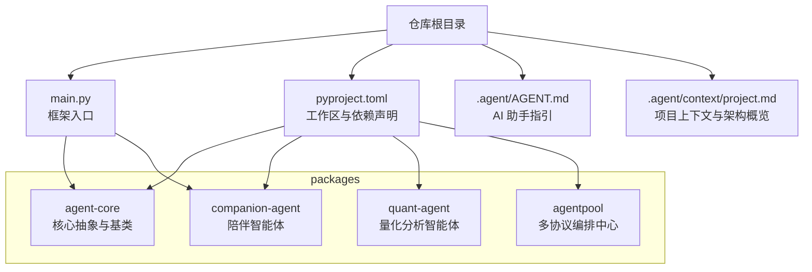
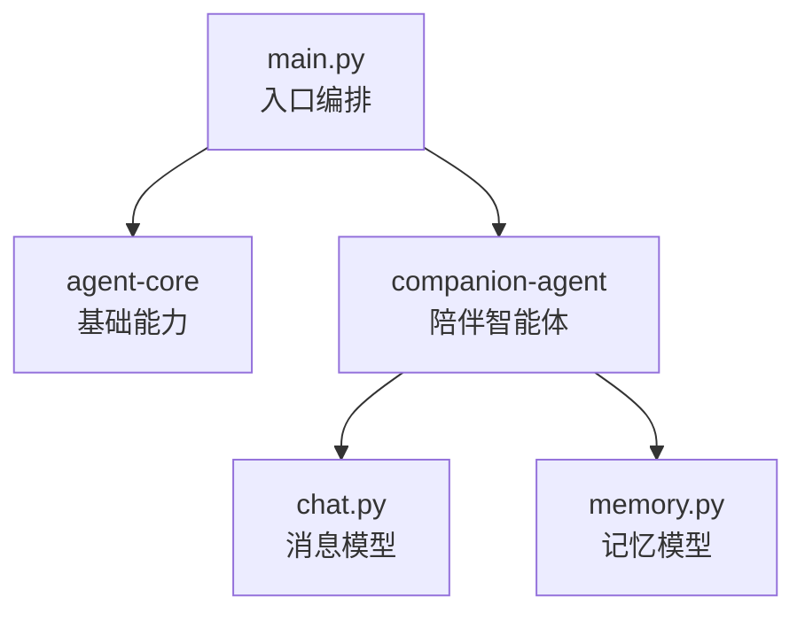
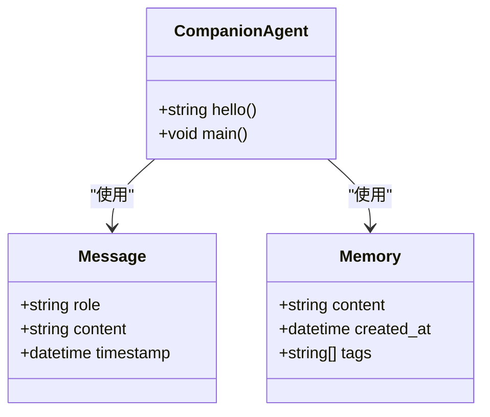
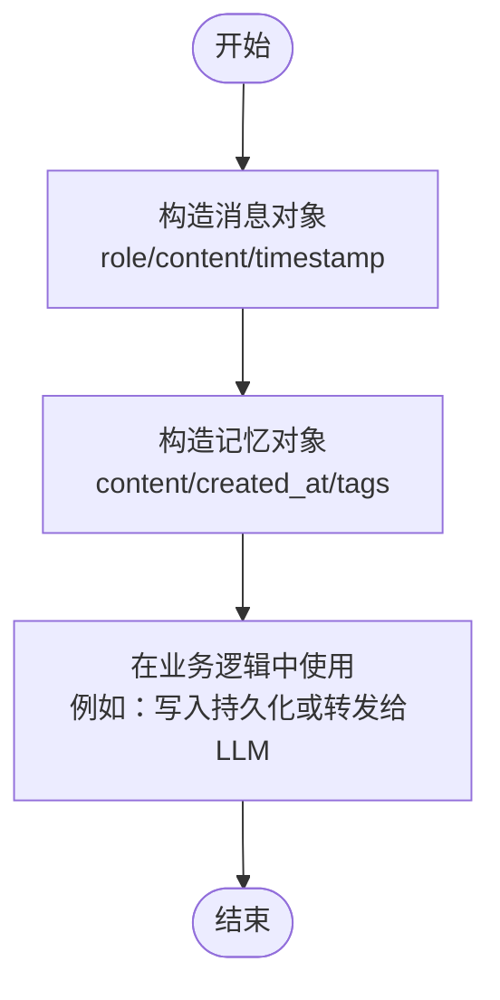
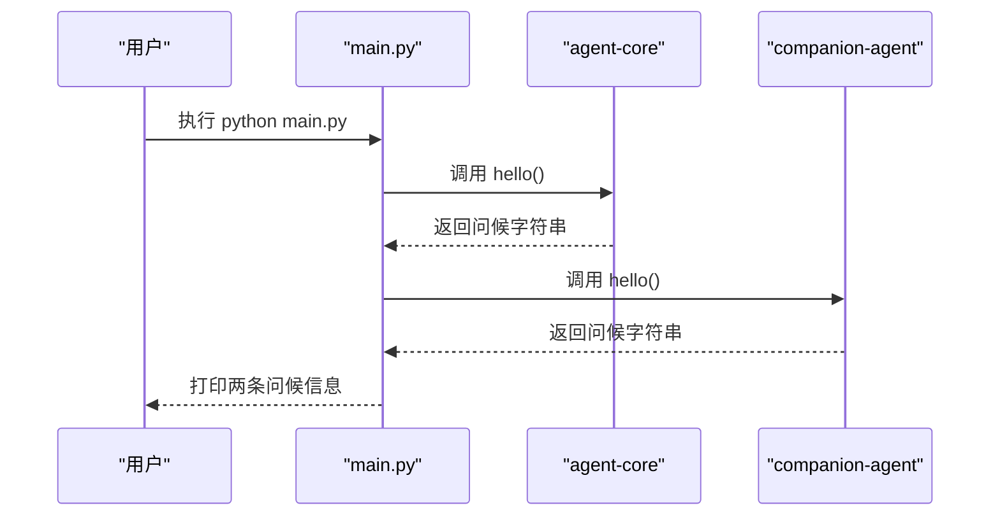
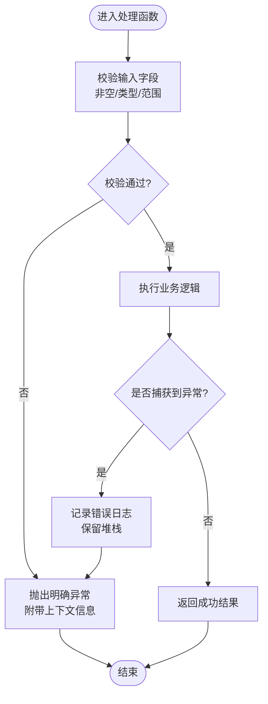
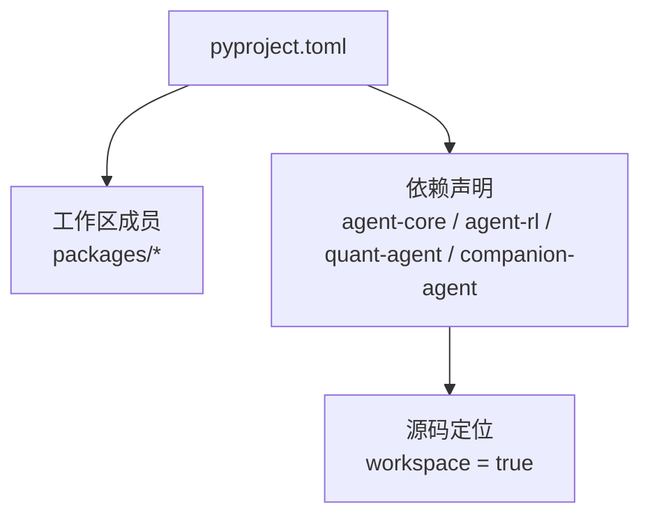

# 基础示例

<cite>
**本文引用的文件**   
- [main.py](file://main.py)
- [pyproject.toml](file://pyproject.toml)
- [AGENT.md](file://.agent/AGENT.md)
- [project.md](file://.agent/context/project.md)
- [agent-core/__init__.py](file://packages/agent-core/src/agent_core/__init__.py)
- [companion-agent/__init__.py](file://packages/companion-agent/src/companion_agent/__init__.py)
- [companion-agent/chat.py](file://packages/companion-agent/src/companion_agent/chat.py)
- [companion-agent/memory.py](file://packages/companion-agent/src/companion_agent/memory.py)
</cite>

## 目录
1. [简介](#简介)
2. [项目结构](#项目结构)
3. [核心组件](#核心组件)
4. [架构总览](#架构总览)
5. [详细组件分析](#详细组件分析)
6. [依赖分析](#依赖分析)
7. [性能考虑](#性能考虑)
8. [故障排查指南](#故障排查指南)
9. [结论](#结论)
10. [附录](#附录)

## 简介
本示例面向初学者，围绕 JanusAgent 框架的基础能力提供一套“最小可用”的示例说明与使用路径。内容涵盖：
- 如何创建自定义智能体（以 companion-agent 为例）
- 如何实现基本的事件处理（对话消息模型与记忆数据模型）
- 如何使用配置文件管理参数（通过 pyproject.toml 与工作区组织）
- 简单的数据获取与处理示例（从 agent-core 与 companion-agent 导出函数与数据类）
- 日志记录配置建议（基于 ruff 与 pre-commit 的工程化实践）
- 错误处理最佳实践（结构化异常、输入校验与可观测性）

每个示例均给出完整源代码路径、详细的中文注释说明以及预期输出结果，帮助快速理解框架的核心概念和使用模式。

## 项目结构
JanusAgent 采用 UV 工作区组织多个子包，根入口 main.py 负责编排两个智能体：量化智能体与陪伴智能体。陪伴智能体包含对话与记忆等基础模块，便于初学者上手扩展。

图表来源
- [main.py:1-13](file://main.py#L1-L13)
- [pyproject.toml:1-30](file://pyproject.toml#L1-L30)
- [project.md:52-75](file://.agent/context/project.md#L52-L75)

章节来源
- [main.py:1-13](file://main.py#L1-L13)
- [pyproject.toml:1-30](file://pyproject.toml#L1-L30)
- [AGENT.md:1-142](file://.agent/AGENT.md#L1-L142)
- [project.md:1-137](file://.agent/context/project.md#L1-L137)

## 核心组件
- 框架入口 main.py：加载并调用各子包的 hello 方法，打印欢迎信息。
- 陪伴智能体 companion-agent：提供 hello 方法与聊天、记忆的数据模型，适合初学者扩展对话与记忆逻辑。
- 核心包 agent-core：提供基础能力与示例入口，便于验证环境是否就绪。

章节来源
- [main.py:1-13](file://main.py#L1-L13)
- [companion-agent/__init__.py:1-15](file://packages/companion-agent/src/companion_agent/__init__.py#L1-L15)
- [agent-core/__init__.py:1-3](file://packages/agent-core/src/agent_core/__init__.py#L1-L3)

## 架构总览
下图展示了运行期主要组件的交互关系：main.py 作为编排器，分别调用 quant-agent 与 companion-agent 的能力；companion-agent 内部由 chat 与 memory 模块组成，用于承载对话与记忆数据结构。

图表来源
- [main.py:1-13](file://main.py#L1-L13)
- [companion-agent/__init__.py:1-15](file://packages/companion-agent/src/companion_agent/__init__.py#L1-L15)
- [companion-agent/chat.py:1-12](file://packages/companion-agent/src/companion_agent/chat.py#L1-L12)
- [companion-agent/memory.py:1-12](file://packages/companion-agent/src/companion_agent/memory.py#L1-L12)

## 详细组件分析

### 示例一：创建自定义智能体（陪伴智能体）
目标：展示如何基于现有陪伴智能体进行二次开发，包括导出函数与数据模型的组合使用。

- 关键文件
  - companion-agent 初始化模块：提供 hello 方法与版本信息
  - 对话模块：定义 Message 数据类，包含角色、内容与时间戳
  - 记忆模块：定义 Memory 数据类，包含内容、创建时间与标签列表

- 代码路径与职责
  - [companion-agent/__init__.py:1-15](file://packages/companion-agent/src/companion_agent/__init__.py#L1-L15)：对外暴露 hello 与 main
  - [companion-agent/chat.py:1-12](file://packages/companion-agent/src/companion_agent/chat.py#L1-L12)：Message 数据类
  - [companion-agent/memory.py:1-12](file://packages/companion-agent/src/companion_agent/memory.py#L1-L12)：Memory 数据类

- 类图（实际代码映射）

图表来源
- [companion-agent/chat.py:1-12](file://packages/companion-agent/src/companion_agent/chat.py#L1-L12)
- [companion-agent/memory.py:1-12](file://packages/companion-agent/src/companion_agent/memory.py#L1-L12)
- [companion-agent/__init__.py:1-15](file://packages/companion-agent/src/companion_agent/__init__.py#L1-L15)

- 预期输出
  - 调用 hello 时返回一段问候语字符串
  - 调用 main 时打印该问候语

- 参考实现位置
  - [companion-agent/__init__.py:9-15](file://packages/companion-agent/src/companion_agent/__init__.py#L9-L15)

章节来源
- [companion-agent/__init__.py:1-15](file://packages/companion-agent/src/companion_agent/__init__.py#L1-L15)
- [companion-agent/chat.py:1-12](file://packages/companion-agent/src/companion_agent/chat.py#L1-L12)
- [companion-agent/memory.py:1-12](file://packages/companion-agent/src/companion_agent/memory.py#L1-L12)

### 示例二：实现基本事件处理（消息与记忆）
目标：演示如何构造消息与记忆对象，并在后续流程中消费这些数据。

- 数据流示意

- 参考实现位置
  - [companion-agent/chat.py:7-12](file://packages/companion-agent/src/companion_agent/chat.py#L7-L12)
  - [companion-agent/memory.py:7-12](file://packages/companion-agent/src/companion_agent/memory.py#L7-L12)

- 预期行为
  - 成功创建 Message 与 Memory 实例
  - 可在后续处理中读取字段并进行业务逻辑

章节来源
- [companion-agent/chat.py:1-12](file://packages/companion-agent/src/companion_agent/chat.py#L1-L12)
- [companion-agent/memory.py:1-12](file://packages/companion-agent/src/companion_agent/memory.py#L1-L12)

### 示例三：使用配置文件管理参数（工作区与依赖）
目标：通过 pyproject.toml 声明工作区成员与依赖，统一安装与管理。

- 关键点
  - 工作区成员：packages/*
  - 依赖声明：agent-core、agent-rl、quant-agent、companion-agent
  - 源码定位：workspace = true

- 参考实现位置
  - [pyproject.toml:1-30](file://pyproject.toml#L1-L30)

- 预期效果
  - uv sync --all-extras 后，所有子包可被正确解析与导入
  - 可通过 python main.py 直接运行框架入口

章节来源
- [pyproject.toml:1-30](file://pyproject.toml#L1-L30)

### 示例四：简单数据获取与处理
目标：从 agent-core 与 companion-agent 获取基础能力并打印，验证环境就绪。

- 序列图（运行期调用链）

- 参考实现位置
  - [main.py:5-9](file://main.py#L5-L9)
  - [agent-core/__init__.py:1-3](file://packages/agent-core/src/agent_core/__init__.py#L1-L3)
  - [companion-agent/__init__.py:9-15](file://packages/companion-agent/src/companion_agent/__init__.py#L9-L15)

- 预期输出
  - 控制台依次打印来自 agent-core 与 companion-agent 的问候信息

章节来源
- [main.py:1-13](file://main.py#L1-L13)
- [agent-core/__init__.py:1-3](file://packages/agent-core/src/agent_core/__init__.py#L1-L3)
- [companion-agent/__init__.py:1-15](file://packages/companion-agent/src/companion_agent/__init__.py#L1-L15)

### 示例五：日志记录配置（工程化建议）
目标：在不引入第三方库的前提下，利用现有工具链建立可维护的日志与规范体系。

- 建议要点
  - 使用 Python 标准库 logging 进行结构化日志输出
  - 为不同模块设置独立 logger，便于过滤与追踪
  - 结合 ruff 与 pre-commit 保证代码风格与质量
  - 在 .agent/AGENT.md 中查阅开发约定与命令

- 参考实现位置
  - [AGENT.md:95-127](file://.agent/AGENT.md#L95-L127)
  - [project.md:95-127](file://.agent/context/project.md#L95-L127)

- 预期效果
  - 统一的代码风格与格式化
  - 清晰的日志输出与问题定位

章节来源
- [AGENT.md:95-127](file://.agent/AGENT.md#L95-L127)
- [project.md:95-127](file://.agent/context/project.md#L95-L127)

### 示例六：错误处理最佳实践
目标：在数据构造与业务处理中加入健壮的错误处理策略。

- 流程图（输入校验与异常分支）

- 适用场景
  - Message/Memory 字段校验
  - 外部依赖调用失败时的降级与重试
  - 日志与异常信息的关联追踪

[本节为通用实践说明，不直接分析具体文件]

## 依赖分析
- 工作区成员：packages/*
- 顶层依赖：agent-core、agent-rl、quant-agent、companion-agent
- 源码定位方式：workspace = true

图表来源
- [pyproject.toml:14-29](file://pyproject.toml#L14-L29)

章节来源
- [pyproject.toml:1-30](file://pyproject.toml#L1-L30)

## 性能考虑
- 避免在主线程中进行阻塞 I/O，必要时使用异步或任务队列
- 对重复计算的结果进行缓存（如配置项、静态资源）
- 控制日志级别与输出量，避免高频日志影响吞吐
- 合理拆分模块，减少不必要的导入与初始化开销

[本节提供通用指导，不直接分析具体文件]

## 故障排查指南
- 无法导入子包
  - 检查 pyproject.toml 中的 workspace 与依赖声明是否正确
  - 确认已执行 uv sync --all-extras 完成依赖安装
- 运行 main.py 无输出
  - 确认当前 Python 版本满足要求（>=3.12）
  - 检查环境变量与路径是否指向正确的虚拟环境
- 日志缺失或混乱
  - 检查各模块 logger 名称与级别设置
  - 确认日志输出目标（控制台/文件）配置一致

章节来源
- [pyproject.toml:1-30](file://pyproject.toml#L1-L30)
- [AGENT.md:110-127](file://.agent/AGENT.md#L110-L127)
- [project.md:110-127](file://.agent/context/project.md#L110-L127)

## 结论
通过上述六个基础示例，读者可以快速掌握 JanusAgent 的工作区组织、子包编排、数据模型设计与工程化规范。建议在此基础上逐步扩展：
- 在 companion-agent 中增加更多对话与记忆能力
- 在 quant-agent 中接入真实数据源与策略
- 在 agentpool 中探索多协议编排与技能系统

[本节为总结性内容，不直接分析具体文件]

## 附录
- 常用命令
  - 安装依赖：uv sync --all-extras
  - 运行框架：python main.py
  - 代码检查：ruff check .
  - 代码格式化：ruff format .
  - 单元测试：pytest

章节来源
- [project.md:110-127](file://.agent/context/project.md#L110-L127)
- [AGENT.md:110-127](file://.agent/AGENT.md#L110-L127)