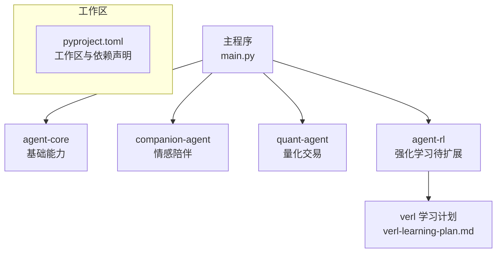
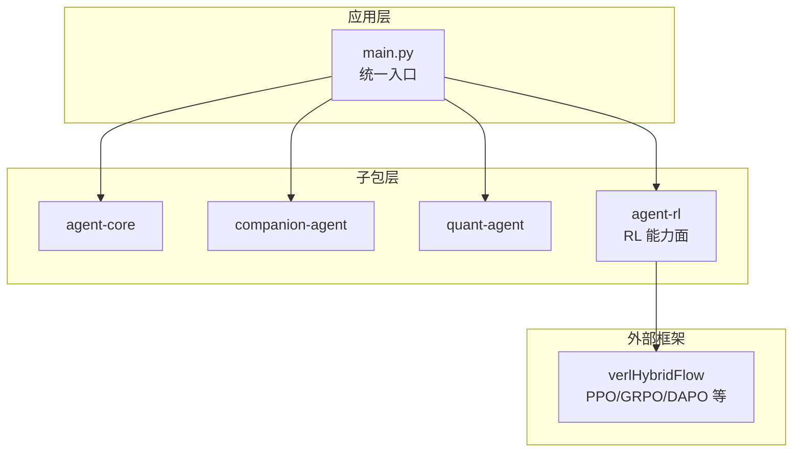
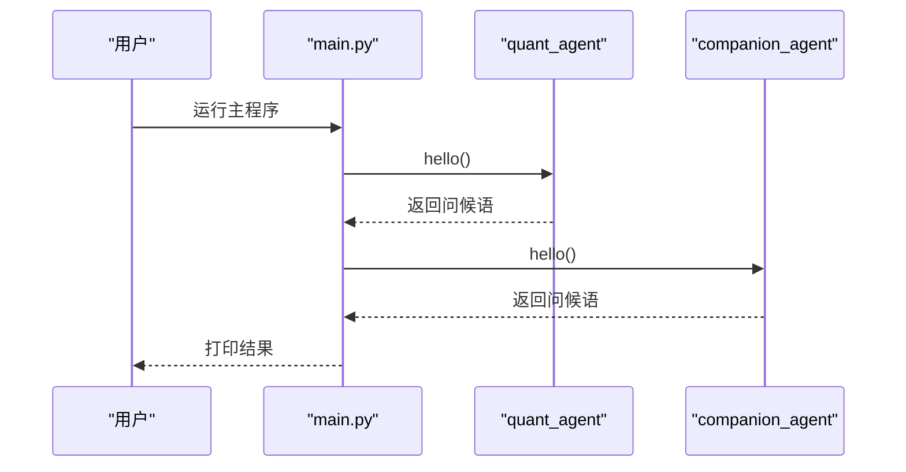
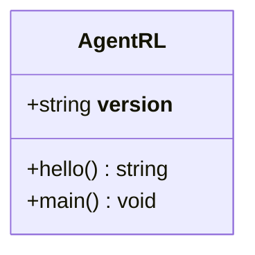
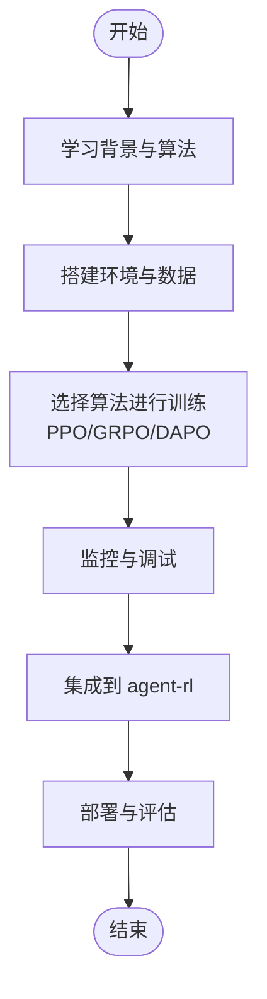
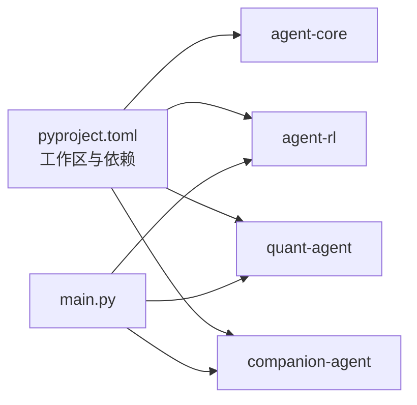

# 强化学习应用

<cite>
**本文引用的文件**   
- [main.py](file://main.py)
- [pyproject.toml](file://pyproject.toml)
- [agent-rl README.md](file://packages/agent-rl/README.md)
- [agent-rl __init__.py](file://packages/agent-rl/src/agent_rl/__init__.py)
- [verl 学习计划](file://docs/plans/verl-learning-plan.md)
</cite>

## 目录
1. [简介](#简介)
2. [项目结构](#项目结构)
3. [核心组件](#核心组件)
4. [架构总览](#架构总览)
5. [详细组件分析](#详细组件分析)
6. [依赖分析](#依赖分析)
7. [性能考虑](#性能考虑)
8. [故障排查指南](#故障排查指南)
9. [结论](#结论)
10. [附录](#附录)

## 简介
本文件面向希望在模拟环境中训练智能体的工程师与研究者，提供从环境定义、奖励函数设计到策略优化的完整教程思路，并结合本项目中“agent-rl”子包与 verl 学习计划，给出可落地的集成路径。内容覆盖：
- 在仿真环境中训练智能体的端到端流程
- 不同 RL 算法（如 PPO、GRPO）的适用场景与实践要点
- 在线学习与模型更新的实现方案
- 性能监控与调试工具的使用建议
- 每个案例包含环境配置、训练脚本与结果分析的模板化说明

## 项目结构
当前仓库采用多包工作区组织，主入口通过 main.py 聚合各子包能力；agent-rl 作为“理性/感性”双面的“RL 面”，负责强化学习相关能力。verl 学习计划文档为后续引入 RL 训练能力提供了路线图与参考。

图示来源
- [main.py:1-13](file://main.py#L1-L13)
- [pyproject.toml:1-30](file://pyproject.toml#L1-L30)
- [verl 学习计划:1-512](file://docs/plans/verl-learning-plan.md#L1-L512)

章节来源
- [main.py:1-13](file://main.py#L1-L13)
- [pyproject.toml:1-30](file://pyproject.toml#L1-L30)

## 核心组件
- 主程序入口
  - 作用：打印并调用各子包的 hello/main 方法，验证模块可用性。
  - 关键点：依赖 agent-core、companion-agent、quant-agent、agent-rl 四个子包。
- agent-rl 子包
  - 定位：强化学习智能体，提供环境交互、策略优化、奖励建模与部署能力（当前为骨架）。
  - 现状：__init__.py 提供版本与 hello/main 占位；README 描述开发方式与目标。
- verl 学习计划
  - 作用：为引入 verl（HybridFlow）提供学习路径、算法清单与整合步骤，指导将 RL 训练能力接入 agent-rl。

章节来源
- [main.py:1-13](file://main.py#L1-L13)
- [agent-rl README.md:1-15](file://packages/agent-rl/README.md#L1-L15)
- [agent-rl __init__.py:1-14](file://packages/agent-rl/src/agent_rl/__init__.py#L1-L14)
- [verl 学习计划:1-512](file://docs/plans/verl-learning-plan.md#L1-L512)

## 架构总览
下图展示当前仓库的高层结构与未来 RL 训练能力的集成点。主程序聚合多个子包；agent-rl 作为 RL 能力面，计划通过 verl 完成训练闭环。

图示来源
- [main.py:1-13](file://main.py#L1-L13)
- [pyproject.toml:1-30](file://pyproject.toml#L1-L30)
- [verl 学习计划:1-512](file://docs/plans/verl-learning-plan.md#L1-L512)

## 详细组件分析

### 组件一：主程序入口（main.py）
- 职责
  - 初始化并调用各子包的 hello/main，用于快速验证安装与依赖。
- 关键流程
  - 导入 quant_agent 与 companion_agent
  - 调用各自的 hello() 输出信息
- 可扩展点
  - 增加对 agent-rl 的调用，作为 RL 训练的统一入口或 CLI 封装。

图示来源
- [main.py:1-13](file://main.py#L1-L13)

章节来源
- [main.py:1-13](file://main.py#L1-L13)

### 组件二：agent-rl 子包（骨架）
- 职责
  - 承载 RL 相关能力：环境交互、策略优化、奖励建模与部署。
- 现状
  - __init__.py 提供版本与 hello/main 占位；README 提供开发与运行指引。
- 下一步
  - 根据 verl 学习计划逐步引入训练管线、奖励函数与数据预处理。

图示来源
- [agent-rl __init__.py:1-14](file://packages/agent-rl/src/agent_rl/__init__.py#L1-L14)

章节来源
- [agent-rl README.md:1-15](file://packages/agent-rl/README.md#L1-L15)
- [agent-rl __init__.py:1-14](file://packages/agent-rl/src/agent_rl/__init__.py#L1-L14)

### 组件三：verl 学习计划（训练蓝图）
- 目标
  - 为 agent-rl 引入 RL 训练能力，提供学习路径、算法清单与整合步骤。
- 关键内容
  - 背景知识补齐（RL 基础、PPO、GRPO、RLHF 流程）
  - 多种算法实践（PPO、GRPO、DAPO 等）
  - 结合 agent-rl 实战（依赖引入、训练脚本化、Reward 定制、数据集接入、Agent Loop 集成、实验跟踪、Model Zoo 接入）
  - 常见问题与调优建议（显存不足、NaN loss 等）

图示来源
- [verl 学习计划:1-512](file://docs/plans/verl-learning-plan.md#L1-L512)

章节来源
- [verl 学习计划:1-512](file://docs/plans/verl-learning-plan.md#L1-L512)

## 依赖分析
- 工作区与依赖
  - pyproject.toml 声明了工作区成员 packages/*，并将 agent-core、agent-rl、quant-agent、companion-agent 作为依赖项。
- 子包关系
  - main.py 直接依赖 quant-agent 与 companion-agent；agent-rl 作为独立子包，未来将与 verl 集成。

图示来源
- [pyproject.toml:1-30](file://pyproject.toml#L1-L30)
- [main.py:1-13](file://main.py#L1-L13)

章节来源
- [pyproject.toml:1-30](file://pyproject.toml#L1-L30)
- [main.py:1-13](file://main.py#L1-L13)

## 性能考虑
- 训练资源
  - 单卡显存不足时，优先使用小模型、降低 micro batch size 与 gpu_memory_utilization，或采用 LoRA RL 方式。
- 数值稳定性
  - 出现 NaN loss 时，检查学习率是否过高（建议 lr ≤ 1e-5），并调整 KL 系数。
- 采样与并行
  - 合理设置 rollout 与 ppo_mini_batch_size_per_gpu，平衡吞吐与显存占用。
- 监控与日志
  - 记录 reward、advantage、policy/value loss、KL 散度等关键指标，便于定位问题。

[本节为通用指导，不直接分析具体文件]

## 故障排查指南
- 常见错误与处理
  - 显存不足：减小 batch 与内存利用率，或切换更小模型。
  - 训练不稳定：降低学习率、调整 KL 系数、检查奖励尺度。
  - 数据格式不匹配：确保输入数据符合 verl 的数据预处理要求。
- 定位手段
  - 开启详细日志，观察每一步的张量形状与数值范围。
  - 分阶段验证：先跑通最小样例，再逐步放大规模。

章节来源
- [verl 学习计划:505-512](file://docs/plans/verl-learning-plan.md#L505-L512)

## 结论
当前仓库已具备多包协作的基础结构，agent-rl 作为 RL 能力面处于骨架阶段。借助 verl 学习计划，可按图索骥完成依赖引入、训练脚本化、奖励函数定制与数据接入，最终形成可在模拟环境中训练智能体的完整方案。建议在 Phase 1-3 快速跑通 PPO 训练，随后进入 GRPO/DAPO 等算法实践，并在 Phase 7 将能力深度集成至 agent-rl。

[本节为总结性内容，不直接分析具体文件]

## 附录

### 附录A：典型应用案例模板（示例说明）
以下为三个常用 RL 应用场景的模板化说明，便于快速落地：

- 路径规划（网格世界）
  - 环境配置：状态空间（位置）、动作空间（上下左右）、终止条件（到达目标或步数上限）
  - 奖励函数：到达目标正奖励，每步负惩罚，碰撞障碍额外惩罚
  - 算法选择：PPO（稳定收敛）或 GRPO（无需 Critic）
  - 训练脚本：加载环境、构建数据、启动训练、保存策略
  - 结果分析：绘制累计奖励曲线、成功率、平均步数

- 资源分配（任务调度）
  - 环境配置：资源向量、任务队列、容量约束
  - 奖励函数：吞吐量最大化、延迟惩罚、资源闲置惩罚
  - 算法选择：PPO（连续/离散混合动作）或 GRPO（组内对比）
  - 训练脚本：批处理生成样本、计算优势、更新策略
  - 结果分析：吞吐、延迟分布、公平性指标

- 对话策略（多轮交互）
  - 环境配置：对话历史、用户意图、系统动作
  - 奖励函数：满意度评分、完成率、对话长度惩罚
  - 算法选择：GRPO/DAPO（文本生成场景）
  - 训练脚本：Prompt 生成、Rollout、奖励计算、策略更新
  - 结果分析：任务完成率、用户偏好、多样性与一致性

[本节为概念性模板，不直接分析具体文件]