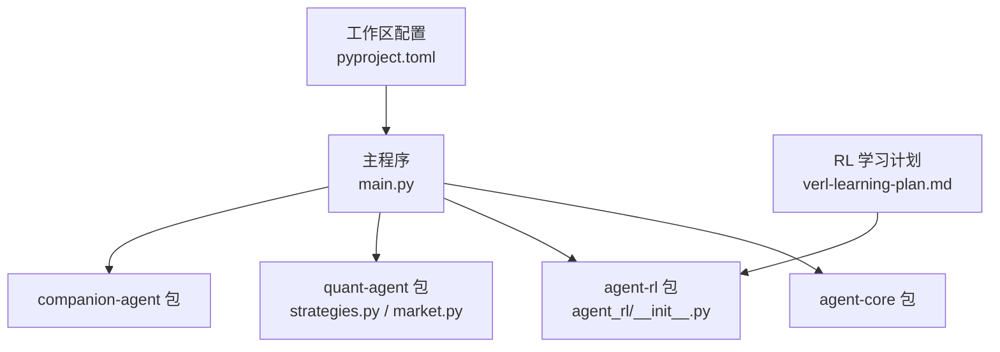
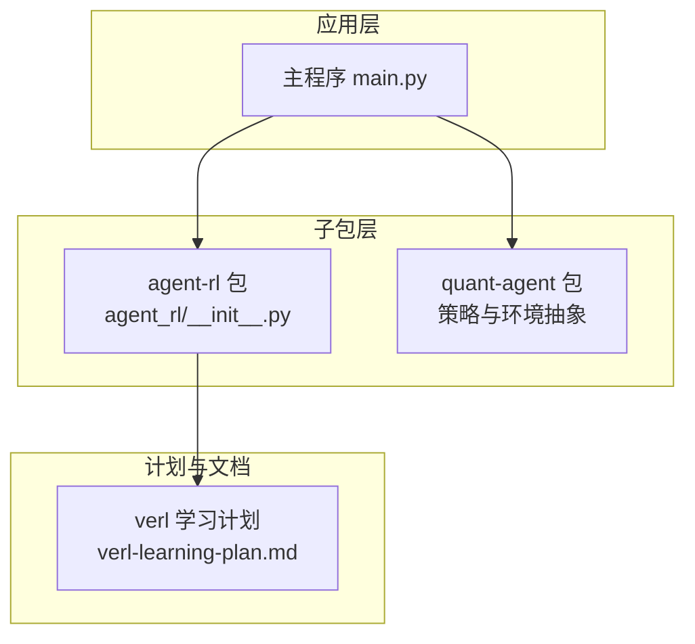
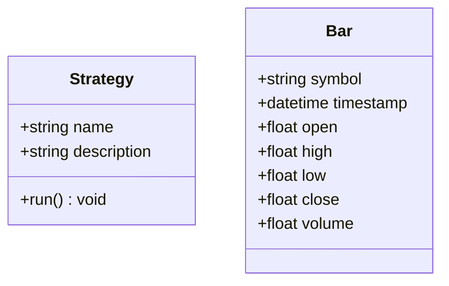
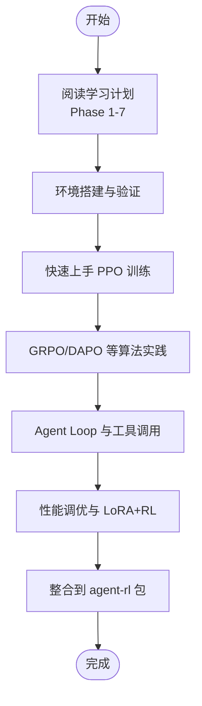
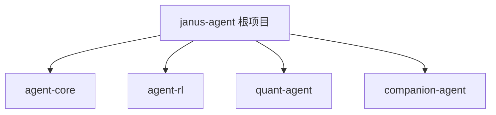
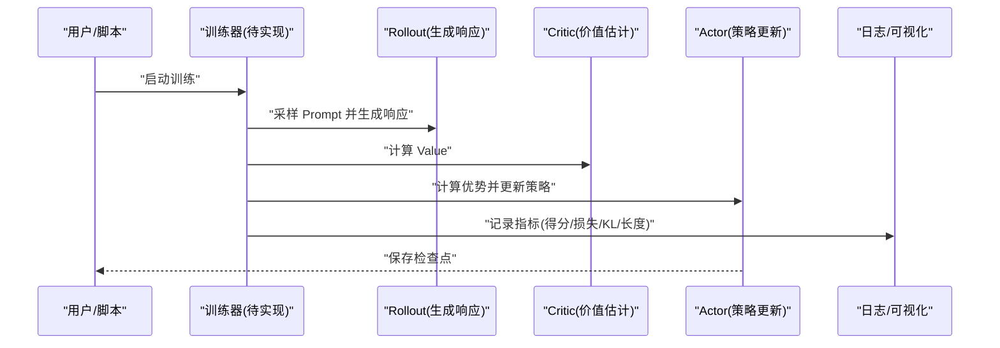

# 强化学习算法

<cite>
**本文引用的文件**   
- [main.py](file://main.py)
- [pyproject.toml](file://pyproject.toml)
- [agent_rl/__init__.py](file://packages/agent-rl/src/agent_rl/__init__.py)
- [quant_agent/strategies.py](file://packages/quant-agent/src/quant_agent/strategies.py)
- [quant_agent/market.py](file://packages/quant-agent/src/quant_agent/market.py)
- [verl-learning-plan.md](file://docs/plans/verl-learning-plan.md)
</cite>

## 目录
1. [简介](#简介)
2. [项目结构](#项目结构)
3. [核心组件](#核心组件)
4. [架构总览](#架构总览)
5. [详细组件分析](#详细组件分析)
6. [依赖分析](#依赖分析)
7. [性能考虑](#性能考虑)
8. [故障排查指南](#故障排查指南)
9. [结论](#结论)
10. [附录](#附录)

## 简介
本仓库为“JanusAgent”个人智能体框架，采用多包工作区组织。当前代码库中尚未包含具体的强化学习算法实现（如 Q-Learning、SARSA、Policy Gradient、Actor-Critic），但已规划在 agent-rl 子包中引入 verl 作为 LLM 强化学习训练后端，并提供了完整的学习与落地路线图。本文基于现有仓库内容，梳理项目结构与 RL 能力规划，给出算法选择指南与后续集成建议，帮助开发者在具备环境数据与奖励函数的基础上，选择合适的 RL 算法进行训练与评估。

## 项目结构
仓库采用 uv workspace 的多包结构，主入口 main.py 聚合多个子包的 hello 能力；agent-rl 子包定位为“自主学习之面”，负责环境交互、策略优化、奖励建模与模型部署等 RL 相关能力；quant-agent 提供交易策略与市场数据的抽象接口；verl 学习计划文档明确了将 verl 引入 agent-rl 的路线与关键步骤。

图表来源
- [main.py:1-13](file://main.py#L1-L13)
- [pyproject.toml:1-30](file://pyproject.toml#L1-L30)
- [agent_rl/__init__.py:1-15](file://packages/agent-rl/src/agent_rl/__init__.py#L1-L15)
- [quant_agent/strategies.py:1-13](file://packages/quant-agent/src/quant_agent/strategies.py#L1-L13)
- [quant_agent/market.py:1-16](file://packages/quant-agent/src/quant_agent/market.py#L1-L16)
- [verl-learning-plan.md:1-536](file://docs/plans/verl-learning-plan.md#L1-L536)

章节来源
- [main.py:1-13](file://main.py#L1-L13)
- [pyproject.toml:1-30](file://pyproject.toml#L1-L30)
- [agent_rl/__init__.py:1-15](file://packages/agent-rl/src/agent_rl/__init__.py#L1-L15)
- [quant_agent/strategies.py:1-13](file://packages/quant-agent/src/quant_agent/strategies.py#L1-L13)
- [quant_agent/market.py:1-16](file://packages/quant-agent/src/quant_agent/market.py#L1-L16)
- [verl-learning-plan.md:1-536](file://docs/plans/verl-learning-plan.md#L1-L536)

## 核心组件
- 主程序入口：打印各子包信息，体现模块化组合方式。
- agent-rl 包：定义版本与基础入口函数，承载未来 RL 训练与部署能力。
- quant-agent 包：提供交易策略基类与行情数据抽象，便于构建 RL 环境与奖励函数。
- 工作区配置：声明子包成员与依赖关系，支持可选依赖扩展（例如 verl）。

章节来源
- [main.py:1-13](file://main.py#L1-L13)
- [agent_rl/__init__.py:1-15](file://packages/agent-rl/src/agent_rl/__init__.py#L1-L15)
- [quant_agent/strategies.py:1-13](file://packages/quant-agent/src/quant_agent/strategies.py#L1-L13)
- [quant_agent/market.py:1-16](file://packages/quant-agent/src/quant_agent/market.py#L1-L16)
- [pyproject.toml:1-30](file://pyproject.toml#L1-L30)

## 架构总览
从仓库现状看，RL 能力尚未落地到具体算法实现，但整体架构已预留 agent-rl 子包用于承接 RL 训练与部署。结合 verl 学习计划，后续可将 verl 作为分布式 RLHF 训练后端，通过 Control Flow 与 Computation Flow 解耦的方式，将 Actor/Critic/Rollout 等模块以 Ray + FSDP/vLLM 的形式运行。

图表来源
- [main.py:1-13](file://main.py#L1-L13)
- [agent_rl/__init__.py:1-15](file://packages/agent-rl/src/agent_rl/__init__.py#L1-L15)
- [quant_agent/strategies.py:1-13](file://packages/quant-agent/src/quant_agent/strategies.py#L1-L13)
- [verl-learning-plan.md:1-536](file://docs/plans/verl-learning-plan.md#L1-L536)

## 详细组件分析

### 量化策略与环境抽象（quant-agent）
- 策略基类 Strategy：定义 name、description 与 run 接口，便于后续接入 RL 策略或规则策略。
- 市场数据 Bar：封装 OHLCV 字段，可作为 RL 环境的观测输入或奖励计算依据。

图表来源
- [quant_agent/strategies.py:1-13](file://packages/quant-agent/src/quant_agent/strategies.py#L1-L13)
- [quant_agent/market.py:1-16](file://packages/quant-agent/src/quant_agent/market.py#L1-L16)

章节来源
- [quant_agent/strategies.py:1-13](file://packages/quant-agent/src/quant_agent/strategies.py#L1-L13)
- [quant_agent/market.py:1-16](file://packages/quant-agent/src/quant_agent/market.py#L1-L16)

### RL 训练入口与定位（agent-rl）
- agent-rl 包提供版本信息与 hello/main 入口，明确“环境交互、策略优化、奖励建模与模型部署”的定位，为后续集成 verl 训练管线预留空间。

章节来源
- [agent_rl/__init__.py:1-15](file://packages/agent-rl/src/agent_rl/__init__.py#L1-L15)

### verl 学习计划与集成路径
- 学习计划涵盖背景知识、环境搭建、PPO/GRPO/DAPO 等算法实践、HybridFlow 编程模型、Agent Loop 与 VLM 多模态 RL、性能调优与 LoRA+RL 等进阶主题，并给出与 agent-rl 整合的步骤与优先级。

图表来源
- [verl-learning-plan.md:1-536](file://docs/plans/verl-learning-plan.md#L1-L536)

章节来源
- [verl-learning-plan.md:1-536](file://docs/plans/verl-learning-plan.md#L1-L536)

## 依赖分析
- 工作区成员：agent-core、agent-rl、quant-agent、companion-agent。
- 运行时依赖：当前 pyproject.toml 仅声明子包依赖，未直接引入 verl 及其生态（vLLM、Ray、FSDP 等），可通过 optional-dependencies 按需引入。

图表来源
- [pyproject.toml:1-30](file://pyproject.toml#L1-L30)

章节来源
- [pyproject.toml:1-30](file://pyproject.toml#L1-L30)

## 性能考虑
- 硬件与后端：参考学习计划中的 GPU 要求与 vLLM/SGLang/FSDP 选型建议，合理设置 rollout 与微批次大小，避免显存溢出。
- 训练稳定性：关注 KL 系数、学习率与熵项，防止 loss 发散或策略退化。
- 监控与可视化：使用 wandb/TensorBoard 跟踪关键指标（验证集得分、策略梯度损失、价值函数损失、KL 惩罚、回复长度等）。

[本节为通用指导，不直接分析具体文件]

## 故障排查指南
- 单卡显存不足：降低 ppo_micro_batch_size_per_gpu 与 gpu_memory_utilization，或改用 LoRA+RL。
- NaN loss：检查学习率是否过高、KL 系数是否合适。
- 推理后端选择：生产场景优先 vLLM，多轮 RL/VLM 可考虑 SGLang。

章节来源
- [verl-learning-plan.md:1-536](file://docs/plans/verl-learning-plan.md#L1-L536)

## 结论
当前仓库已完成多包工程化与 RL 能力定位，但尚未实现具体 RL 算法。按照 verl 学习计划，可在 agent-rl 中逐步引入 verl 作为训练后端，先跑通 PPO，再扩展到 GRPO/DAPO 等先进算法，并结合 Agent Loop 与自定义奖励函数，形成端到端的 RL 训练体系。建议在量化场景中，利用 quant-agent 的策略与环境抽象，设计面向交易的奖励函数与评测指标，从而选择最适合的 RL 算法与超参数配置。

[本节为总结性内容，不直接分析具体文件]

## 附录

### 算法选择指南（概念性建议）
- Q-Learning：适用于离散动作、状态空间较小且可枚举的场景；优点是实现简单、离线学习稳定；缺点是难以扩展到连续动作与大状态空间。
- SARSA：在线 On-policy 方法，适合需要严格遵循当前策略探索过程的场景；对噪声更稳健，但样本效率通常低于 Off-policy。
- Policy Gradient（REINFORCE 系列）：适用于连续动作或高维离散动作；需配合基线（如 Critic）降低方差；训练不稳定时需正则化与步长控制。
- Actor-Critic（含 PPO）：兼顾样本效率与稳定性，适合复杂任务与大规模环境；PPO 的 Clip 机制提升鲁棒性，是工业常用基线。
- 针对大语言模型的 RLHF：优先考虑 PPO/GRPO/DAPO 等方案，结合 vLLM/SGLang 做高效 Rollout，并使用 FSDP 进行分布式训练。

[本节为概念性说明，不直接分析具体文件]

### 训练流程示意（概念性）

[此图为概念流程，不映射到具体源码文件]