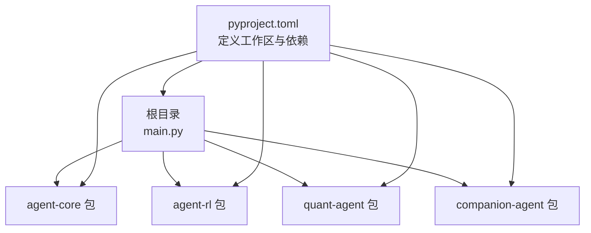
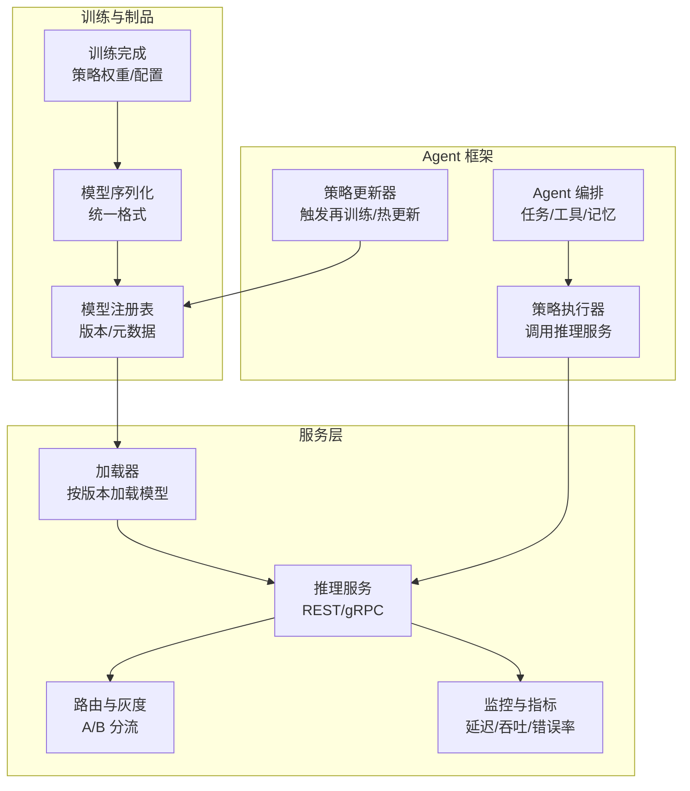
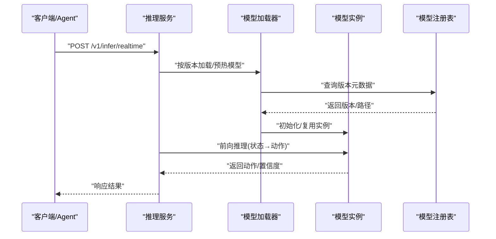
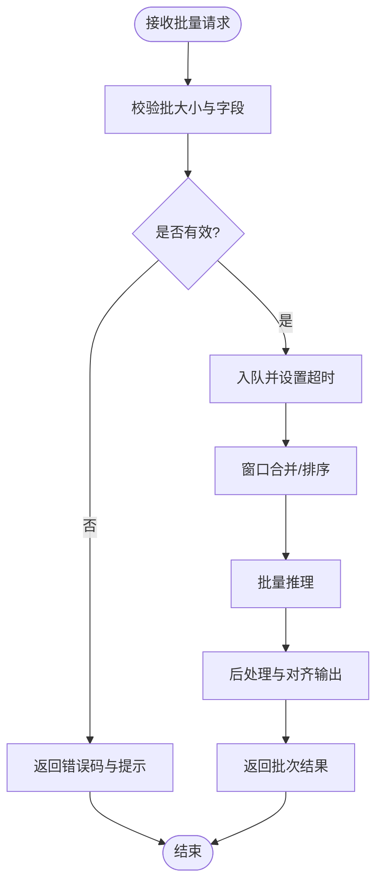
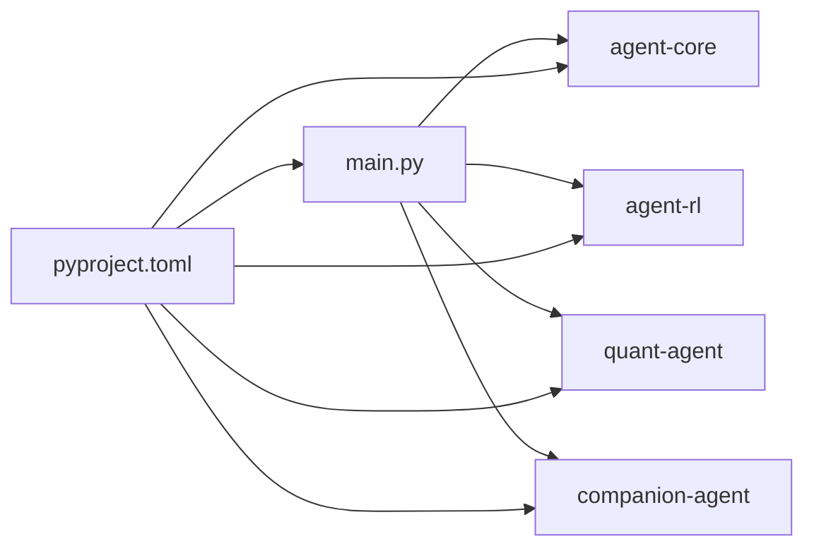

# 模型部署与服务化

<cite>
**本文引用的文件**   
- [main.py](file://main.py)
- [pyproject.toml](file://pyproject.toml)
- [agent-core/__init__.py](file://packages/agent-core/src/agent_core/__init__.py)
- [agent-rl/__init__.py](file://packages/agent-rl/src/agent_rl/__init__.py)
- [companion-agent/__init__.py](file://packages/companion-agent/src/companion_agent/__init__.py)
- [companion-agent/chat.py](file://packages/companion-agent/src/companion_agent/chat.py)
- [companion-agent/memory.py](file://packages/companion-agent/src/companion_agent/memory.py)
</cite>

## 目录
1. [简介](#简介)
2. [项目结构](#项目结构)
3. [核心组件](#核心组件)
4. [架构总览](#架构总览)
5. [详细组件分析](#详细组件分析)
6. [依赖分析](#依赖分析)
7. [性能考虑](#性能考虑)
8. [故障排查指南](#故障排查指南)
9. [结论](#结论)
10. [附录](#附录)

## 简介
本文件面向“训练完成的强化学习模型”的部署与服务化，结合当前仓库中的多包结构与入口程序，给出从模型序列化、API 接口设计、服务容器化到在线推理（实时决策与批量预测）、版本管理、A/B 测试、性能监控以及将 RL 模型集成到现有 Agent 框架并实现策略更新的完整方案。文档在保持可操作性的同时，尽量以图示和路径引用说明关键实现位置，避免直接粘贴代码。

## 项目结构
仓库采用多包工作区组织，顶层通过 pyproject 声明成员包与依赖关系；主入口 main.py 聚合各子包的 hello 能力，便于快速验证环境连通性。

图表来源
- [main.py:1-13](file://main.py#L1-L13)
- [pyproject.toml:1-30](file://pyproject.toml#L1-L30)

章节来源
- [main.py:1-13](file://main.py#L1-L13)
- [pyproject.toml:1-30](file://pyproject.toml#L1-L30)

## 核心组件
- agent-rl：提供“自主学习之面”，负责环境交互、策略优化、奖励建模与模型部署相关能力。该包已暴露版本与 hello/main 能力，可作为后续部署服务的扩展点。
- companion-agent：提供“感性之面”，包含对话与记忆的数据模型，可用于构建交互式推理入口或人机协同流程。
- agent-core：通用智能体基础能力（当前为占位），可在后续承载统一的 Agent 运行时、工具调用与编排逻辑。
- quant-agent：量化交易相关能力（当前未在本仓库中展开），可作为 RL 策略的应用场景之一。

章节来源
- [agent-rl/__init__.py:1-15](file://packages/agent-rl/src/agent_rl/__init__.py#L1-L15)
- [companion-agent/__init__.py:1-15](file://packages/companion-agent/src/companion_agent/__init__.py#L1-L15)
- [companion-agent/chat.py:1-12](file://packages/companion-agent/src/companion_agent/chat.py#L1-L12)
- [companion-agent/memory.py:1-12](file://packages/companion-agent/src/companion_agent/memory.py#L1-L12)
- [agent-core/__init__.py:1-3](file://packages/agent-core/src/agent_core/__init__.py#L1-L3)

## 架构总览
下图展示“RL 模型部署与服务化”的高层架构：训练产物以统一格式持久化，服务侧提供在线推理 API，支持实时与批量两种模式；上层通过 Agent 框架进行编排与策略更新，并通过版本管理与 A/B 流量切分保障稳定性与可观测性。

图表来源
- [agent-rl/__init__.py:1-15](file://packages/agent-rl/src/agent_rl/__init__.py#L1-L15)
- [companion-agent/chat.py:1-12](file://packages/companion-agent/src/companion_agent/chat.py#L1-L12)
- [companion-agent/memory.py:1-12](file://packages/companion-agent/src/companion_agent/memory.py#L1-L12)
- [main.py:1-13](file://main.py#L1-L13)

## 详细组件分析

### 模型序列化与存储
- 目标
  - 统一序列化工具链，确保跨环境一致加载。
  - 保存策略权重、超参、环境配置与随机种子等元信息。
- 建议格式
  - 策略权重：优先使用轻量且易迁移的格式（如 ONNX/TensorRT 导出用于高性能推理；PyTorch 原生用于兼容复杂网络）。
  - 配置与元数据：JSON/YAML + 版本号 + 哈希校验。
- 存储与注册
  - 对象存储或文件系统作为制品库，配合模型注册表记录版本、创建时间、评估指标、适用环境等。
- 加载策略
  - 启动时按版本拉取并缓存至内存；支持热替换（双缓冲）降低切换抖动。

章节来源
- [agent-rl/__init__.py:1-15](file://packages/agent-rl/src/agent_rl/__init__.py#L1-L15)

### 在线推理服务（实时决策与批量预测）
- 接口设计（REST 示例）
  - POST /v1/infer/realtime：单步实时决策，输入状态，返回动作及置信度。
  - POST /v1/infer/batch：批量预测，输入批次状态，返回批次动作。
  - GET /v1/model/info：查询当前服务模型版本与能力。
  - GET /v1/health：健康检查。
- 请求/响应要点
  - 实时：低延迟优先，幂等键可选，超时与重试策略明确。
  - 批量：支持分页与批大小上限，返回顺序与输入对齐。
- 并发与资源
  - 进程内多线程/协程处理 I/O，推理线程池隔离 CPU/GPU 资源。
  - 批合并窗口与最大等待时间平衡吞吐与时延。
- 安全与鉴权
  - 网关层鉴权、限流、审计日志。

章节来源
- [companion-agent/chat.py:1-12](file://packages/companion-agent/src/companion_agent/chat.py#L1-L12)
- [companion-agent/memory.py:1-12](file://packages/companion-agent/src/companion_agent/memory.py#L1-L12)

### 服务容器化部署
- 镜像分层
  - 基础镜像：精简 OS + Python 运行环境。
  - 依赖层：固定第三方库版本，启用缓存加速构建。
  - 应用层：仅拷贝必要二进制与配置文件。
- 运行参数
  - 端口、模型路径、版本标签、并发数、GPU 显存限制等通过环境变量注入。
- 编排
  - Kubernetes Deployment + Service + HPA；探针就绪/存活；滚动更新。
- 可观测性
  - 结构化日志、Prometheus 指标、分布式追踪。

章节来源
- [pyproject.toml:1-30](file://pyproject.toml#L1-L30)

### 模型版本管理与 A/B 测试
- 版本管理
  - 语义化版本；每次发布附带模型指纹（SHA256）与评估报告。
  - 回滚策略：一键切换至上一稳定版本。
- A/B 测试
  - 基于请求头或用户标识分流；统计转化率、收益、延迟等指标。
  - 自动止损：当新模型指标低于阈值时自动降级。
- 灰度发布
  - 小流量逐步放量，观察业务与系统指标后再全量。

章节来源
- [agent-rl/__init__.py:1-15](file://packages/agent-rl/src/agent_rl/__init__.py#L1-L15)

### 性能监控与告警
- 指标
  - 服务：QPS、P95/P99 延迟、错误率、队列长度。
  - 推理：模型加载耗时、批大小分布、命中率。
  - 业务：决策成功率、收益提升、异常行为比例。
- 告警
  - 阈值告警与趋势告警结合；分级通知与自愈脚本。

章节来源
- [companion-agent/chat.py:1-12](file://packages/companion-agent/src/companion_agent/chat.py#L1-L12)

### 与 Agent 框架集成与策略更新
- 集成方式
  - Agent 编排层通过 HTTP/gRPC 调用推理服务获取动作。
  - 记忆模块用于保存历史交互与上下文，辅助策略迭代。
- 策略更新
  - 离线训练产出新版本 → 注册表登记 → 灰度上线 → 全量切换。
  - 支持热更新：在不重启服务的情况下替换内存中的模型实例。
- 自主学习能力
  - 在线收集反馈与奖励信号，定期触发增量训练或微调。
  - 策略探索与利用的动态平衡由服务侧开关控制。

章节来源
- [companion-agent/memory.py:1-12](file://packages/companion-agent/src/companion_agent/memory.py#L1-L12)
- [agent-rl/__init__.py:1-15](file://packages/agent-rl/src/agent_rl/__init__.py#L1-L15)

### 关键流程图示

#### 在线推理时序（实时决策）

图表来源
- [agent-rl/__init__.py:1-15](file://packages/agent-rl/src/agent_rl/__init__.py#L1-L15)
- [companion-agent/chat.py:1-12](file://packages/companion-agent/src/companion_agent/chat.py#L1-L12)

#### 批量预测流程

图表来源
- [companion-agent/chat.py:1-12](file://packages/companion-agent/src/companion_agent/chat.py#L1-L12)

## 依赖分析
- 顶层入口 main.py 聚合多个子包能力，便于快速验证。
- pyproject.toml 定义了工作区成员与依赖关系，确保本地与 CI 环境一致性。

图表来源
- [main.py:1-13](file://main.py#L1-L13)
- [pyproject.toml:1-30](file://pyproject.toml#L1-L30)

章节来源
- [main.py:1-13](file://main.py#L1-L13)
- [pyproject.toml:1-30](file://pyproject.toml#L1-L30)

## 性能考虑
- 推理加速
  - 模型量化与图优化（INT8/FP16），算子融合，静态形状编译。
  - 批处理与动态批合并，合理设置批大小与等待窗口。
- 资源隔离
  - CPU/GPU 资源配额与亲和性设置，避免争抢。
- 缓存与预取
  - 常用状态特征缓存；模型预热与冷启动优化。
- 弹性伸缩
  - 基于 QPS/延迟指标的 HPA 自动扩缩容。

[本节为通用指导，不直接分析具体文件]

## 故障排查指南
- 常见问题
  - 模型加载失败：检查版本路径、权限与依赖库一致性。
  - 推理超时：调整批大小、并发与超时阈值；关注 GPU/CPU 利用率。
  - 指标异常：核对日志与链路追踪，定位瓶颈环节。
- 诊断步骤
  - 查看健康检查与模型信息接口。
  - 对比不同版本的延迟与吞吐差异。
  - 回放失败请求，复现问题并定位。

章节来源
- [companion-agent/chat.py:1-12](file://packages/companion-agent/src/companion_agent/chat.py#L1-L12)
- [companion-agent/memory.py:1-12](file://packages/companion-agent/src/companion_agent/memory.py#L1-L12)

## 结论
通过将 RL 模型以统一格式序列化、对外提供标准化推理 API，并结合容器化与编排平台，可实现高可用、可扩展的在线服务。配合版本管理、A/B 测试与完善的监控告警，能够在保证稳定的前提下持续演进策略。最终，借助 Agent 框架的编排与记忆机制，可将 RL 模型无缝融入端到端智能体闭环，实现持续的自主学习与策略更新。

[本节为总结性内容，不直接分析具体文件]

## 附录
- 术语
  - 实时决策：单次状态到动作的低延迟推理。
  - 批量预测：对一批状态进行并行推理以提升吞吐。
  - 灰度发布：小流量逐步放量以降低风险。
- 参考路径
  - 入口与依赖：[main.py](file://main.py), [pyproject.toml](file://pyproject.toml)
  - RL 能力入口：[agent-rl/__init__.py](file://packages/agent-rl/src/agent_rl/__init__.py)
  - 对话与记忆模型：[companion-agent/chat.py](file://packages/companion-agent/src/companion_agent/chat.py), [companion-agent/memory.py](file://packages/companion-agent/src/companion_agent/memory.py)