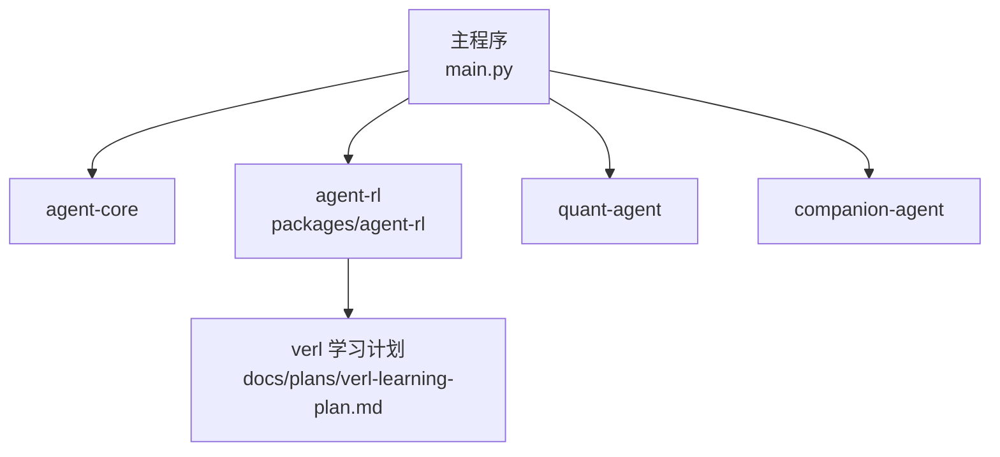
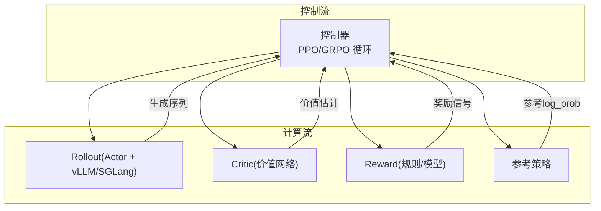
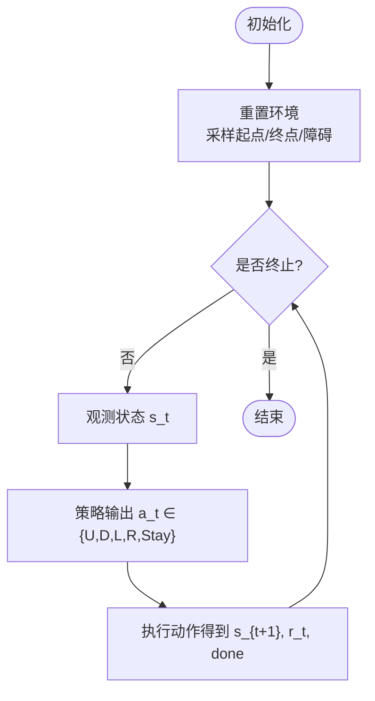
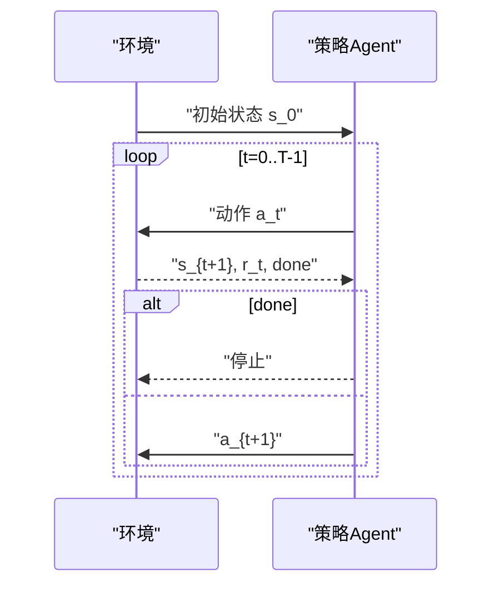
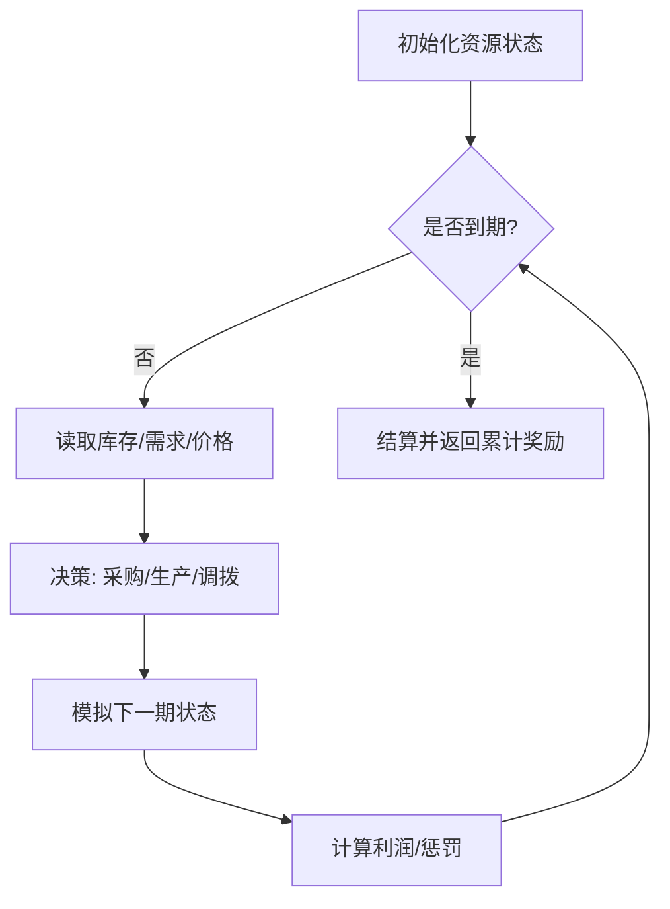
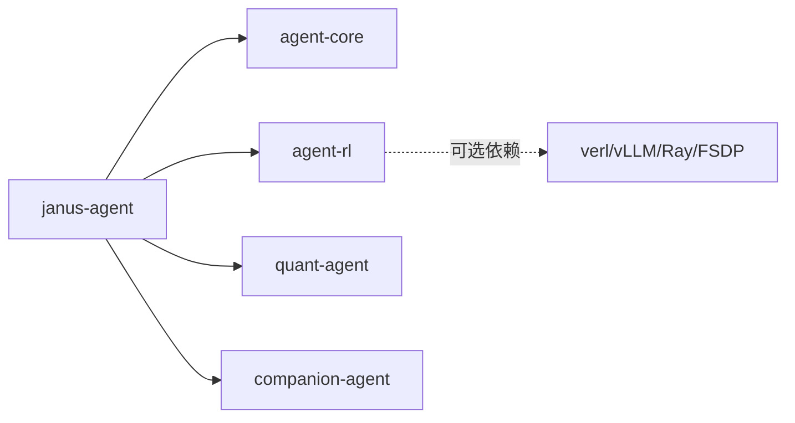

# 环境设计与配置

<cite>
**本文引用的文件**   
- [main.py](file://main.py)
- [pyproject.toml](file://pyproject.toml)
- [uv.lock](file://uv.lock)
- [agent-rl/README.md](file://packages/agent-rl/README.md)
- [agent-rl/__init__.py](file://packages/agent-rl/src/agent_rl/__init__.py)
- [verl-learning-plan.md](file://docs/plans/verl-learning-plan.md)
</cite>

## 目录
1. [引言](#引言)
2. [项目结构](#项目结构)
3. [核心组件](#核心组件)
4. [架构总览](#架构总览)
5. [详细组件分析](#详细组件分析)
6. [依赖分析](#依赖分析)
7. [性能考虑](#性能考虑)
8. [故障排查指南](#故障排查指南)
9. [结论](#结论)
10. [附录](#附录)

## 引言
本文件面向“如何设计并配置强化学习环境”的目标，结合仓库中 agent-rl 的定位与 verl 学习计划，给出：
- 环境定义规范（状态空间、动作空间、终止条件）
- 奖励函数设计原则与常见模式
- 典型环境类型模板（网格世界、路径规划、资源管理）
- 环境调试工具与性能优化技巧
- 每个示例的配置文件要点与测试用例清单

说明：当前仓库中的 agent-rl 包为骨架实现，具体环境与环境交互接口尚未落地。本文在保持与现有代码一致的前提下，提供可落地的设计方法与集成建议，便于后续扩展。

章节来源
- [agent-rl/README.md:1-15](file://packages/agent-rl/README.md#L1-L15)
- [agent-rl/__init__.py:1-14](file://packages/agent-rl/src/agent_rl/__init__.py#L1-L14)

## 项目结构
仓库采用 uv workspace 多包组织，主入口 main.py 聚合各子包能力；agent-rl 作为“强化学习之面”，负责环境交互、策略优化、奖励建模与模型部署。

图表来源
- [main.py:1-13](file://main.py#L1-L13)
- [agent-rl/README.md:1-15](file://packages/agent-rl/README.md#L1-L15)
- [verl-learning-plan.md:1-20](file://docs/plans/verl-learning-plan.md#L1-L20)

章节来源
- [main.py:1-13](file://main.py#L1-L13)
- [pyproject.toml:1-30](file://pyproject.toml#L1-L30)
- [uv.lock:2157-2185](file://uv.lock#L2157-L2185)

## 核心组件
- agent-rl 定位：强化学习智能体，包含环境交互、策略优化、奖励建模与模型部署。
- 当前状态：包内仅保留最小骨架与版本信息，训练与奖励模块待按 verl 学习计划逐步引入。

章节来源
- [agent-rl/__init__.py:1-14](file://packages/agent-rl/src/agent_rl/__init__.py#L1-L14)
- [agent-rl/README.md:1-15](file://packages/agent-rl/README.md#L1-L15)

## 架构总览
从 verl 学习计划可知，RL 训练通常由“控制流（单进程）+ 计算流（多进程）”组成，数据以 DataProto 跨进程传递，Actor/Rollout/Critic/Reward 等组件通过 WorkerGroup 协作。

图表来源
- [verl-learning-plan.md:215-281](file://docs/plans/verl-learning-plan.md#L215-L281)
- [verl-learning-plan.md:283-311](file://docs/plans/verl-learning-plan.md#L283-L311)

## 详细组件分析

### 环境定义规范
- 状态空间 S
  - 离散型：如网格坐标、图节点索引、库存等级枚举
  - 连续型：如位置/速度向量、资源比例、特征嵌入
  - 混合/结构化：图像/文本观测时，使用编码器映射到固定维度向量
- 动作空间 A
  - 离散动作集：移动方向、选择任务、开关设备
  - 连续动作：力度、角度、分配权重
  - 约束动作：需满足物理/业务约束（边界、容量、时序）
- 转移函数 P(s'|s,a)
  - 确定性或随机性（噪声、外部扰动）
  - 可观测或部分可观测（POMDP）
- 终止条件
  - 步数上限、目标达成、失败事件、资源耗尽

章节来源
- [verl-learning-plan.md:25-42](file://docs/plans/verl-learning-plan.md#L25-L42)

### 奖励函数设计原则
- 稀疏奖励 → 稠密化：阶段目标、距离惩罚、安全惩罚
- 稳定与尺度：归一化、裁剪、KL 惩罚项控制偏离
- 可解释与对齐：与人类偏好/业务指标一致
- 鲁棒性：对噪声不敏感，避免过拟合短期捷径

章节来源
- [verl-learning-plan.md:191-202](file://docs/plans/verl-learning-plan.md#L191-L202)

### 常见环境类型模板

#### 模板A：网格世界（GridWorld）
- 状态：二维坐标 (x,y)，障碍物掩码，目标位置
- 动作：上/下/左/右/停留
- 奖励：到达目标 +1，撞墙 -1，每步 -ε（鼓励最短路径）
- 终止：到达目标或达到最大步数
- 适用算法：PPO/GRPO（离散动作）

章节来源
- [verl-learning-plan.md:283-311](file://docs/plans/verl-learning-plan.md#L283-L311)

#### 模板B：路径规划（Path Planning）
- 状态：当前节点、邻接关系、动态障碍时间窗
- 动作：选择下一个邻居节点
- 奖励：到达目标 +R，碰撞/越界 -R，步数惩罚 -ε
- 终止：到达目标或超时
- 适用算法：PPO/GRPO（离散动作），可结合启发式剪枝

章节来源
- [verl-learning-plan.md:283-311](file://docs/plans/verl-learning-plan.md#L283-L311)

#### 模板C：资源管理（Resource Management）
- 状态：库存水平、需求预测、价格/成本
- 动作：采购量、生产量、调拨比例（连续或离散）
- 奖励：利润 = 收入 - 成本 - 缺货惩罚 - 持有成本
- 终止：周期结束或预算耗尽
- 适用算法：PPO（连续动作）、GRPO（分组相对优势）

章节来源
- [verl-learning-plan.md:283-311](file://docs/plans/verl-learning-plan.md#L283-L311)

### 配置文件与测试用例（示例清单）
以下为每个模板的“配置文件要点”和“测试用例清单”。实际实现时，将对应写入 agent-rl 的配置与测试目录。

- 网格世界
  - 配置文件要点
    - 网格尺寸、障碍分布、起始/目标点、最大步数
    - 奖励系数：到达、碰撞、步数惩罚
    - 观察编码方式（one-hot/坐标拼接）
  - 测试用例
    - 无障最短路径可达
    - 多障碍绕路正确
    - 边界行为（撞墙/越界）
    - 随机种子复现
    - 最大步数终止
- 路径规划
  - 配置文件要点
    - 图规模、边权重、动态障碍时间表
    - 启发式参数（若使用）
    - 奖励与 KL 系数
  - 测试用例
    - 静态图最优路径
    - 动态障碍避让
    - 死路与回退处理
    - 大规模图稳定性
- 资源管理
  - 配置文件要点
    - 需求分布、价格波动、持有/缺货成本
    - 动作上下界、批量粒度
    - 评估窗口与折扣因子
  - 测试用例
    - 零需求场景（不超采）
    - 峰值需求（缺货惩罚生效）
    - 成本敏感（低利润收敛）
    - 长周期稳定性

章节来源
- [verl-learning-plan.md:452-489](file://docs/plans/verl-learning-plan.md#L452-L489)

### 环境调试工具与性能优化技巧
- 调试工具
  - 日志与可视化：控制台、TensorBoard、W&B
  - 指标监控：验证集得分、策略梯度损失、价值损失、熵、KL 惩罚、平均回复长度、奖励均值
- 性能优化
  - 微批次大小与 GPU 内存利用率调优
  - 推理后端选择：vLLM 或 SGLang
  - LoRA RL 降低显存占用
  - 分布式并行：FSDP / Megatron 切换

章节来源
- [verl-learning-plan.md:191-202](file://docs/plans/verl-learning-plan.md#L191-L202)
- [verl-learning-plan.md:384-395](file://docs/plans/verl-learning-plan.md#L384-L395)
- [verl-learning-plan.md:517-527](file://docs/plans/verl-learning-plan.md#L517-L527)

## 依赖分析
- 顶层项目 janus-agent 依赖 agent-core、agent-rl、quant-agent、companion-agent。
- agent-rl 目前为空依赖包，后续可将 verl、vLLM、Ray、FSDP 等作为可选依赖引入。

图表来源
- [pyproject.toml:1-30](file://pyproject.toml#L1-L30)
- [uv.lock:2157-2185](file://uv.lock#L2157-L2185)

章节来源
- [pyproject.toml:1-30](file://pyproject.toml#L1-L30)
- [uv.lock:2157-2185](file://uv.lock#L2157-L2185)

## 性能考虑
- 训练循环关键步骤：Rollout 生成、旧策略 log_prob、参考策略 log_prob、价值估计、奖励计算、GAE 优势、Actor/Critic 更新。
- 监控重点：验证集得分、策略/价值损失、熵、KL 惩罚、响应长度、奖励均值。
- 硬件与后端：根据模型规模选择 vLLM 或 SGLang；合理设置 micro_batch_size 与 gpu_memory_utilization；必要时启用 LoRA。

章节来源
- [verl-learning-plan.md:283-311](file://docs/plans/verl-learning-plan.md#L283-L311)
- [verl-learning-plan.md:191-202](file://docs/plans/verl-learning-plan.md#L191-L202)
- [verl-learning-plan.md:384-395](file://docs/plans/verl-learning-plan.md#L384-L395)

## 故障排查指南
- 单卡显存不足：减小模型规模、降低 ppo_micro_batch_size_per_gpu 与 gpu_memory_utilization，或使用 LoRA RL。
- NaN loss：检查学习率是否过高（建议 ≤ 1e-5），调整 KL 系数。
- 后端选择：vLLM 生态完善适合生产；SGLang 在多轮 RL 与 VLM RL 上有独特优化。

章节来源
- [verl-learning-plan.md:505-516](file://docs/plans/verl-learning-plan.md#L505-L516)

## 结论
当前仓库已明确 agent-rl 的定位与 verl 的学习路线。下一步可在 agent-rl 中引入 verl 及其依赖，封装训练入口与自定义奖励函数，并按本文的环境设计规范与模板快速落地网格世界、路径规划、资源管理等典型环境，配合调试与性能优化手段完成端到端闭环。

## 附录
- 安装与运行
  - 使用 uv sync 安装依赖后，可通过 uv run agent-rl 启动（当前为骨架）。
- 训练脚本化与 YAML 对齐
  - 将 verl 命令行训练封装为 Python API，并与 JanusAgent 的 YAML 配置体系对齐。

章节来源
- [agent-rl/README.md:1-15](file://packages/agent-rl/README.md#L1-L15)
- [verl-learning-plan.md:437-482](file://docs/plans/verl-learning-plan.md#L437-L482)