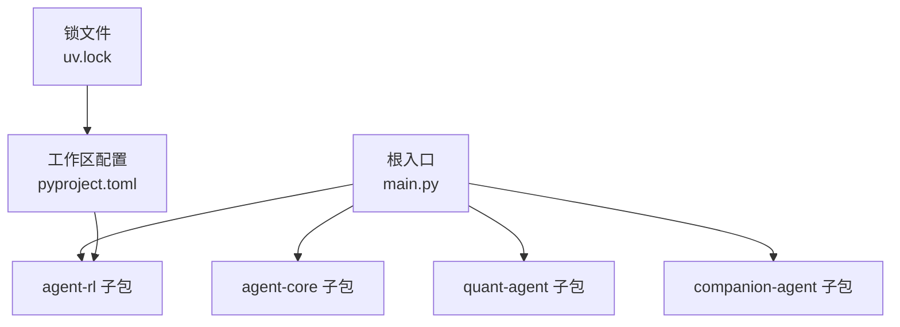
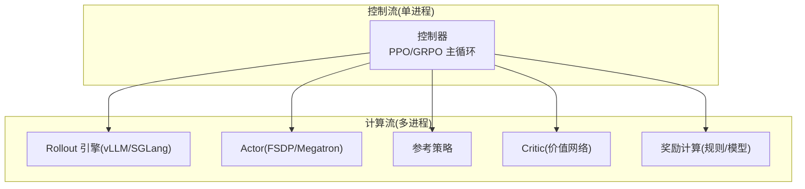
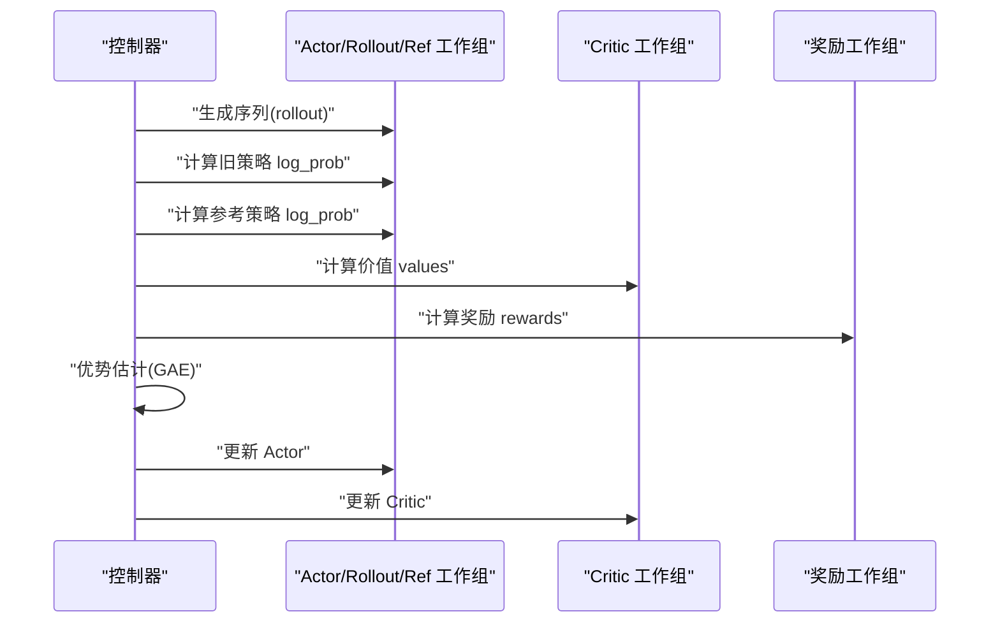
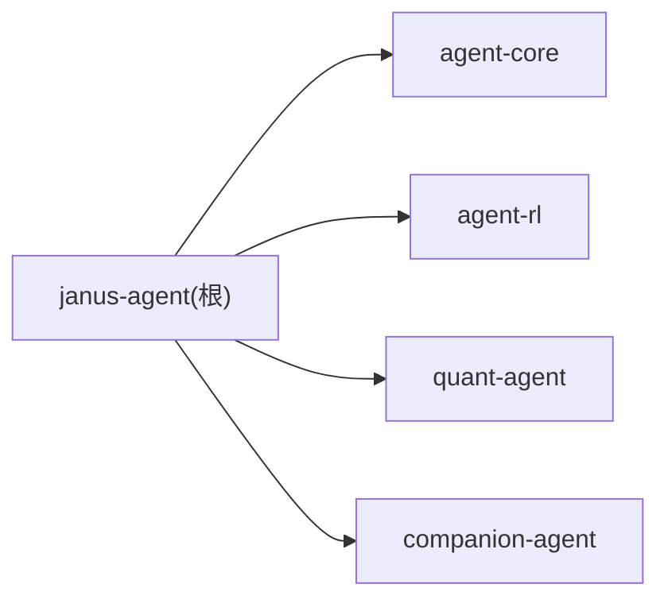

# 训练流程管理

<cite>
**本文引用的文件**   
- [main.py](file://main.py)
- [pyproject.toml](file://pyproject.toml)
- [uv.lock](file://uv.lock)
- [agent_rl/__init__.py](file://packages/agent-rl/src/agent_rl/__init__.py)
- [verl-learning-plan.md](file://docs/plans/verl-learning-plan.md)
</cite>

## 目录
1. [简介](#简介)
2. [项目结构](#项目结构)
3. [核心组件](#核心组件)
4. [架构总览](#架构总览)
5. [详细组件分析](#详细组件分析)
6. [依赖分析](#依赖分析)
7. [性能考虑](#性能考虑)
8. [故障排查指南](#故障排查指南)
9. [结论](#结论)
10. [附录](#附录)

## 简介
本文件面向“强化学习训练工作流程”的端到端落地，覆盖从训练脚本编写、超参数调优、模型保存与加载、训练监控与日志记录，到批量与分布式训练配置方案；同时提供常见问题诊断与解决方案，并说明如何通过回调机制实现自定义训练逻辑，以及训练结果分析与可视化工具的使用方法。本项目以 verl（HybridFlow）作为 RLHF 训练框架基础，结合 agent-rl 子包进行工程化封装与集成。

## 项目结构
仓库采用多包工作区组织，根入口 main.py 聚合各子包能力；agent-rl 子包承载强化学习相关能力，当前为骨架包，后续将整合 verl 的训练编排、奖励函数、数据预处理与实验跟踪等模块。

图示来源
- [main.py:1-13](file://main.py#L1-L13)
- [pyproject.toml:1-30](file://pyproject.toml#L1-L30)
- [uv.lock:2157-2162](file://uv.lock#L2157-L2162)

章节来源
- [main.py:1-13](file://main.py#L1-L13)
- [pyproject.toml:1-30](file://pyproject.toml#L1-L30)
- [uv.lock:2157-2162](file://uv.lock#L2157-L2162)

## 核心组件
- 根入口与子包聚合：根入口负责调用各子包的 hello/main 能力，便于统一启动与演示。
- agent-rl 子包：定位为“自主学习之面”，包含强化学习环境交互、策略优化、奖励建模与部署能力。当前为初始化骨架，后续将引入 verl 训练管线与工具链。
- 工作区与依赖：通过 pyproject.toml 声明 workspace 成员与依赖关系，uv.lock 锁定版本。

章节来源
- [main.py:1-13](file://main.py#L1-L13)
- [agent_rl/__init__.py:1-14](file://packages/agent-rl/src/agent_rl/__init__.py#L1-L14)
- [pyproject.toml:14-30](file://pyproject.toml#L14-L30)
- [uv.lock:2157-2162](file://uv.lock#L2157-L2162)

## 架构总览
基于 verl 的 HybridFlow 编程模型，训练过程解耦为控制流与计算流：控制流由单进程控制器协调，计算流在 Ray WorkerGroup 中并行执行 Actor/Rollout/Reference/Critic/Reward 等引擎，并通过 DataProto 跨进程传递数据。

图示来源
- [verl-learning-plan.md:215-281](file://docs/plans/verl-learning-plan.md#L215-L281)

## 详细组件分析

### PPO 训练主循环（概念级）
PPO 训练在每个批次上依次完成 rollout、旧策略 log_prob、参考策略 log_prob、价值估计、奖励计算、优势估计（GAE）、Actor 更新与 Critic 更新。该流程体现了 Control Flow 对多个 WorkerGroup 的调度。

图示来源
- [verl-learning-plan.md:283-311](file://docs/plans/verl-learning-plan.md#L283-L311)

章节来源
- [verl-learning-plan.md:283-311](file://docs/plans/verl-learning-plan.md#L283-L311)

### 训练脚本与命令行参数（PPO 示例）
- 数据预处理：使用示例脚本准备数据集。
- 基础模型下载：确保目标模型可被推理库加载。
- 启动训练：通过命令行参数指定数据路径、批大小、模型路径、优化器学习率、rollout 后端、GPU 内存利用率、日志与检查点频率、总轮次等。

章节来源
- [verl-learning-plan.md:151-189](file://docs/plans/verl-learning-plan.md#L151-L189)

### 超参数调优要点
- 学习率：建议较小值（如 ≤ 1e-5），避免不稳定或 NaN。
- KL 系数：合理设置以平衡探索与稳定性。
- 微批次大小：根据显存调整 ppo_micro_batch_size_per_gpu。
- GPU 内存利用率：vLLM 的 gpu_memory_utilization 需与显存容量匹配。
- 序列长度：max_prompt_length 与 max_response_length 影响吞吐与显存占用。

章节来源
- [verl-learning-plan.md:505-516](file://docs/plans/verl-learning-plan.md#L505-L516)

### 模型保存与合并
- 训练过程中按步长保存分片权重。
- 训练结束后，使用模型合并工具将 FSDP 分片权重合并为 HuggingFace 格式，便于部署与评测。

章节来源
- [verl-learning-plan.md:203-211](file://docs/plans/verl-learning-plan.md#L203-L211)

### 训练监控与日志记录
- 关键指标：验证集得分、策略梯度损失、价值函数损失、策略熵、KL 惩罚项、回复长度均值、奖励均值等。
- 日志后端：支持控制台、wandb、TensorBoard 等。
- 实验命名：通过 project_name 与 experiment_name 区分不同实验。

章节来源
- [verl-learning-plan.md:191-201](file://docs/plans/verl-learning-plan.md#L191-L201)
- [verl-learning-plan.md:517-527](file://docs/plans/verl-learning-plan.md#L517-L527)

### 批量训练与分布式训练配置
- 单节点多卡：通过 n_gpus_per_node 与 nnodes 控制资源规模。
- 多节点集群：结合 Ray 集群与 NCCL 通信，注意共享内存与网络参数。
- 推理后端选择：vLLM 生态完善适合生产；SGLang 在多轮 RL 与 VLM RL 上有独特优化。

章节来源
- [verl-learning-plan.md:161-189](file://docs/plans/verl-learning-plan.md#L161-L189)
- [verl-learning-plan.md:514-516](file://docs/plans/verl-learning-plan.md#L514-L516)

### 回调与自定义训练逻辑
- 在 VerlTrainer 中可通过回调钩子插入自定义逻辑，例如：
  - 每 N 步触发评估与采样可视化
  - 动态调整 KL 系数或学习率
  - 记录中间样本与轨迹
- 建议将回调注册为独立模块，便于复用与组合。

章节来源
- [verl-learning-plan.md:452-482](file://docs/plans/verl-learning-plan.md#L452-L482)

### 自定义奖励函数
- 规则奖励：参考 GSM8K/MATH 的规则解析与评分逻辑。
- 模型奖励：可接入外部奖励模型，输出标量反馈。
- 奖励管道：将环境交互结果与业务规则结合，形成可编程的 Reward Loop。

章节来源
- [verl-learning-plan.md:484-489](file://docs/plans/verl-learning-plan.md#L484-L489)

### 训练结果分析与可视化
- 指标曲线：关注 val/test_score、actor/pg_loss、critic/vf_loss、entropy、KL penalty、response_length、rewards mean。
- 对比实验：使用 wandb 或 TensorBoard 的多实验对比面板。
- 样本回放：定期保存 prompt/response/reward 三元组，用于离线分析。

章节来源
- [verl-learning-plan.md:191-201](file://docs/plans/verl-learning-plan.md#L191-L201)
- [verl-learning-plan.md:517-527](file://docs/plans/verl-learning-plan.md#L517-L527)

## 依赖分析
- 工作区成员：packages/* 下的子包均纳入 uv workspace。
- 顶层依赖：janus-agent 依赖 agent-core、agent-rl、quant-agent、companion-agent。
- 锁文件：uv.lock 记录了具体依赖版本与来源，便于复现。

图示来源
- [pyproject.toml:1-12](file://pyproject.toml#L1-L12)
- [uv.lock:2157-2162](file://uv.lock#L2157-L2162)

章节来源
- [pyproject.toml:1-12](file://pyproject.toml#L1-L12)
- [uv.lock:2157-2162](file://uv.lock#L2157-L2162)

## 性能考虑
- 显存瓶颈：优先降低 ppo_micro_batch_size_per_gpu 与 gpu_memory_utilization，或使用 LoRA RL 降低显存需求。
- 吞吐优化：合理设置 tensor_model_parallel_size 与 log_prob_micro_batch_size_per_gpu。
- 数据流水线：增大 DataLoader 进程数与共享内存，避免 I/O 阻塞。
- 算法选择：GRPO 无需 Critic，可降低显存压力；DAPO 通过动态采样提升效率。

章节来源
- [verl-learning-plan.md:505-516](file://docs/plans/verl-learning-plan.md#L505-L516)
- [verl-learning-plan.md:384-395](file://docs/plans/verl-learning-plan.md#L384-L395)

## 故障排查指南
- 单卡显存不足：减小模型规模与微批次，或启用 LoRA RL。
- NaN loss：降低学习率至合理范围，检查 KL 系数是否过大。
- vLLM vs SGLang：生产场景优先 vLLM；多轮 RL/VLM 场景可尝试 SGLang。
- 日志缺失：确认 trainer.logger 配置正确，并检查后端服务（如 wandb/TensorBoard）。

章节来源
- [verl-learning-plan.md:505-527](file://docs/plans/verl-learning-plan.md#L505-L527)

## 结论
通过将 verl 的 HybridFlow 训练范式与 agent-rl 子包工程化封装，可实现从数据预处理、模型加载、训练主循环、监控日志、模型保存合并到批量/分布式训练的全流程闭环。配合回调机制与自定义奖励函数，能够灵活适配多样化业务场景，并以 wandb/TensorBoard 进行结果分析与可视化。

## 附录
- 快速上手：参考 PPO 训练命令与关键参数，逐步跑通 GSM8K 示例。
- 进阶主题：多轮 Agent Loop、VLM 多模态 RL、LoRA + RL、性能调优指南。
- 参考资料：verl 官方文档、HybridFlow 论文、verl-recipe 与 DAPO 主页。

章节来源
- [verl-learning-plan.md:145-189](file://docs/plans/verl-learning-plan.md#L145-L189)
- [verl-learning-plan.md:371-406](file://docs/plans/verl-learning-plan.md#L371-L406)
- [verl-learning-plan.md:529-536](file://docs/plans/verl-learning-plan.md#L529-L536)