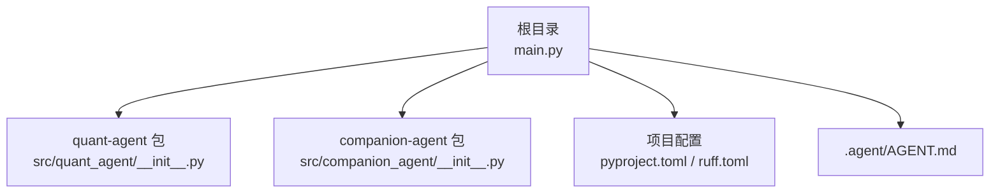
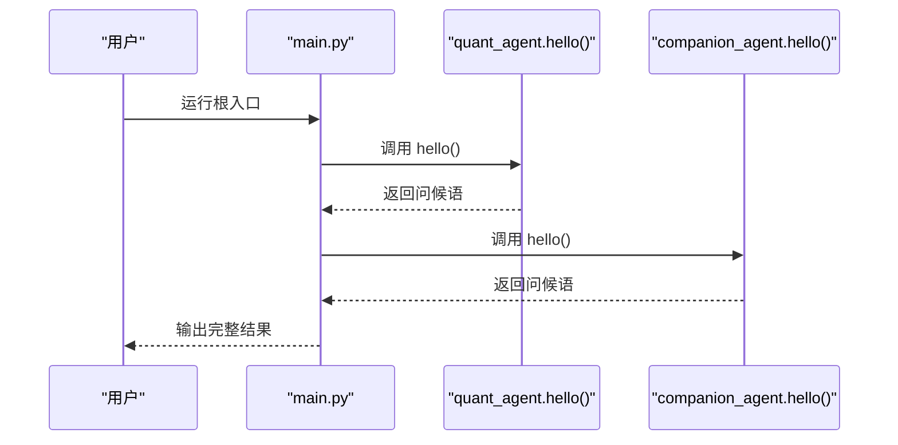
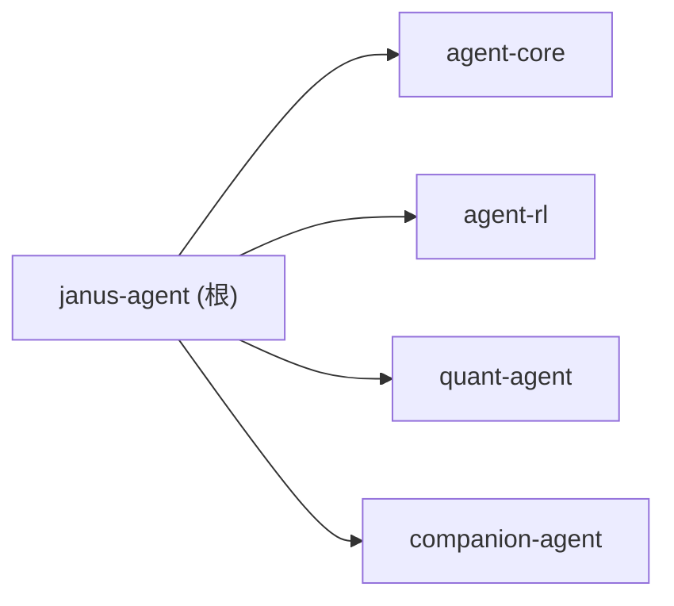

# 快速开始

<cite>
**本文引用的文件**   
- [main.py](file://main.py)
- [pyproject.toml](file://pyproject.toml)
- [ruff.toml](file://ruff.toml)
- [AGENT.md](file://.agent/AGENT.md)
- [quant-agent README.md](file://packages/quant-agent/README.md)
- [companion-agent README.md](file://packages/companion-agent/README.md)
- [quant_agent/__init__.py](file://packages/quant-agent/src/quant_agent/__init__.py)
- [companion_agent/__init__.py](file://packages/companion-agent/src/companion_agent/__init__.py)
</cite>

## 目录
1. [简介](#简介)
2. [项目结构](#项目结构)
3. [核心组件](#核心组件)
4. [架构总览](#架构总览)
5. [详细组件分析](#详细组件分析)
6. [依赖分析](#依赖分析)
7. [性能考虑](#性能考虑)
8. [故障排除指南](#故障排除指南)
9. [结论](#结论)
10. [附录](#附录)

## 简介
本指南帮助你在5分钟内运行第一个 JanusAgent 应用，体验“量化交易智能体”与“陪伴助手”的基本能力。你将完成环境准备、依赖安装、基本配置与首次运行，并通过最简单的 Hello World 示例了解如何调用两个智能体的入口函数。

## 项目结构
JanusAgent 是一个双面孔个人智能体框架，包含：
- 根入口 main.py：统一启动并调用两个子包的能力
- 工作区配置 pyproject.toml：声明 Python 版本、依赖与工作区成员
- 代码规范 ruff.toml：格式化与静态检查规则
- 智能体包：
  - quant-agent：量化交易智能体（理性之面）
  - companion-agent：情感陪伴智能体（感性之面）

图表来源
- [main.py:1-12](file://main.py#L1-L12)
- [pyproject.toml:1-30](file://pyproject.toml#L1-L30)
- [ruff.toml:1-70](file://ruff.toml#L1-L70)
- [AGENT.md:1-142](file://.agent/AGENT.md#L1-L142)

章节来源
- [main.py:1-12](file://main.py#L1-L12)
- [pyproject.toml:1-30](file://pyproject.toml#L1-L30)
- [ruff.toml:1-70](file://ruff.toml#L1-L70)
- [AGENT.md:1-142](file://.agent/AGENT.md#L1-L142)

## 核心组件
- 根入口 main.py：打印框架标题并依次调用两个智能体的 hello 方法，展示最小可用流程。
- 量化交易智能体 quant-agent：提供 hello 与命令行入口脚本，用于数据驱动决策的演示。
- 陪伴助手 companion-agent：提供 hello 与命令行入口脚本，用于对话与陪伴能力的演示。

章节来源
- [main.py:1-12](file://main.py#L1-L12)
- [quant_agent/__init__.py:1-14](file://packages/quant-agent/src/quant_agent/__init__.py#L1-L14)
- [companion_agent/__init__.py:1-14](file://packages/companion-agent/src/companion_agent/__init__.py#L1-L14)

## 架构总览
下图展示了从根入口到两个智能体包的调用关系，以及工作区与脚本入口的配置位置。

图表来源
- [main.py:1-12](file://main.py#L1-L12)
- [quant_agent/__init__.py:1-14](file://packages/quant-agent/src/quant_agent/__init__.py#L1-L14)
- [companion_agent/__init__.py:1-14](file://packages/companion-agent/src/companion_agent/__init__.py#L1-L14)

## 详细组件分析

### 根入口 main.py
- 职责：作为框架的统一入口，打印标题并调用两个智能体的 hello 方法。
- 关键点：
  - 导入 quant_agent 与 companion_agent 两个包
  - 顺序调用 hello 并打印结果
  - 通过 if __name__ == "__main__" 触发执行

章节来源
- [main.py:1-12](file://main.py#L1-L12)

### 量化交易智能体 quant-agent
- 职责：提供量化交易相关的演示能力，暴露 hello 与命令行入口。
- 关键点：
  - 定义 hello 返回问候信息
  - 定义 main 用于命令行直接运行
  - 在 pyproject.toml 中注册脚本入口 quant-agent

章节来源
- [quant_agent/__init__.py:1-14](file://packages/quant-agent/src/quant_agent/__init__.py#L1-L14)
- [quant-agent README.md:1-16](file://packages/quant-agent/README.md#L1-L16)
- [pyproject.toml:1-30](file://pyproject.toml#L1-L30)

### 陪伴助手 companion-agent
- 职责：提供对话与陪伴能力的演示，暴露 hello 与命令行入口。
- 关键点：
  - 定义 hello 返回问候信息
  - 定义 main 用于命令行直接运行
  - 在 pyproject.toml 中注册脚本入口 companion-agent

章节来源
- [companion_agent/__init__.py:1-14](file://packages/companion-agent/src/companion_agent/__init__.py#L1-L14)
- [companion-agent README.md:1-16](file://packages/companion-agent/README.md#L1-L16)
- [pyproject.toml:1-30](file://pyproject.toml#L1-L30)

### 配置与规范
- pyproject.toml：声明 Python 版本要求、依赖与工作区成员；将四个子包加入工作区。
- ruff.toml：设置行宽、目标版本、忽略与选中的规则集，便于统一代码风格。

章节来源
- [pyproject.toml:1-30](file://pyproject.toml#L1-L30)
- [ruff.toml:1-70](file://ruff.toml#L1-L70)

## 依赖分析
- 语言与工具链：Python >= 3.12；使用 uv 进行依赖管理与工作区编排。
- 工作区成员：packages/* 下的四个包（agent-core、agent-rl、quant-agent、companion-agent）。
- 顶层依赖：janus-agent 依赖上述四个包，确保运行时可被导入。

图表来源
- [pyproject.toml:1-30](file://pyproject.toml#L1-L30)

章节来源
- [pyproject.toml:1-30](file://pyproject.toml#L1-L30)

## 性能考虑
- 当前为最小可用示例，主要开销在于解释器启动与模块导入，无外部服务或重型计算。
- 建议：
  - 使用 uv 管理虚拟环境与依赖，避免全局污染
  - 按需启用 ruff 预提交钩子，减少本地调试成本
  - 后续扩展时关注 I/O 与网络请求的并发与超时策略

## 故障排除指南
- 无法找到 Python 3.12+：请安装或切换到满足要求的 Python 版本。
- uv 未安装或不可用：请先安装 uv，再在项目根目录执行依赖同步。
- 运行时报 ModuleNotFoundError：确认已在项目根目录执行依赖安装，且工作区成员已正确解析。
- 命令找不到 quant-agent 或 companion-agent：确认已通过 uv 安装工作区，并使用 uv run 执行对应脚本。
- 代码风格报错：参考 ruff.toml 的规则集，或在开发阶段按需调整忽略项。

章节来源
- [AGENT.md:111-127](file://.agent/AGENT.md#L111-L127)
- [quant-agent README.md:1-16](file://packages/quant-agent/README.md#L1-L16)
- [companion-agent README.md:1-16](file://packages/companion-agent/README.md#L1-L16)
- [ruff.toml:1-70](file://ruff.toml#L1-L70)

## 结论
通过以上步骤，你已完成环境准备、依赖安装与首次运行，并成功调用量化交易智能体与陪伴助手的 hello 接口。下一步可基于各自包的 README 与入口脚本进一步探索更多能力。

## 附录

### 5分钟快速上手清单
- 准备环境
  - 安装 Python 3.12+
  - 安装 uv
- 安装依赖
  - 在项目根目录执行依赖同步
- 运行根入口
  - 使用 uv 运行根入口 main.py
- 分别运行子包
  - 使用 uv run 执行 quant-agent 与 companion-agent 脚本

章节来源
- [AGENT.md:111-127](file://.agent/AGENT.md#L111-L127)
- [quant-agent README.md:1-16](file://packages/quant-agent/README.md#L1-L16)
- [companion-agent README.md:1-16](file://packages/companion-agent/README.md#L1-L16)
- [main.py:1-12](file://main.py#L1-L12)