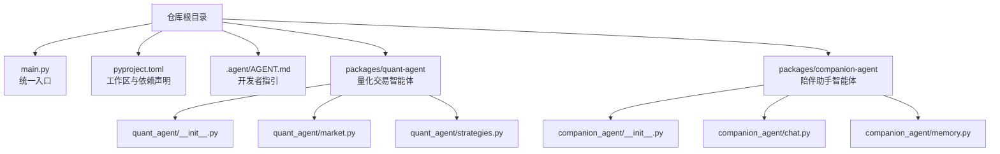
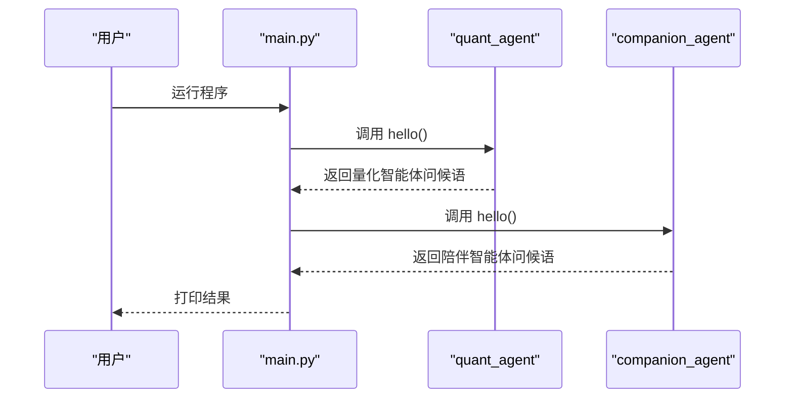
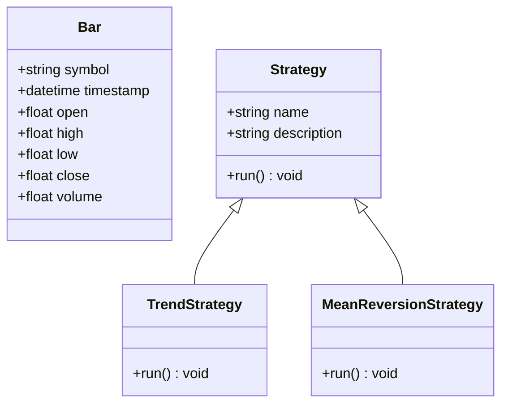
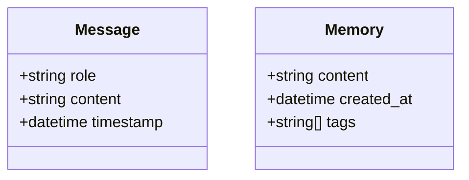
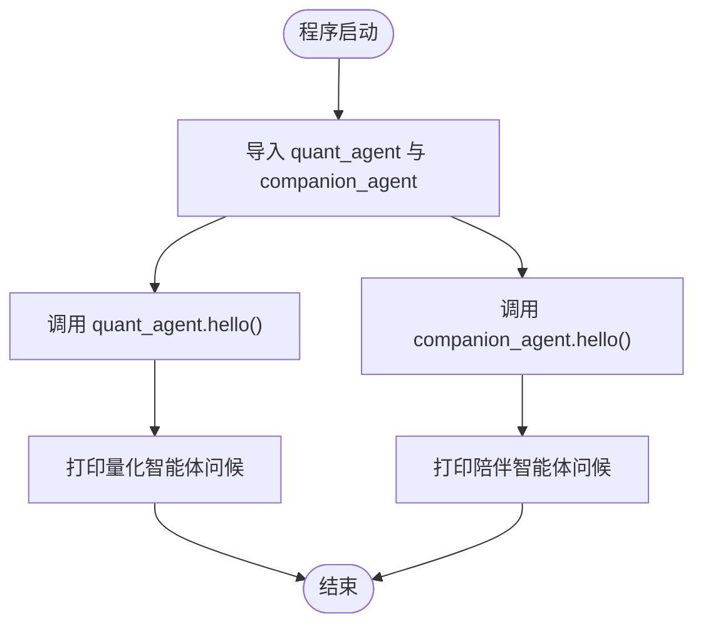
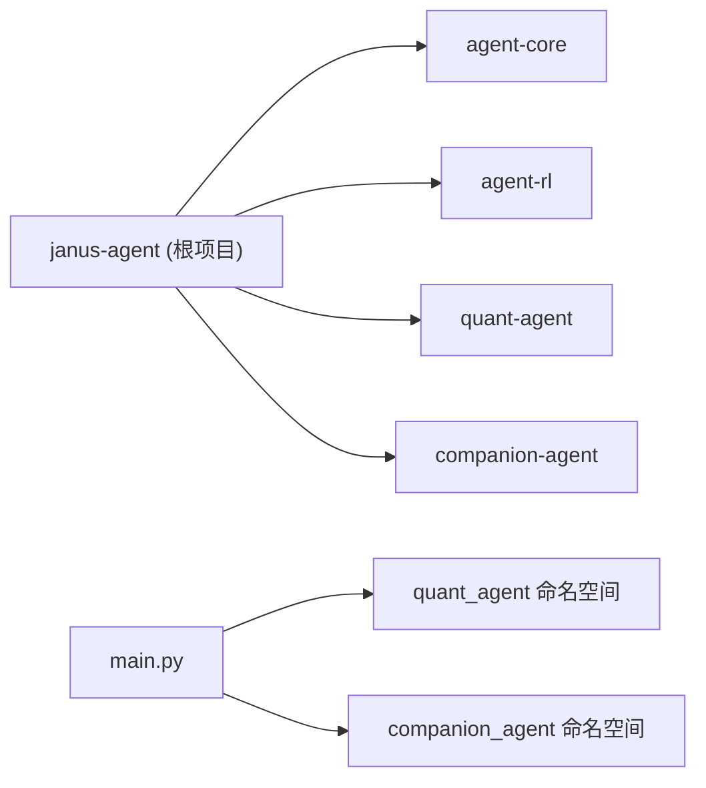

# 示例与教程

<cite>
**本文引用的文件**   
- [main.py](file://main.py)
- [pyproject.toml](file://pyproject.toml)
- [AGENT.md](file://.agent/AGENT.md)
- [quant_agent/__init__.py](file://packages/quant-agent/src/quant_agent/__init__.py)
- [quant_agent/market.py](file://packages/quant-agent/src/quant_agent/market.py)
- [quant_agent/strategies.py](file://packages/quant-agent/src/quant_agent/strategies.py)
- [companion_agent/__init__.py](file://packages/companion-agent/src/companion_agent/__init__.py)
- [companion_agent/chat.py](file://packages/companion-agent/src/companion_agent/chat.py)
- [companion_agent/memory.py](file://packages/companion-agent/src/companion_agent/memory.py)
</cite>

## 目录
1. [简介](#简介)
2. [项目结构](#项目结构)
3. [核心组件](#核心组件)
4. [架构总览](#架构总览)
5. [详细组件分析](#详细组件分析)
6. [依赖关系分析](#依赖关系分析)
7. [性能考虑](#性能考虑)
8. [故障排查指南](#故障排查指南)
9. [结论](#结论)
10. [附录：从零到一实战教程](#附录从零到一实战教程)

## 简介
本仓库是一个“双面智能体框架”的示例工程，包含两个面向不同场景的智能体：
- 量化交易智能体（理性之面）：提供市场数据模型、策略基类与回测扩展点。
- 陪伴助手智能体（感性之面）：提供对话消息模型、记忆结构与多轮交互基础能力。

通过统一入口 main.py 可同时启动两个智能体的演示能力，便于快速体验与二次开发。

## 项目结构
仓库采用 uv workspace 组织多个子包，根目录提供统一入口与配置；各功能以 packages/* 形式拆分，便于独立演进与复用。

图表来源
- [main.py:1-13](file://main.py#L1-L13)
- [pyproject.toml:1-30](file://pyproject.toml#L1-L30)
- [AGENT.md:1-142](file://.agent/AGENT.md#L1-L142)
- [quant_agent/__init__.py:1-15](file://packages/quant-agent/src/quant_agent/__init__.py#L1-L15)
- [quant_agent/market.py:1-16](file://packages/quant-agent/src/quant_agent/market.py#L1-L16)
- [quant_agent/strategies.py:1-13](file://packages/quant-agent/src/quant_agent/strategies.py#L1-L13)
- [companion_agent/__init__.py:1-15](file://packages/companion-agent/src/companion_agent/__init__.py#L1-L15)
- [companion_agent/chat.py:1-12](file://packages/companion-agent/src/companion_agent/chat.py#L1-L12)
- [companion_agent/memory.py:1-12](file://packages/companion-agent/src/companion_agent/memory.py#L1-L12)

章节来源
- [main.py:1-13](file://main.py#L1-L13)
- [pyproject.toml:1-30](file://pyproject.toml#L1-L30)
- [AGENT.md:1-142](file://.agent/AGENT.md#L1-L142)

## 核心组件
- 量化交易智能体
  - 市场数据模型 Bar：封装单根 K 线的基本字段（标的、时间、开高低收、成交量）。
  - 策略基类 Strategy：定义策略名称、描述与统一的 run 接口，供具体策略继承实现。
- 陪伴助手智能体
  - 对话消息 Message：封装角色、内容与时间戳，用于构建多轮对话历史。
  - 记忆 Memory：封装记忆内容、创建时间与标签列表，支持个性化与检索扩展。

章节来源
- [quant_agent/market.py:1-16](file://packages/quant-agent/src/quant_agent/market.py#L1-L16)
- [quant_agent/strategies.py:1-13](file://packages/quant-agent/src/quant_agent/strategies.py#L1-L13)
- [companion_agent/chat.py:1-12](file://packages/companion-agent/src/companion_agent/chat.py#L1-L12)
- [companion_agent/memory.py:1-12](file://packages/companion-agent/src/companion_agent/memory.py#L1-L12)

## 架构总览
整体采用“双智能体 + 统一入口”的轻量架构。根入口负责加载并调用两个子包的 hello 能力，展示各自定位与能力边界。

图表来源
- [main.py:1-13](file://main.py#L1-L13)
- [quant_agent/__init__.py:1-15](file://packages/quant-agent/src/quant_agent/__init__.py#L1-L15)
- [companion_agent/__init__.py:1-15](file://packages/companion-agent/src/companion_agent/__init__.py#L1-L15)

## 详细组件分析

### 量化交易智能体（Quant Agent）
- 数据模型 Bar
  - 作用：标准化单根 K 线数据结构，作为策略输入与回测的基础单元。
  - 复杂度：O(1) 构造与访问。
  - 可扩展点：可追加技术指标字段或元数据。
- 策略基类 Strategy
  - 作用：抽象策略通用属性与 run 接口，约束子类必须实现具体交易逻辑。
  - 设计模式：模板方法（run 为抽象钩子）。
  - 可扩展点：在子类中接入行情数据源、风控模块与订单执行器。

图表来源
- [quant_agent/market.py:1-16](file://packages/quant-agent/src/quant_agent/market.py#L1-L16)
- [quant_agent/strategies.py:1-13](file://packages/quant-agent/src/quant_agent/strategies.py#L1-L13)

章节来源
- [quant_agent/market.py:1-16](file://packages/quant-agent/src/quant_agent/market.py#L1-L16)
- [quant_agent/strategies.py:1-13](file://packages/quant-agent/src/quant_agent/strategies.py#L1-L13)

### 陪伴助手智能体（Companion Agent）
- 对话消息 Message
  - 作用：记录每轮对话的角色、内容与时间戳，支撑上下文管理。
  - 使用建议：结合会话 ID 进行分会话存储与检索。
- 记忆 Memory
  - 作用：持久化用户的偏好、经历与关键信息，支持标签化检索。
  - 使用建议：按时间衰减与重要性评分进行记忆更新与清理。

图表来源
- [companion_agent/chat.py:1-12](file://packages/companion-agent/src/companion_agent/chat.py#L1-L12)
- [companion_agent/memory.py:1-12](file://packages/companion-agent/src/companion_agent/memory.py#L1-L12)

章节来源
- [companion_agent/chat.py:1-12](file://packages/companion-agent/src/companion_agent/chat.py#L1-L12)
- [companion_agent/memory.py:1-12](file://packages/companion-agent/src/companion_agent/memory.py#L1-L12)

### 统一入口与运行流程
- main.py 负责导入两个子包并调用其 hello 函数，输出欢迎信息。
- 该流程展示了“统一入口 -> 子包能力”的解耦方式，便于后续扩展更多智能体。

图表来源
- [main.py:1-13](file://main.py#L1-L13)
- [quant_agent/__init__.py:1-15](file://packages/quant-agent/src/quant_agent/__init__.py#L1-L15)
- [companion_agent/__init__.py:1-15](file://packages/companion-agent/src/companion_agent/__init__.py#L1-L15)

章节来源
- [main.py:1-13](file://main.py#L1-L13)

## 依赖关系分析
- 工作区与依赖
  - pyproject.toml 声明了工作区成员 packages/*，并将四个子包作为依赖引入。
  - 根项目依赖 agent-core、agent-rl、quant-agent、companion-agent，其中 quant-agent 与 companion-agent 已在本仓库内实现。
- 运行时依赖
  - main.py 仅依赖 quant_agent 与 companion_agent 两个命名空间，无第三方库直接依赖。

图表来源
- [pyproject.toml:1-30](file://pyproject.toml#L1-L30)
- [main.py:1-13](file://main.py#L1-L13)

章节来源
- [pyproject.toml:1-30](file://pyproject.toml#L1-L30)
- [main.py:1-13](file://main.py#L1-L13)

## 性能考虑
- 数据模型
  - Bar 与 Message/Memory 均为轻量 dataclass，内存占用低，适合高频构造与传递。
- 策略扩展
  - 建议在具体策略中按需缓存指标计算结果，避免重复计算。
- 对话与记忆
  - 对长对话历史可采用滑动窗口或摘要压缩；记忆可按标签与时间维度做索引与淘汰。

## 故障排查指南
- 无法找到子包
  - 确认已通过 uv sync 安装工作区依赖，且当前环境 Python 版本满足要求。
- 运行无输出或报错
  - 检查 main.py 是否正确导入 quant_agent 与 companion_agent，以及对应 __init__.py 是否暴露 hello 函数。
- 策略未实现
  - 若直接调用 Strategy.run 将触发未实现异常，请继承 Strategy 并实现 run 方法。

章节来源
- [quant_agent/strategies.py:1-13](file://packages/quant-agent/src/quant_agent/strategies.py#L1-L13)

## 结论
本项目以最小可用形态展示了“量化交易智能体”和“陪伴助手智能体”的双面架构。通过统一入口与清晰的数据模型/策略基类，为后续接入真实数据源、完善策略与对话系统提供了良好基础。

## 附录：从零到一实战教程

### 快速开始
- 安装依赖
  - 在工作区根目录执行依赖同步命令，确保所有子包可用。
- 运行演示
  - 通过根入口 main.py 运行，查看两个智能体的问候输出。

章节来源
- [pyproject.toml:1-30](file://pyproject.toml#L1-L30)
- [main.py:1-13](file://main.py#L1-L13)

### 实战案例一：趋势跟踪策略（示例骨架）
- 目标
  - 基于 Bar 序列，实现简单的趋势跟踪信号生成与交易动作。
- 步骤
  - 新建策略类继承 Strategy，实现 run 方法。
  - 在 run 中读取历史 Bar 序列，计算趋势指标（如均线交叉），生成买卖信号。
  - 接入回测引擎（待扩展）统计收益与风险指标。
- 参考位置
  - 策略基类定义：[quant_agent/strategies.py:1-13](file://packages/quant-agent/src/quant_agent/strategies.py#L1-L13)
  - 市场数据模型：[quant_agent/market.py:1-16](file://packages/quant-agent/src/quant_agent/market.py#L1-L16)

章节来源
- [quant_agent/strategies.py:1-13](file://packages/quant-agent/src/quant_agent/strategies.py#L1-L13)
- [quant_agent/market.py:1-16](file://packages/quant-agent/src/quant_agent/market.py#L1-L16)

### 实战案例二：均值回归策略（示例骨架）
- 目标
  - 基于价格偏离均值的程度，设计高抛低吸的交易逻辑。
- 步骤
  - 继承 Strategy，实现 run 方法。
  - 计算滚动均值与标准差，当价格显著偏离时发出反向信号。
  - 结合仓位管理与止损止盈规则完善策略。
- 参考位置
  - 策略基类定义：[quant_agent/strategies.py:1-13](file://packages/quant-agent/src/quant_agent/strategies.py#L1-L13)
  - 市场数据模型：[quant_agent/market.py:1-16](file://packages/quant-agent/src/quant_agent/market.py#L1-L16)

章节来源
- [quant_agent/strategies.py:1-13](file://packages/quant-agent/src/quant_agent/strategies.py#L1-L13)
- [quant_agent/market.py:1-16](file://packages/quant-agent/src/quant_agent/market.py#L1-L16)

### 实战案例三：陪伴助手（对话流程与记忆集成）
- 目标
  - 构建多轮对话循环，集成记忆系统，支持用户个性化定制。
- 步骤
  - 使用 Message 记录每轮对话，维护会话上下文。
  - 使用 Memory 存储用户偏好与重要事件，按标签检索与更新。
  - 设计对话流程：意图识别 -> 检索记忆 -> 生成回复 -> 更新记忆。
- 参考位置
  - 对话消息模型：[companion_agent/chat.py:1-12](file://packages/companion-agent/src/companion_agent/chat.py#L1-L12)
  - 记忆模型：[companion_agent/memory.py:1-12](file://packages/companion-agent/src/companion_agent/memory.py#L1-L12)

章节来源
- [companion_agent/chat.py:1-12](file://packages/companion-agent/src/companion_agent/chat.py#L1-L12)
- [companion_agent/memory.py:1-12](file://packages/companion-agent/src/companion_agent/memory.py#L1-L12)

### 实战案例四：强化学习入门（模拟环境训练）
- 目标
  - 在简单模拟环境中训练智能体解决具体问题（如路径规划或资源分配）。
- 步骤
  - 定义状态空间、动作空间与奖励函数。
  - 选择算法（如 DQN、PPO），编写训练循环与评估脚本。
  - 可视化训练曲线并进行超参调优。
- 说明
  - 本仓库尚未包含 agent-rl 的具体实现，可在 packages/agent-rl 下逐步扩展。

章节来源
- [pyproject.toml:1-30](file://pyproject.toml#L1-L30)

### 进阶主题：多智能体协作与分布式部署
- 多智能体协作
  - 在统一入口中注册更多智能体，通过任务路由分发至不同专业智能体。
  - 利用共享记忆与工具总线实现跨智能体知识共享。
- 分布式部署
  - 将各智能体拆分为独立服务，通过消息队列或 API 网关编排。
  - 结合容器化与编排平台实现弹性伸缩与高可用。
- 性能优化
  - 对热点数据与计算结果进行缓存；对长对话与记忆进行压缩与索引。

章节来源
- [main.py:1-13](file://main.py#L1-L13)
- [AGENT.md:1-142](file://.agent/AGENT.md#L1-L142)