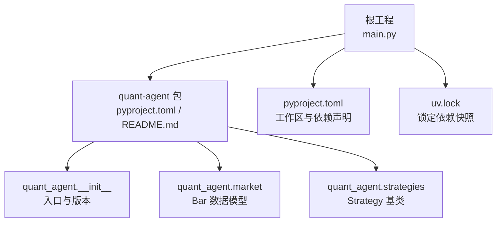
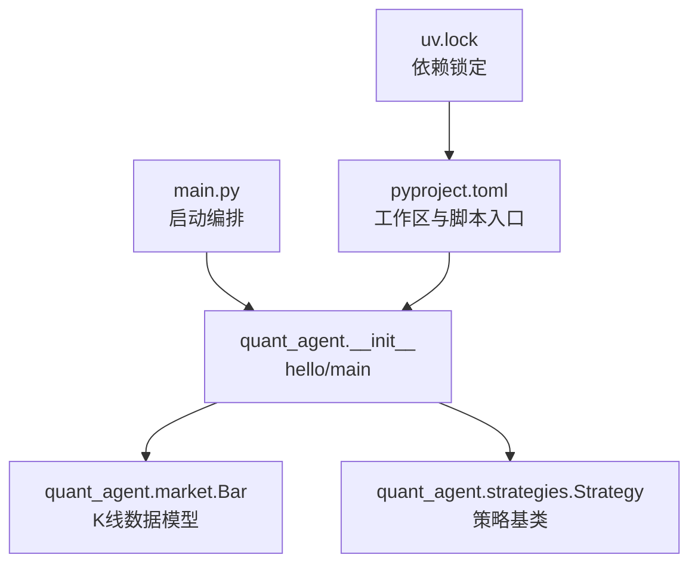
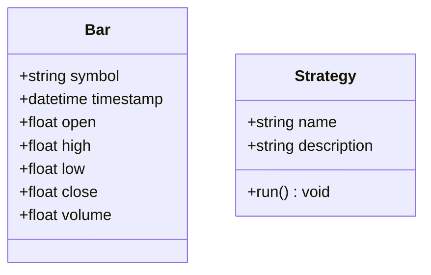
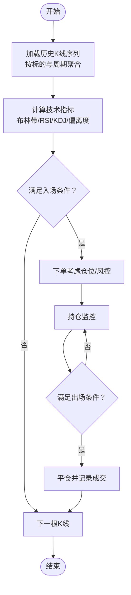
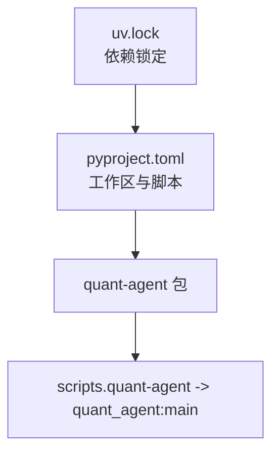

# 均值回归策略案例

<cite>
**本文引用的文件**   
- [main.py](file://main.py)
- [pyproject.toml](file://pyproject.toml)
- [uv.lock](file://uv.lock)
- [README.md](file://packages/quant-agent/README.md)
- [__init__.py](file://packages/quant-agent/src/quant_agent/__init__.py)
- [market.py](file://packages/quant-agent/src/quant_agent/market.py)
- [strategies.py](file://packages/quant-agent/src/quant_agent/strategies.py)
- [todolist.html](file://docs/plans/todolist.html)
- [roadmap.html](file://docs/plans/roadmap.html)
</cite>

## 目录
1. [引言](#引言)
2. [项目结构](#项目结构)
3. [核心组件](#核心组件)
4. [架构总览](#架构总览)
5. [详细组件分析](#详细组件分析)
6. [依赖分析](#依赖分析)
7. [性能考虑](#性能考虑)
8. [故障排查指南](#故障排查指南)
9. [结论](#结论)
10. [附录](#附录)

## 引言
本案例围绕“均值回归”策略在量化交易中的应用，系统阐述其理论要点与实战落地路径：以价格序列为基础，结合布林带、RSI、KDJ等技术指标识别超买超卖状态，计算偏离度并设定入场/出场条件；同时给出回测框架配置要点（滑点、手续费、资金管理）、参数优化方法与绩效报告解读。本项目仓库提供了量化智能体（Quant Agent）的基础骨架与数据模型，可作为实现与扩展的起点。

## 项目结构
仓库采用多包工作区组织，根工程通过 uv 管理依赖与工作区成员。量化相关能力集中在 quant-agent 子包中，提供市场数据结构与策略基类，便于后续扩展具体策略与回测引擎。

图表来源
- [main.py:1-13](file://main.py#L1-L13)
- [pyproject.toml:1-30](file://pyproject.toml#L1-L30)
- [uv.lock:2158-2195](file://uv.lock#L2158-L2195)
- [README.md:1-16](file://packages/quant-agent/README.md#L1-L16)
- [__init__.py:1-15](file://packages/quant-agent/src/quant_agent/__init__.py#L1-L15)
- [market.py:1-16](file://packages/quant-agent/src/quant_agent/market.py#L1-L16)
- [strategies.py:1-13](file://packages/quant-agent/src/quant_agent/strategies.py#L1-L13)

章节来源
- [main.py:1-13](file://main.py#L1-L13)
- [pyproject.toml:1-30](file://pyproject.toml#L1-L30)
- [uv.lock:2158-2195](file://uv.lock#L2158-L2195)
- [README.md:1-16](file://packages/quant-agent/README.md#L1-L16)

## 核心组件
- 市场数据模型 Bar：封装单根 K 线的基本字段（标的、时间戳、开高低收、成交量），为后续技术指标与策略逻辑提供统一输入。
- 策略基类 Strategy：定义策略名称与描述，并提供 run 接口作为策略执行入口，便于派生具体策略（如均值回归）。
- 量化智能体入口：quant_agent 模块提供 hello/main 等基础能力，配合主程序 main.py 进行编排调用。

章节来源
- [market.py:1-16](file://packages/quant-agent/src/quant_agent/market.py#L1-L16)
- [strategies.py:1-13](file://packages/quant-agent/src/quant_agent/strategies.py#L1-L13)
- [__init__.py:1-15](file://packages/quant-agent/src/quant_agent/__init__.py#L1-L15)
- [main.py:1-13](file://main.py#L1-L13)

## 架构总览
从运行视角看，根入口 main.py 加载 quant-agent 与 companion-agent 的能力；quant-agent 内部以 market 与 strategies 为核心，未来可扩展回测引擎、指标计算与信号生成模块。

图表来源
- [main.py:1-13](file://main.py#L1-L13)
- [__init__.py:1-15](file://packages/quant-agent/src/quant_agent/__init__.py#L1-L15)
- [market.py:1-16](file://packages/quant-agent/src/quant_agent/market.py#L1-L16)
- [strategies.py:1-13](file://packages/quant-agent/src/quant_agent/strategies.py#L1-L13)
- [pyproject.toml:1-30](file://pyproject.toml#L1-L30)
- [uv.lock:2158-2195](file://uv.lock#L2158-L2195)

## 详细组件分析

### 均值回归理论与指标体系
- 理论要点
  - 均值回归假设价格围绕长期均值波动，短期过度偏离后存在向均值回归的动力。
  - 常用衡量工具：移动平均（MA/EMA）、标准差通道（布林带）、动量与相对强度（RSI）、随机震荡（KDJ）。
- 指标用法
  - 布林带：上轨/下轨基于均值±倍数标准差，价格触及或突破轨道常被视为极端区域。
  - RSI：衡量涨跌动能比例，常见阈值（如 70/30）用于识别超买/超卖。
  - KDJ：随机指标中的 K/D/J 值，低值区间关注买入机会，高值区间关注卖出风险。
- 偏离度计算
  - 可定义为当前价与均值的标准化距离（Z-score），或相对布林带带宽的位置（%B）。
- 入场/出场条件示例思路
  - 入场：价格低于下轨且 RSI 进入超卖区，或 KDJ 低位金叉，同时偏离度超过阈值。
  - 出场：价格回到中轨附近、RSI 回升至中性区、或达到目标盈亏比/止损位。

[本节为概念性说明，不直接分析具体代码文件]

### 数据模型 Bar 与策略基类 Strategy
- Bar 数据模型
  - 字段包含标的、时间戳、OHLCV，是构建价格序列与计算指标的基础单元。
- Strategy 基类
  - 提供 name/description 元信息，run 方法作为策略执行入口，便于派生具体策略（例如 MeanReversionStrategy）。

图表来源
- [market.py:1-16](file://packages/quant-agent/src/quant_agent/market.py#L1-L16)
- [strategies.py:1-13](file://packages/quant-agent/src/quant_agent/strategies.py#L1-L13)

章节来源
- [market.py:1-16](file://packages/quant-agent/src/quant_agent/market.py#L1-L16)
- [strategies.py:1-13](file://packages/quant-agent/src/quant_agent/strategies.py#L1-L13)

### 均值回归策略流程（概念级）
以下流程图展示均值回归策略的典型处理步骤，便于理解从数据到信号的完整链路。

[此图为概念流程示意，不对应具体源码文件]

### 回测框架配置与使用（概念级）
- 滑点模拟
  - 根据流动性与波动率设置固定或动态滑点，避免过于乐观的回测结果。
- 手续费计算
  - 佣金+印花税+过户费等，按成交金额比例或固定费用建模。
- 资金管理
  - 固定仓位、凯利公式、波动率倒数加权等，控制单笔风险与整体回撤。
- 回测执行
  - 事件驱动或向量回测，逐根K线推进，维护账户净值曲线与交易明细。
- 结果输出
  - 收益、年化、最大回撤、夏普比率、胜率、盈亏比、换手率等。

[本节为通用指导，不直接分析具体代码文件]

### 策略优化与参数调优（概念级）
- 参数空间
  - 布林带窗口与倍数、RSI 周期与阈值、KDJ 周期与阈值、偏离度阈值、止损止盈比例等。
- 优化方法
  - 网格搜索、随机搜索、贝叶斯优化；注意过拟合与样本外验证。
- 稳健性检验
  - 滚动窗口、交叉验证、蒙特卡洛打乱、不同标的/时段泛化测试。
- 指标选择
  - 优先关注夏普、索提诺、最大回撤、Calmar、尾部风险等综合指标。

[本节为通用指导，不直接分析具体代码文件]

### 绩效分析报告解读（概念级）
- 收益与风险
  - 累计收益、年化收益、波动率、最大回撤、回撤持续时间。
- 风险调整后收益
  - 夏普比率（超额收益/波动率）、索提诺比率（下行偏差）、Calmar（年化/最大回撤）。
- 交易质量
  - 胜率、盈亏比、期望收益、换手率、滑点与手续费影响。
- 稳定性
  - 分年度/分季度表现、不同市场环境下的鲁棒性。

[本节为通用指导，不直接分析具体代码文件]

## 依赖分析
- 工作区与脚本
  - 根 pyproject.toml 声明工作区成员与依赖，quant-agent 通过 scripts 暴露命令行入口。
- 依赖锁定
  - uv.lock 记录各包的依赖树与来源，确保环境一致性。

图表来源
- [pyproject.toml:1-30](file://pyproject.toml#L1-L30)
- [uv.lock:2158-2195](file://uv.lock#L2158-L2195)

章节来源
- [pyproject.toml:1-30](file://pyproject.toml#L1-L30)
- [uv.lock:2158-2195](file://uv.lock#L2158-L2195)

## 性能考虑
- 数据与计算
  - 批量计算指标（向量化）优于逐条循环；合理缓存中间结果。
- 内存与IO
  - 大周期长序列建议流式读取或分块处理；减少不必要的对象创建。
- 回测效率
  - 事件驱动需避免重复计算；向量回测需注意对齐与边界条件。
- 数值稳定
  - 对除零、NaN、极值做防护；对指标窗口长度做合理性校验。

[本节为通用指导，不直接分析具体代码文件]

## 故障排查指南
- 常见问题
  - 指标计算异常：检查窗口长度是否小于数据长度、是否存在缺失值。
  - 信号抖动：调整阈值或引入过滤（如连续确认、趋势过滤）。
  - 回测与实际差异过大：核查滑点、手续费、成交概率与流动性假设。
- 定位方法
  - 打印关键变量（偏离度、指标值、订单触发原因）。
  - 分段回测与可视化（净值曲线、买卖点标注）。
  - 对比不同参数组合的结果，观察稳健性。

[本节为通用指导，不直接分析具体代码文件]

## 结论
本仓库为量化智能体提供了清晰的数据模型与策略基类，适合作为均值回归策略的实现底座。建议在现有基础上逐步完善：指标计算模块、信号生成器、回测引擎与绩效统计，从而形成完整的“数据→指标→信号→交易→评估”闭环。

[本节为总结性内容，不直接分析具体代码文件]

## 附录
- 开发计划与路线图参考
  - 技术分析与策略回测任务规划见 todolist.html，涵盖行情接入、指标计算、策略定义与回测执行等阶段。
  - 里程碑与验收标准见 roadmap.html，强调策略可验证性与闭环能力。

章节来源
- [todolist.html:184-222](file://docs/plans/todolist.html#L184-L222)
- [roadmap.html:314-333](file://docs/plans/roadmap.html#L314-L333)