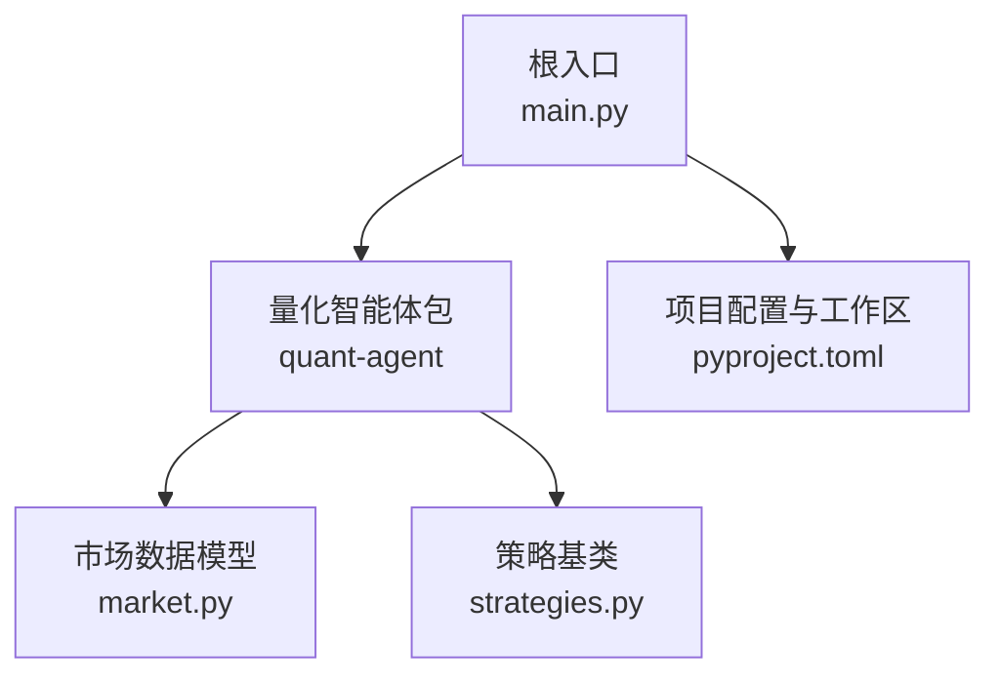
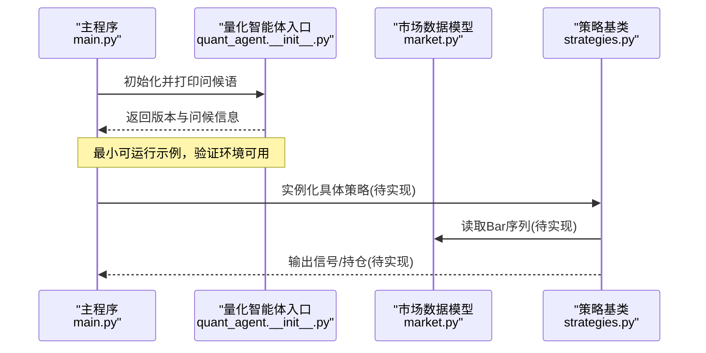
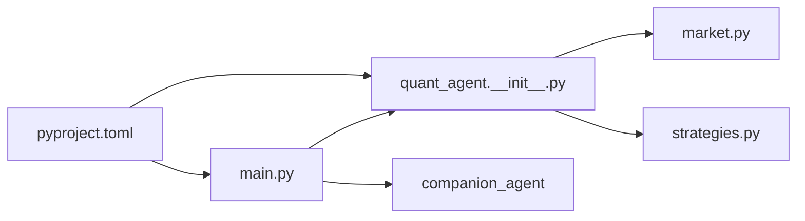
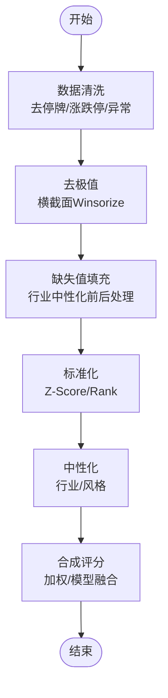
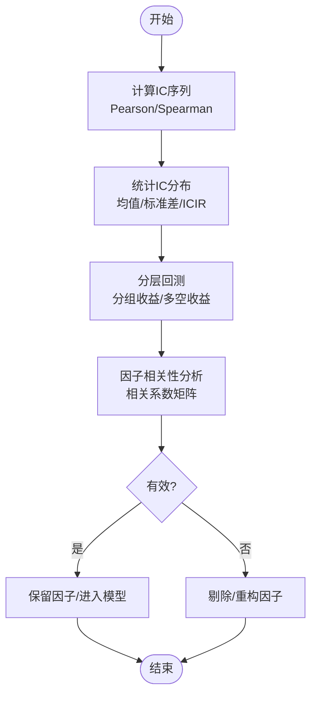
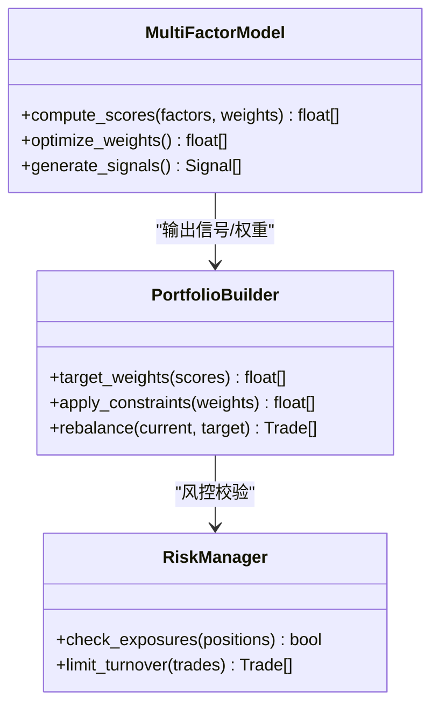
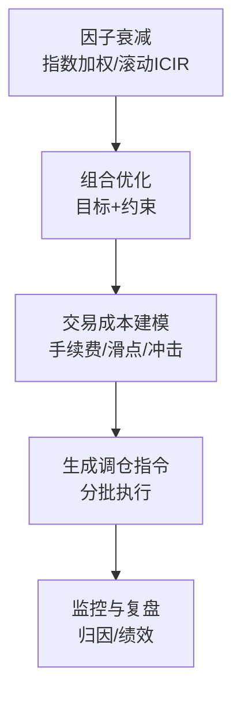

# 多因子策略案例

<cite>
**本文引用的文件**   
- [main.py](file://main.py)
- [pyproject.toml](file://pyproject.toml)
- [packages/quant-agent/README.md](file://packages/quant-agent/README.md)
- [packages/quant-agent/src/quant_agent/__init__.py](file://packages/quant-agent/src/quant_agent/__init__.py)
- [packages/quant-agent/src/quant_agent/market.py](file://packages/quant-agent/src/quant_agent/market.py)
- [packages/quant-agent/src/quant_agent/strategies.py](file://packages/quant-agent/src/quant_agent/strategies.py)
</cite>

## 目录
1. [引言](#引言)
2. [项目结构](#项目结构)
3. [核心组件](#核心组件)
4. [架构总览](#架构总览)
5. [详细组件分析](#详细组件分析)
6. [依赖关系分析](#依赖关系分析)
7. [性能与工程实践](#性能与工程实践)
8. [故障排查指南](#故障排查指南)
9. [结论](#结论)
10. [附录：多因子策略完整实现方案](#附录多因子策略完整实现方案)

## 引言
本案例面向“多因子选股策略”的从零到一落地，围绕以下目标展开：
- 因子选择理论：价值、成长、动量、质量等因子的构建思路与注意事项
- 数据处理与标准化：横截面去极值、标准化、缺失值处理、合成评分
- 有效性检验：IC（信息系数）分析、分层回测、相关性分析
- 策略实现：多因子模型、权重分配、组合构建与动态调仓
- 最佳实践：因子衰减处理、组合优化、交易成本与流动性约束

本项目仓库提供了量化智能体（quant-agent）的基础骨架，包括市场数据Bar结构与策略基类。基于此骨架，本文将给出一个可落地的多因子策略实现蓝图与代码级映射，帮助读者在现有框架上快速扩展出完整的因子投研与回测流程。

## 项目结构
仓库采用多包工作区组织方式，根入口通过 main.py 启动，依赖 pyproject.toml 声明各子包。quant-agent 子包提供量化基础能力（市场数据、策略定义），为后续多因子策略扩展提供承载点。

图表来源
- [main.py:1-13](file://main.py#L1-L13)
- [pyproject.toml:1-30](file://pyproject.toml#L1-L30)
- [packages/quant-agent/src/quant_agent/market.py:1-16](file://packages/quant-agent/src/quant_agent/market.py#L1-L16)
- [packages/quant-agent/src/quant_agent/strategies.py:1-13](file://packages/quant-agent/src/quant_agent/strategies.py#L1-L13)

章节来源
- [main.py:1-13](file://main.py#L1-L13)
- [pyproject.toml:1-30](file://pyproject.toml#L1-L30)
- [packages/quant-agent/README.md:1-16](file://packages/quant-agent/README.md#L1-L16)

## 核心组件
- 市场数据模型 Bar：统一K线/Bar数据结构，包含标的、时间戳与OHLCV字段，作为所有策略与因子计算的时间序列基础。
- 策略基类 Strategy：抽象策略接口，要求子类实现 run 方法，便于统一调度与回测执行。
- 量化智能体入口：__init__.py 提供版本与hello/main函数，main.py 聚合调用各子模块，形成最小可运行示例。

章节来源
- [packages/quant-agent/src/quant_agent/market.py:1-16](file://packages/quant-agent/src/quant_agent/market.py#L1-L16)
- [packages/quant-agent/src/quant_agent/strategies.py:1-13](file://packages/quant-agent/src/quant_agent/strategies.py#L1-L13)
- [packages/quant-agent/src/quant_agent/__init__.py:1-15](file://packages/quant-agent/src/quant_agent/__init__.py#L1-L15)
- [main.py:1-13](file://main.py#L1-L13)

## 架构总览
下图展示从数据到策略执行的端到端流程，并标注与源码文件的对应关系。该图仅用于说明当前仓库中已存在的组件边界与交互，不包含尚未实现的因子与回测细节。

图表来源
- [main.py:1-13](file://main.py#L1-L13)
- [packages/quant-agent/src/quant_agent/__init__.py:1-15](file://packages/quant-agent/src/quant_agent/__init__.py#L1-L15)
- [packages/quant-agent/src/quant_agent/market.py:1-16](file://packages/quant-agent/src/quant_agent/market.py#L1-L16)
- [packages/quant-agent/src/quant_agent/strategies.py:1-13](file://packages/quant-agent/src/quant_agent/strategies.py#L1-L13)

## 详细组件分析

### 数据层：Bar 数据模型
- 职责：统一行情时序数据的存储与传递，确保策略与因子计算对输入格式一致。
- 关键字段：symbol、timestamp、open、high、low、close、volume。
- 使用建议：
  - 以 symbol+timestamp 为主键进行索引，支持按标的和时间窗口切片。
  - 在因子计算前进行数据清洗（停牌、涨跌停、异常值）。

章节来源
- [packages/quant-agent/src/quant_agent/market.py:1-16](file://packages/quant-agent/src/quant_agent/market.py#L1-L16)

### 策略层：Strategy 基类
- 职责：定义策略的统一接口，强制子类实现 run 方法，便于回测引擎或调度器统一调用。
- 扩展点：
  - 子类可实现多因子选股、趋势跟踪、均值回归等策略。
  - 可在 run 中封装信号生成、组合构建、调仓逻辑。

章节来源
- [packages/quant-agent/src/quant_agent/strategies.py:1-13](file://packages/quant-agent/src/quant_agent/strategies.py#L1-L13)

### 入口与装配：__init__.py 与 main.py
- __init__.py：提供 hello/main 函数与版本信息，便于外部导入与命令行运行。
- main.py：聚合调用 quant-agent 与 companion-agent，演示最小可运行路径。

章节来源
- [packages/quant-agent/src/quant_agent/__init__.py:1-15](file://packages/quant-agent/src/quant_agent/__init__.py#L1-L15)
- [main.py:1-13](file://main.py#L1-L13)

## 依赖关系分析
- 根入口 main.py 依赖 quant-agent 与 companion-agent 两个子包。
- quant-agent 内部 market.py 与 strategies.py 相互独立，分别承担数据模型与策略接口。
- pyproject.toml 声明工作区成员与依赖，统一安装与运行。

图表来源
- [main.py:1-13](file://main.py#L1-L13)
- [packages/quant-agent/src/quant_agent/__init__.py:1-15](file://packages/quant-agent/src/quant_agent/__init__.py#L1-L15)
- [packages/quant-agent/src/quant_agent/market.py:1-16](file://packages/quant-agent/src/quant_agent/market.py#L1-L16)
- [packages/quant-agent/src/quant_agent/strategies.py:1-13](file://packages/quant-agent/src/quant_agent/strategies.py#L1-L13)
- [pyproject.toml:1-30](file://pyproject.toml#L1-L30)

章节来源
- [pyproject.toml:1-30](file://pyproject.toml#L1-L30)
- [main.py:1-13](file://main.py#L1-L13)

## 性能与工程实践
- 数据层
  - 向量化计算：优先使用数组/矩阵运算，避免逐行循环。
  - 内存管理：大样本横截面数据分块处理，及时释放中间变量。
- 因子层
  - 去极值与标准化：横截面Winsorize/Z-Score，降低极端值影响。
  - 缺失值填充：行业中性化前后分别处理，避免泄露。
- 组合层
  - 权重分配：等权、ICIR加权、风险平价等；结合换手率与冲击成本约束。
  - 调仓频率：月度/周度/日内，需考虑交易成本与滑点。
- 回测层
  - 事件驱动或向量化回测；严格的前视偏差控制与交易费用建模。

[本节为通用指导，不直接分析具体文件]

## 故障排查指南
- 运行入口
  - 若 main.py 无法导入 quant-agent，检查 pyproject.toml 的工作区与依赖是否安装成功。
- 数据问题
  - Bar 字段缺失或类型不一致会导致因子计算报错，建议在数据加载阶段增加校验。
- 策略未实现
  - Strategy.run 未覆盖将抛出异常，需在子类中实现具体逻辑。

章节来源
- [main.py:1-13](file://main.py#L1-L13)
- [packages/quant-agent/src/quant_agent/strategies.py:1-13](file://packages/quant-agent/src/quant_agent/strategies.py#L1-L13)
- [packages/quant-agent/src/quant_agent/market.py:1-16](file://packages/quant-agent/src/quant_agent/market.py#L1-L16)
- [pyproject.toml:1-30](file://pyproject.toml#L1-L30)

## 结论
当前仓库提供了量化智能体的最小骨架：统一的Bar数据模型与策略基类，以及清晰的入口与依赖管理。基于此骨架，可按本文附录的方案逐步扩展出完整的多因子选股策略，涵盖因子构建、数据处理、有效性检验、组合构建与动态调仓的全流程。

[本节为总结性内容，不直接分析具体文件]

## 附录：多因子策略完整实现方案

### 一、因子选择理论与构建方法
- 价值因子
  - 常用指标：市盈率PE、市净率PB、企业价值倍数EV/EBITDA、股息率等。
  - 构建要点：剔除亏损与异常样本；行业中性化；滚动窗口更新。
- 成长因子
  - 常用指标：营收增速、净利润增速、ROE变化、现金流增长等。
  - 构建要点：平滑短期波动（移动平均/指数平滑）；注意会计口径一致性。
- 动量因子
  - 常用指标：过去N日收益率、相对强弱RS、波动调整动量等。
  - 构建要点：剔除近期涨跌停与停牌；考虑反转效应与流动性。
- 质量因子
  - 常用指标：ROE、毛利率、资产负债率、应计项比例等。
  - 构建要点：财务数据披露滞后处理；跨期对齐与复权。

[本节为概念性内容，不直接分析具体文件]

### 二、数据处理与标准化
- 去极值：横截面Winsorize（如1%~99%分位）。
- 标准化：Z-Score或Rank标准化，保证不同量纲可比。
- 缺失值：行业/风格中性化前后分别填充，避免泄露。
- 合成评分：线性加权或机器学习融合；权重可通过ICIR或优化方法确定。

[本图为概念流程图，不直接映射具体源文件]

### 三、因子有效性检验
- IC分析
  - 计算每日横截面IC（因子值与下期收益的相关系数），统计IC均值、标准差、ICIR、正IC占比。
- 分层回测
  - 按因子值分组（如五组/十组），观察各组未来收益单调性与超额收益曲线。
- 相关性分析
  - 因子间相关系数矩阵；多重共线性检测；必要时做正交化或降维。

[本图为概念流程图，不直接映射具体源文件]

### 四、策略实现：多因子模型与组合构建
- 模型设计
  - 线性打分：score = Σ w_i * z_i（z为标准化后的因子值，w为权重）。
  - 非线性融合：树模型/正则化回归/深度学习（需注意过拟合与解释性）。
- 权重分配
  - 等权、ICIR加权、最大化ICIR优化、风险平价。
- 组合构建
  - 目标权重→实际权重（考虑交易成本、流动性、个股权重上限）。
  - 调仓触发：固定周期（月/周）或阈值触发（偏离度/信号强度）。
- 风险控制
  - 行业暴露、风格暴露、个股权重上限、换手率限制。

[本图为概念类图，不直接映射具体源文件]

### 五、因子衰减处理与组合优化最佳实践
- 因子衰减
  - 引入衰减权重：近期因子值赋予更高权重；或使用指数移动平均。
  - 动态权重：根据滚动ICIR自适应调整因子权重。
- 组合优化
  - 目标函数：最大化预期收益/ICIR，惩罚方差与换手率。
  - 约束条件：行业中性、风格中性、个股权重上限、流动性约束。
- 交易成本建模
  - 固定成本+比例成本；滑点估计；冲击成本近似。

[本图为概念流程图，不直接映射具体源文件]

### 六、与现有代码的对接建议
- 在 strategies.py 中新增子类实现多因子选股策略，重写 run 方法。
- 在 market.py 基础上扩展更多数据字段（如基本面、财务指标）或新增数据加载器。
- 在 __init__.py 中注册新策略，并在 main.py 中编排运行流程。

章节来源
- [packages/quant-agent/src/quant_agent/strategies.py:1-13](file://packages/quant-agent/src/quant_agent/strategies.py#L1-L13)
- [packages/quant-agent/src/quant_agent/market.py:1-16](file://packages/quant-agent/src/quant_agent/market.py#L1-L16)
- [packages/quant-agent/src/quant_agent/__init__.py:1-15](file://packages/quant-agent/src/quant_agent/__init__.py#L1-L15)
- [main.py:1-13](file://main.py#L1-L13)