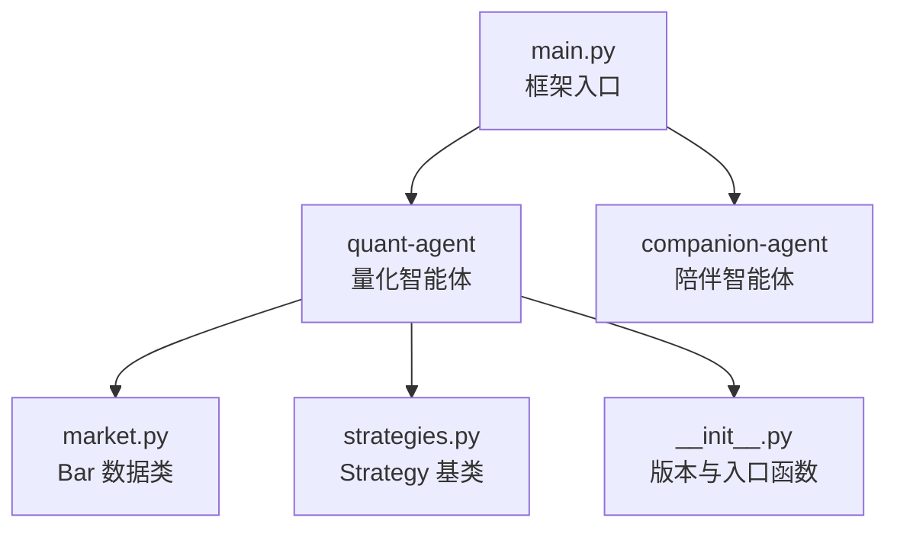
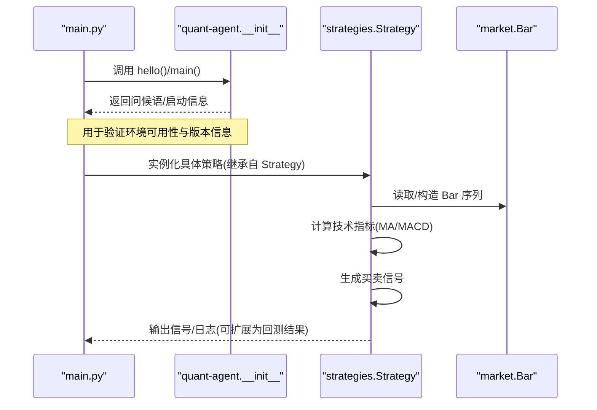
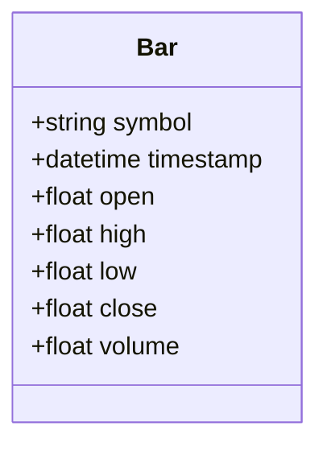
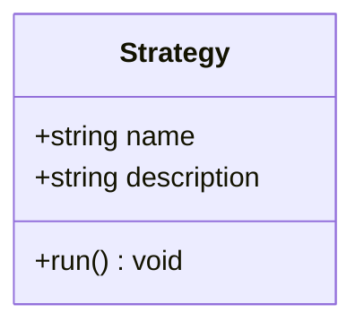
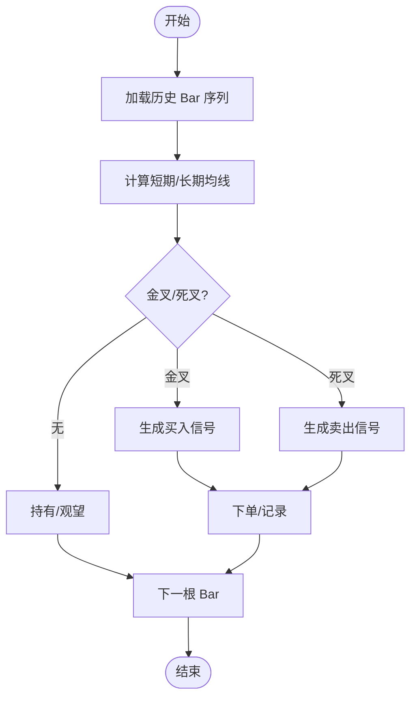
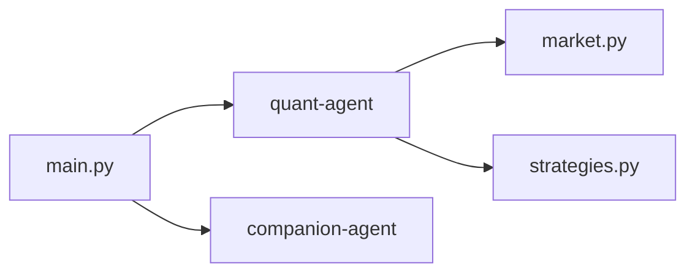

# 趋势跟踪策略案例

<cite>
**本文引用的文件**   
- [main.py](file://main.py)
- [pyproject.toml](file://pyproject.toml)
- [README.md](file://README.md)
- [__init__.py](file://packages/quant-agent/src/quant_agent/__init__.py)
- [market.py](file://packages/quant-agent/src/quant_agent/market.py)
- [strategies.py](file://packages/quant-agent/src/quant_agent/strategies.py)
- [todolist.html](file://docs/plans/todolist.html)
</cite>

## 目录
1. [引言](#引言)
2. [项目结构](#项目结构)
3. [核心组件](#核心组件)
4. [架构总览](#架构总览)
5. [详细组件分析](#详细组件分析)
6. [依赖关系分析](#依赖关系分析)
7. [性能与回测要点](#性能与回测要点)
8. [故障排查指南](#故障排查指南)
9. [结论](#结论)
10. [附录](#附录)

## 引言
本案例面向“趋势跟踪策略”的完整实现，围绕以下目标展开：
- 使用市场数据（K线）进行趋势识别与信号生成
- 应用移动平均线交叉、MACD 等经典技术指标
- 展示如何连接数据源、处理历史数据、计算指标、生成交易信号并执行订单
- 提供参数配置说明、回测框架使用方法、绩效指标解读
- 给出示例数据与可视化建议

本项目为多包工作区，量化能力集中在 quant-agent 子包中，当前已提供基础的数据模型与策略抽象。后续将在此基础上扩展指标计算、回测引擎与可视化模块。

## 项目结构
仓库采用 uv workspace 组织多个子包，其中 quant-agent 负责量化相关能力（市场数据、策略定义）。顶层 main.py 作为统一入口，聚合各子包的 hello 信息。

图表来源
- [main.py:1-13](file://main.py#L1-L13)
- [__init__.py:1-15](file://packages/quant-agent/src/quant_agent/__init__.py#L1-L15)
- [market.py:1-16](file://packages/quant-agent/src/quant_agent/market.py#L1-L16)
- [strategies.py:1-13](file://packages/quant-agent/src/quant_agent/strategies.py#L1-L13)

章节来源
- [README.md:39-94](file://README.md#L39-L94)
- [pyproject.toml:1-30](file://pyproject.toml#L1-L30)
- [main.py:1-13](file://main.py#L1-L13)

## 核心组件
- Bar 数据类：表示单根 K 线，包含标的、时间戳、开高低收与成交量，是行情数据的原子单元。
- Strategy 基类：定义策略的统一接口，要求子类实现 run 方法以驱动策略逻辑。
- quant-agent 初始化：提供版本信息与简单入口函数，便于上层编排调用。

这些组件构成趋势跟踪策略的最小骨架：以 Bar 序列为输入，在 Strategy.run 中计算指标并产生交易信号。

章节来源
- [market.py:1-16](file://packages/quant-agent/src/quant_agent/market.py#L1-L16)
- [strategies.py:1-13](file://packages/quant-agent/src/quant_agent/strategies.py#L1-L13)
- [__init__.py:1-15](file://packages/quant-agent/src/quant_agent/__init__.py#L1-L15)

## 架构总览
从系统层面看，趋势跟踪流程由“数据 → 指标 → 信号 → 执行/记录”组成。下图展示了与代码映射的关系：

图表来源
- [main.py:1-13](file://main.py#L1-L13)
- [__init__.py:1-15](file://packages/quant-agent/src/quant_agent/__init__.py#L1-L15)
- [strategies.py:1-13](file://packages/quant-agent/src/quant_agent/strategies.py#L1-L13)
- [market.py:1-16](file://packages/quant-agent/src/quant_agent/market.py#L1-L16)

## 详细组件分析

### 数据层：Bar 数据类
- 职责：封装单根 K 线的标准字段，确保策略与数据源的解耦。
- 复杂度：O(1) 访问；批量处理时按时间顺序迭代即可。
- 扩展点：可新增前复权因子、涨跌停标记、盘口快照等字段。

图表来源
- [market.py:1-16](file://packages/quant-agent/src/quant_agent/market.py#L1-L16)

章节来源
- [market.py:1-16](file://packages/quant-agent/src/quant_agent/market.py#L1-L16)

### 策略层：Strategy 基类
- 职责：定义策略的统一入口 run，强制子类实现具体逻辑。
- 设计模式：模板方法（run 为模板，子类填充细节）。
- 扩展点：可在基类中增加通用生命周期钩子（如 on_init/on_bar/on_close），减少重复代码。

图表来源
- [strategies.py:1-13](file://packages/quant-agent/src/quant_agent/strategies.py#L1-L13)

章节来源
- [strategies.py:1-13](file://packages/quant-agent/src/quant_agent/strategies.py#L1-L13)

### 指标与信号流程（概念性）
以下为趋势跟踪常用流程的概念图，便于理解整体步骤与分支条件：

[此图为概念流程，不直接映射到具体源码文件]

### 回测与执行（结合计划文档）
根据项目计划，未来将引入回测框架选型与最小示例，产出收益、回撤、胜率等指标，并以结构化方式呈现。

章节来源
- [todolist.html:200-228](file://docs/plans/todolist.html#L200-L228)

## 依赖关系分析
- 顶层 main.py 依赖 quant-agent 与 companion-agent 两个子包，通过各自的 hello 函数进行快速自检。
- quant-agent 内部 market.py 与 strategies.py 相互独立，前者提供数据模型，后者提供策略抽象。
- pyproject.toml 声明了工作区成员与依赖，确保本地开发环境一致性。

图表来源
- [main.py:1-13](file://main.py#L1-L13)
- [pyproject.toml:1-30](file://pyproject.toml#L1-L30)

章节来源
- [main.py:1-13](file://main.py#L1-L13)
- [pyproject.toml:1-30](file://pyproject.toml#L1-L30)

## 性能与回测要点
- 数据规模：Bar 序列通常较大，建议使用向量化或流式计算以降低内存占用。
- 指标计算：均线与 MACD 可通过滑动窗口增量更新，避免全量重算。
- 信号过滤：加入波动率阈值、成交量过滤、滑点与手续费假设，提升回测贴近度。
- 评估指标：年化收益、最大回撤、夏普比率、胜率、盈亏比、交易次数等。
- 可视化：净值曲线、回撤曲线、月度收益热力图、交易分布直方图等。

[本节为通用指导，不直接分析具体文件]

## 故障排查指南
- 运行入口无效：确认已安装依赖并正确进入工作区，使用 python main.py 启动。
- 子包未找到：检查 pyproject.toml 的 workspace members 是否包含 packages/*。
- 类型错误：确保传入 Bar 字段类型一致（symbol 字符串、timestamp 日期时间、数值型价格与成交量）。
- 策略未实现：自定义策略需覆盖 run 方法，否则将触发未实现异常。

章节来源
- [README.md:95-112](file://README.md#L95-L112)
- [pyproject.toml:14-17](file://pyproject.toml#L14-L17)
- [strategies.py:11-12](file://packages/quant-agent/src/quant_agent/strategies.py#L11-L12)

## 结论
当前仓库提供了趋势跟踪策略的最小骨架：Bar 数据模型与 Strategy 抽象。下一步应优先补齐指标计算（MA/MACD）、回测引擎与可视化模块，形成“数据→指标→信号→执行/记录”的闭环，并通过计划文档中的任务逐步落地。

[本节为总结，不直接分析具体文件]

## 附录
- 快速开始与环境准备：参考 README 的快速开始部分，使用 uv sync --all-extras 安装依赖后运行 python main.py。
- 编码规范：遵循 Python 3.12+ 语法、PEP 8、ruff 检查与 Google 风格 docstrings。

章节来源
- [README.md:95-129](file://README.md#L95-L129)
- [.agent/rules/coding.md:1-65](file://.agent/rules/coding.md#L1-L65)