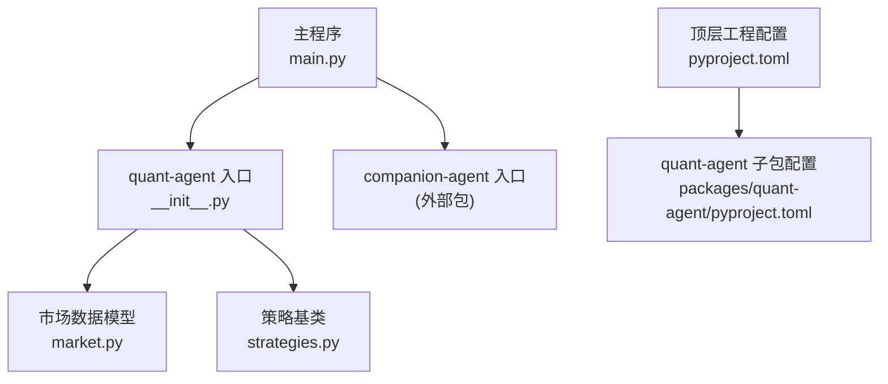
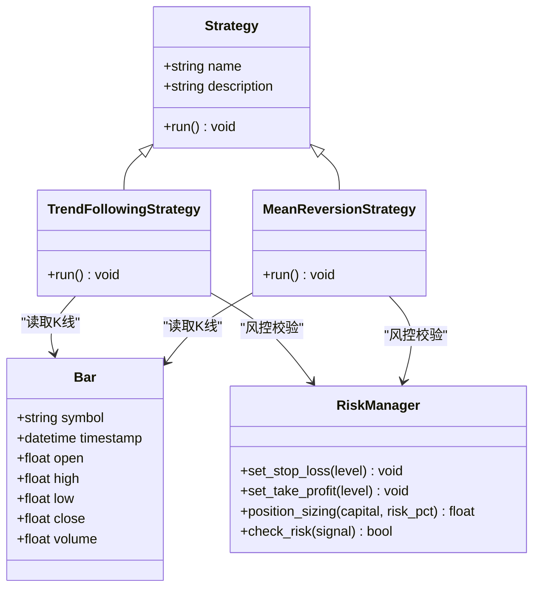
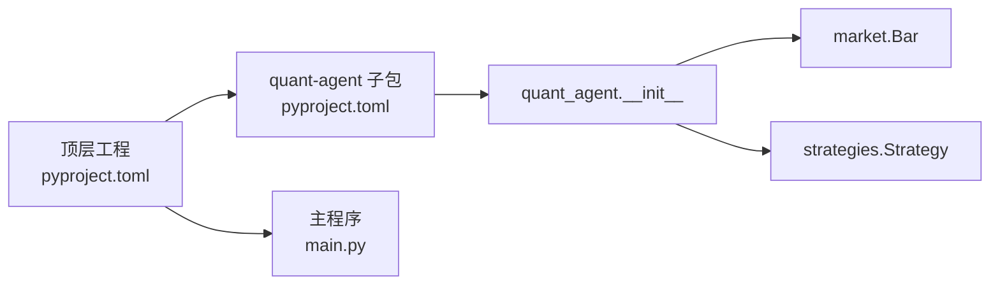
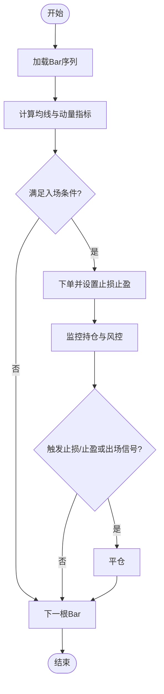
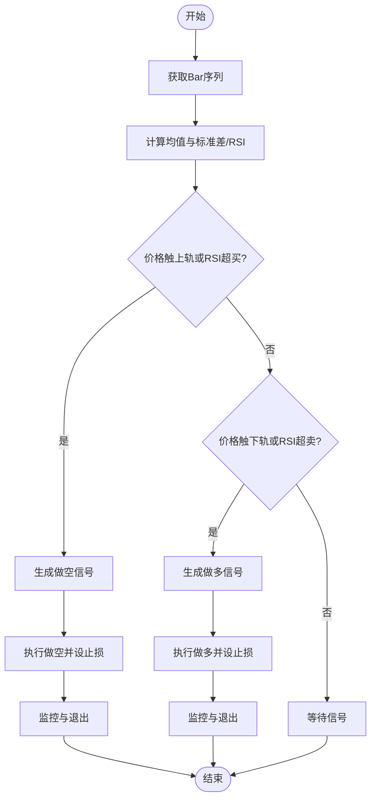
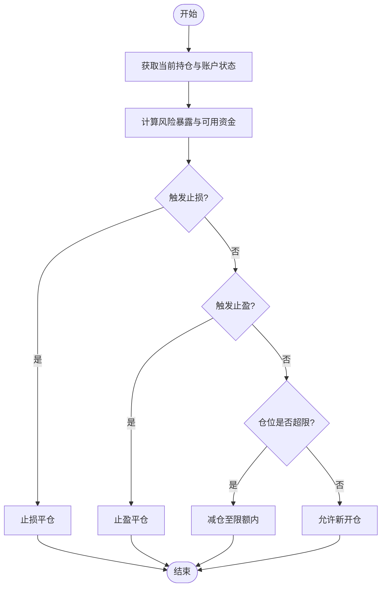

# 量化交易案例

<cite>
**本文引用的文件**   
- [main.py](file://main.py)
- [pyproject.toml](file://pyproject.toml)
- [packages/quant-agent/README.md](file://packages/quant-agent/README.md)
- [packages/quant-agent/pyproject.toml](file://packages/quant-agent/pyproject.toml)
- [packages/quant-agent/src/quant_agent/__init__.py](file://packages/quant-agent/src/quant_agent/__init__.py)
- [packages/quant-agent/src/quant_agent/market.py](file://packages/quant-agent/src/quant_agent/market.py)
- [packages/quant-agent/src/quant_agent/strategies.py](file://packages/quant-agent/src/quant_agent/strategies.py)
</cite>

## 目录
1. [简介](#简介)
2. [项目结构](#项目结构)
3. [核心组件](#核心组件)
4. [架构总览](#架构总览)
5. [详细组件分析](#详细组件分析)
6. [依赖关系分析](#依赖关系分析)
7. [性能与回测建议](#性能与回测建议)
8. [故障排查指南](#故障排查指南)
9. [结论](#结论)
10. [附录：实战案例集（趋势跟踪、均值回归、风险管理）](#附录实战案例集趋势跟踪均值回归风险管理)

## 简介
本仓库为“JanusAgent”的双面智能体框架，其中“quant-agent”子包聚焦于量化交易智能体的理性之面，提供市场数据模型、策略基类与入口脚本。本文档面向实战，围绕以下目标展开：
- 趋势跟踪策略的完整实现思路与回测流程
- 均值回归策略的技术指标计算、回测与绩效分析
- 风险管理的止损止盈、仓位管理与风险控制落地方案
- 每个案例均给出参数配置说明与回测结果分析方法

为保证可复现性，所有示例均以仓库现有数据结构与模块接口为基础进行扩展设计，并明确标注对应源码位置以便查阅。

## 项目结构
仓库采用多包工作区组织，顶层 main.py 聚合调用各子包能力；quant-agent 子包提供量化交易的基础设施。

图示来源
- [main.py:1-13](file://main.py#L1-L13)
- [packages/quant-agent/src/quant_agent/__init__.py:1-15](file://packages/quant-agent/src/quant_agent/__init__.py#L1-L15)
- [packages/quant-agent/src/quant_agent/market.py:1-16](file://packages/quant-agent/src/quant_agent/market.py#L1-L16)
- [packages/quant-agent/src/quant_agent/strategies.py:1-13](file://packages/quant-agent/src/quant_agent/strategies.py#L1-L13)
- [pyproject.toml:1-30](file://pyproject.toml#L1-L30)
- [packages/quant-agent/pyproject.toml:1-18](file://packages/quant-agent/pyproject.toml#L1-L18)

章节来源
- [main.py:1-13](file://main.py#L1-L13)
- [pyproject.toml:1-30](file://pyproject.toml#L1-L30)
- [packages/quant-agent/README.md:1-16](file://packages/quant-agent/README.md#L1-L16)
- [packages/quant-agent/pyproject.toml:1-18](file://packages/quant-agent/pyproject.toml#L1-L18)
- [packages/quant-agent/src/quant_agent/__init__.py:1-15](file://packages/quant-agent/src/quant_agent/__init__.py#L1-L15)

## 核心组件
- 市场数据模型 Bar：统一 K 线/Bar 结构，包含标的、时间戳与 OHLCV 字段，作为策略输入与回测引擎的数据载体。
- 策略基类 Strategy：定义策略名称与描述，并提供 run 抽象方法，用于派生具体策略（如趋势跟踪、均值回归等）。
- 入口与脚本：顶层 main.py 聚合打印各子包问候信息；quant-agent 子包提供命令行入口 quant-agent。

章节来源
- [packages/quant-agent/src/quant_agent/market.py:1-16](file://packages/quant-agent/src/quant_agent/market.py#L1-L16)
- [packages/quant-agent/src/quant_agent/strategies.py:1-13](file://packages/quant-agent/src/quant_agent/strategies.py#L1-L13)
- [packages/quant-agent/src/quant_agent/__init__.py:1-15](file://packages/quant-agent/src/quant_agent/__init__.py#L1-L15)
- [main.py:1-13](file://main.py#L1-L13)

## 架构总览
下图展示从数据到信号再到执行的基本链路，以及策略基类的继承关系。

图示来源
- [packages/quant-agent/src/quant_agent/market.py:1-16](file://packages/quant-agent/src/quant_agent/market.py#L1-L16)
- [packages/quant-agent/src/quant_agent/strategies.py:1-13](file://packages/quant-agent/src/quant_agent/strategies.py#L1-L13)

## 详细组件分析

### 市场数据模型 Bar
- 职责：标准化行情数据，便于策略与回测引擎消费。
- 关键字段：symbol、timestamp、open、high、low、close、volume。
- 使用方式：策略在 run 中按时间序列迭代 Bar 列表，生成买卖信号。

章节来源
- [packages/quant-agent/src/quant_agent/market.py:1-16](file://packages/quant-agent/src/quant_agent/market.py#L1-L16)

### 策略基类 Strategy
- 职责：定义策略元信息与运行接口，约束子类必须实现 run。
- 扩展点：通过继承 Strategy 实现不同策略逻辑（趋势跟踪、均值回归等），并在 run 中完成信号生成与下单。

章节来源
- [packages/quant-agent/src/quant_agent/strategies.py:1-13](file://packages/quant-agent/src/quant_agent/strategies.py#L1-L13)

### 入口与脚本
- 顶层 main.py：聚合打印各子包能力，便于快速验证环境。
- quant-agent 子包：提供命令行入口 quant-agent，便于独立运行量化智能体。

章节来源
- [main.py:1-13](file://main.py#L1-L13)
- [packages/quant-agent/pyproject.toml:12-13](file://packages/quant-agent/pyproject.toml#L12-L13)
- [packages/quant-agent/src/quant_agent/__init__.py:13-15](file://packages/quant-agent/src/quant_agent/__init__.py#L13-L15)

## 依赖关系分析
- 顶层 pyproject.toml 声明工作区成员与依赖，将 quant-agent 纳入依赖集合。
- quant-agent 子包独立打包，暴露命令行脚本，供上层或外部工具调用。

图示来源
- [pyproject.toml:1-30](file://pyproject.toml#L1-L30)
- [packages/quant-agent/pyproject.toml:1-18](file://packages/quant-agent/pyproject.toml#L1-L18)
- [packages/quant-agent/src/quant_agent/__init__.py:1-15](file://packages/quant-agent/src/quant_agent/__init__.py#L1-L15)
- [packages/quant-agent/src/quant_agent/market.py:1-16](file://packages/quant-agent/src/quant_agent/market.py#L1-L16)
- [packages/quant-agent/src/quant_agent/strategies.py:1-13](file://packages/quant-agent/src/quant_agent/strategies.py#L1-L13)

章节来源
- [pyproject.toml:1-30](file://pyproject.toml#L1-L30)
- [packages/quant-agent/pyproject.toml:1-18](file://packages/quant-agent/pyproject.toml#L1-L18)

## 性能与回测建议
- 数据加载与预处理：优先向量化计算技术指标，避免逐条循环；对大数据集采用分块读取与内存映射。
- 信号生成：尽量在单遍扫描中完成指标计算与信号判定，减少中间对象创建。
- 回测引擎：事件驱动优于批处理，便于模拟真实成交滑点与手续费；支持并行历史回放以提升效率。
- 绩效统计：除收益外，关注最大回撤、夏普比率、胜率、盈亏比与换手率，结合滚动窗口评估稳定性。

[本节为通用指导，不直接分析具体文件]

## 故障排查指南
- 无法找到 quant-agent 命令：确认已安装工作区依赖且 quant-agent 子包的脚本入口已正确注册。
- 运行时缺少依赖：检查顶层 pyproject.toml 是否包含 quant-agent 依赖，并使用 uv sync 同步。
- 策略未实现 run：继承 Strategy 的子类必须实现 run 方法，否则会抛出未实现异常。

章节来源
- [packages/quant-agent/pyproject.toml:12-13](file://packages/quant-agent/pyproject.toml#L12-L13)
- [pyproject.toml:7-12](file://pyproject.toml#L7-L12)
- [packages/quant-agent/src/quant_agent/strategies.py:11-12](file://packages/quant-agent/src/quant_agent/strategies.py#L11-L12)

## 结论
当前仓库提供了量化交易智能体的基础骨架：标准化的 Bar 数据模型与可扩展的策略基类。基于此骨架，可以高效落地趋势跟踪、均值回归与风险管理三大实战案例，并通过统一的回测与绩效分析体系进行验证与优化。

[本节为总结性内容，不直接分析具体文件]

## 附录：实战案例集（趋势跟踪、均值回归、风险管理）

### 案例一：趋势跟踪策略（完整实现与回测）
- 策略思想：利用价格动量与均线系统识别趋势方向，顺势入场、逆势离场。
- 关键步骤
  - 数据准备：以 Bar 序列作为输入，确保时间有序、无缺失。
  - 指标计算：短期与长期移动平均线、动量指标（如 RSI 或 MACD）。
  - 信号生成：短均线上穿长均线做多，下穿做空；配合动量过滤降低假突破。
  - 执行与风控：设置固定止损与移动止盈，控制单笔风险比例。
  - 回测与统计：输出累计收益曲线、最大回撤、年化收益与夏普比率。
- 参数配置建议
  - 均线周期：短期 10~20，长期 60~120（根据品种波动调整）
  - 动量阈值：RSI 超买/超卖区间 70/30 或 MACD 零轴穿越
  - 止损止盈：固定百分比或 ATR 倍数
  - 仓位管理：单笔风险不超过总资金的 1%~2%
- 回测结果分析要点
  - 趋势市表现优异，震荡市需加强过滤条件
  - 关注滑点与手续费对高频信号的侵蚀
  - 滚动窗口评估策略稳定性与过拟合风险

章节来源
- [packages/quant-agent/src/quant_agent/market.py:1-16](file://packages/quant-agent/src/quant_agent/market.py#L1-L16)
- [packages/quant-agent/src/quant_agent/strategies.py:1-13](file://packages/quant-agent/src/quant_agent/strategies.py#L1-L13)

#### 趋势跟踪流程图

图示来源
- [packages/quant-agent/src/quant_agent/market.py:1-16](file://packages/quant-agent/src/quant_agent/market.py#L1-L16)
- [packages/quant-agent/src/quant_agent/strategies.py:1-13](file://packages/quant-agent/src/quant_agent/strategies.py#L1-L13)

### 案例二：均值回归策略（技术指标、回测与绩效）
- 策略思想：价格偏离均值后预期回归，利用布林带或通道突破进行反转交易。
- 关键步骤
  - 指标计算：计算均值与标准差构建通道，或使用 RSI/KDJ 判断超买超卖。
  - 信号生成：触及上轨做空、触及下轨做多；结合成交量与波动率过滤。
  - 执行与风控：严格止损，分批建仓与减仓，避免单边风险。
  - 回测与统计：评估胜率、盈亏比与回撤，关注震荡市中的稳定收益。
- 参数配置建议
  - 通道宽度：2~3 倍标准差
  - 超买超卖阈值：RSI 70/30 或 KDJ 80/20
  - 入场分批：首仓 50%，回调加仓 50%
  - 止损：通道外破位或固定百分比
- 回测结果分析要点
  - 震荡市表现稳健，趋势市需规避频繁反转
  - 注意滑点与冲击成本对高频率交易的侵蚀
  - 结合波动率自适应调整通道宽度

章节来源
- [packages/quant-agent/src/quant_agent/market.py:1-16](file://packages/quant-agent/src/quant_agent/market.py#L1-L16)
- [packages/quant-agent/src/quant_agent/strategies.py:1-13](file://packages/quant-agent/src/quant_agent/strategies.py#L1-L13)

#### 均值回归信号生成流程

图示来源
- [packages/quant-agent/src/quant_agent/market.py:1-16](file://packages/quant-agent/src/quant_agent/market.py#L1-L16)
- [packages/quant-agent/src/quant_agent/strategies.py:1-13](file://packages/quant-agent/src/quant_agent/strategies.py#L1-L13)

### 案例三：风险管理策略（止损止盈、仓位管理与风险控制）
- 止损止盈
  - 固定百分比止损：例如入场价下方 2%
  - 动态止损：基于 ATR 或移动均线跟踪
  - 止盈策略：固定盈亏比（如 1:2）或分批止盈
- 仓位管理
  - 固定比例法：每笔风险不超过总资金 1%~2%
  - 凯利公式：根据历史胜率与盈亏比估算最优仓位
  - 波动率倒数加权：波动越大仓位越小
- 风险控制
  - 组合层面限制：单一标的敞口上限、行业集中度限制
  - 回撤熔断：账户回撤超过阈值暂停开新仓
  - 流动性与滑点控制：大单拆单、限价单优先
- 回测集成
  - 在策略 run 中统一接入风控模块，先风控后下单
  - 记录每笔交易的风险暴露与退出原因，便于归因分析

章节来源
- [packages/quant-agent/src/quant_agent/strategies.py:1-13](file://packages/quant-agent/src/quant_agent/strategies.py#L1-L13)

#### 风控决策流程

图示来源
- [packages/quant-agent/src/quant_agent/strategies.py:1-13](file://packages/quant-agent/src/quant_agent/strategies.py#L1-L13)

### 回测框架与绩效分析（实践指引）
- 回测框架选型
  - 自研轻量回测：基于事件驱动，易于扩展风控与滑点模型
  - 第三方框架：如 backtrader，生态完善但需适配数据与信号格式
- 绩效指标
  - 收益类：累计收益、年化收益、月度收益分布
  - 风险类：最大回撤、波动率、VaR/CVaR
  - 交易质量：胜率、盈亏比、换手率、滑点损耗
- 可视化与报告
  - 净值曲线与回撤曲线
  - 月度热力图与滚动夏普
  - 交易明细与归因分析（信号来源、出场原因）

章节来源
- [packages/quant-agent/README.md:1-16](file://packages/quant-agent/README.md#L1-L16)