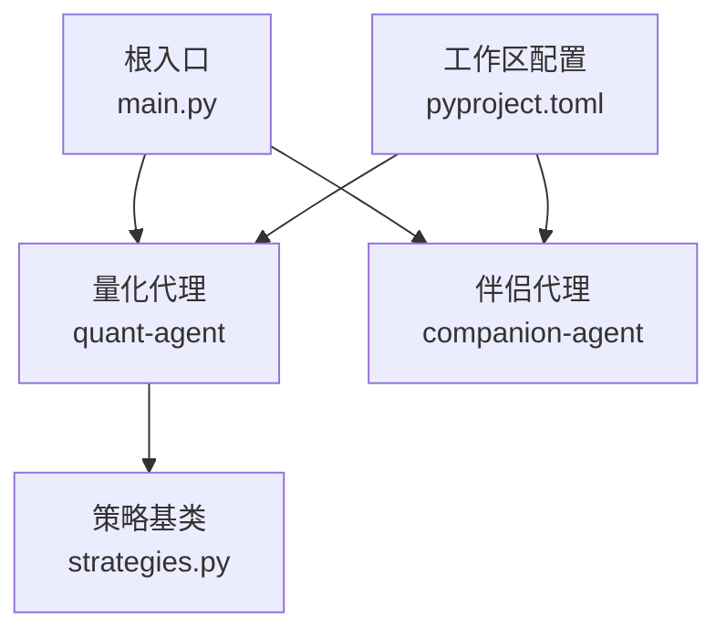
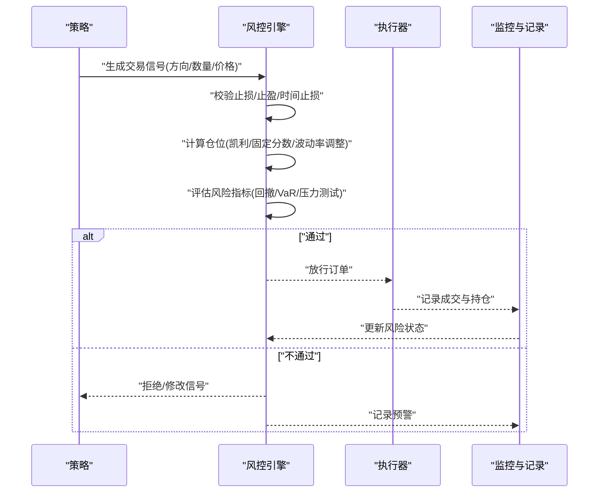
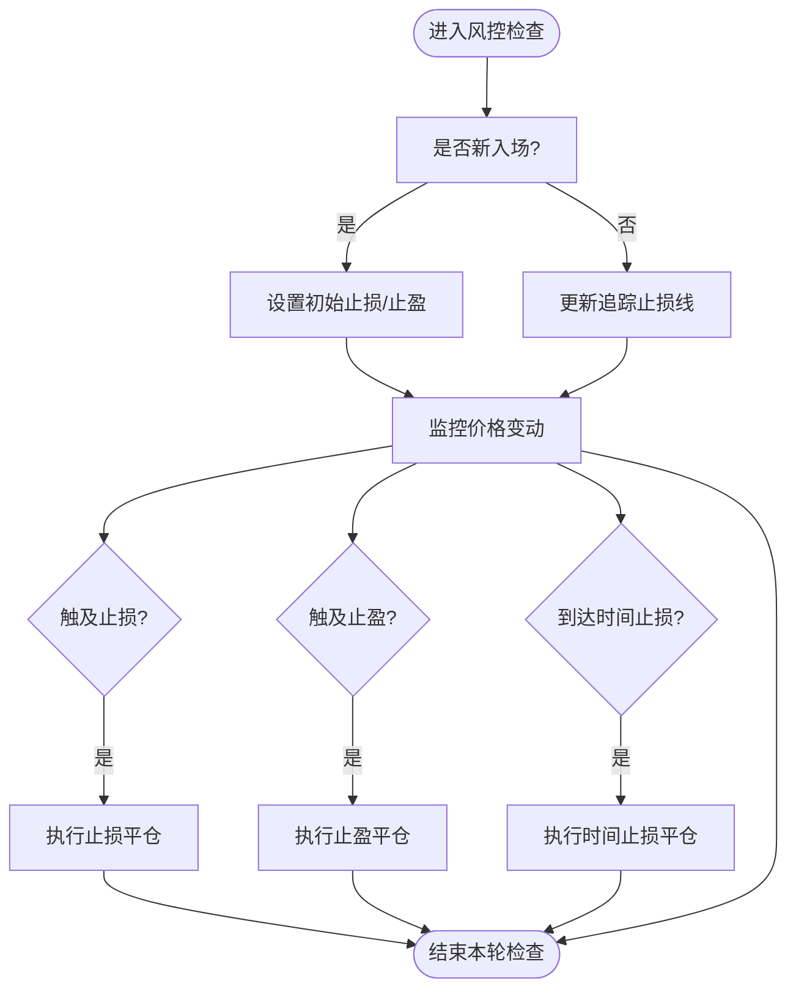
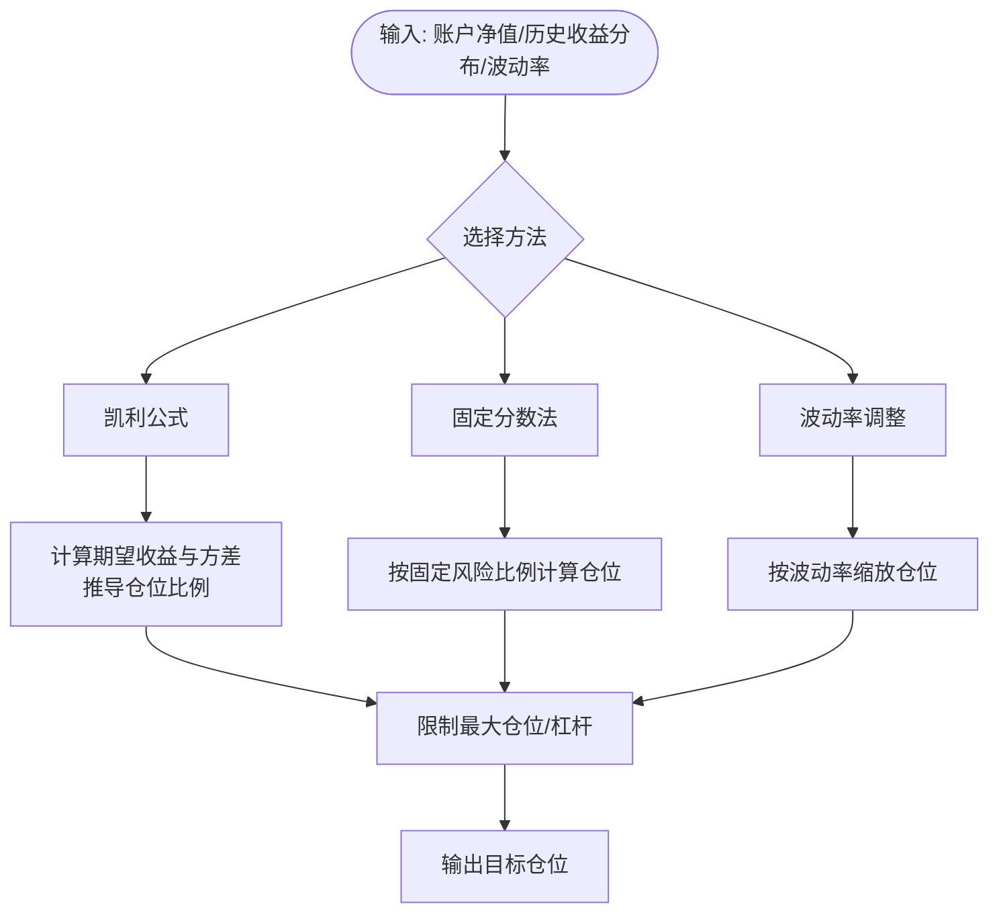
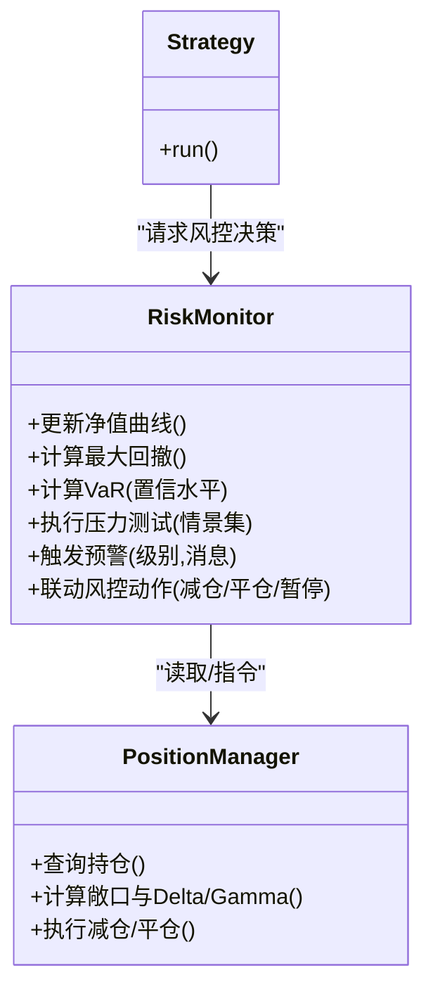
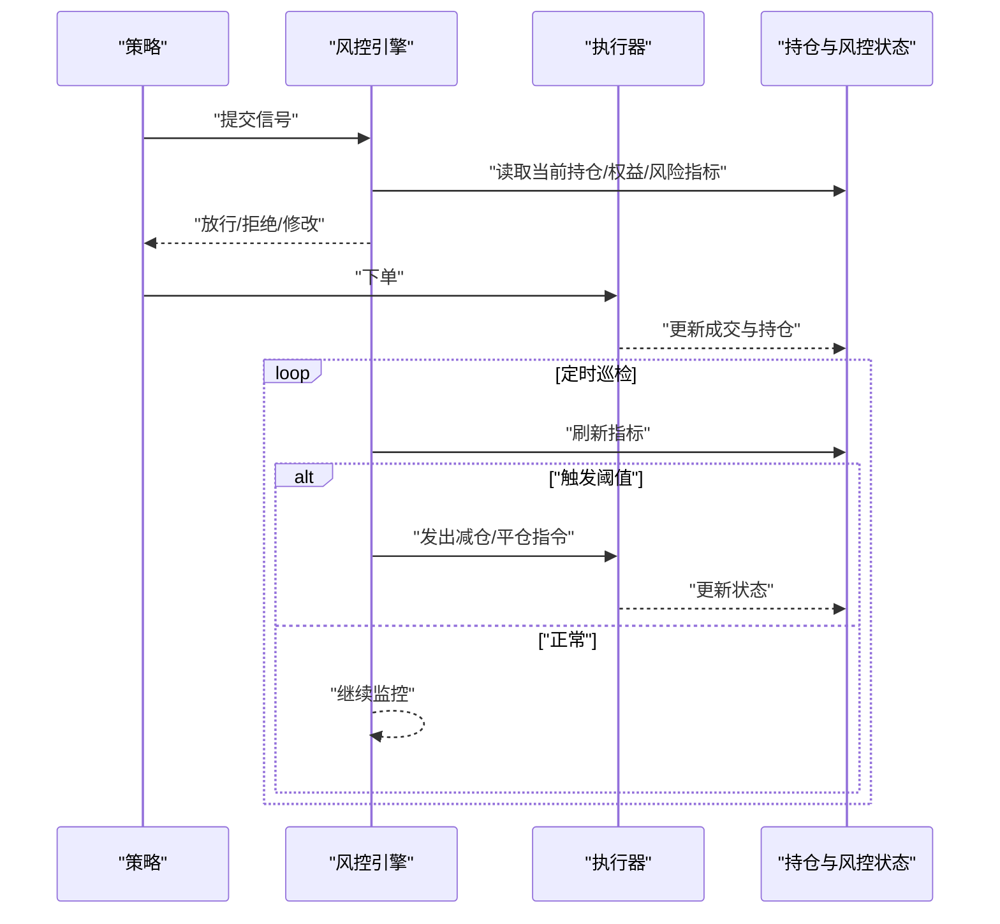
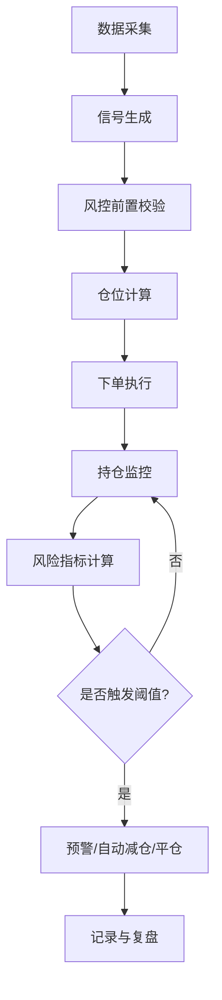
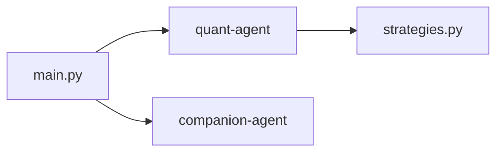

# 风险管理策略案例

<cite>
**本文引用的文件**   
- [main.py](file://main.py)
- [pyproject.toml](file://pyproject.toml)
- [strategies.py](file://packages/quant-agent/src/quant_agent/strategies.py)
- [coding.md](file://.agent/rules/coding.md)
</cite>

## 目录
1. [引言](#引言)
2. [项目结构](#项目结构)
3. [核心组件](#核心组件)
4. [架构总览](#架构总览)
5. [详细组件分析](#详细组件分析)
6. [依赖分析](#依赖分析)
7. [性能考虑](#性能考虑)
8. [故障排查指南](#故障排查指南)
9. [结论](#结论)
10. [附录](#附录)

## 引言
本案例围绕“风险管理策略实现”的目标，结合仓库中已有的量化交易基础骨架与编码规范，给出一个可落地的风险管理子系统设计方案与集成路径。内容覆盖：
- 止损止盈机制：固定比例止损、追踪止损、时间止损等
- 仓位管理算法：凯利公式、固定分数法、波动率调整仓位
- 风险指标监控：最大回撤控制、VaR计算、压力测试
- 交易执行集成：在下单与持仓管理中嵌入风控逻辑，支持预警与自动平仓
- 工程化实践：基于现有策略基类与编码规范进行扩展

说明：由于当前仓库未包含完整的风控实现代码，本文以“设计+集成方案”为主，并通过“章节来源”指向现有代码位置，便于后续落地时对照扩展。

## 项目结构
仓库采用多包工作区组织，根入口 main.py 聚合多个子代理能力；pyproject.toml 声明了工作区成员与依赖关系；quant-agent 包提供交易策略的抽象基类，可作为风控模块的扩展点。

图表来源
- [main.py:1-13](file://main.py#L1-L13)
- [pyproject.toml:1-30](file://pyproject.toml#L1-L30)
- [strategies.py:1-12](file://packages/quant-agent/src/quant_agent/strategies.py#L1-L12)

章节来源
- [main.py:1-13](file://main.py#L1-L13)
- [pyproject.toml:1-30](file://pyproject.toml#L1-L30)

## 核心组件
- 策略基类：提供一个最小化的策略抽象，作为扩展点。风控子系统可在策略运行前后注入风控检查与动作。
- 编码规范：定义了类型注解、文档字符串、错误处理等约定，确保风控模块的可维护性与一致性。

章节来源
- [strategies.py:1-12](file://packages/quant-agent/src/quant_agent/strategies.py#L1-L12)
- [coding.md:1-65](file://.agent/rules/coding.md#L1-L65)

## 架构总览
下图展示“策略—风控—执行”的整体交互：策略产生信号，风控对信号与持仓进行校验并决定放行或拦截，执行层负责下单与仓位更新，同时持续监控风险指标并在触发阈值时采取自动平仓或减仓。

图表来源
- [strategies.py:1-12](file://packages/quant-agent/src/quant_agent/strategies.py#L1-L12)
- [coding.md:1-65](file://.agent/rules/coding.md#L1-L65)

## 详细组件分析

### 止损止盈机制
目标：在信号生成后、下单前，依据多种规则决定是否允许入场或继续持有，并在必要时触发减仓/清仓。

- 固定比例止损/止盈
  - 入场价与浮动盈亏比较，达到阈值即平仓或移动止损至保本位
  - 适用于趋势跟踪与波段策略
- 追踪止损（移动止损）
  - 随最高盈利回撤一定比例或ATR倍数移动止损线
  - 保护利润的同时保留上行空间
- 时间止损
  - 持仓超过预设时间仍未达预期则退出
  - 避免资金占用与机会成本

图表来源
- [strategies.py:1-12](file://packages/quant-agent/src/quant_agent/strategies.py#L1-L12)

章节来源
- [strategies.py:1-12](file://packages/quant-agent/src/quant_agent/strategies.py#L1-L12)

### 仓位管理算法
目标：在信号通过后，根据账户权益、波动性与统计优势确定合理的头寸规模，控制单笔风险暴露。

- 凯利公式
  - 基于胜率与赔率估算最优仓位比例
  - 建议采用半凯利以降低波动
- 固定分数法
  - 每笔交易风险固定为账户净值的一定比例
  - 简单稳健，适合实盘初期
- 波动率调整仓位
  - 根据标的波动率（如ATR）动态缩放仓位
  - 高波动降仓、低波动加仓

图表来源
- [strategies.py:1-12](file://packages/quant-agent/src/quant_agent/strategies.py#L1-L12)

章节来源
- [strategies.py:1-12](file://packages/quant-agent/src/quant_agent/strategies.py#L1-L12)

### 风险指标监控系统
目标：实时评估组合风险，设定阈值并触发预警或自动干预。

- 最大回撤控制
  - 监控净值曲线相对峰值的回撤幅度，超过阈值减仓或暂停开新仓
- VaR 计算
  - 使用历史模拟或参数法估计在一定置信水平下的潜在损失
- 压力测试
  - 对极端行情情景（流动性枯竭、跳空缺口、相关性上升）进行回测与冲击评估

图表来源
- [strategies.py:1-12](file://packages/quant-agent/src/quant_agent/strategies.py#L1-L12)

章节来源
- [strategies.py:1-12](file://packages/quant-agent/src/quant_agent/strategies.py#L1-L12)

### 交易执行集成与自动平仓
目标：将风控逻辑嵌入到交易生命周期，确保信号在进入执行前经过风控校验，并在持仓期间持续监控。

- 集成点
  - 信号生成后：风控前置校验（止损/止盈/时间止损/仓位上限）
  - 下单前：二次校验（滑点、流动性、保证金）
  - 持仓期：定时巡检（回撤、VaR、压力测试结果）
  - 触发条件：自动减仓/平仓、暂停新开仓、发送预警
- 自动平仓流程

图表来源
- [strategies.py:1-12](file://packages/quant-agent/src/quant_agent/strategies.py#L1-L12)

章节来源
- [strategies.py:1-12](file://packages/quant-agent/src/quant_agent/strategies.py#L1-L12)

### 概念性总览
以下流程图用于帮助理解整体风控闭环，不直接映射具体源码文件。

[无需图表来源，因为该图为概念性流程]

## 依赖分析
- 根入口 main.py 聚合 quant-agent 与 companion-agent 的能力，便于统一调度与日志输出
- pyproject.toml 定义工作区成员与依赖，quant-agent 作为策略与风控扩展的基础包
- strategies.py 提供策略基类，风控子系统应与其解耦并通过接口协作

图表来源
- [main.py:1-13](file://main.py#L1-L13)
- [pyproject.toml:1-30](file://pyproject.toml#L1-L30)
- [strategies.py:1-12](file://packages/quant-agent/src/quant_agent/strategies.py#L1-L12)

章节来源
- [main.py:1-13](file://main.py#L1-L13)
- [pyproject.toml:1-30](file://pyproject.toml#L1-L30)
- [strategies.py:1-12](file://packages/quant-agent/src/quant_agent/strategies.py#L1-L12)

## 性能考虑
- 风控计算应尽量向量化与批量化，减少逐单循环带来的延迟
- 指标缓存：对回撤、VaR等高频计算结果做增量更新与窗口滑动
- 异步巡检：将风控巡检与交易执行解耦，避免阻塞主流程
- 限流与熔断：当市场异常或系统告警时，快速降级为只读模式或暂停开仓

[本节为通用指导，无需章节来源]

## 故障排查指南
- 常见异常定位
  - 数据缺失或格式不一致导致指标计算失败：核对数据源与清洗流程
  - 阈值误触发：检查参数校准与滑点模型
  - 自动平仓未生效：确认执行器权限与网络连通性
- 日志与观测
  - 关键事件：信号、风控决策、下单、成交、预警、自动平仓
  - 指标快照：权益、回撤、VaR、压力测试结果
- 复现与回归
  - 保存触发时的快照（价格、持仓、参数），用于离线回放与修复验证

章节来源
- [coding.md:1-65](file://.agent/rules/coding.md#L1-L65)

## 结论
本案例以仓库现有的策略基类与编码规范为基础，给出了完整的风险管理子系统设计与集成路径。通过将止损止盈、仓位管理与风险指标监控嵌入交易执行链路，可实现从“信号—风控—执行—监控”的闭环控制。后续可在 quant-agent 包内新增风控模块，遵循编码规范与类型注解约定，逐步完善实盘可用的高可靠风控体系。

[本节为总结，无需章节来源]

## 附录
- 术语
  - 止损/止盈：预设的价格边界，用于限制亏损或锁定利润
  - 追踪止损：随盈利提升而移动的止损线
  - 时间止损：持仓超时退出
  - 凯利公式：基于胜率与赔率的理论最优仓位比例
  - 固定分数法：按固定风险比例分配仓位
  - 波动率调整：依据波动率动态缩放仓位
  - 最大回撤：净值相对峰值的最大跌幅
  - VaR：在给定置信水平下的潜在损失估计
  - 压力测试：对极端情景的风险冲击评估

[本节为概念补充，无需章节来源]