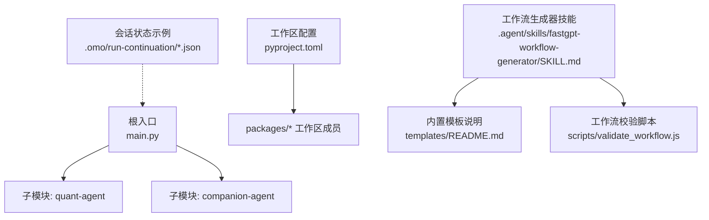
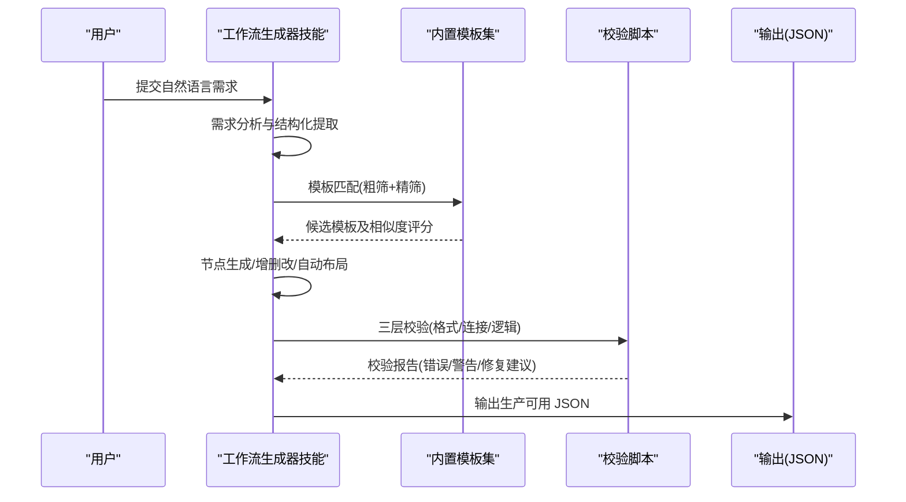
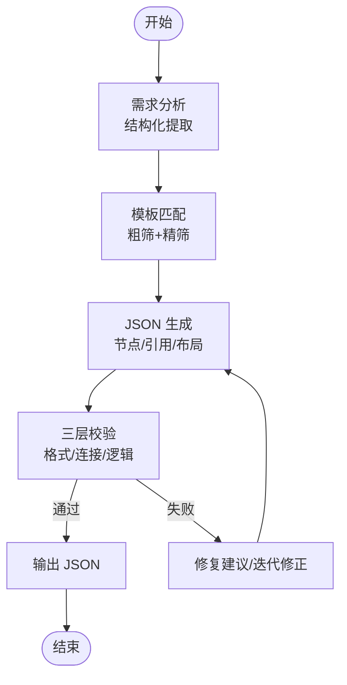
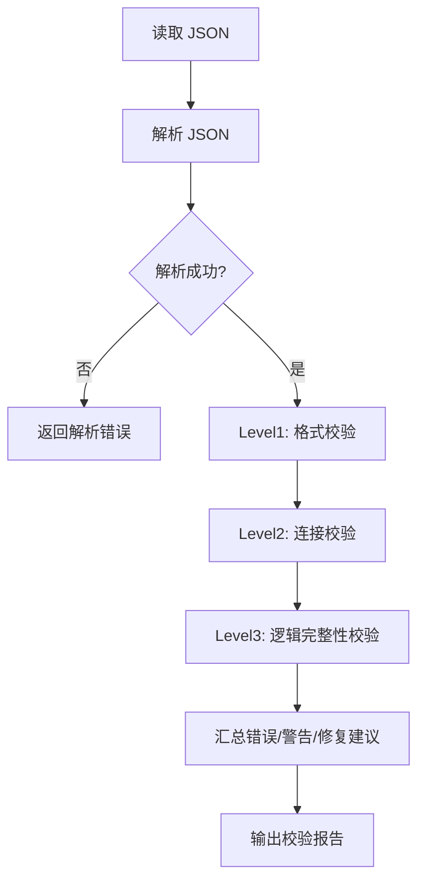
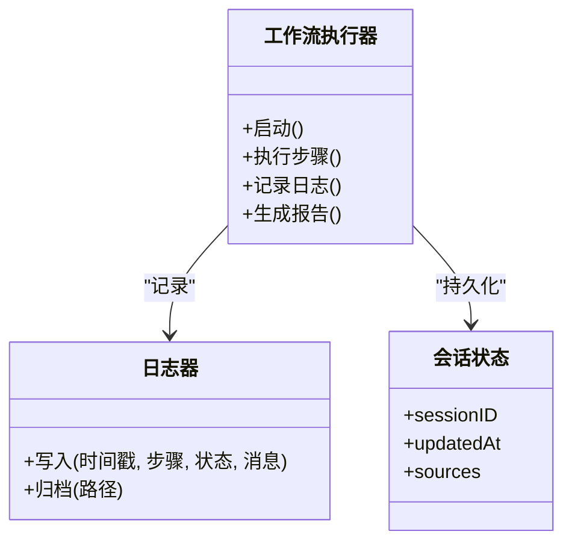
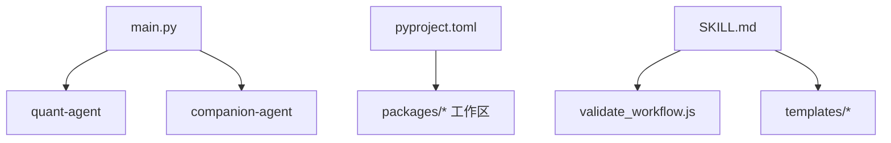

# 任务自动化工作流

<cite>
**本文引用的文件**   
- [main.py](file://main.py)
- [pyproject.toml](file://pyproject.toml)
- [.agent/skills/fastgpt-workflow-generator/SKILL.md](file://.agent/skills/fastgpt-workflow-generator/SKILL.md)
- [.agent/skills/fastgpt-workflow-generator/scripts/validate_workflow.js](file://.agent/skills/fastgpt-workflow-generator/scripts/validate_workflow.js)
- [.agent/skills/fastgpt-workflow-generator/templates/README.md](file://.agent/skills/fastgpt-workflow-generator/templates/README.md)
- [.agent/skills/create-skill-file/templates/workflow-skill-template.md](file://.agent/skills/create-skill-file/templates/workflow-skill-template.md)
- [.omo/run-continuation/ses_0de0ba8e7ffe7f2M89BsQ600ba.json](file://.omo/run-continuation/ses_0de0ba8e7ffe7f2M89BsQ600ba.json)
</cite>

## 目录
1. [引言](#引言)
2. [项目结构](#项目结构)
3. [核心组件](#核心组件)
4. [架构总览](#架构总览)
5. [详细组件分析](#详细组件分析)
6. [依赖分析](#依赖分析)
7. [性能考虑](#性能考虑)
8. [故障排查指南](#故障排查指南)
9. [结论](#结论)
10. [附录](#附录)

## 引言
本教程面向希望构建“日程提醒、信息查询与外部服务调用”的自动化工作流的工程师与产品人员。我们将基于仓库中已有的 FastGPT 工作流生成器与校验脚本，系统讲解：
- 工作流引擎的设计模式（任务调度、依赖管理、异常处理）
- 从自然语言需求到可执行 JSON 的生成流程
- 模板匹配、节点布局、连接校验与逻辑完整性检查
- 监控、日志记录与调试方法
- 常见自动化场景（日历集成、邮件发送、API 调用）的实现思路与落地步骤

## 项目结构
仓库采用多包工作区组织，根入口 main.py 聚合多个子模块；同时包含一套“FastGPT 工作流生成器”技能与校验脚本，用于将自然语言需求转化为生产可用的工作流 JSON，并提供三层校验能力。

图表来源
- [main.py:1-13](file://main.py#L1-L13)
- [pyproject.toml:1-30](file://pyproject.toml#L1-L30)
- [.agent/skills/fastgpt-workflow-generator/SKILL.md:1-755](file://.agent/skills/fastgpt-workflow-generator/SKILL.md#L1-L755)
- [.agent/skills/fastgpt-workflow-generator/templates/README.md:1-83](file://.agent/skills/fastgpt-workflow-generator/templates/README.md#L1-L83)
- [.agent/skills/fastgpt-workflow-generator/scripts/validate_workflow.js:1-200](file://.agent/skills/fastgpt-workflow-generator/scripts/validate_workflow.js#L1-L200)
- [.omo/run-continuation/ses_0de0ba8e7ffe7f2M89BsQ600ba.json:1-10](file://.omo/run-continuation/ses_0de0ba8e7ffe7f2M89BsQ600ba.json#L1-L10)

章节来源
- [main.py:1-13](file://main.py#L1-L13)
- [pyproject.toml:1-30](file://pyproject.toml#L1-L30)

## 核心组件
- 工作流生成器技能：负责从自然语言需求中提取结构化信息、匹配模板、生成 JSON、进行三层校验与增量修改建议。
- 工作流校验脚本：提供命令行工具，对生成的 JSON 进行格式、连接与逻辑完整性校验。
- 内置模板集合：覆盖文档翻译、销售陪练、简历筛选、金融日报等典型场景，便于快速复用与二次定制。
- 会话状态持久化：以 JSON 形式记录后台任务状态，便于恢复与追踪。

章节来源
- [.agent/skills/fastgpt-workflow-generator/SKILL.md:1-755](file://.agent/skills/fastgpt-workflow-generator/SKILL.md#L1-L755)
- [.agent/skills/fastgpt-workflow-generator/scripts/validate_workflow.js:1-200](file://.agent/skills/fastgpt-workflow-generator/scripts/validate_workflow.js#L1-L200)
- [.agent/skills/fastgpt-workflow-generator/templates/README.md:1-83](file://.agent/skills/fastgpt-workflow-generator/templates/README.md#L1-L83)
- [.omo/run-continuation/ses_0de0ba8e7ffe7f2M89BsQ600ba.json:1-10](file://.omo/run-continuation/ses_0de0ba8e7ffe7f2M89BsQ600ba.json#L1-L10)

## 架构总览
下图展示了从“自然语言需求”到“可执行工作流 JSON”的端到端流程，以及校验与模板的作用。

图表来源
- [.agent/skills/fastgpt-workflow-generator/SKILL.md:26-233](file://.agent/skills/fastgpt-workflow-generator/SKILL.md#L26-L233)
- [.agent/skills/fastgpt-workflow-generator/scripts/validate_workflow.js:58-200](file://.agent/skills/fastgpt-workflow-generator/scripts/validate_workflow.js#L58-L200)

## 详细组件分析

### 工作流生成器技能（五阶段流水线）
- 阶段一：需求分析
  - 识别请求类型（从零创建/基于模板/修改现有/校验修复）
  - 使用语义分析抽取目的、领域、复杂度、特性、输入输出、外部集成与特殊要求
- 阶段二：模板匹配
  - 粗筛：基于元数据（领域、复杂度、特性重叠度、节点数量）计算综合得分
  - 精筛：结合结构与语义相似度，选择最佳模板或空白模板
- 阶段三：JSON 生成
  - 节点增删改、ID 重生成、引用更新、自动布局、配置项调整
- 阶段四：三层校验
  - 格式校验：顶层字段、节点必填字段、类型与坐标合法性
  - 连接校验：边源/目标存在性、句柄格式、输入引用有效性
  - 逻辑完整性：必需节点、可达性、无非法环、循环节点配置、死胡同检测
- 阶段五：增量修改（可选）
  - 理解修改意图、执行变更、重新布局与校验

图表来源
- [.agent/skills/fastgpt-workflow-generator/SKILL.md:26-233](file://.agent/skills/fastgpt-workflow-generator/SKILL.md#L26-L233)

章节来源
- [.agent/skills/fastgpt-workflow-generator/SKILL.md:26-233](file://.agent/skills/fastgpt-workflow-generator/SKILL.md#L26-L233)

### 工作流校验脚本（三层校验实现）
- 格式校验
  - 顶层 nodes/edges/chatConfig 存在性与类型
  - 节点必填字段 nodeId/name/flowNodeType/position/inputs/outputs
  - flowNodeType 在已知白名单内（未知类型给出警告）
  - position 的 x/y 为数值
  - inputs/outputs 为数组
- 连接校验
  - edges 的 source/target 必须存在于 nodes
  - sourceHandle/targetHandle 符合 node-source-right/left/top/bottom 与 node-target-left/right/top/bottom 规范
  - 输入引用 value 的数组格式 ["nodeId","key"] 需指向存在的输出键
- 逻辑完整性校验
  - 必需节点：workflowStart、至少一个输出节点（answerNode 或 pluginOutput）
  - 从 workflowStart 出发的连通性（DFS/BFS）
  - 无非法环（除非使用 loop 节点）
  - loop 节点正确配置 parentNodeId 与 childrenNodeIdList
  - 非输出节点不得成为死胡同

图表来源
- [.agent/skills/fastgpt-workflow-generator/scripts/validate_workflow.js:58-200](file://.agent/skills/fastgpt-workflow-generator/scripts/validate_workflow.js#L58-L200)
- [.agent/skills/fastgpt-workflow-generator/scripts/validate_workflow.js:122-369](file://.agent/skills/fastgpt-workflow-generator/scripts/validate_workflow.js#L122-L369)

章节来源
- [.agent/skills/fastgpt-workflow-generator/scripts/validate_workflow.js:1-200](file://.agent/skills/fastgpt-workflow-generator/scripts/validate_workflow.js#L1-L200)
- [.agent/skills/fastgpt-workflow-generator/scripts/validate_workflow.js:122-369](file://.agent/skills/fastgpt-workflow-generator/scripts/validate_workflow.js#L122-L369)

### 内置模板与适用场景
- 文档翻译助手：简单工作流，适合文档处理与文本转换
- 销售陪练大师：中等复杂度，对话式 AI 训练与反馈
- 简历筛选助手_飞书：复杂工作流，数据处理与外部 API 集成
- AI 金融日报：定时触发 + 多智能体并行，新闻聚合与定期报告

章节来源
- [.agent/skills/fastgpt-workflow-generator/templates/README.md:1-83](file://.agent/skills/fastgpt-workflow-generator/templates/README.md#L1-L83)

### 监控、日志与调试
- 运行期日志
  - 建议按“时间戳-步骤-状态-消息”的固定格式输出，便于检索与告警
  - 关键决策与动作均需落盘，支持审计与回溯
- 工作流执行报告
  - 完成后自动生成摘要：起止时间、耗时、状态、步骤清单、告警、产物路径与后续步骤
- 调试清单
  - 从 JSON 解析、节点存在性、连接句柄、引用类型匹配、可达性、无非法环、必填输入赋值，到导入运行与用例验证
- 会话状态持久化
  - 以 JSON 记录后台任务状态与更新时间，便于中断恢复与进度跟踪

图表来源
- [.agent/skills/create-skill-file/templates/workflow-skill-template.md:270-365](file://.agent/skills/create-skill-file/templates/workflow-skill-template.md#L270-L365)
- [.omo/run-continuation/ses_0de0ba8e7ffe7f2M89BsQ600ba.json:1-10](file://.omo/run-continuation/ses_0de0ba8e7ffe7f2M89BsQ600ba.json#L1-L10)

章节来源
- [.agent/skills/create-skill-file/templates/workflow-skill-template.md:270-365](file://.agent/skills/create-skill-file/templates/workflow-skill-template.md#L270-L365)
- [.omo/run-continuation/ses_0de0ba8e7ffe7f2M89BsQ600ba.json:1-10](file://.omo/run-continuation/ses_0de0ba8e7ffe7f2M89BsQ600ba.json#L1-L10)

### 常见自动化场景落地指引
- 日程提醒
  - 使用定时触发节点（cron）驱动工作流
  - 查询日历事件，判断是否临近截止或需要提醒
  - 组合通知渠道（如邮件/IM），发送提醒内容
- 信息查询
  - 通过 HTTP 请求节点调用内部/外部 API
  - 对返回数据进行清洗、过滤与格式化
  - 将结果作为下游节点的输入（如知识库检索或回答）
- 外部服务调用
  - 封装认证、重试与超时策略
  - 对错误进行分类与降级（缓存/默认值/人工介入）
  - 记录调用链路日志与指标，便于排障与优化

[本节为概念性指导，不直接分析具体文件]

## 依赖分析
- 根入口 main.py 聚合子模块并打印问候信息，体现模块化装配
- pyproject.toml 声明工作区成员与依赖组，统一管理与开发工具链
- 工作流生成器与校验脚本独立于 Python 运行时，由 Node.js 提供 CLI 能力

图表来源
- [main.py:1-13](file://main.py#L1-L13)
- [pyproject.toml:1-30](file://pyproject.toml#L1-L30)
- [.agent/skills/fastgpt-workflow-generator/SKILL.md:1-755](file://.agent/skills/fastgpt-workflow-generator/SKILL.md#L1-L755)
- [.agent/skills/fastgpt-workflow-generator/scripts/validate_workflow.js:1-200](file://.agent/skills/fastgpt-workflow-generator/scripts/validate_workflow.js#L1-L200)

章节来源
- [main.py:1-13](file://main.py#L1-L13)
- [pyproject.toml:1-30](file://pyproject.toml#L1-L30)

## 性能考虑
- 模板优先：优先基于模板生成，减少从头构造的成本与出错概率
- 自动布局：使用分层布局算法，避免手工定位带来的维护成本
- 并行执行：对相互独立的步骤启用并行，缩短整体时延
- 校验前置：在导入前完成三层校验，降低运行期失败率
- 日志精简：生产环境适度降低日志级别，保留关键审计信息

[本节为通用建议，不直接分析具体文件]

## 故障排查指南
- 常见问题
  - 导入时报“无效节点类型”：核对 flowNodeType 是否在支持列表
  - 节点间引用不生效：确认引用格式为数组或模板语法，且目标节点与键存在
  - 部分节点未执行：检查 Level 3 连通性，确保所有节点可从起点到达
  - 并行节点未按预期并行：确认汇聚节点与依赖关系
  - 循环工作流报错：确保使用 loop 节点并正确配置父子节点关系
- 调试清单
  - JSON 解析、顶层结构、节点必填字段、句柄格式、引用类型匹配、可达性、无非法环、必填输入赋值、导入运行与用例验证

章节来源
- [.agent/skills/fastgpt-workflow-generator/SKILL.md:646-711](file://.agent/skills/fastgpt-workflow-generator/SKILL.md#L646-L711)

## 结论
借助仓库中的工作流生成器与校验脚本，可以高效地将自然语言需求转化为可执行的自动化工作流。通过模板匹配、自动布局与三层校验，显著降低设计与维护成本；配合完善的日志、监控与调试手段，可在生产环境中稳定运行。针对日程提醒、信息查询与外部服务调用等常见场景，可按本文指引快速落地。

## 附录
- 快速参考
  - 内置模板：文档翻译助手、销售陪练大师、简历筛选助手_飞书、AI 金融日报
  - 校验命令：使用 validate_workflow.js 对 JSON 进行三层校验
  - 模板复制：按需复制模板文件并做最小化修改
- 版本与兼容性
  - 工作流生成器技能与校验脚本适用于 FastGPT v4.8+

章节来源
- [.agent/skills/fastgpt-workflow-generator/SKILL.md:715-755](file://.agent/skills/fastgpt-workflow-generator/SKILL.md#L715-L755)