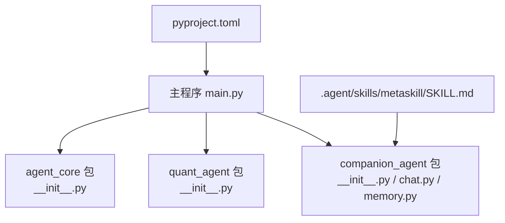
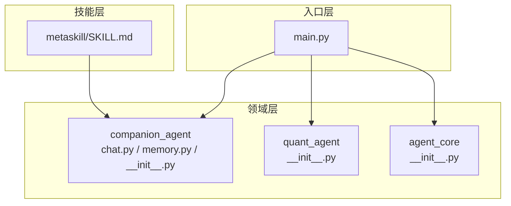
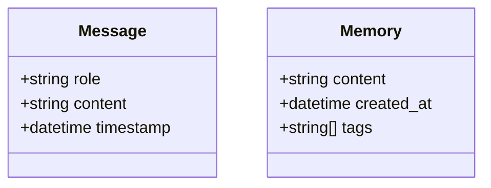
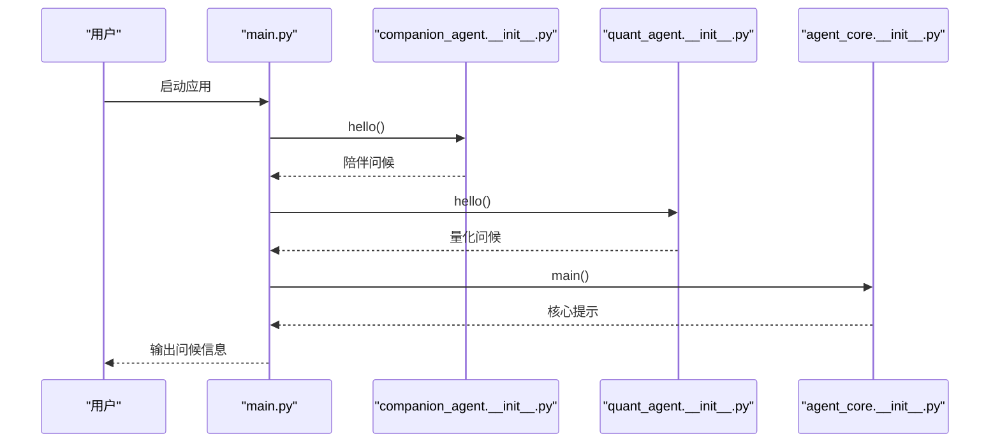
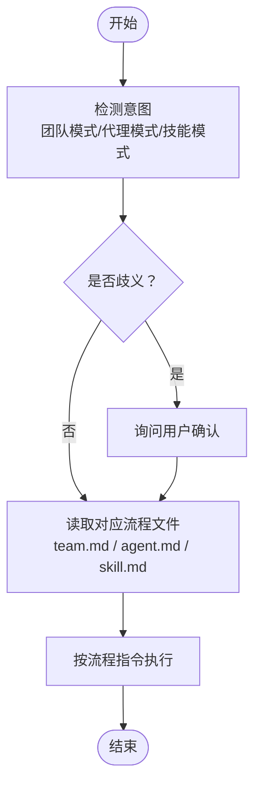
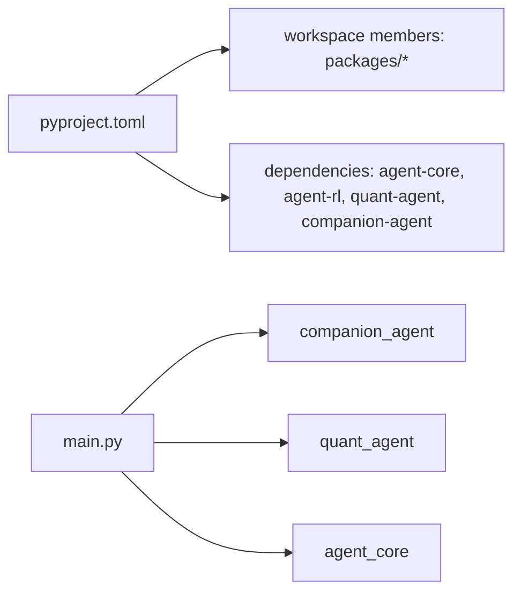

# 对话流程设计

<cite>
**本文引用的文件**   
- [main.py](file://main.py)
- [pyproject.toml](file://pyproject.toml)
- [packages/companion-agent/src/companion_agent/__init__.py](file://packages/companion-agent/src/companion_agent/__init__.py)
- [packages/companion-agent/src/companion_agent/chat.py](file://packages/companion-agent/src/companion_agent/chat.py)
- [packages/companion-agent/src/companion_agent/memory.py](file://packages/companion-agent/src/companion_agent/memory.py)
- [packages/quant-agent/src/quant_agent/__init__.py](file://packages/quant-agent/src/quant_agent/__init__.py)
- [packages/agent-core/src/agent_core/__init__.py](file://packages/agent-core/src/agent_core/__init__.py)
- [.agent/skills/metaskill/SKILL.md](file://.agent/skills/metaskill/SKILL.md)
</cite>

## 目录
1. [简介](#简介)
2. [项目结构](#项目结构)
3. [核心组件](#核心组件)
4. [架构总览](#架构总览)
5. [详细组件分析](#详细组件分析)
6. [依赖分析](#依赖分析)
7. [性能考虑](#性能考虑)
8. [故障排查指南](#故障排查指南)
9. [结论](#结论)
10. [附录](#附录)

## 简介
本教程面向希望构建“多轮对话”的开发者，围绕以下目标展开：
- 解释多轮对话的实现原理：对话状态管理、上下文保持与意图识别机制
- 展示如何设计自然的对话流程：用户输入解析、分支逻辑与错误恢复
- 提供完整代码示例路径，演示问候语生成、问题回答与对话引导功能
- 给出对话流程图与最佳实践建议

本项目采用“双智能体”架构：理性面（量化交易）与感性面（情感陪伴），通过统一入口编排协作。对话能力由消息模型、记忆模块与技能流驱动，结合意图识别实现自然交互。

## 项目结构
仓库为多包工作区，主程序作为编排入口，调用各子包的对外接口；对话相关能力集中在 companion-agent 包中，包含消息结构与记忆模型；技能流定义在 .agent/skills 下，用于按意图加载并执行不同对话流程。

图示来源
- [main.py:1-13](file://main.py#L1-L13)
- [packages/companion-agent/src/companion_agent/__init__.py:1-14](file://packages/companion-agent/src/companion_agent/__init__.py#L1-L14)
- [packages/companion-agent/src/companion_agent/chat.py:1-12](file://packages/companion-agent/src/companion_agent/chat.py#L1-L12)
- [packages/companion-agent/src/companion_agent/memory.py:1-12](file://packages/companion-agent/src/companion_agent/memory.py#L1-L12)
- [packages/quant-agent/src/quant_agent/__init__.py:1-15](file://packages/quant-agent/src/quant_agent/__init__.py#L1-L15)
- [packages/agent-core/src/agent_core/__init__.py:1-3](file://packages/agent-core/src/agent_core/__init__.py#L1-L3)
- [.agent/skills/metaskill/SKILL.md:22-46](file://.agent/skills/metaskill/SKILL.md#L22-L46)
- [pyproject.toml:1-30](file://pyproject.toml#L1-L30)

章节来源
- [main.py:1-13](file://main.py#L1-L13)
- [pyproject.toml:1-30](file://pyproject.toml#L1-L30)

## 核心组件
- 消息模型：用于表示对话中的单条消息，包含角色、内容与时间戳，是上下文保持的基础单元。
- 记忆模型：用于持久化或缓存对话片段，支持标签组织，便于检索与回溯。
- 智能体门面：各智能体暴露统一的 hello/main 接口，便于主程序编排与扩展。
- 技能流：基于意图识别动态加载对应流程文件，驱动多轮对话的执行步骤。

章节来源
- [packages/companion-agent/src/companion_agent/chat.py:1-12](file://packages/companion-agent/src/companion_agent/chat.py#L1-L12)
- [packages/companion-agent/src/companion_agent/memory.py:1-12](file://packages/companion-agent/src/companion_agent/memory.py#L1-L12)
- [packages/companion-agent/src/companion_agent/__init__.py:1-14](file://packages/companion-agent/src/companion_agent/__init__.py#L1-L14)
- [packages/quant-agent/src/quant_agent/__init__.py:1-15](file://packages/quant-agent/src/quant_agent/__init__.py#L1-L15)
- [packages/agent-core/src/agent_core/__init__.py:1-3](file://packages/agent-core/src/agent_core/__init__.py#L1-L3)
- [.agent/skills/metaskill/SKILL.md:22-46](file://.agent/skills/metaskill/SKILL.md#L22-L46)

## 架构总览
整体采用“入口编排 + 领域智能体 + 技能流”的分层设计：
- 入口层：主程序负责初始化与调用各智能体的对外接口
- 领域层：companion-agent 提供对话与记忆能力；quant-agent 提供量化领域能力
- 技能层：根据意图识别结果选择并执行对应的对话流程文件

图示来源
- [main.py:1-13](file://main.py#L1-L13)
- [packages/companion-agent/src/companion_agent/__init__.py:1-14](file://packages/companion-agent/src/companion_agent/__init__.py#L1-L14)
- [packages/companion-agent/src/companion_agent/chat.py:1-12](file://packages/companion-agent/src/companion_agent/chat.py#L1-L12)
- [packages/companion-agent/src/companion_agent/memory.py:1-12](file://packages/companion-agent/src/companion_agent/memory.py#L1-L12)
- [packages/quant-agent/src/quant_agent/__init__.py:1-15](file://packages/quant-agent/src/quant_agent/__init__.py#L1-L15)
- [packages/agent-core/src/agent_core/__init__.py:1-3](file://packages/agent-core/src/agent_core/__init__.py#L1-L3)
- [.agent/skills/metaskill/SKILL.md:22-46](file://.agent/skills/metaskill/SKILL.md#L22-L46)

## 详细组件分析

### 数据模型：消息与记忆
- 消息（Message）：承载对话的基本单元，包含角色、内容与时间戳，用于构建上下文序列。
- 记忆（Memory）：承载可检索的记忆片段，包含内容、创建时间与标签集合，用于长期上下文保持。

图示来源
- [packages/companion-agent/src/companion_agent/chat.py:1-12](file://packages/companion-agent/src/companion_agent/chat.py#L1-L12)
- [packages/companion-agent/src/companion_agent/memory.py:1-12](file://packages/companion-agent/src/companion_agent/memory.py#L1-L12)

章节来源
- [packages/companion-agent/src/companion_agent/chat.py:1-12](file://packages/companion-agent/src/companion_agent/chat.py#L1-L12)
- [packages/companion-agent/src/companion_agent/memory.py:1-12](file://packages/companion-agent/src/companion_agent/memory.py#L1-L12)

### 智能体门面：问候与主流程
- companion_agent.hello：返回陪伴型问候语，体现“感性之面”的定位
- quant_agent.hello：返回量化型问候语，体现“理性之面”的定位
- agent_core.main：核心框架占位入口

图示来源
- [main.py:1-13](file://main.py#L1-L13)
- [packages/companion-agent/src/companion_agent/__init__.py:1-14](file://packages/companion-agent/src/companion_agent/__init__.py#L1-L14)
- [packages/quant-agent/src/quant_agent/__init__.py:1-15](file://packages/quant-agent/src/quant_agent/__init__.py#L1-L15)
- [packages/agent-core/src/agent_core/__init__.py:1-3](file://packages/agent-core/src/agent_core/__init__.py#L1-L3)

章节来源
- [main.py:1-13](file://main.py#L1-L13)
- [packages/companion-agent/src/companion_agent/__init__.py:1-14](file://packages/companion-agent/src/companion_agent/__init__.py#L1-L14)
- [packages/quant-agent/src/quant_agent/__init__.py:1-15](file://packages/quant-agent/src/quant_agent/__init__.py#L1-L15)
- [packages/agent-core/src/agent_core/__init__.py:1-3](file://packages/agent-core/src/agent_core/__init__.py#L1-L3)

### 意图识别与对话流程编排
技能流根据用户输入进行意图识别，并加载对应流程文件执行。该机制是多轮对话的核心控制点。

图示来源
- [.agent/skills/metaskill/SKILL.md:22-46](file://.agent/skills/metaskill/SKILL.md#L22-L46)

章节来源
- [.agent/skills/metaskill/SKILL.md:22-46](file://.agent/skills/metaskill/SKILL.md#L22-L46)

### 多轮对话实现要点
- 对话状态管理
  - 使用消息序列维护短期上下文，以时间戳排序保证时序一致性
  - 使用记忆模型维护长期上下文，通过标签进行主题化索引
- 上下文保持
  - 将最近若干条消息与关键记忆片段拼接为当前上下文窗口
  - 对长对话进行摘要或压缩，避免上下文溢出
- 意图识别机制
  - 基于关键词与短语匹配进行初筛，必要时通过提问澄清
  - 根据意图选择对应流程文件，确保行为可配置与可扩展

章节来源
- [packages/companion-agent/src/companion_agent/chat.py:1-12](file://packages/companion-agent/src/companion_agent/chat.py#L1-L12)
- [packages/companion-agent/src/companion_agent/memory.py:1-12](file://packages/companion-agent/src/companion_agent/memory.py#L1-L12)
- [.agent/skills/metaskill/SKILL.md:22-46](file://.agent/skills/metaskill/SKILL.md#L22-L46)

### 代码示例路径（无代码内容）
- 问候语生成
  - 陪伴型问候：[packages/companion-agent/src/companion_agent/__init__.py:9-10](file://packages/companion-agent/src/companion_agent/__init__.py#L9-L10)
  - 量化型问候：[packages/quant-agent/src/quant_agent/__init__.py:9-10](file://packages/quant-agent/src/quant_agent/__init__.py#L9-L10)
- 问题回答
  - 参考消息模型与记忆模型的字段结构，组合上下文后调用上层问答服务（示例路径见上）
- 对话引导
  - 参考意图识别与流程加载逻辑，依据用户输入选择 team/agent/skill 流程文件（示例路径见上）

章节来源
- [packages/companion-agent/src/companion_agent/__init__.py:9-10](file://packages/companion-agent/src/companion_agent/__init__.py#L9-L10)
- [packages/quant-agent/src/quant_agent/__init__.py:9-10](file://packages/quant-agent/src/quant_agent/__init__.py#L9-L10)
- [packages/companion-agent/src/companion_agent/chat.py:1-12](file://packages/companion-agent/src/companion_agent/chat.py#L1-L12)
- [packages/companion-agent/src/companion_agent/memory.py:1-12](file://packages/companion-agent/src/companion_agent/memory.py#L1-L12)
- [.agent/skills/metaskill/SKILL.md:22-46](file://.agent/skills/metaskill/SKILL.md#L22-L46)

## 依赖分析
- 主程序依赖三个子包：companion-agent、quant-agent、agent-core
- 工作区配置声明了成员包与依赖关系，便于统一安装与运行

图示来源
- [pyproject.toml:1-30](file://pyproject.toml#L1-L30)
- [main.py:1-13](file://main.py#L1-L13)

章节来源
- [pyproject.toml:1-30](file://pyproject.toml#L1-L30)
- [main.py:1-13](file://main.py#L1-L13)

## 性能考虑
- 上下文窗口控制：限制消息数量与长度，必要时进行摘要压缩
- 记忆检索优化：利用标签与时间戳建立索引，减少全量扫描
- 意图识别效率：优先规则匹配，再引入更耗资源的模型判断
- I/O 与并发：对外部查询与存储操作进行异步与批处理

## 故障排查指南
- 启动失败
  - 检查主程序是否正确导入并调用子包接口
  - 核对工作区依赖是否安装成功
- 对话无响应
  - 检查意图识别是否命中有效分支
  - 确认流程文件是否存在且可读
- 上下文丢失
  - 检查消息与记忆的写入与读取顺序
  - 验证时间戳与标签是否一致

章节来源
- [main.py:1-13](file://main.py#L1-L13)
- [pyproject.toml:1-30](file://pyproject.toml#L1-L30)
- [.agent/skills/metaskill/SKILL.md:22-46](file://.agent/skills/metaskill/SKILL.md#L22-L46)

## 结论
本项目通过清晰的数据模型与模块化设计，实现了多轮对话的基础能力：消息与记忆支撑上下文保持，技能流驱动意图识别与流程编排，主程序完成跨智能体编排。在此基础上，可进一步扩展问答、引导与错误恢复策略，提升对话的自然性与鲁棒性。

## 附录
- 最佳实践建议
  - 明确意图边界：为每种意图定义清晰的触发词与排除条件
  - 分层上下文：短期用消息序列，长期用记忆模型，定期清理与摘要
  - 可观测性：记录意图识别结果、选择的流程与关键决策点
  - 容错设计：对歧义输入主动澄清，对异常流程回退到默认引导