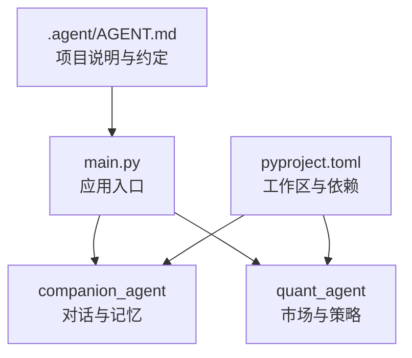
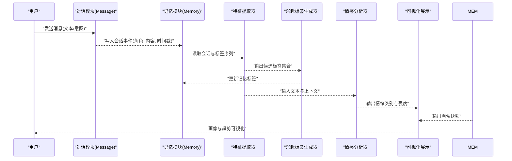
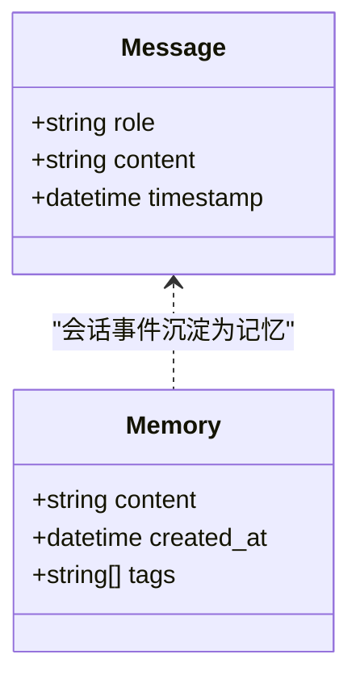
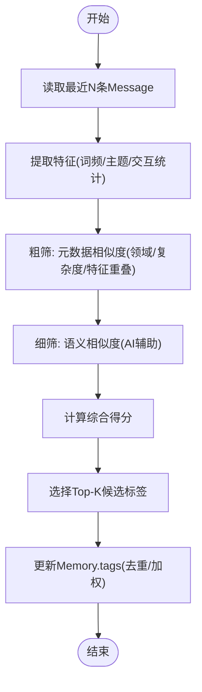
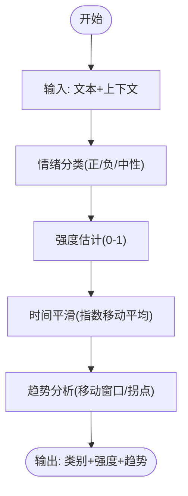
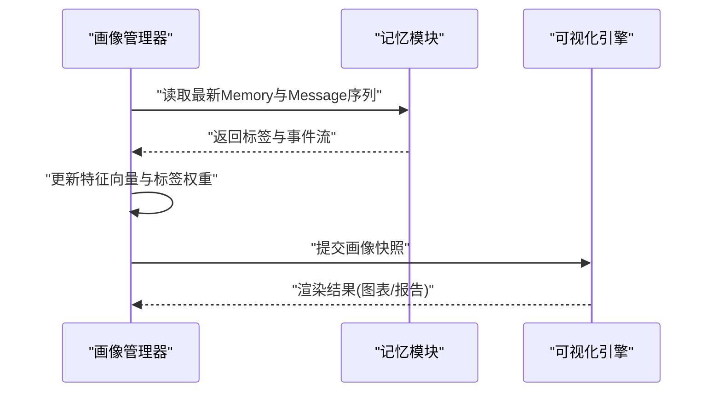
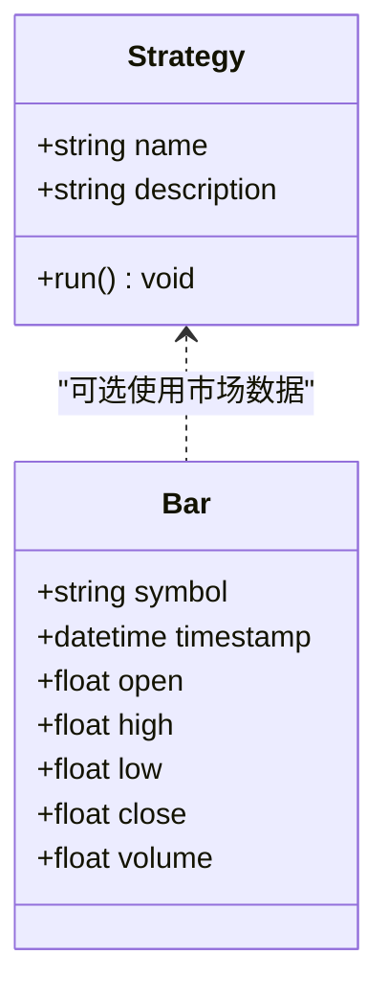
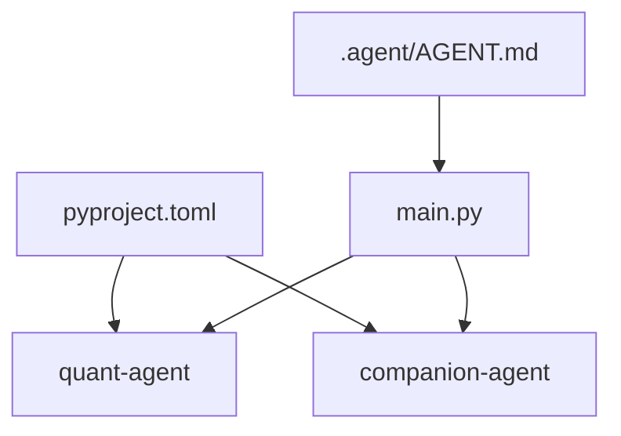

# 用户画像与情感分析

<cite>
**本文引用的文件**   
- [main.py](file://main.py)
- [pyproject.toml](file://pyproject.toml)
- [AGENT.md](file://.agent/AGENT.md)
- [roadmap.html](file://docs/plans/roadmap.html)
- [memory.py](file://packages/companion-agent/src/companion_agent/memory.py)
- [chat.py](file://packages/companion-agent/src/companion_agent/chat.py)
- [market.py](file://packages/quant-agent/src/quant_agent/market.py)
- [strategies.py](file://packages/quant-agent/src/quant_agent/strategies.py)
</cite>

## 目录
1. [引言](#引言)
2. [项目结构](#项目结构)
3. [核心组件](#核心组件)
4. [架构总览](#架构总览)
5. [详细组件分析](#详细组件分析)
6. [依赖关系分析](#依赖关系分析)
7. [性能考虑](#性能考虑)
8. [故障排查指南](#故障排查指南)
9. [结论](#结论)
10. [附录](#附录)

## 引言
本教程面向希望在个人智能体框架中构建“用户画像”和“情感分析”能力的开发者。我们将基于现有代码库中的对话、记忆与市场数据等基础构件，逐步实现：
- 用户特征提取：从对话与行为日志中抽取结构化特征（如角色、时间戳、标签）。
- 行为模式分析：通过会话序列与标签演化识别用户偏好与习惯。
- 兴趣标签生成：结合领域知识与模板匹配策略，为会话内容生成可解释的兴趣标签。
- 情感识别算法：情绪分类、情感强度评估与趋势分析。
- 完整示例流程：创建、更新与可视化展示用户画像。
- 隐私保护策略与数据分析最佳实践。

本项目采用双智能体架构：量化分析与陪伴助手，统一由 AgentPool 编排。该文档将围绕 companion-agent（对话与记忆）与 quant-agent（市场数据与策略）展开，给出可落地的实现路径与图示。

## 项目结构
仓库采用 uv workspace 组织多包工程，根入口 main.py 启动两个子模块的 hello 能力；companion-agent 提供对话与记忆的数据模型；quant-agent 提供市场数据与策略基类；顶层配置 pyproject.toml 声明工作区成员与依赖。

图表来源
- [main.py:1-13](file://main.py#L1-L13)
- [pyproject.toml:1-30](file://pyproject.toml#L1-L30)
- [AGENT.md:1-142](file://.agent/AGENT.md#L1-L142)

章节来源
- [main.py:1-13](file://main.py#L1-L13)
- [pyproject.toml:1-30](file://pyproject.toml#L1-L30)
- [AGENT.md:1-142](file://.agent/AGENT.md#L1-L142)

## 核心组件
- 对话消息模型：用于记录用户与助手的交互，包含角色、内容与时间戳，是构建用户画像的基础事件源。
- 记忆条目模型：用于持久化关键信息并附带标签，便于后续兴趣标签与行为模式分析。
- 市场数据模型：以 K 线数据为例，展示时序数据的结构化表示，可用于情感趋势分析的数值型输入。
- 策略基类：定义策略运行接口，可作为“画像驱动的策略”扩展点（例如根据用户画像调整参数）。

章节来源
- [chat.py:1-12](file://packages/companion-agent/src/companion_agent/chat.py#L1-L12)
- [memory.py:1-12](file://packages/companion-agent/src/companion_agent/memory.py#L1-L12)
- [market.py:1-16](file://packages/quant-agent/src/quant_agent/market.py#L1-L16)
- [strategies.py:1-13](file://packages/quant-agent/src/quant_agent/strategies.py#L1-L13)

## 架构总览
下图展示了从对话到画像再到情感趋势的整体流程：对话消息进入记忆系统，经过特征提取与标签生成形成用户画像；同时，市场或业务时序数据作为外部信号参与情感强度与趋势分析；最终输出可视化的画像与趋势报告。

图表来源
- [chat.py:1-12](file://packages/companion-agent/src/companion_agent/chat.py#L1-L12)
- [memory.py:1-12](file://packages/companion-agent/src/companion_agent/memory.py#L1-L12)

## 详细组件分析

### 组件A：对话与记忆数据模型
- Message：承载单条对话事件，字段包括角色、内容与时间戳，适合作为用户行为事件的原子单元。
- Memory：承载持久化记忆，字段包括内容、创建时间与标签列表，适合存储兴趣标签与关键事实。

图表来源
- [chat.py:1-12](file://packages/companion-agent/src/companion_agent/chat.py#L1-L12)
- [memory.py:1-12](file://packages/companion-agent/src/companion_agent/memory.py#L1-L12)

章节来源
- [chat.py:1-12](file://packages/companion-agent/src/companion_agent/chat.py#L1-L12)
- [memory.py:1-12](file://packages/companion-agent/src/companion_agent/memory.py#L1-L12)

### 组件B：用户特征提取与兴趣标签生成
- 特征提取：从 Message 序列中提取时间窗口内的关键词、话题分布、交互频率、响应延迟等指标。
- 标签生成：结合领域知识（如阅读与分析技能）与模板匹配策略，对会话内容进行粗筛与细筛，产出兴趣标签。
- 标签更新：将新标签写入 Memory.tags，支持去重、权重衰减与合并。

图表来源
- [template_matching.md:1-295](file://.agent/skills/fastgpt-workflow-generator/references/template_matching.md#L1-L295)
- [memory.py:1-12](file://packages/companion-agent/src/companion_agent/memory.py#L1-L12)
- [chat.py:1-12](file://packages/companion-agent/src/companion_agent/chat.py#L1-L12)

章节来源
- [template_matching.md:1-295](file://.agent/skills/fastgpt-workflow-generator/references/template_matching.md#L1-L295)
- [memory.py:1-12](file://packages/companion-agent/src/companion_agent/memory.py#L1-L12)
- [chat.py:1-12](file://packages/companion-agent/src/companion_agent/chat.py#L1-L12)

### 组件C：情感识别算法（情绪分类、强度评估、趋势分析）
- 情绪分类：基于文本与上下文，将对话划分为积极/消极/中性等类别，并可细化到更丰富的标签集。
- 强度评估：在分类基础上输出情感强度（如0-1连续值），结合用户历史进行平滑处理。
- 趋势分析：对时间序列的情感强度进行移动平均、波动率与拐点检测，输出趋势信号。

[本节为概念性流程图，不直接映射具体源码文件]

### 组件D：画像创建、更新与可视化
- 画像创建：初始化空画像，聚合首次会话的特征与标签，建立基线。
- 画像更新：增量更新特征向量与标签权重，保留版本历史以便回溯。
- 可视化展示：渲染标签云、兴趣雷达图、情感趋势折线图与热点时间轴。

[本节为概念性流程图，不直接映射具体源码文件]

### 组件E：量化数据接入与画像联动
- 市场数据：Bar 数据类提供标准K线字段，可作为外部信号影响情感强度（如市场波动对用户情绪的潜在影响）。
- 策略基类：Strategy.run 可扩展为“画像驱动策略”，依据用户画像动态调整参数或触发提醒。

图表来源
- [market.py:1-16](file://packages/quant-agent/src/quant_agent/market.py#L1-L16)
- [strategies.py:1-13](file://packages/quant-agent/src/quant_agent/strategies.py#L1-L13)

章节来源
- [market.py:1-16](file://packages/quant-agent/src/quant_agent/market.py#L1-L16)
- [strategies.py:1-13](file://packages/quant-agent/src/quant_agent/strategies.py#L1-L13)

## 依赖关系分析
- 工作区与依赖：pyproject.toml 定义了工作区成员与依赖项，确保各包可被统一管理与安装。
- 入口程序：main.py 调用子模块的 hello 方法，验证环境可用性与模块导入正确性。
- 项目约定：.agent/AGENT.md 提供了开发约定与关键文件指引，有助于团队协作与规范落地。

图表来源
- [pyproject.toml:1-30](file://pyproject.toml#L1-L30)
- [main.py:1-13](file://main.py#L1-L13)
- [AGENT.md:1-142](file://.agent/AGENT.md#L1-L142)

章节来源
- [pyproject.toml:1-30](file://pyproject.toml#L1-L30)
- [main.py:1-13](file://main.py#L1-L13)
- [AGENT.md:1-142](file://.agent/AGENT.md#L1-L142)

## 性能考虑
- 批处理与滑动窗口：对消息与记忆进行批量读取与滑动窗口聚合，降低频繁IO开销。
- 标签去重与权重衰减：避免标签爆炸，保持画像稳定与可解释性。
- 异步与缓存：对情感分类与标签生成引入缓存层，减少重复计算。
- 向量化与近似检索：对大规模记忆使用向量索引加速相似性搜索。

[本节为通用指导，不直接分析具体文件]

## 故障排查指南
- 模块导入失败：检查 main.py 是否正确导入 quant-agent 与 companion-agent，确认 pyproject.toml 中依赖与工作区配置。
- 数据模型缺失字段：核对 Message 与 Memory 的字段是否齐全，确保下游组件读取时不会抛出异常。
- 标签生成不稳定：检查模板匹配权重与阈值，必要时调整粗筛与细筛阶段的比例。
- 情感趋势异常：检查时间对齐与平滑参数，确认是否存在缺失时间戳或异常值。

章节来源
- [main.py:1-13](file://main.py#L1-L13)
- [pyproject.toml:1-30](file://pyproject.toml#L1-L30)
- [chat.py:1-12](file://packages/companion-agent/src/companion_agent/chat.py#L1-L12)
- [memory.py:1-12](file://packages/companion-agent/src/companion_agent/memory.py#L1-L12)

## 结论
本教程基于现有代码库的对话、记忆与市场数据模型，给出了用户画像构建与情感分析的端到端方案。通过特征提取、标签生成、情感分类与趋势分析，可实现个性化画像与情绪洞察，并结合可视化展示提升可解释性与可用性。建议在迭代中持续优化标签体系与情感模型，并严格遵循隐私保护与数据安全最佳实践。

[本节为总结性内容，不直接分析具体文件]

## 附录

### 隐私保护策略
- 最小化采集：仅收集必要字段（角色、内容、时间戳、标签），避免敏感信息入库。
- 匿名化与脱敏：对姓名、联系方式等PII进行哈希或替换。
- 访问控制与审计：限制画像与记忆的读写权限，记录操作日志。
- 数据留存与删除：设定生命周期策略，支持一键删除与导出。
- 合规与同意：明确告知用户数据用途，提供退出机制。

[本节为通用指导，不直接分析具体文件]

### 数据分析最佳实践
- 数据质量：校验时间戳顺序、缺失值与异常值处理。
- 指标体系：参考北极星指标设计原则，衡量专属度与价值差异。
- 实验与对照：采用对照法评估画像带来的增量价值。
- 可解释性：标签与情感结果需具备可追溯的来源与理由。

章节来源
- [roadmap.html:276-290](file://docs/plans/roadmap.html#L276-L290)