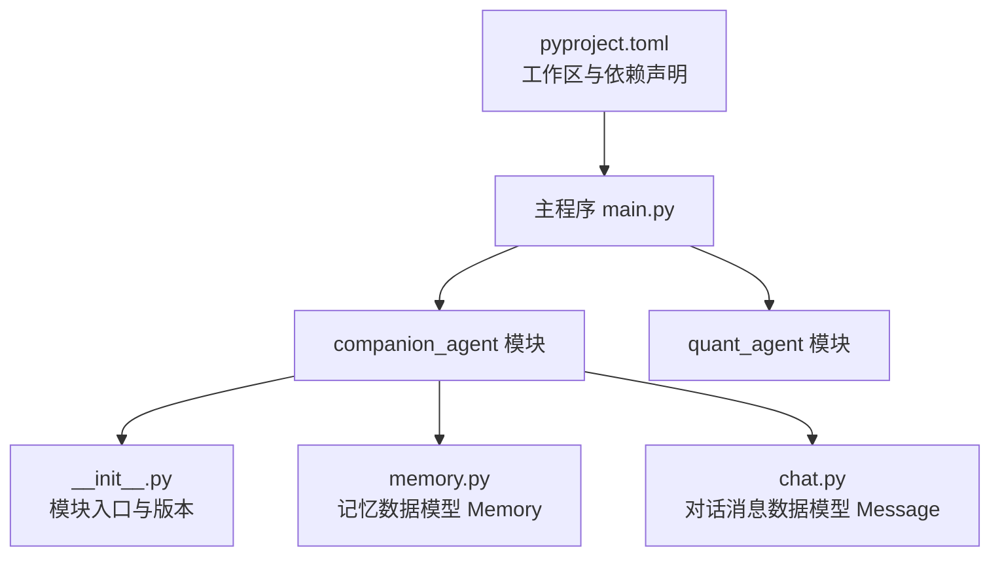
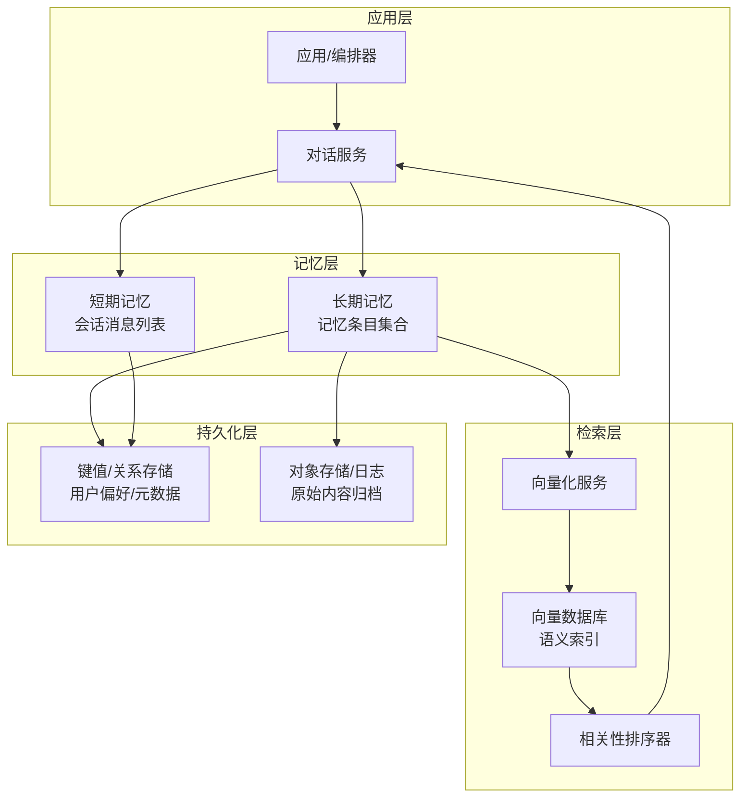
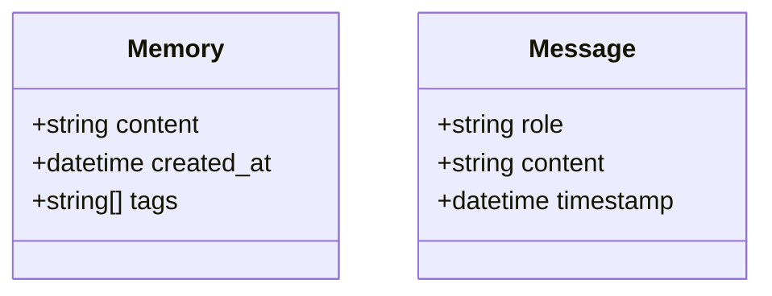
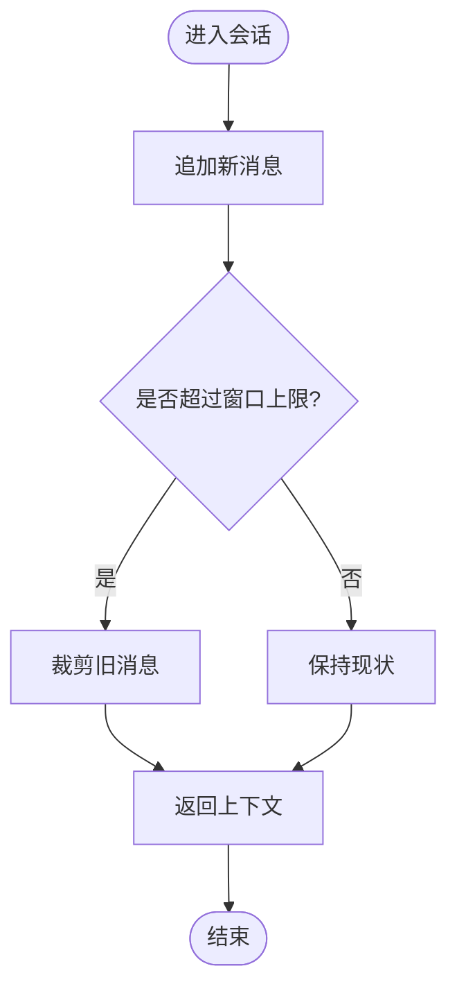
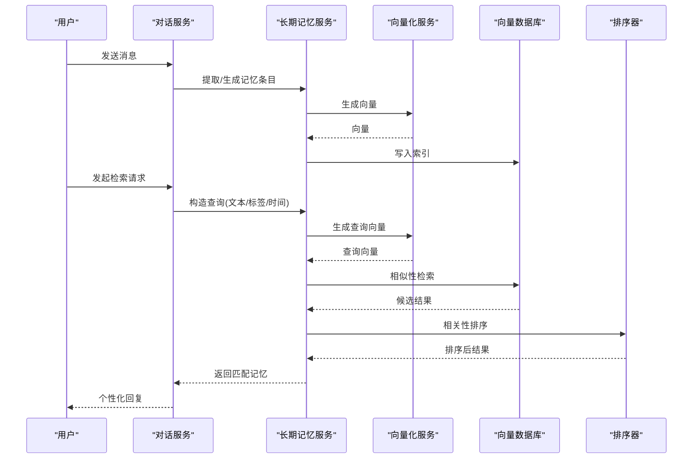
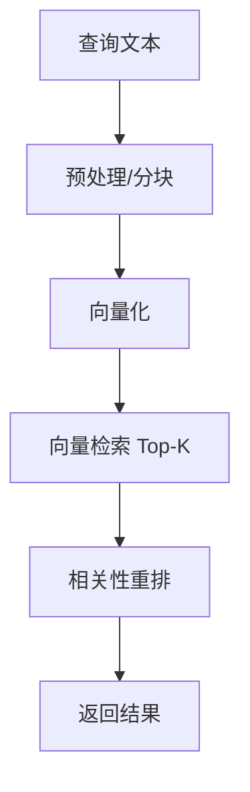
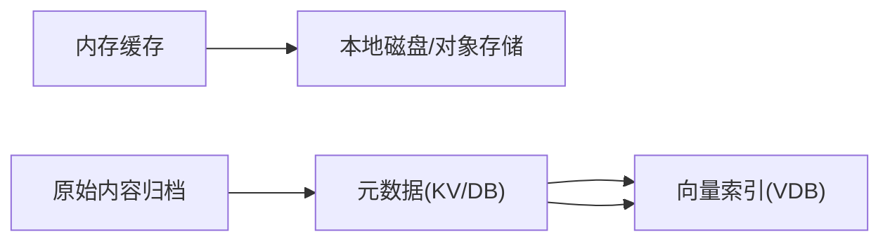
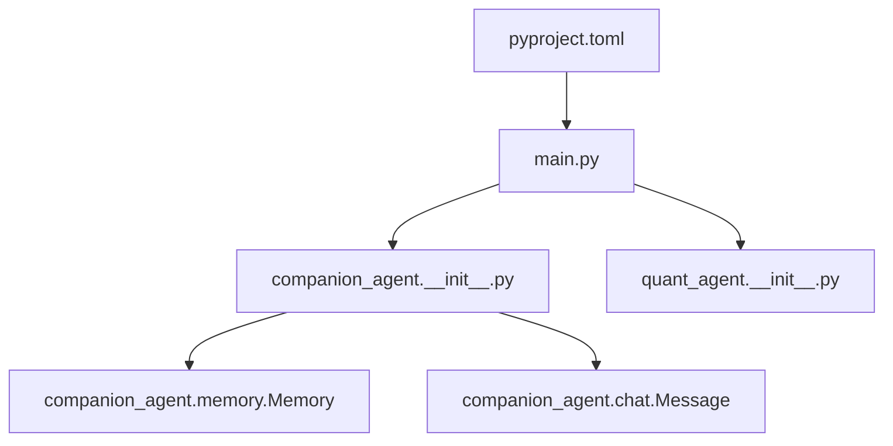

# 记忆系统集成

<cite>
**本文引用的文件**   
- [main.py](file://main.py)
- [pyproject.toml](file://pyproject.toml)
- [companion_agent/__init__.py](file://packages/companion-agent/src/companion_agent/__init__.py)
- [companion_agent/memory.py](file://packages/companion-agent/src/companion_agent/memory.py)
- [companion_agent/chat.py](file://packages/companion-agent/src/companion_agent/chat.py)
</cite>

## 目录
1. [简介](#简介)
2. [项目结构](#项目结构)
3. [核心组件](#核心组件)
4. [架构总览](#架构总览)
5. [详细组件分析](#详细组件分析)
6. [依赖分析](#依赖分析)
7. [性能考虑](#性能考虑)
8. [故障排查指南](#故障排查指南)
9. [结论](#结论)
10. [附录](#附录)

## 简介
本教程面向希望在智能体中集成“记忆系统”的开发者，围绕长期记忆与短期记忆的架构设计、数据模型、检索策略、持久化方案与性能优化进行系统化说明。结合当前仓库中的基础数据结构（如对话消息与记忆条目），我们将给出从概念到落地的完整路径：包括用户偏好存储、历史对话记录、个性化信息维护；并展示如何引入向量数据库实现语义搜索与相关性排序，提供创建、更新、查询、清理等操作的参考流程与最佳实践。

## 项目结构
本项目采用多包工作区组织，主入口聚合多个子智能体模块。与记忆系统直接相关的数据模型位于 companion-agent 包内，包含对话消息与记忆条目的基础定义。

图示来源
- [main.py:1-13](file://main.py#L1-L13)
- [pyproject.toml:1-30](file://pyproject.toml#L1-L30)
- [companion_agent/__init__.py:1-15](file://packages/companion-agent/src/companion_agent/__init__.py#L1-L15)
- [companion_agent/memory.py:1-12](file://packages/companion-agent/src/companion_agent/memory.py#L1-L12)
- [companion_agent/chat.py:1-12](file://packages/companion-agent/src/companion_agent/chat.py#L1-L12)

章节来源
- [main.py:1-13](file://main.py#L1-L13)
- [pyproject.toml:1-30](file://pyproject.toml#L1-L30)
- [companion_agent/__init__.py:1-15](file://packages/companion-agent/src/companion_agent/__init__.py#L1-L15)

## 核心组件
- 记忆数据模型：用于承载单条记忆内容、创建时间与标签集合，便于后续检索与过滤。
- 对话消息模型：用于承载角色、内容与时间戳，作为短期记忆（会话上下文）的基础单元。
- 模块入口：提供对外接口与版本信息，便于上层编排调用。

章节来源
- [companion_agent/memory.py:1-12](file://packages/companion-agent/src/companion_agent/memory.py#L1-L12)
- [companion_agent/chat.py:1-12](file://packages/companion-agent/src/companion_agent/chat.py#L1-L12)
- [companion_agent/__init__.py:1-15](file://packages/companion-agent/src/companion_agent/__init__.py#L1-L15)

## 架构总览
下图展示了“短期记忆 + 长期记忆 + 向量检索 + 持久化”的整体架构。短期记忆以会话消息为主，长期记忆以结构化记忆条目为主，并通过向量数据库进行语义检索与相关性排序。

图示来源
- [companion_agent/memory.py:1-12](file://packages/companion-agent/src/companion_agent/memory.py#L1-L12)
- [companion_agent/chat.py:1-12](file://packages/companion-agent/src/companion_agent/chat.py#L1-L12)

## 详细组件分析

### 数据模型与职责
- 记忆条目（Memory）
  - 字段：内容、创建时间、标签集合
  - 用途：长期记忆的基本单元，支持基于标签与时间的筛选，以及基于内容的语义检索
- 对话消息（Message）
  - 字段：角色、内容、时间戳
  - 用途：短期记忆的基本单元，用于构建会话上下文窗口

图示来源
- [companion_agent/memory.py:1-12](file://packages/companion-agent/src/companion_agent/memory.py#L1-L12)
- [companion_agent/chat.py:1-12](file://packages/companion-agent/src/companion_agent/chat.py#L1-L12)

章节来源
- [companion_agent/memory.py:1-12](file://packages/companion-agent/src/companion_agent/memory.py#L1-L12)
- [companion_agent/chat.py:1-12](file://packages/companion-agent/src/companion_agent/chat.py#L1-L12)

### 短期记忆（会话上下文）
- 目标：在单次或有限轮次对话中维持上下文，提升连贯性与个性化响应质量。
- 关键操作：
  - 追加新消息
  - 滑动窗口裁剪（按时间或数量）
  - 快速检索最近 N 条消息
- 建议：
  - 将高频访问的近期消息缓存至内存
  - 定期将重要片段沉淀为长期记忆

[此图为概念流程图，无需图示来源]

### 长期记忆（用户偏好与知识）
- 目标：跨会话持久化用户偏好、兴趣、历史要点与个性化信息。
- 关键操作：
  - 创建：从对话摘要或显式输入生成记忆条目
  - 更新：合并重复、修正过时信息
  - 查询：基于标签、时间范围与语义关键词检索
  - 清理：删除过期或低价值条目
- 建议：
  - 使用标签体系对记忆进行主题划分
  - 为每条记忆建立向量索引，支持语义相似度检索

图示来源
- [companion_agent/memory.py:1-12](file://packages/companion-agent/src/companion_agent/memory.py#L1-L12)
- [companion_agent/chat.py:1-12](file://packages/companion-agent/src/companion_agent/chat.py#L1-L12)

### 语义搜索与相关性排序
- 步骤：
  - 文本预处理与分块（可选）
  - 向量化（嵌入模型）
  - 向量数据库检索（Top-K）
  - 重排（规则权重 + 学习排序）
- 指标：
  - 召回率、精确率、MRR、NDCG
  - 延迟与吞吐
- 技巧：
  - 混合检索：关键词 + 向量
  - 动态阈值：根据场景调整 Top-K 与相似度阈值
  - 增量索引：异步写入，避免阻塞主链路

[此图为概念流程图，无需图示来源]

### 持久化策略
- 短期记忆：内存优先，必要时落盘为会话快照（JSON/Parquet）
- 长期记忆：
  - 元数据与标签：KV 或关系型数据库
  - 向量索引：专用向量数据库
  - 原始内容：对象存储或归档库
- 一致性：最终一致即可，允许短暂延迟

[此图为概念流程图，无需图示来源]

### 代码示例（操作清单）
以下为常用操作的参考流程（不直接粘贴代码，仅给出步骤与对应位置）：
- 创建记忆
  - 构造 Memory 实例，设置内容、时间与标签
  - 生成向量并写入向量数据库
  - 持久化元数据与原始内容
  - 参考：[companion_agent/memory.py:1-12](file://packages/companion-agent/src/companion_agent/memory.py#L1-L12)
- 更新记忆
  - 按 ID 定位条目，合并内容/标签
  - 重新计算向量并覆盖索引
  - 记录变更审计
- 查询记忆
  - 组合条件：标签、时间范围、语义关键词
  - 执行向量检索与重排
  - 参考：[companion_agent/memory.py:1-12](file://packages/companion-agent/src/companion_agent/memory.py#L1-L12)
- 清理记忆
  - 基于过期策略与低价值评分删除
  - 同步清理向量索引与元数据
- 短期记忆管理
  - 追加/裁剪消息，维护上下文窗口
  - 参考：[companion_agent/chat.py:1-12](file://packages/companion-agent/src/companion_agent/chat.py#L1-L12)

章节来源
- [companion_agent/memory.py:1-12](file://packages/companion-agent/src/companion_agent/memory.py#L1-L12)
- [companion_agent/chat.py:1-12](file://packages/companion-agent/src/companion_agent/chat.py#L1-L12)

## 依赖分析
- 工作区与依赖
  - 根配置声明了工作区成员与依赖项，主程序通过导入子模块进行聚合
- 模块耦合
  - 主程序仅依赖各子模块的对外入口函数
  - companion-agent 内部目前仅暴露基础数据模型与简单入口

图示来源
- [pyproject.toml:1-30](file://pyproject.toml#L1-L30)
- [main.py:1-13](file://main.py#L1-L13)
- [companion_agent/__init__.py:1-15](file://packages/companion-agent/src/companion_agent/__init__.py#L1-L15)
- [companion_agent/memory.py:1-12](file://packages/companion-agent/src/companion_agent/memory.py#L1-L12)
- [companion_agent/chat.py:1-12](file://packages/companion-agent/src/companion_agent/chat.py#L1-L12)

章节来源
- [pyproject.toml:1-30](file://pyproject.toml#L1-L30)
- [main.py:1-13](file://main.py#L1-L13)

## 性能考虑
- 索引与检索
  - 批量写入与异步索引，降低主链路延迟
  - 合理选择 Top-K 与相似度阈值，平衡召回与速度
- 缓存与分层
  - 热点记忆与近期消息常驻内存
  - 冷热分离：热数据内存/近线存储，冷数据归档
- 资源与扩展
  - 向量化服务独立部署，水平扩展
  - 向量数据库分片与副本，保障高可用
- 监控与度量
  - 记录检索耗时、命中率、错误率
  - 对重排阶段进行 A/B 评估

[本节为通用指导，无需章节来源]

## 故障排查指南
- 常见问题
  - 向量维度不一致：检查嵌入模型与索引配置
  - 检索结果为空：确认相似度阈值与 Top-K 设置
  - 写入失败：检查向量数据库连接与权限
  - 数据不一致：核对元数据与向量索引的同步状态
- 诊断步骤
  - 查看写入与检索日志
  - 校验时间戳与标签格式
  - 回放典型查询，逐步缩小问题范围

[本节为通用指导，无需章节来源]

## 结论
通过将短期记忆与长期记忆解耦，并以向量检索为核心能力，可实现具备个性化与上下文感知的智能体体验。建议在现有数据模型基础上，逐步完善检索、排序与持久化链路，并结合业务指标持续优化。

[本节为总结，无需章节来源]

## 附录
- 术语
  - 短期记忆：会话级上下文，通常以消息序列表示
  - 长期记忆：跨会话的用户偏好与知识，以结构化条目表示
  - 向量检索：基于嵌入向量的近似最近邻搜索
  - 重排：在召回后进行更精细的相关性排序
- 推荐工具栈（示例）
  - 向量数据库：Milvus / FAISS / Chroma / Pinecone
  - 嵌入模型：OpenAI / SentenceTransformers / 自研模型
  - 元数据存储：SQLite / PostgreSQL / Redis
  - 对象存储：MinIO / S3

[本节为补充信息，无需章节来源]