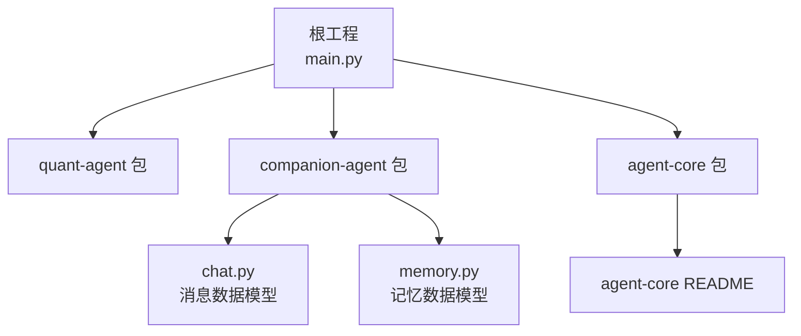
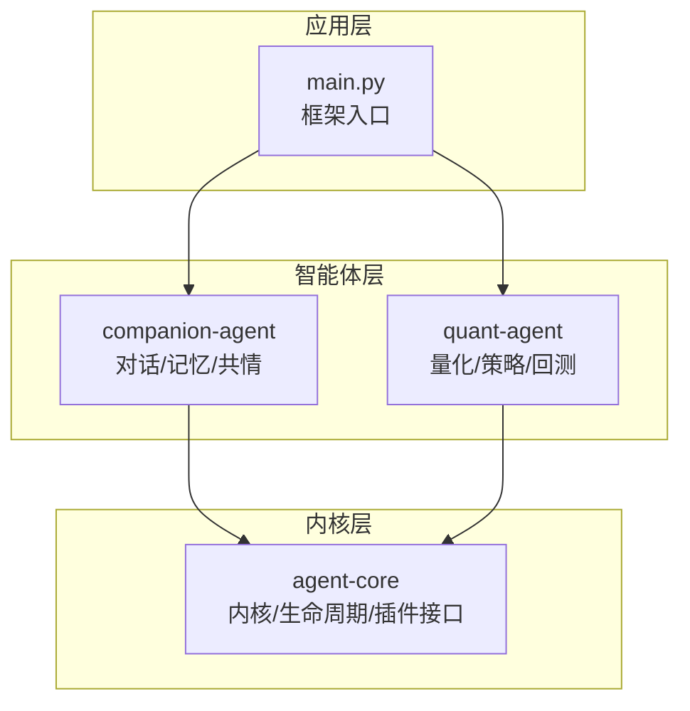
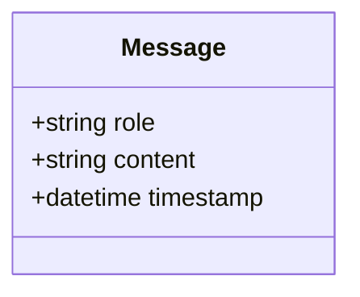
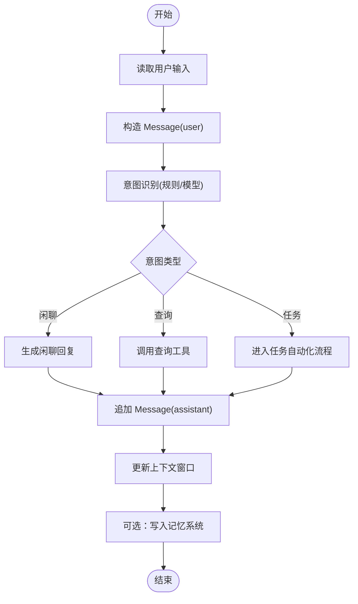
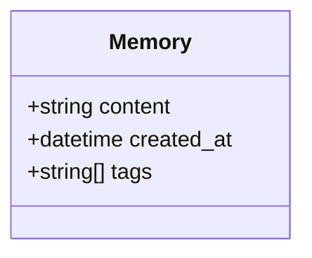
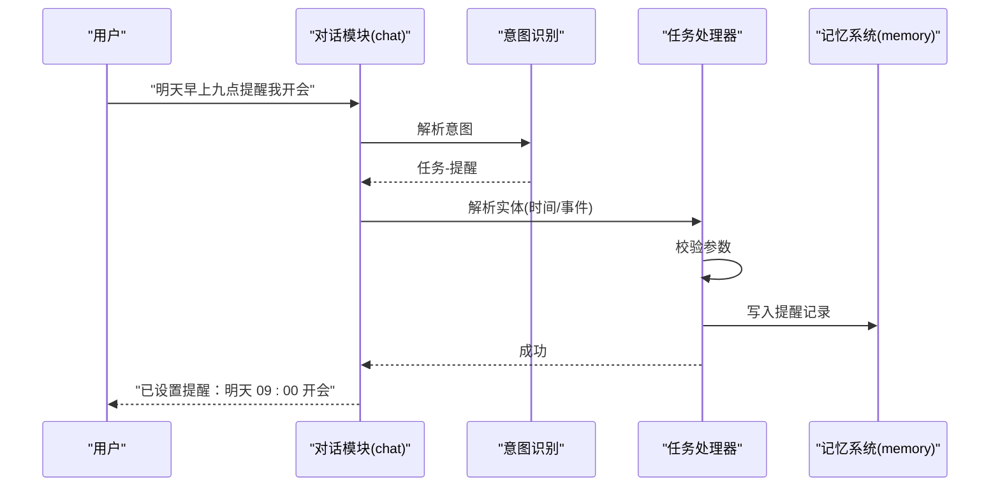
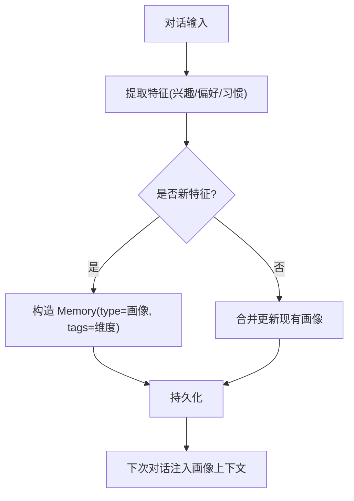
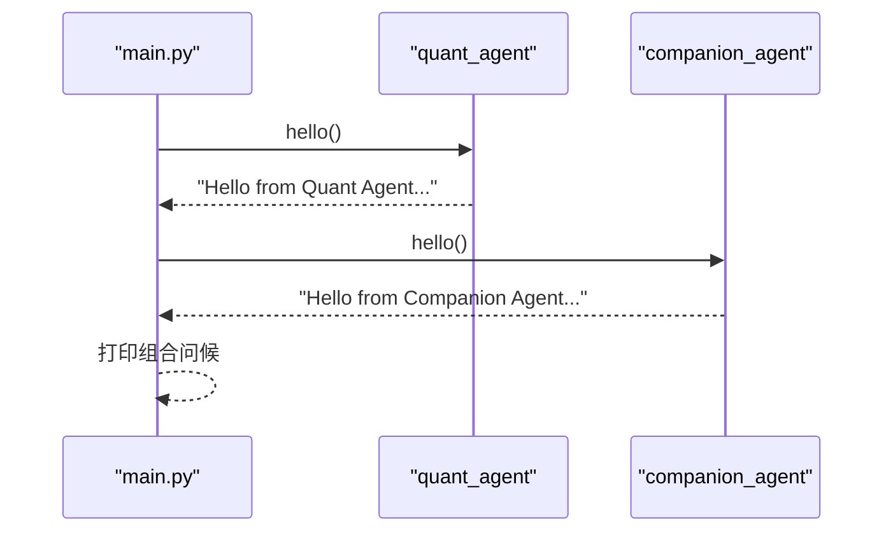
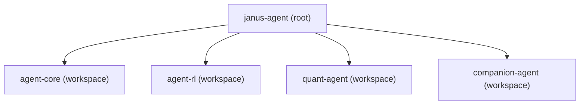

# 陪伴助手教程

<cite>
**本文引用的文件**   
- [main.py](file://main.py)
- [pyproject.toml](file://pyproject.toml)
- [.agent/AGENT.md](file://.agent/AGENT.md)
- [.agent/context/project.md](file://.agent/context/project.md)
- [packages/companion-agent/src/companion_agent/__init__.py](file://packages/companion-agent/src/companion_agent/__init__.py)
- [packages/companion-agent/src/companion_agent/chat.py](file://packages/companion-agent/src/companion_agent/chat.py)
- [packages/companion-agent/src/companion_agent/memory.py](file://packages/companion-agent/src/companion_agent/memory.py)
- [packages/quant-agent/src/quant_agent/__init__.py](file://packages/quant-agent/src/quant_agent/__init__.py)
- [packages/agent-core/README.md](file://packages/agent-core/README.md)
</cite>

## 目录
1. [简介](#简介)
2. [项目结构](#项目结构)
3. [核心组件](#核心组件)
4. [架构总览](#架构总览)
5. [详细组件分析](#详细组件分析)
6. [依赖分析](#依赖分析)
7. [性能考虑](#性能考虑)
8. [故障排查指南](#故障排查指南)
9. [结论](#结论)
10. [附录](#附录)

## 简介
本教程面向希望构建“陪伴助手”的开发者，围绕多轮对话、上下文管理、意图识别、记忆系统、任务自动化（日程提醒、信息查询、外部服务调用）、用户画像与情感分析等主题，提供循序渐进的实现步骤与可落地的代码示例路径。本项目采用双智能体架构：量化智能体（理性面）与陪伴智能体（感性面），统一由编排层驱动，便于在个人助理场景下扩展对话能力与工具链。

## 项目结构
仓库采用 uv workspace 组织多个子包，根入口 main.py 负责启动并调用各子包的 hello 接口；companion-agent 提供对话与记忆的数据模型；agent-core 提供通用内核抽象；quant-agent 提供量化相关能力。

图表来源
- [main.py:1-12](file://main.py#L1-L12)
- [packages/companion-agent/src/companion_agent/chat.py:1-12](file://packages/companion-agent/src/companion_agent/chat.py#L1-L12)
- [packages/companion-agent/src/companion_agent/memory.py:1-12](file://packages/companion-agent/src/companion_agent/memory.py#L1-L12)
- [packages/agent-core/README.md:1-16](file://packages/agent-core/README.md#L1-L16)

章节来源
- [main.py:1-12](file://main.py#L1-L12)
- [pyproject.toml:1-30](file://pyproject.toml#L1-L30)
- [.agent/AGENT.md:1-18](file://.agent/AGENT.md#L1-L18)
- [.agent/context/project.md:52-75](file://.agent/context/project.md#L52-L75)

## 核心组件
- 根入口与编排
  - main.py 作为框架入口，加载 quant-agent 与 companion-agent 的 hello 能力，用于快速验证环境连通性。
- 陪伴智能体（Companion Agent）
  - __init__.py 暴露版本与 hello/main 方法，体现“感性之面”的定位。
  - chat.py 定义 Message 数据类，承载角色、内容与时间戳，是多轮对话的基础单元。
  - memory.py 定义 Memory 数据类，承载记忆内容、创建时间与标签，是记忆系统的核心数据结构。
- 量化智能体（Quant Agent）
  - __init__.py 暴露版本与 hello/main 方法，体现“理性之面”的定位。
- 核心抽象层（Agent Core）
  - README.md 说明 agent-core 提供 Agent 内核基类、生命周期管理与插件化接口，为两个智能体提供统一基础。

章节来源
- [main.py:1-12](file://main.py#L1-L12)
- [packages/companion-agent/src/companion_agent/__init__.py:1-15](file://packages/companion-agent/src/companion_agent/__init__.py#L1-L15)
- [packages/companion-agent/src/companion_agent/chat.py:1-12](file://packages/companion-agent/src/companion_agent/chat.py#L1-L12)
- [packages/companion-agent/src/companion_agent/memory.py:1-12](file://packages/companion-agent/src/companion_agent/memory.py#L1-L12)
- [packages/quant-agent/src/quant_agent/__init__.py:1-15](file://packages/quant-agent/src/quant_agent/__init__.py#L1-L15)
- [packages/agent-core/README.md:1-16](file://packages/agent-core/README.md#L1-L16)

## 架构总览
整体采用“双智能体 + 编排层”的架构。根入口负责调度，companion-agent 专注对话与记忆，quant-agent 专注数据与策略，agent-core 提供通用内核与插件接口。

图表来源
- [main.py:1-12](file://main.py#L1-L12)
- [packages/companion-agent/src/companion_agent/__init__.py:1-15](file://packages/companion-agent/src/companion_agent/__init__.py#L1-L15)
- [packages/quant-agent/src/quant_agent/__init__.py:1-15](file://packages/quant-agent/src/quant_agent/__init__.py#L1-L15)
- [packages/agent-core/README.md:1-16](file://packages/agent-core/README.md#L1-L16)

## 详细组件分析

### 对话流程设计与多轮对话实现
目标：从单条消息到多轮对话循环，包含上下文窗口管理与意图识别。

- 设计要点
  - 使用 Message 数据类记录每轮对话的角色、内容与时间戳。
  - 维护一个消息历史列表，作为上下文输入给上层 LLM 或规则引擎。
  - 在每轮中先进行意图识别（关键词/分类器），再选择对应处理分支（闲聊、查询、任务）。
  - 将系统提示词与最近 N 条消息拼接，形成上下文窗口。

- 实现步骤
  1) 初始化对话会话与会话 ID，加载系统提示词。
  2) 接收用户输入，构造 Message(role="user", content=..., timestamp=now)。
  3) 执行意图识别：基于关键词或轻量分类器判断意图类别。
  4) 根据意图路由：
     - 闲聊：直接生成回复。
     - 查询：调用查询工具（如日历、知识库）。
     - 任务：进入任务自动化流程（见下一节）。
  5) 生成助手回复，构造 Message(role="assistant", content=..., timestamp=now)。
  6) 更新上下文窗口（保留最近 N 条消息）。
  7) 持久化本轮对话到记忆系统（可选）。

- 关键数据结构
  - Message：role、content、timestamp。

图表来源
- [packages/companion-agent/src/companion_agent/chat.py:1-12](file://packages/companion-agent/src/companion_agent/chat.py#L1-L12)

章节来源
- [packages/companion-agent/src/companion_agent/chat.py:1-12](file://packages/companion-agent/src/companion_agent/chat.py#L1-L12)

### 上下文管理与意图识别
目标：在多轮对话中保持上下文连贯，并对用户意图进行分类以驱动后续处理。

- 上下文管理
  - 使用滑动窗口策略，仅保留最近 N 条消息，避免上下文过长导致成本上升与延迟增加。
  - 对长对话进行摘要压缩，将早期对话的关键信息提炼为“长期上下文”。

- 意图识别
  - 规则型：基于关键词与正则匹配，适合快速原型。
  - 模型型：使用轻量分类器或 LLM 做意图标注，适合复杂语义。
  - 输出意图标签后，进入对应的处理分支。

- 流程图

[此图为概念流程，不直接映射具体源码，故无图表来源]

章节来源
- [packages/companion-agent/src/companion_agent/chat.py:1-12](file://packages/companion-agent/src/companion_agent/chat.py#L1-L12)

### 记忆系统集成（偏好、历史、个性化）
目标：存储用户偏好、历史对话与个性化信息，支持检索与更新。

- 数据结构
  - Memory：content、created_at、tags。
  - 建议扩展字段：user_id、type（偏好/事件/事实）、source（对话/手动/自动）、score（置信度）。

- 存储策略
  - 短期记忆：内存中的消息队列与会话缓存。
  - 长期记忆：本地文件或数据库（SQLite/PostgreSQL），按 user_id 与 tags 索引。
  - 向量检索：将重要片段向量化，支持语义搜索（可选）。

- 读写流程
  1) 写：在每轮对话结束后，提取关键信息（偏好、事实、事件），构造 Memory 对象并持久化。
  2) 读：在对话前，根据当前上下文与意图，检索相关记忆片段，注入到系统提示词或上下文中。
  3) 更新：当用户修正偏好时，覆盖旧条目或新增带时间戳的版本，保留变更历史。

图表来源
- [packages/companion-agent/src/companion_agent/memory.py:1-12](file://packages/companion-agent/src/companion_agent/memory.py#L1-L12)

章节来源
- [packages/companion-agent/src/companion_agent/memory.py:1-12](file://packages/companion-agent/src/companion_agent/memory.py#L1-L12)

### 任务自动化案例（日程提醒、信息查询、外部服务调用）
目标：将对话转化为可执行任务，包括定时提醒、信息查询与外部 API 调用。

- 任务类型
  - 日程提醒：解析自然语言时间表达，设置定时任务或写入日历。
  - 信息查询：封装查询工具（天气、新闻、内部知识库），返回结构化结果。
  - 外部服务调用：通过 HTTP 客户端调用第三方服务（邮件、IM、CRM）。

- 实现步骤
  1) 意图识别为“任务”后，进入任务解析器，抽取实体（时间、地点、对象）。
  2) 校验参数合法性，必要时向用户确认。
  3) 调用相应工具或服务，获取结果。
  4) 将结果格式化为用户友好的回复，并记录到记忆系统。

- 序列图（以“设置提醒”为例）

[此图为概念流程，不直接映射具体源码，故无图表来源]

章节来源
- [packages/companion-agent/src/companion_agent/chat.py:1-12](file://packages/companion-agent/src/companion_agent/chat.py#L1-L12)
- [packages/companion-agent/src/companion_agent/memory.py:1-12](file://packages/companion-agent/src/companion_agent/memory.py#L1-L12)

### 用户画像构建与情感分析
目标：从对话中提取用户画像特征（兴趣、偏好、习惯），并进行情感分析以优化交互体验。

- 用户画像
  - 维度：兴趣领域、常用时间、沟通风格、敏感话题。
  - 来源：显式声明（用户主动告知）、隐式推断（行为模式、历史对话）。
  - 存储：Memory 的 type 标记为“画像”，tags 包含维度标签。

- 情感分析
  - 方法：基于词典或轻量模型，计算情绪极性（积极/中性/消极）与强度。
  - 应用：调整语气、推荐内容、触发关怀策略。

- 流程图（画像更新）

[此图为概念流程，不直接映射具体源码，故无图表来源]

章节来源
- [packages/companion-agent/src/companion_agent/memory.py:1-12](file://packages/companion-agent/src/companion_agent/memory.py#L1-L12)

### 根入口与双智能体协作
目标：理解 main.py 如何协调 quant-agent 与 companion-agent，并在未来扩展更多智能体。

- 当前实现
  - main.py 导入并调用 quant_agent.hello() 与 companion_agent.hello()，打印问候语。
  - 可作为后续编排层的起点，逐步引入对话循环、工具注册与协议桥接。

- 序列图（启动流程）

图表来源
- [main.py:1-12](file://main.py#L1-L12)
- [packages/quant-agent/src/quant_agent/__init__.py:1-15](file://packages/quant-agent/src/quant_agent/__init__.py#L1-L15)
- [packages/companion-agent/src/companion_agent/__init__.py:1-15](file://packages/companion-agent/src/companion_agent/__init__.py#L1-L15)

章节来源
- [main.py:1-12](file://main.py#L1-L12)
- [packages/quant-agent/src/quant_agent/__init__.py:1-15](file://packages/quant-agent/src/quant_agent/__init__.py#L1-L15)
- [packages/companion-agent/src/companion_agent/__init__.py:1-15](file://packages/companion-agent/src/companion_agent/__init__.py#L1-L15)

## 依赖分析
- 工作区与依赖
  - pyproject.toml 定义了项目名称、Python 版本要求与依赖项，包含 agent-core、agent-rl、quant-agent、companion-agent。
  - uv.lock 记录了可编辑安装的本地包路径，确保开发时直接引用 packages/* 下的源码。

- 依赖关系图

图表来源
- [pyproject.toml:1-30](file://pyproject.toml#L1-L30)
- [uv.lock:2158-2195](file://uv.lock#L2158-L2195)

章节来源
- [pyproject.toml:1-30](file://pyproject.toml#L1-L30)
- [uv.lock:2158-2195](file://uv.lock#L2158-L2195)

## 性能考虑
- 上下文窗口控制：限制消息数量与长度，必要时进行摘要压缩，降低 LLM 调用成本与延迟。
- 记忆检索优化：为 Memory 建立索引（user_id、tags、时间范围），优先命中近期与高相关片段。
- 工具调用批处理：将多个查询合并为批量请求，减少网络往返。
- 异步与并发：对外部服务调用采用异步客户端，提升吞吐。
- 缓存策略：对热点查询结果进行短时缓存，提高响应速度。

[本节为通用指导，不直接分析具体文件]

## 故障排查指南
- 启动失败
  - 检查 Python 版本是否满足 >=3.12。
  - 确认 uv 工作区安装完成，依赖已同步。
- 模块导入错误
  - 确认 packages/* 下的包已在 pyproject.toml 中声明为 workspace 成员。
  - 检查 __init__.py 是否正确导出 hello/main 函数。
- 对话异常
  - 检查 Message 字段是否完整（role、content、timestamp）。
  - 确认意图识别分支逻辑未遗漏，避免空指针或未知意图。
- 记忆写入失败
  - 检查 Memory 字段与持久化路径权限。
  - 确认 tags 列表非空且格式正确。

章节来源
- [packages/companion-agent/src/companion_agent/chat.py:1-12](file://packages/companion-agent/src/companion_agent/chat.py#L1-L12)
- [packages/companion-agent/src/companion_agent/memory.py:1-12](file://packages/companion-agent/src/companion_agent/memory.py#L1-L12)
- [packages/companion-agent/src/companion_agent/__init__.py:1-15](file://packages/companion-agent/src/companion_agent/__init__.py#L1-L15)
- [packages/quant-agent/src/quant_agent/__init__.py:1-15](file://packages/quant-agent/src/quant_agent/__init__.py#L1-L15)
- [main.py:1-12](file://main.py#L1-L12)

## 结论
本教程围绕陪伴助手的对话流程、上下文管理、意图识别、记忆系统、任务自动化、用户画像与情感分析提供了完整的实现思路与步骤。通过双智能体架构与统一的编排入口，可在个人助理场景中快速扩展能力。建议在后续迭代中完善 agent-core 的内核抽象与插件机制，并将对话与记忆能力沉淀为可复用的模块。

[本节为总结，不直接分析具体文件]

## 附录
- 参考文档
  - .agent/AGENT.md：项目概览与使用说明。
  - .agent/context/project.md：架构总览与分层说明。
  - agent-core README：内核抽象与开发指引。

章节来源
- [.agent/AGENT.md:1-18](file://.agent/AGENT.md#L1-L18)
- [.agent/context/project.md:52-75](file://.agent/context/project.md#L52-L75)
- [packages/agent-core/README.md:1-16](file://packages/agent-core/README.md#L1-L16)