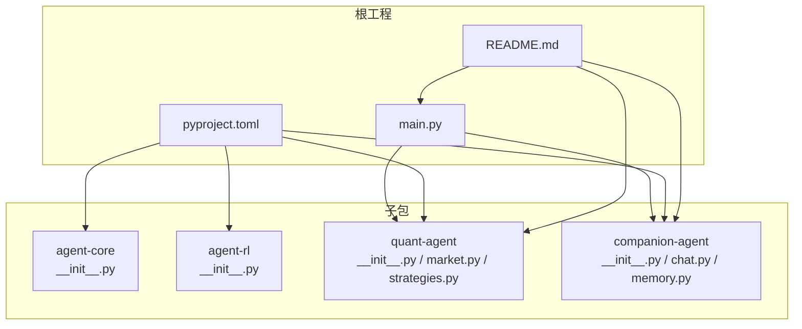
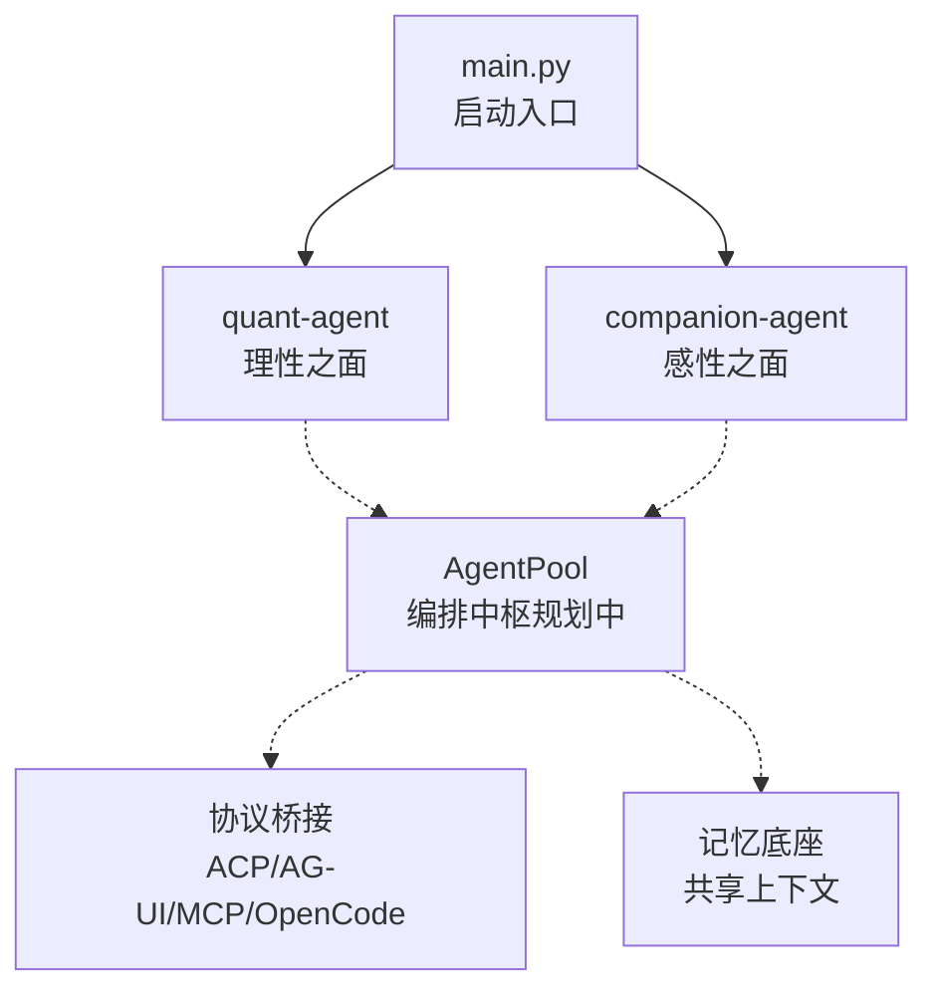
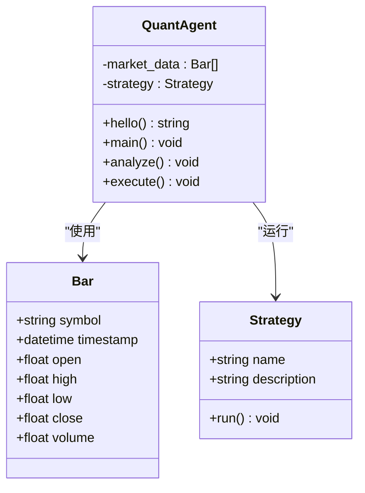
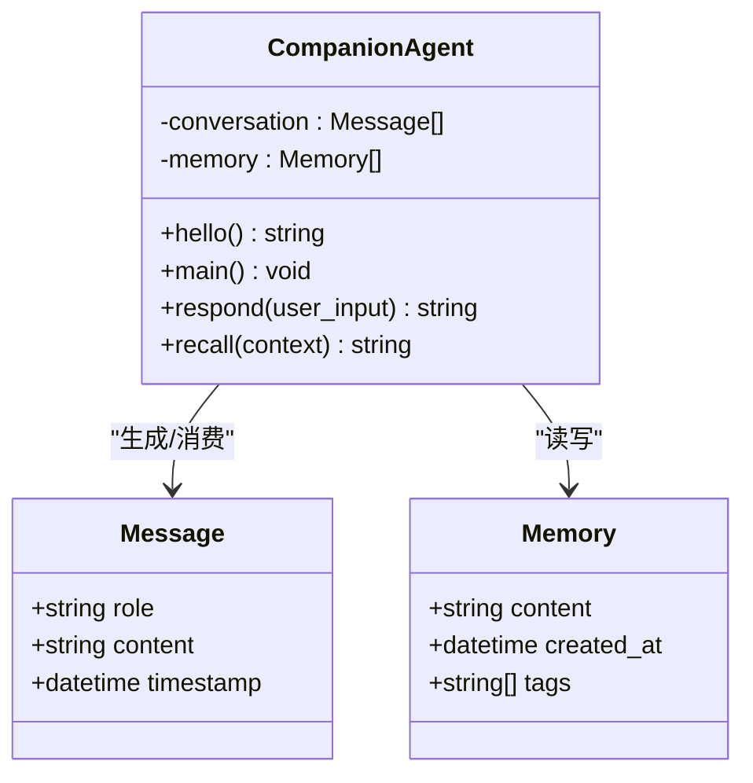
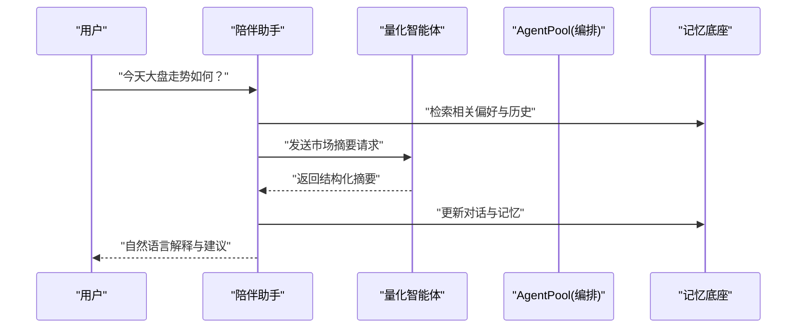
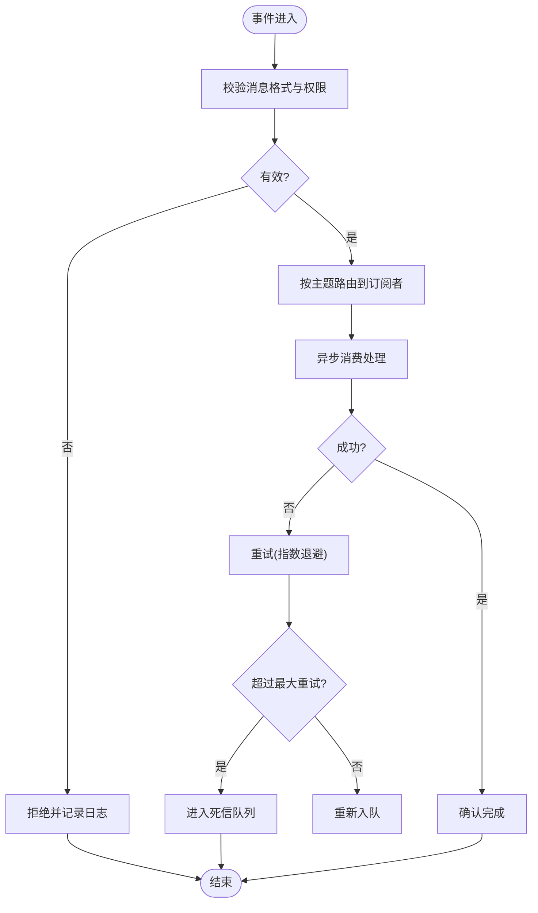
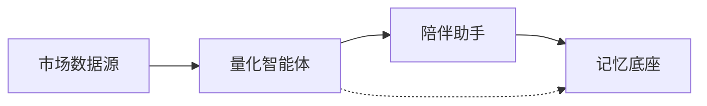
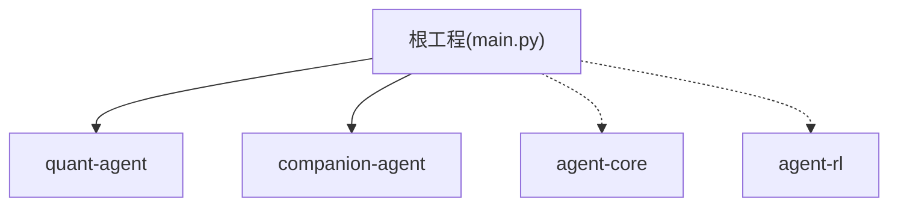

# 多智能体协作架构

<cite>
**本文引用的文件**   
- [main.py](file://main.py)
- [pyproject.toml](file://pyproject.toml)
- [README.md](file://README.md)
- [agent-core/__init__.py](file://packages/agent-core/src/agent_core/__init__.py)
- [quant-agent/__init__.py](file://packages/quant-agent/src/quant_agent/__init__.py)
- [quant-agent/market.py](file://packages/quant-agent/src/quant_agent/market.py)
- [quant-agent/strategies.py](file://packages/quant-agent/src/quant_agent/strategies.py)
- [companion-agent/__init__.py](file://packages/companion-agent/src/companion_agent/__init__.py)
- [companion-agent/chat.py](file://packages/companion-agent/src/companion_agent/chat.py)
- [companion-agent/memory.py](file://packages/companion-agent/src/companion_agent/memory.py)
- [agent-rl/__init__.py](file://packages/agent-rl/src/agent_rl/__init__.py)
</cite>

## 目录
1. [引言](#引言)
2. [项目结构](#项目结构)
3. [核心组件](#核心组件)
4. [架构总览](#架构总览)
5. [详细组件分析](#详细组件分析)
6. [依赖关系分析](#依赖关系分析)
7. [性能考虑](#性能考虑)
8. [故障排查指南](#故障排查指南)
9. [结论](#结论)
10. [附录](#附录)

## 引言
本文件面向“多智能体协作架构”的目标，聚焦于 JanusAgent 中量化交易智能体与陪伴助手之间的协作模式。文档将系统阐述：
- 智能体间的通信协议、消息传递机制与数据共享策略
- 通过 AgentPool 管理多个智能体的生命周期与状态同步（概念性说明）
- 事件驱动的异步消息处理、错误处理与重试机制（概念性设计）
- 自定义智能体交互协议的实现思路与示例路径
- 智能体间依赖关系建模与冲突解决策略

当前仓库处于早期阶段，核心包提供基础抽象与数据结构；编排层（AgentPool）与高级通信机制将在后续迭代中完善。

## 项目结构
JanusAgent 采用工作区组织方式，包含四个子包：
- agent-core：核心抽象层（Agent 内核基类、生命周期、插件接口）
- agentpool：编排中枢（YAML 驱动的多智能体编排，桥接 ACP/AG-UI/MCP/OpenCode 协议）
- quant-agent：量化交易智能体（市场数据、策略定义）
- companion-agent：情感陪伴智能体（对话管理、记忆存储）

图示来源
- [main.py:1-13](file://main.py#L1-L13)
- [pyproject.toml:1-30](file://pyproject.toml#L1-L30)
- [README.md:39-94](file://README.md#L39-L94)

章节来源
- [README.md:39-94](file://README.md#L39-L94)
- [pyproject.toml:1-30](file://pyproject.toml#L1-L30)
- [main.py:1-13](file://main.py#L1-L13)

## 核心组件
本节梳理各子包的职责与关键数据结构，为后续协作机制奠定基础。

- agent-core
  - 角色：提供 Agent 内核抽象、生命周期管理与插件化接口（占位实现）
  - 入口：[agent-core/__init__.py](file://packages/agent-core/src/agent_core/__init__.py)

- agent-rl
  - 角色：强化学习智能体，负责环境交互、策略优化与奖励建模（占位实现）
  - 入口：[agent-rl/__init__.py](file://packages/agent-rl/src/agent_rl/__init__.py)

- quant-agent
  - 角色：量化交易智能体，提供市场数据模型与策略框架
  - 关键模块：
    - 市场数据：[market.py](file://packages/quant-agent/src/quant_agent/market.py)
    - 策略抽象：[strategies.py](file://packages/quant-agent/src/quant_agent/strategies.py)
  - 入口：[quant-agent/__init__.py](file://packages/quant-agent/src/quant_agent/__init__.py)

- companion-agent
  - 角色：情感陪伴智能体，提供对话与记忆的数据模型
  - 关键模块：
    - 对话消息：[chat.py](file://packages/companion-agent/src/companion_agent/chat.py)
    - 记忆条目：[memory.py](file://packages/companion-agent/src/companion_agent/memory.py)
  - 入口：[companion-agent/__init__.py](file://packages/companion-agent/src/companion_agent/__init__.py)

章节来源
- [agent-core/__init__.py:1-3](file://packages/agent-core/src/agent_core/__init__.py#L1-L3)
- [agent-rl/__init__.py:1-15](file://packages/agent-rl/src/agent_rl/__init__.py#L1-L15)
- [quant-agent/__init__.py:1-15](file://packages/quant-agent/src/quant_agent/__init__.py#L1-L15)
- [quant-agent/market.py:1-16](file://packages/quant-agent/src/quant_agent/market.py#L1-L16)
- [quant-agent/strategies.py:1-13](file://packages/quant-agent/src/quant_agent/strategies.py#L1-L13)
- [companion-agent/__init__.py:1-15](file://packages/companion-agent/src/companion_agent/__init__.py#L1-L15)
- [companion-agent/chat.py:1-12](file://packages/companion-agent/src/companion_agent/chat.py#L1-L12)
- [companion-agent/memory.py:1-12](file://packages/companion-agent/src/companion_agent/memory.py#L1-L12)

## 架构总览
JanusAgent 的顶层由 main.py 启动，分别调用量化与陪伴两个智能体的 hello 能力。根据 README 的架构描述，未来将通过 AgentPool 作为编排中枢，统一接入多种协议（ACP/AG-UI/MCP/OpenCode），并共享记忆底座。

图示来源
- [main.py:1-13](file://main.py#L1-L13)
- [README.md:61-84](file://README.md#L61-L84)

章节来源
- [main.py:1-13](file://main.py#L1-L13)
- [README.md:61-84](file://README.md#L61-L84)

## 详细组件分析

### 量化交易智能体（Quant Agent）
- 目标：提供市场数据与策略执行的基础能力，便于与陪伴智能体进行数据交换与协同决策
- 关键数据结构
  - Bar（K线数据）：用于表示时间序列行情
  - Strategy（策略抽象）：定义 run 接口以扩展具体策略
- 建议的协作点
  - 向陪伴智能体输出“可读的市场摘要”，辅助用户理解
  - 接收来自陪伴智能体的“用户偏好/风险承受度”提示，影响策略参数或解释风格

图示来源
- [quant-agent/market.py:1-16](file://packages/quant-agent/src/quant_agent/market.py#L1-L16)
- [quant-agent/strategies.py:1-13](file://packages/quant-agent/src/quant_agent/strategies.py#L1-L13)
- [quant-agent/__init__.py:1-15](file://packages/quant-agent/src/quant_agent/__init__.py#L1-L15)

章节来源
- [quant-agent/market.py:1-16](file://packages/quant-agent/src/quant_agent/market.py#L1-L16)
- [quant-agent/strategies.py:1-13](file://packages/quant-agent/src/quant_agent/strategies.py#L1-L13)
- [quant-agent/__init__.py:1-15](file://packages/quant-agent/src/quant_agent/__init__.py#L1-L15)

### 陪伴助手（Companion Agent）
- 目标：提供对话与记忆能力，构建个性化体验，并在需要时调用量化智能体输出专业信息
- 关键数据结构
  - Message（对话消息）：记录角色、内容与时间戳
  - Memory（记忆条目）：内容、创建时间与标签
- 建议的协作点
  - 将用户的投资问题转化为结构化查询，交由量化智能体处理
  - 将量化结果转换为自然语言解释，结合记忆增强个性化表达

图示来源
- [companion-agent/chat.py:1-12](file://packages/companion-agent/src/companion_agent/chat.py#L1-L12)
- [companion-agent/memory.py:1-12](file://packages/companion-agent/src/companion_agent/memory.py#L1-L12)
- [companion-agent/__init__.py:1-15](file://packages/companion-agent/src/companion_agent/__init__.py#L1-L15)

章节来源
- [companion-agent/chat.py:1-12](file://packages/companion-agent/src/companion_agent/chat.py#L1-L12)
- [companion-agent/memory.py:1-12](file://packages/companion-agent/src/companion_agent/memory.py#L1-L12)
- [companion-agent/__init__.py:1-15](file://packages/companion-agent/src/companion_agent/__init__.py#L1-L15)

### 智能体间通信协议与消息传递机制（设计）
- 协议分层
  - 应用层：领域语义（如“市场摘要”、“风险提示”、“用户偏好”）
  - 传输层：进程内队列/事件总线或跨进程消息通道
  - 序列化层：JSON/Protobuf 等格式
- 消息类型（示例）
  - MarketSummary：{symbol, period, summary}
  - UserPreference：{risk_level, horizon, interests}
  - DecisionRequest：{question, context_id}
  - DecisionResponse：{answer, evidence, confidence}
- 消息路由
  - 基于主题订阅/发布（Topic-based Pub/Sub）
  - 基于请求-响应（RPC-like）
- 数据共享策略
  - 短期共享：内存中的会话上下文（会话级）
  - 长期共享：持久化记忆（用户画像、历史交互、策略偏好）

图示来源
- [README.md:61-84](file://README.md#L61-L84)
- [companion-agent/chat.py:1-12](file://packages/companion-agent/src/companion_agent/chat.py#L1-L12)
- [companion-agent/memory.py:1-12](file://packages/companion-agent/src/companion_agent/memory.py#L1-L12)
- [quant-agent/market.py:1-16](file://packages/quant-agent/src/quant_agent/market.py#L1-L16)

### 事件驱动与异步处理（设计）
- 事件总线
  - 生产者：量化智能体（行情更新、信号触发）、陪伴助手（用户意图识别）
  - 消费者：编排层（路由）、其他智能体（订阅者）
- 异步处理
  - 使用事件循环与任务队列，避免阻塞主流程
- 错误处理与重试
  - 幂等性：确保重复投递不产生副作用
  - 退避策略：指数退避与最大重试次数
  - 死信队列：失败消息归档与人工干预

### 自定义智能体交互协议（示例路径）
- 步骤
  - 定义消息模型（dataclass/Pydantic）
  - 定义协议接口（发送/接收/回调）
  - 在 AgentPool 中注册协议处理器
  - 在智能体中引用协议进行调用
- 参考路径
  - 消息模型：[companion-agent/chat.py](file://packages/companion-agent/src/companion_agent/chat.py)、[companion-agent/memory.py](file://packages/companion-agent/src/companion_agent/memory.py)、[quant-agent/market.py](file://packages/quant-agent/src/quant_agent/market.py)
  - 协议接口：待实现（建议在 agentpool 中新增 protocol.py）
  - 注册与调度：待实现（建议在 agentpool 中新增 dispatcher.py）

章节来源
- [companion-agent/chat.py:1-12](file://packages/companion-agent/src/companion_agent/chat.py#L1-L12)
- [companion-agent/memory.py:1-12](file://packages/companion-agent/src/companion_agent/memory.py#L1-L12)
- [quant-agent/market.py:1-16](file://packages/quant-agent/src/quant_agent/market.py#L1-L16)

### 智能体依赖关系与冲突解决（设计）
- 依赖建模
  - 有向无环图（DAG）：量化智能体依赖市场数据源；陪伴智能体依赖量化智能体输出
  - 版本兼容：通过版本号与兼容性矩阵管理
- 冲突解决
  - 优先级：业务关键路径优先（如风控 > 收益）
  - 仲裁器：当多个智能体对同一资源写入时，采用写时复制与合并策略
  - 一致性：最终一致性为主，强一致仅在必要场景启用

## 依赖关系分析
- 工程依赖
  - 根工程依赖四个子包：agent-core、agent-rl、quant-agent、companion-agent
- 运行时依赖
  - main.py 直接导入 quant-agent 与 companion-agent 的 hello 方法
- 内部耦合
  - 当前量化与陪伴之间尚未显式耦合，通过 AgentPool 与协议桥接解耦

图示来源
- [main.py:1-13](file://main.py#L1-L13)
- [pyproject.toml:1-30](file://pyproject.toml#L1-L30)

章节来源
- [main.py:1-13](file://main.py#L1-L13)
- [pyproject.toml:1-30](file://pyproject.toml#L1-L30)

## 性能考虑
- 异步与并发
  - 使用事件循环与任务队列，避免 I/O 阻塞
  - 批量处理与批大小调优
- 缓存与去重
  - 热点数据缓存（如最近 K 线、热门话题）
  - 消息去重（基于 ID 或指纹）
- 资源隔离
  - 不同智能体使用独立线程/进程池，防止相互干扰
- 可观测性
  - 指标采集（延迟、吞吐、错误率）
  - 链路追踪（跨智能体调用链）

## 故障排查指南
- 常见问题
  - 消息丢失：检查事件总线持久化与重试策略
  - 死锁与竞态：审查共享资源的锁粒度与顺序
  - 超时与降级：设置合理超时与降级逻辑
- 定位手段
  - 日志级别与结构化日志
  - 断点与快照（会话上下文、消息队列状态）
  - 回放与复现（基于死信队列）

## 结论
当前仓库提供了多智能体协作的基础骨架：量化与陪伴两个智能体的数据模型与入口，以及 AgentPool 的架构愿景。下一步应重点完善：
- 在 agentpool 中实现协议桥接与编排调度
- 建立事件总线与异步消息处理机制
- 定义统一的智能体交互协议与消息模型
- 引入记忆底座的共享与一致性策略
- 完善错误处理、重试与可观测性

## 附录
- 快速开始
  - 安装依赖与运行入口参见 README 与 main.py
- 开发规范
  - 代码检查与格式化使用 ruff；测试使用 pytest

章节来源
- [README.md:95-112](file://README.md#L95-L112)
- [main.py:1-13](file://main.py#L1-L13)