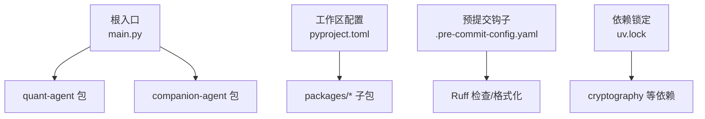
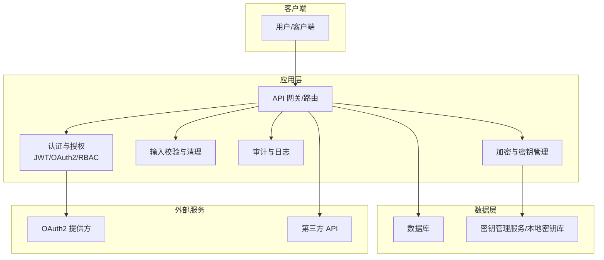
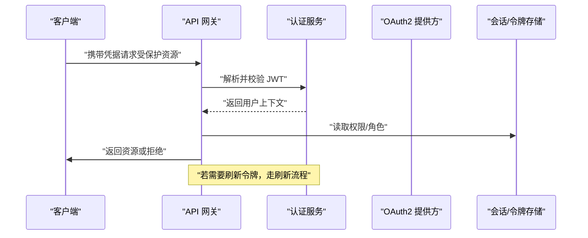
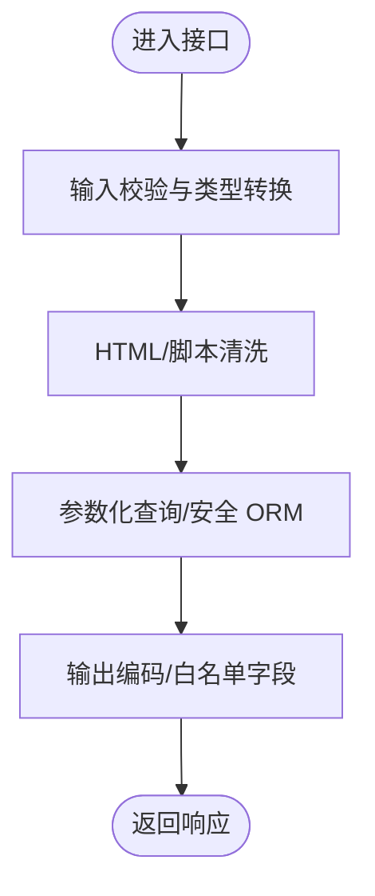
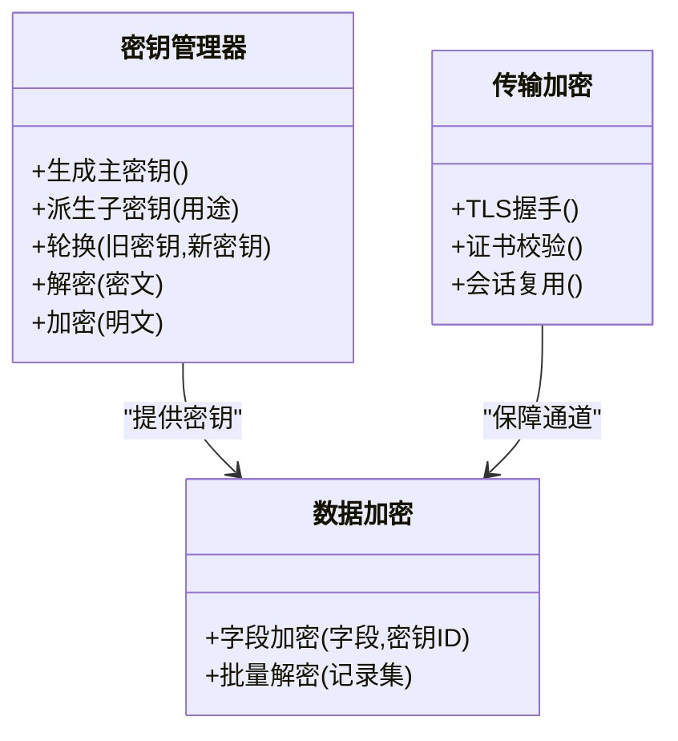
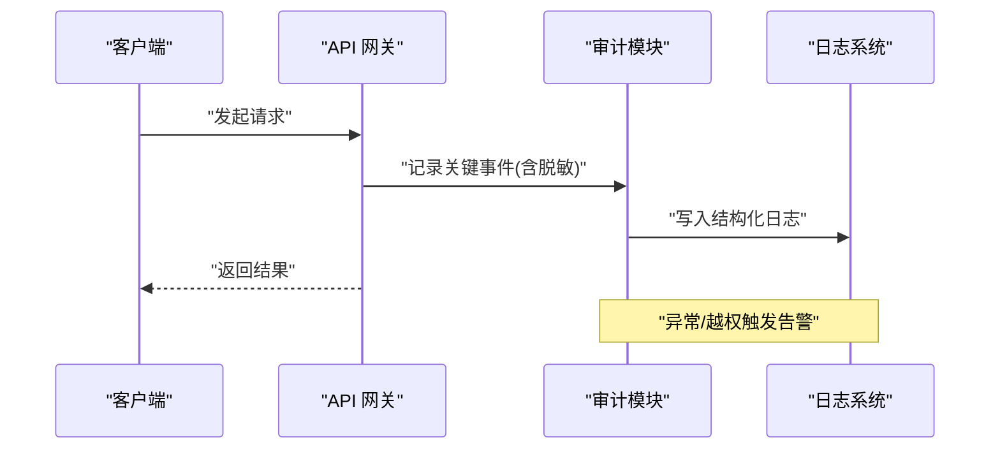
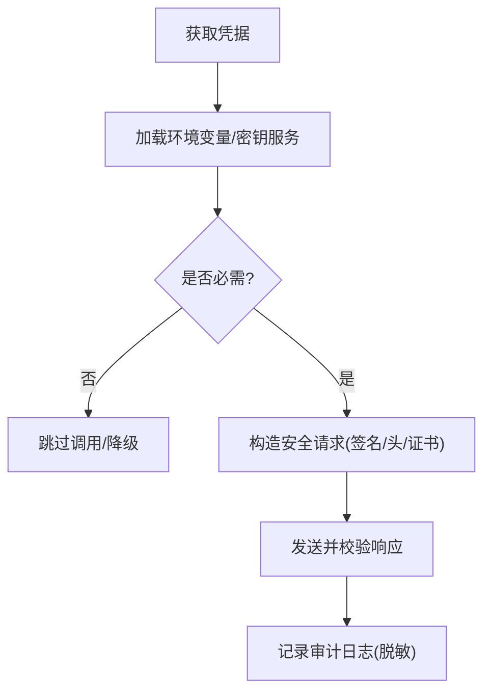
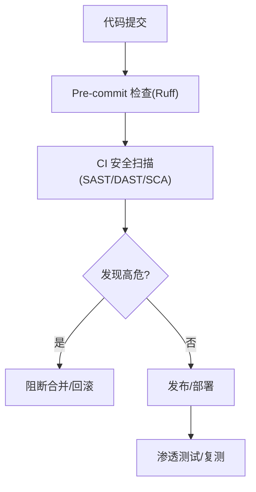
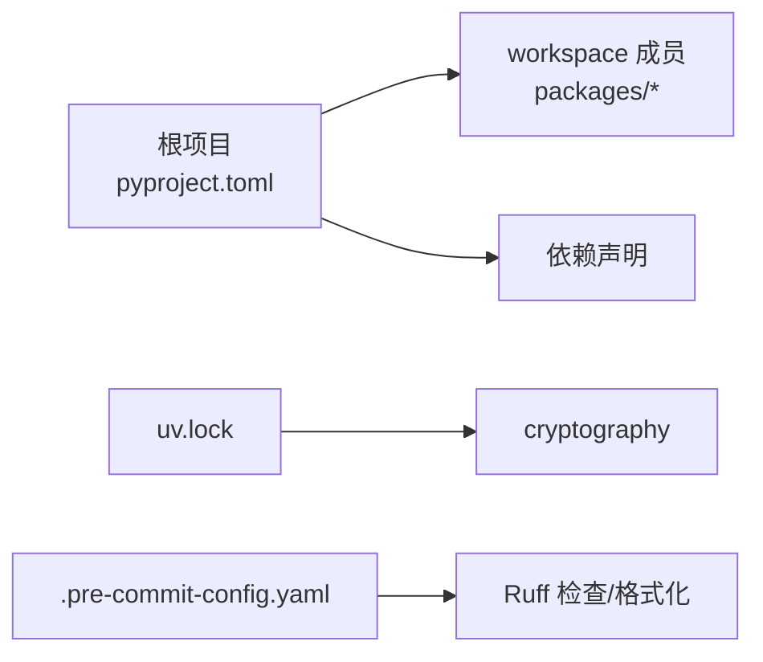

# 安全最佳实践

<cite>
**本文引用的文件**
- [main.py](file://main.py)
- [pyproject.toml](file://pyproject.toml)
- [.pre-commit-config.yaml](file://.pre-commit-config.yaml)
- [uv.lock](file://uv.lock)
- [security-review SKILL.md](file://.agent\skills\security-review\SKILL.md)
- [security-research SKILL.md](file://.agent\skills\security-research\SKILL.md)
- [local-diff-review code-quality-standards.md](file://.agent\skills\local-diff-review\code-quality-standards.md)
- [local-diff-review common-issues-checklist.md](file://.agent\skills\local-diff-review\common-issues-checklist.md)
- [create-skill-file bad-example.md](file://.agent\skills\create-skill-file\examples\bad-example.md)
- [create-agent-skills api-security.md](file://.agent\skills\create-agent-skills\references\api-security.md)
</cite>

## 目录
1. [简介](#简介)
2. [项目结构](#项目结构)
3. [核心组件](#核心组件)
4. [架构总览](#架构总览)
5. [详细组件分析](#详细组件分析)
6. [依赖分析](#依赖分析)
7. [性能考虑](#性能考虑)
8. [故障排查指南](#故障排查指南)
9. [结论](#结论)
10. [附录](#附录)

## 简介
本指南面向 JanusAgent 项目的安全建设，围绕身份认证与授权、API 安全防护、数据加密与密钥管理、安全审计与日志、第三方服务集成安全、以及漏洞扫描与渗透测试等方面，提供可落地的最佳实践。文档同时结合仓库中已有的安全审查技能与工作流规范，形成从开发到交付的全链路安全策略。

## 项目结构
JanusAgent 采用多包工作区组织，根入口 main.py 聚合多个子包能力；构建与质量通过 pre-commit 钩子统一约束；依赖锁定在 uv.lock 中维护。

图表来源
- [main.py:1-13](file://main.py#L1-L13)
- [pyproject.toml:1-30](file://pyproject.toml#L1-L30)
- [.pre-commit-config.yaml:1-18](file://.pre-commit-config.yaml#L1-L18)
- [uv.lock:1161-1189](file://uv.lock#L1161-L1189)

章节来源
- [main.py:1-13](file://main.py#L1-L13)
- [pyproject.toml:1-30](file://pyproject.toml#L1-L30)
- [.pre-commit-config.yaml:1-18](file://.pre-commit-config.yaml#L1-L18)

## 核心组件
- 入口程序：负责初始化并调用各子包的对外能力，便于集中注入安全中间件（如鉴权、审计、限流）。
- 工作区与依赖：通过 pyproject.toml 声明依赖与 workspace 成员，使用 uv.lock 锁定版本，降低供应链风险。
- 代码质量与安全门禁：通过 .pre-commit-config.yaml 集成 Ruff 检查与格式化，可在提交阶段拦截不安全或低质量代码。

章节来源
- [main.py:1-13](file://main.py#L1-L13)
- [pyproject.toml:1-30](file://pyproject.toml#L1-L30)
- [.pre-commit-config.yaml:1-18](file://.pre-commit-config.yaml#L1-L18)

## 架构总览
下图展示应用层、安全控制面与外部服务的交互关系，强调认证、授权、输入校验、加密与审计的贯穿式设计。

[此图为概念性架构图，不直接映射具体源码文件]

## 详细组件分析

### 身份认证与授权
- JWT 令牌管理
  - 建议要点：签发时包含最小必要声明、设置合理过期时间、支持刷新令牌、服务端校验签名与有效期、黑名单/撤销机制（可选）、敏感信息不入 token。
  - 参考实现思路路径：[generate_auth_token 示例路径:226-229](file://.agent\skills\create-skill-file\examples\bad-example.md#L226-L229)
- OAuth2 集成
  - 建议要点：使用授权码模式（PKCE），严格校验 state 与 redirect_uri，验证 ID Token 签名与受众，缓存最小化，失败快速返回。
  - 参考流程路径：[Workload Identity Federation 说明:458-468](file://.agent\skills\claude-api\SKILL.md#L458-L468)
- 细粒度权限控制
  - 建议要点：基于角色的访问控制（RBAC）或基于属性的访问控制（ABAC），接口级与方法级鉴权，资源隔离（按租户/用户），最小权限原则。
  - 参考实现思路路径：[权限校验与字段过滤示例路径:65-95](file://.agent\skills\local-diff-review\code-quality-standards.md#L65-L95)

[此图为概念性序列图，不直接映射具体源码文件]

章节来源
- [create-skill-file bad-example.md:226-229](file://.agent\skills\create-skill-file\examples\bad-example.md#L226-L229)
- [local-diff-review code-quality-standards.md:65-95](file://.agent\skills\local-diff-review\code-quality-standards.md#L65-L95)
- [claude-api SKILL.md:458-468](file://.agent\skills\claude-api\SKILL.md#L458-L468)

### API 安全防护
- 输入验证与清理
  - 建议要点：白名单校验、长度/格式限制、类型转换、HTML/脚本清洗、禁止危险函数执行。
  - 参考清单路径：[注入防护与 XSS 检查清单:97-124](file://.agent\skills\local-diff-review\code-quality-standards.md#L97-L124)
- SQL/NoSQL 注入防护
  - 建议要点：参数化查询、ORM 安全用法、限制查询操作符、对动态条件进行严格白名单。
  - 参考修复路径：[NoSQL 注入修复示例路径:504-536](file://.agent\skills\local-diff-review\common-issues-checklist.md#L504-L536)
- CSRF 防护
  - 建议要点：同源策略、SameSite Cookie、双重提交 Cookie、自定义 Header 校验、状态变更接口强制重放保护。
- 输出编码与内容类型
  - 建议要点：明确 Content-Type、避免自动渲染不受信 HTML、前端启用 CSP。

[此图为概念性流程图，不直接映射具体源码文件]

章节来源
- [local-diff-review code-quality-standards.md:97-124](file://.agent\skills\local-diff-review\code-quality-standards.md#L97-L124)
- [local-diff-review common-issues-checklist.md:504-536](file://.agent\skills\local-diff-review\common-issues-checklist.md#L504-L536)

### 数据加密与密钥管理
- 传输层加密
  - 建议要点：全站 HTTPS、强制 TLS 1.2+、禁用弱套件、HSTS、证书自动续期。
- 静态数据加密
  - 建议要点：字段级/表级加密、KMS 托管主密钥、定期轮换、最小可见范围。
- 密钥管理策略
  - 建议要点：环境变量/密钥管理服务、禁止硬编码、最小权限、审计访问、泄露应急流程。
- 依赖中的加密能力
  - 参考依赖路径：[cryptography 依赖锁定:1161-1189](file://uv.lock#L1161-L1189)

[此图为概念性类图，不直接映射具体源码文件]

章节来源
- [uv.lock:1161-1189](file://uv.lock#L1161-L1189)

### 安全审计与日志记录
- 用户行为审计
  - 建议要点：登录/登出、授权变更、关键数据读写、越权尝试、异常事件。
- 操作日志记录
  - 建议要点：结构化日志、关联请求 ID、脱敏敏感字段、保留周期与归档。
- 异常访问检测
  - 建议要点：阈值告警、IP/UA 画像、暴力破解检测、慢查询与错误率监控。
- 安全研究/审查流程
  - 参考流程路径：[安全研究团队分工与规则:21-49](file://.agent\skills\security-research\SKILL.md#L21-L49)、[安全审查团队模式:1-49](file://.agent\skills\security-review\SKILL.md#L1-L49)

[此图为概念性序列图，不直接映射具体源码文件]

章节来源
- [security-research SKILL.md:21-49](file://.agent\skills\security-research\SKILL.md#L21-L49)
- [security-review SKILL.md:1-49](file://.agent\skills\security-review\SKILL.md#L1-L49)

### 第三方服务集成安全
- API 密钥管理
  - 建议要点：集中存放、按需加载、最小权限、轮换与失效处理、不在日志/聊天中暴露。
  - 参考实践路径：[API 安全封装与配置文件:1-227](file://.agent\skills\create-agent-skills\references\api-security.md#L1-L227)
- 回调地址验证
  - 建议要点：白名单 redirect_uri、严格匹配 scheme/host/path、state 防重放。
- 服务间通信安全
  - 建议要点：mTLS、内部网络隔离、签名/摘要校验、超时与重试上限。

[此图为概念性流程图，不直接映射具体源码文件]

章节来源
- [create-agent-skills api-security.md:1-227](file://.agent\skills\create-agent-skills\references\api-security.md#L1-L227)

### 安全漏洞扫描与渗透测试
- 静态/动态/依赖扫描
  - 建议要点：SAST/DAST/SCA 流水线集成、阻断高危、基线阈值、报告闭环。
- 威胁建模与攻击面梳理
  - 建议要点：识别信任边界、数据流、外部依赖、特权操作。
- 渗透测试
  - 建议要点：红蓝对抗、PoC 验证、影响评估、修复回归测试。
- 安全研究/审查工具链
  - 参考流程路径：[安全研究评分标准与团队分工:21-49](file://.agent\skills\security-research\SKILL.md#L21-L49)、[安全审查团队模式:1-49](file://.agent\skills\security-review\SKILL.md#L1-L49)

图表来源
- [.pre-commit-config.yaml:1-18](file://.pre-commit-config.yaml#L1-L18)

章节来源
- [.pre-commit-config.yaml:1-18](file://.pre-commit-config.yaml#L1-L18)
- [security-research SKILL.md:21-49](file://.agent\skills\security-research\SKILL.md#L21-L49)
- [security-review SKILL.md:1-49](file://.agent\skills\security-review\SKILL.md#L1-L49)

## 依赖分析
- 工作区与依赖
  - 通过 pyproject.toml 声明 workspace 成员与依赖，确保所有子包一致管理。
- 安全相关依赖
  - cryptography 作为底层加密能力被广泛使用，建议在 uv.lock 中固定版本并定期更新以修复已知漏洞。
- 质量门禁
  - pre-commit 集成 Ruff 检查与格式化，有助于在早期发现潜在问题。

图表来源
- [pyproject.toml:1-30](file://pyproject.toml#L1-L30)
- [uv.lock:1161-1189](file://uv.lock#L1161-L1189)
- [.pre-commit-config.yaml:1-18](file://.pre-commit-config.yaml#L1-L18)

章节来源
- [pyproject.toml:1-30](file://pyproject.toml#L1-L30)
- [uv.lock:1161-1189](file://uv.lock#L1161-L1189)
- [.pre-commit-config.yaml:1-18](file://.pre-commit-config.yaml#L1-L18)

## 性能考虑
- 认证与授权
  - 缓存用户角色/权限、减少跨域/跨进程调用、异步校验。
- 加密与解密
  - 使用硬件加速（AES-NI）、批量处理、合理选择算法与密钥长度、避免冷路径频繁加解密。
- 日志与审计
  - 异步写入、采样与分级、脱敏前置，避免阻塞主流程。
- 外部服务
  - 连接池、超时与重试退避、熔断与降级。

[本节为通用指导，不直接分析具体文件]

## 故障排查指南
- 常见问题定位
  - 环境配置缺失/未校验：参考环境变量校验与默认值处理路径。
  - 敏感信息泄露：参考日志脱敏与字段过滤路径。
  - 注入与 XSS：参考注入防护与清洗清单路径。
- 调试与证据收集
  - 分层诊断、数据流追踪、最小可复现案例。
- 参考路径
  - [环境变量与配置校验:729-802](file://.agent\skills\local-diff-review\common-issues-checklist.md#L729-L802)
  - [敏感信息保护与日志脱敏:126-162](file://.agent\skills\local-diff-review\code-quality-standards.md#L126-L162)
  - [注入与 XSS 修复:504-589](file://.agent\skills\local-diff-review\common-issues-checklist.md#L504-L589)

章节来源
- [local-diff-review common-issues-checklist.md:729-802](file://.agent\skills\local-diff-review\common-issues-checklist.md#L729-L802)
- [local-diff-review code-quality-standards.md:126-162](file://.agent\skills\local-diff-review\code-quality-standards.md#L126-L162)
- [local-diff-review common-issues-checklist.md:504-589](file://.agent\skills\local-diff-review\common-issues-checklist.md#L504-L589)

## 结论
通过在入口集中注入安全能力、在工作区层面统一依赖与质量门禁、在开发侧落实输入校验与敏感信息保护、在生产侧强化加密与审计、并以安全研究与渗透测试持续改进，JanusAgent 可构建覆盖全生命周期的安全体系。建议将本指南纳入团队规范与 CI 流程，持续演进。

[本节为总结性内容，不直接分析具体文件]

## 附录
- 术语
  - JWT：JSON Web Token，用于无状态身份认证。
  - OAuth2：开放授权协议，常用于第三方登录与授权。
  - RBAC/ABAC：基于角色/属性的访问控制模型。
  - SAST/DAST/SCA：静态/动态/软件成分分析。
- 参考清单
  - OWASP ASVS/WSTG、CVSS v4.0、CWE 分类。
  - 参考路径：[安全研究评分与规则:21-49](file://.agent\skills\security-research\SKILL.md#L21-L49)、[安全审查团队模式:1-49](file://.agent\skills\security-review\SKILL.md#L1-L49)

[本节为补充信息，不直接分析具体文件]