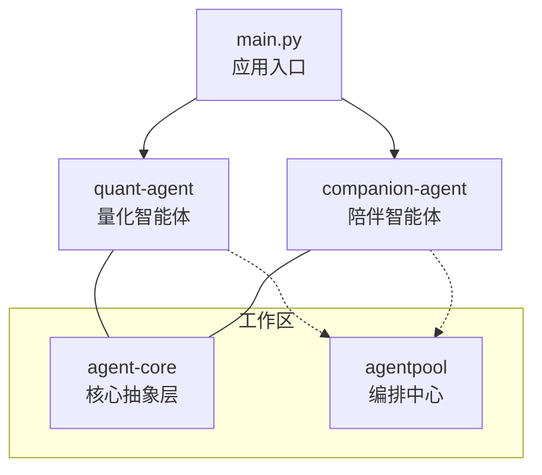
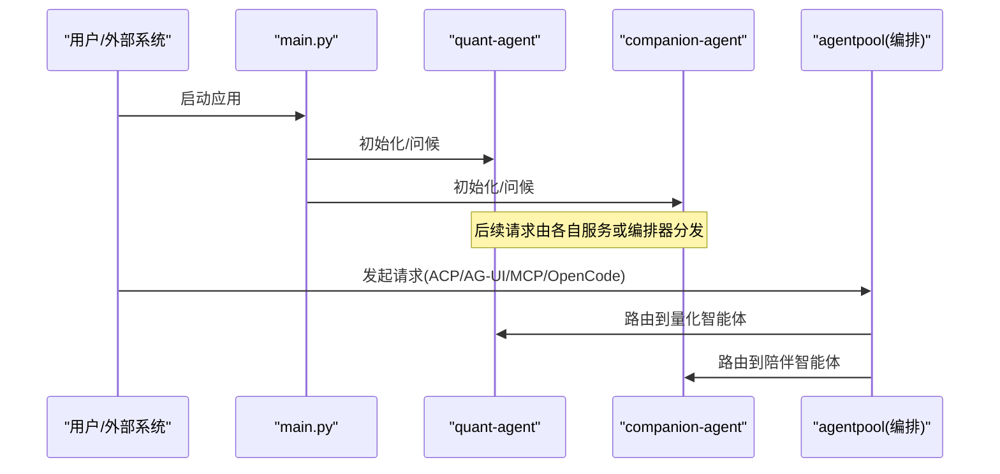
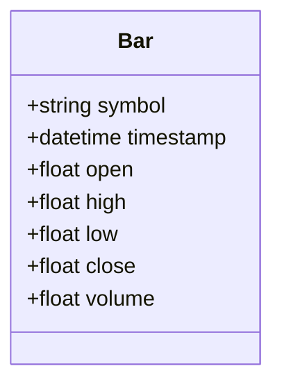
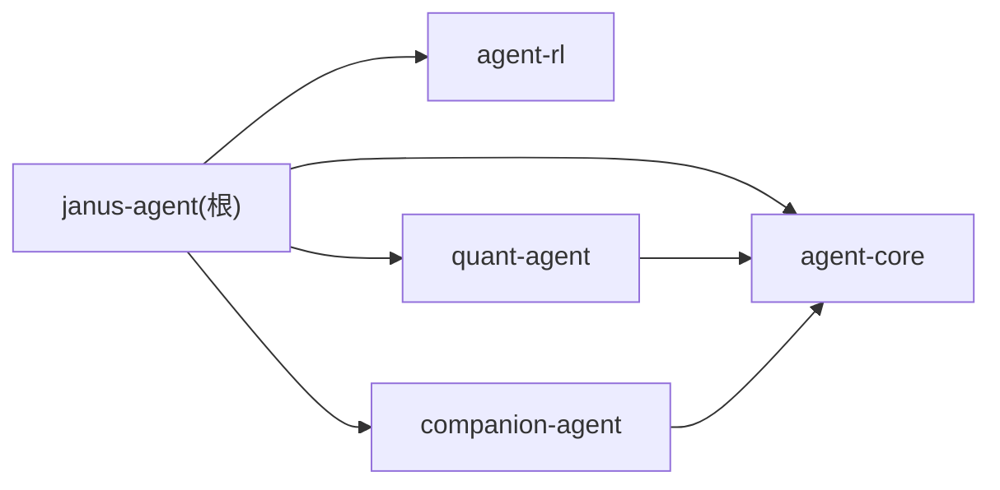

# 性能优化策略

<cite>
**本文引用的文件**   
- [main.py](file://main.py)
- [pyproject.toml](file://pyproject.toml)
- [uv.lock](file://uv.lock)
- [agent-core README.md](file://packages/agent-core/README.md)
- [AGENT.md](file://.agent/AGENT.md)
- [项目上下文 project.md](file://.agent/context/project.md)
- [agent-core __init__.py](file://packages/agent-core/src/agent_core/__init__.py)
- [quant-agent __init__.py](file://packages/quant-agent/src/quant_agent/__init__.py)
- [companion-agent __init__.py](file://packages/companion-agent/src/companion_agent/__init__.py)
- [quant-agent market.py](file://packages/quant-agent/src/quant_agent/market.py)
</cite>

## 目录
1. [简介](#简介)
2. [项目结构](#项目结构)
3. [核心组件](#核心组件)
4. [架构总览](#架构总览)
5. [详细组件分析](#详细组件分析)
6. [依赖分析](#依赖分析)
7. [性能考虑](#性能考虑)
8. [故障排查指南](#故障排查指南)
9. [结论](#结论)
10. [附录](#附录)

## 简介
本指南面向 JanusAgent 的性能优化，围绕缓存策略、异步处理、数据库与连接池、监控指标、压测与瓶颈定位等主题，提供可落地的最佳实践与实施路径。当前仓库处于早期阶段，核心模块以轻量骨架为主，但已具备多包工作区与双智能体（量化与陪伴）的清晰分层，为后续引入高性能能力提供了良好基础。

## 项目结构
JanusAgent 采用 uv 工作区组织多个子包：
- agent-core：核心抽象层与生命周期管理
- quant-agent：量化交易智能体（市场数据、策略、回测与执行）
- companion-agent：对话与记忆的智能体
- agentpool：统一编排中心（ACP/AG-UI/MCP/OpenCode）
- main.py：框架入口，协调两个智能体

图表来源
- [main.py:1-12](file://main.py#L1-L12)
- [项目上下文 project.md:52-75](file://.agent/context/project.md#L52-L75)

章节来源
- [pyproject.toml:1-30](file://pyproject.toml#L1-L30)
- [uv.lock:2158-2195](file://uv.lock#L2158-L2195)
- [项目上下文 project.md:52-75](file://.agent/context/project.md#L52-L75)

## 核心组件
- 应用入口 main.py：负责初始化并调用各智能体的 hello/main 方法，作为整体编排的起点。
- quant-agent：提供量化领域能力（市场数据模型、策略与执行），是 CPU/IO 密集型场景的重点优化对象。
- companion-agent：提供对话与记忆能力，适合引入多级缓存与异步并发以提升交互体验。
- agent-core：定义 Agent 内核基类、生命周期管理与插件接口，是性能优化的通用承载层。

章节来源
- [main.py:1-12](file://main.py#L1-L12)
- [agent-core README.md:1-16](file://packages/agent-core/README.md#L1-L16)
- [quant-agent __init__.py:1-15](file://packages/quant-agent/src/quant_agent/__init__.py#L1-L15)
- [companion-agent __init__.py:1-15](file://packages/companion-agent/src/companion_agent/__init__.py#L1-L15)

## 架构总览
从运行期视角，main.py 启动后分别加载 quant-agent 与 companion-agent；两者基于 agent-core 提供的抽象进行扩展，并通过 agentpool 对接多种协议（ACP/AG-UI/MCP/OpenCode）。在性能层面，建议将“计算密集”和“IO 密集”两类负载解耦，分别通过内存缓存、任务队列与连接池进行优化。

图表来源
- [main.py:1-12](file://main.py#L1-L12)
- [项目上下文 project.md:52-75](file://.agent/context/project.md#L52-L75)

## 详细组件分析

### 量化智能体（quant-agent）
- 职责：市场数据建模、策略计算、回测与执行。典型热点包括行情聚合、指标计算、批量回测与订单执行。
- 数据结构：Bar 数据类用于表示 K 线数据，便于向量化与批处理。
- 优化方向：
  - 计算侧：使用向量化库（如 NumPy/Pandas）替代逐条循环；对高频指标做增量更新与滑动窗口缓存。
  - IO 侧：行情拉取与历史数据读取采用连接池与分页/游标式批量读取；对外部 API 增加重试与退避。
  - 存储侧：热数据入内存缓存（LRU/TTL），冷数据归档至列存或时序数据库。

图表来源
- [quant-agent market.py:1-16](file://packages/quant-agent/src/quant_agent/market.py#L1-L16)

章节来源
- [quant-agent market.py:1-16](file://packages/quant-agent/src/quant_agent/market.py#L1-L16)

### 陪伴智能体（companion-agent）
- 职责：对话、记忆、共情。典型热点为长上下文检索、向量相似度搜索与个性化记忆存取。
- 优化方向：
  - 多级缓存：会话级 L1（进程内字典）、节点级 L2（Redis/本地磁盘）、持久化 L3（向量库/关系库）。
  - 失效策略：按 TTL、访问频率与变更事件触发失效；对热点键设置短 TTL，低频键长 TTL。
  - 并发与队列：对话生成走异步任务队列，避免阻塞主线程；大模型推理与检索并行化。

章节来源
- [companion-agent __init__.py:1-15](file://packages/companion-agent/src/companion_agent/__init__.py#L1-L15)

### 核心抽象层（agent-core）
- 职责：Agent 内核基类、生命周期管理、插件化接口。
- 优化方向：
  - 生命周期钩子中注入监控埋点（开始/结束、错误计数、耗时）。
  - 资源池化：数据库连接、HTTP 客户端、线程/协程池在初始化阶段创建并复用。
  - 插件隔离：不同插件使用独立资源池与限流策略，避免相互影响。

章节来源
- [agent-core README.md:1-16](file://packages/agent-core/README.md#L1-L16)
- [agent-core __init__.py:1-3](file://packages/agent-core/src/agent_core/__init__.py#L1-L3)

## 依赖分析
- 顶层依赖声明位于 pyproject.toml，工作区成员包含 packages/*。
- uv.lock 记录了工作区包的元数据与开发依赖版本范围。
- 运行时入口 main.py 仅依赖 quant-agent 与 companion-agent，耦合度低，有利于分模块压测与隔离优化。

图表来源
- [pyproject.toml:1-30](file://pyproject.toml#L1-L30)
- [uv.lock:2158-2195](file://uv.lock#L2158-L2195)

章节来源
- [pyproject.toml:1-30](file://pyproject.toml#L1-L30)
- [uv.lock:2158-2195](file://uv.lock#L2158-L2195)

## 性能考虑

### 缓存策略（多级缓存设计、失效与内存管理）
- 多级缓存
  - L1：进程内字典/单例缓存，适用于会话级或短时热点数据（TTL 秒级）。
  - L2：分布式缓存（如 Redis），跨实例共享，适用于跨会话热点与短期持久化。
  - L3：持久化存储（向量库/关系库/时序库），用于长期记忆与离线分析。
- 失效策略
  - TTL 过期：根据数据新鲜度设定不同 TTL。
  - 写扩散：数据更新时主动删除相关缓存键。
  - 懒加载+回源：读不到再回源并回填缓存。
  - 热点保护：对高 QPS 键设置更短 TTL 与防击穿锁。
- 内存管理
  - 容量上限与淘汰策略（LRU/LFU）。
  - 序列化体积控制，避免大对象常驻内存。
  - 定期巡检与统计命中率、淘汰率、内存占用。

[本节为通用指导，不直接分析具体文件]

### 异步处理优化（并发、任务队列、资源池化）
- 并发请求处理
  - 使用协程/线程池并发拉取外部数据，限制最大并发数以避免下游过载。
  - 对慢接口设置超时与熔断降级。
- 任务队列管理
  - 将耗时任务（回测、批量导入、索引构建）放入队列，消费者水平扩展。
  - 任务幂等与重试机制，失败告警与死信队列。
- 资源池化
  - 数据库连接池、HTTP 客户端池、向量检索客户端池。
  - 池大小依据 CPU/IO 特性与下游容量调优。

[本节为通用指导，不直接分析具体文件]

### 数据库查询优化、连接池配置与批量操作
- 查询优化
  - 避免 N+1 查询，使用 JOIN 或批量 IN 查询。
  - 只选择必要字段，合理使用分页与游标。
  - 利用索引覆盖与复合索引减少回表。
- 连接池配置
  - 初始大小、最小/最大连接数、空闲回收时间、获取超时。
  - 针对读写分离与只读副本进行池拆分。
- 批量操作
  - 使用 bulkWrite/batch insert 降低往返开销。
  - 事务边界合理划分，避免长事务。

[本节为通用指导，不直接分析具体文件]

### 监控指标定义与收集
- 关键指标
  - 响应时间：P50/P90/P99、平均、最大值。
  - 吞吐量：QPS、RPS、消息吞吐。
  - 错误率：5xx、超时、重试、熔断比例。
  - 资源：CPU、内存、GC/分配、连接池等待、队列积压。
  - 业务：缓存命中率、回源率、任务成功率、延迟分布。
- 采集方式
  - 应用埋点（开始/结束、异常、耗时直方图）。
  - 中间件/网关层指标（接入层延迟、错误码分布）。
  - 基础设施指标（容器/主机/数据库/缓存）。
  - 日志结构化输出，关联 TraceID。

[本节为通用指导，不直接分析具体文件]

### 压力测试方法与工具、瓶颈识别与调优
- 压测方法
  - 基准场景：单端点/端到端混合场景，逐步提升并发与负载。
  - 稳定性测试：长时间运行观察抖动与泄漏。
  - 混沌工程：注入延迟/错误验证弹性。
- 常用工具
  - HTTP/消息：wrk、locust、k6、JMeter。
  - 数据库：sysbench、pgbench、自定义脚本。
  - 语言级：cProfile、py-spy、memory_profiler。
- 瓶颈识别
  - 火焰图定位热点函数；链路追踪定位慢步骤。
  - 对比不同池大小/并发度的吞吐与延迟曲线。
  - 关注尾部延迟与抖动，结合缓存命中率与回源率分析。
- 调优过程
  - 先软后硬：参数调优→算法/数据结构优化→架构调整。
  - 小步快跑：每次变更单一变量，记录回归情况。
  - 灰度发布：线上 A/B 验证收益与风险。

[本节为通用指导，不直接分析具体文件]

### 基准测试结果与实际部署案例（模板）
- 基准结果记录项
  - 场景描述、数据集规模、并发度、硬件规格、关键参数。
  - 指标：P50/P90/P99 延迟、QPS、错误率、CPU/内存、缓存命中率。
  - 前后对比与结论。
- 部署案例要点
  - 环境：容器/裸机、副本数、资源配额。
  - 配置：连接池大小、队列深度、缓存 TTL/容量。
  - 观测：SLO 达成情况、告警阈值、回滚预案。

[本节为通用指导，不直接分析具体文件]

## 故障排查指南
- 常见问题
  - 缓存穿透/击穿/雪崩：加空值缓存、互斥锁、随机 TTL。
  - 连接池耗尽：检查泄漏、增大池上限、缩短超时。
  - 任务堆积：扩容消费者、优化消费逻辑、限速与背压。
  - 尾部延迟：热点键倾斜、锁竞争、GC 停顿。
- 诊断手段
  - 开启详细日志与 Trace，定位慢路径。
  - 查看队列积压与消费者健康状态。
  - 监控连接池等待时间与拒绝率。
  - 使用采样与火焰图定位热点。

[本节为通用指导，不直接分析具体文件]

## 结论
JanusAgent 的多包结构与清晰的职责划分，为引入高性能能力提供了良好基础。建议优先落地“监控与可观测性”，在此基础上推进“缓存与异步化”、“连接池与批量 IO”、“压测与持续调优”的闭环，逐步提升系统的吞吐与稳定性。

[本节为总结性内容，不直接分析具体文件]

## 附录
- 参考文档
  - AGENT.md：项目概览与双智能体说明
  - 项目上下文 project.md：架构图与编排中心说明
  - agent-core README.md：核心抽象层说明

章节来源
- [AGENT.md:1-18](file://.agent/AGENT.md#L1-L18)
- [项目上下文 project.md:52-75](file://.agent/context/project.md#L52-L75)
- [agent-core README.md:1-16](file://packages/agent-core/README.md#L1-L16)