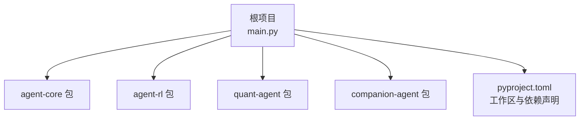
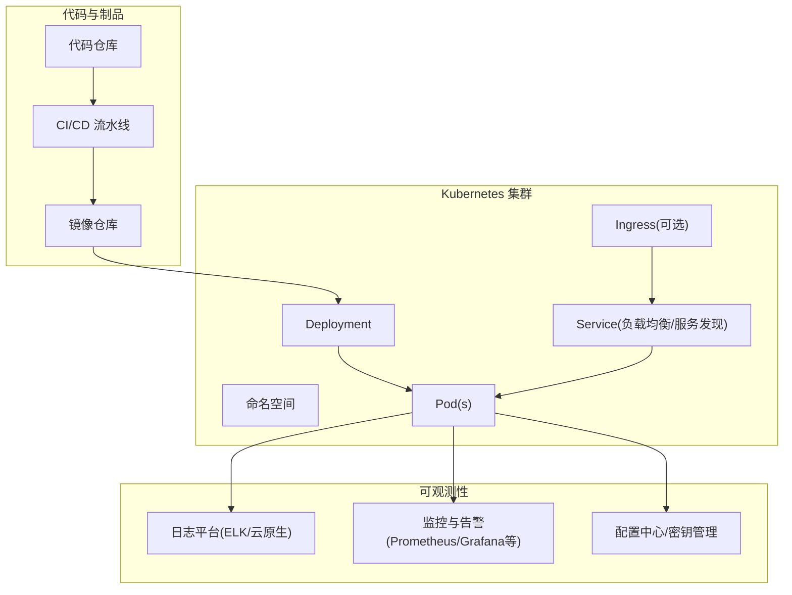
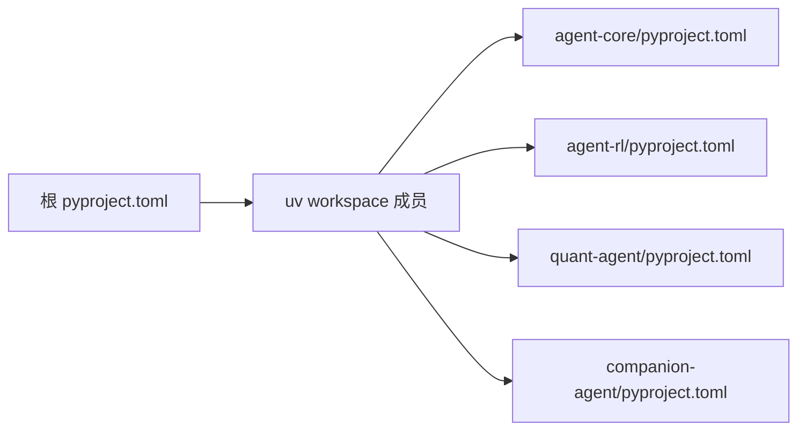
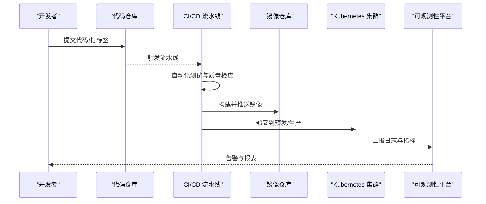

# 生产环境部署

<cite>
**本文引用的文件**   
- [main.py](file://main.py)
- [pyproject.toml](file://pyproject.toml)
- [agent-core/pyproject.toml](file://packages/agent-core/pyproject.toml)
- [agent-rl/pyproject.toml](file://packages/agent-rl/pyproject.toml)
- [quant-agent/pyproject.toml](file://packages/quant-agent/pyproject.toml)
- [companion-agent/pyproject.toml](file://packages/companion-agent/pyproject.toml)
</cite>

## 目录
1. [简介](#简介)
2. [项目结构](#项目结构)
3. [核心组件](#核心组件)
4. [架构总览](#架构总览)
5. [详细组件分析](#详细组件分析)
6. [依赖分析](#依赖分析)
7. [性能考虑](#性能考虑)
8. [故障排查指南](#故障排查指南)
9. [结论](#结论)
10. [附录](#附录)

## 简介
本指南面向生产环境，提供从容器化构建到Kubernetes集群部署、CI/CD流水线、配置与密钥管理、日志收集与分析、监控告警的端到端实践。结合当前仓库的Python多包工作区与入口脚本，给出可落地的镜像构建策略、资源编排模板与运维建议，帮助团队以最小成本实现稳定、可观测、可扩展的生产部署。

## 项目结构
仓库采用Python多包工作区组织，根项目聚合多个子包（agent-core、agent-rl、quant-agent、companion-agent），并通过uv进行依赖与工作区管理。应用入口位于根目录的启动脚本，负责加载并调用各子包的模块能力。

图示来源
- [main.py:1-13](file://main.py#L1-L13)
- [pyproject.toml:1-30](file://pyproject.toml#L1-L30)

章节来源
- [main.py:1-13](file://main.py#L1-L13)
- [pyproject.toml:1-30](file://pyproject.toml#L1-L30)

## 核心组件
- 应用入口：根入口脚本负责初始化并调用各子包提供的能力，便于统一进程管理与生命周期控制。
- 子包职责：
  - agent-core：核心抽象层，定义Agent内核、生命周期与插件接口。
  - agent-rl：强化学习智能体能力。
  - quant-agent：量化交易智能体能力。
  - companion-agent：情感陪伴智能体能力。
- 构建与依赖：使用uv工作区统一管理成员包与依赖，各子包通过pyproject.toml声明脚本入口与构建后端。

章节来源
- [main.py:1-13](file://main.py#L1-L13)
- [agent-core/pyproject.toml:1-18](file://packages/agent-core/pyproject.toml#L1-L18)
- [agent-rl/pyproject.toml:1-17](file://packages/agent-rl/pyproject.toml#L1-L17)
- [quant-agent/pyproject.toml:1-18](file://packages/quant-agent/pyproject.toml#L1-L18)
- [companion-agent/pyproject.toml:1-18](file://packages/companion-agent/pyproject.toml#L1-L18)

## 架构总览
下图展示生产环境的高层架构：代码仓库经CI/CD流水线完成测试、质量检查与镜像构建；镜像推送至镜像仓库后由Kubernetes拉取并调度运行；运行时通过环境变量与配置中心注入配置，通过Service暴露服务发现与负载均衡；日志与指标分别采集到日志平台与监控系统，形成闭环的可观测体系。

[此图为概念性架构图，不直接映射具体源码文件]

## 详细组件分析

### 容器化与镜像构建
- 基础镜像选择：优先使用官方精简版Python镜像或安全加固的基础镜像，固定版本标签，避免latest。
- 多阶段构建优化：
  - 构建阶段：安装构建工具与依赖，生成只读产物。
  - 运行阶段：仅拷贝必要二进制与依赖，减小镜像体积，降低攻击面。
- 依赖缓存：利用Docker层缓存机制，将依赖安装与业务代码分离，提升增量构建速度。
- 安全扫描：在CI中集成镜像漏洞扫描，阻断高危漏洞制品进入生产。
- 非root运行：为镜像创建专用用户并以非root身份运行，遵循最小权限原则。
- 健康检查：在镜像中暴露健康检查端点或命令，供Kubernetes探针使用。

章节来源
- [pyproject.toml:1-30](file://pyproject.toml#L1-L30)
- [agent-core/pyproject.toml:1-18](file://packages/agent-core/pyproject.toml#L1-L18)
- [agent-rl/pyproject.toml:1-17](file://packages/agent-rl/pyproject.toml#L1-L17)
- [quant-agent/pyproject.toml:1-18](file://packages/quant-agent/pyproject.toml#L1-L18)
- [companion-agent/pyproject.toml:1-18](file://packages/companion-agent/pyproject.toml#L1-L18)

### Kubernetes集群部署
- Deployment：定义副本数、资源请求与限制、滚动更新策略、重启策略与探针。
- Service：ClusterIP类型用于内部服务发现与负载均衡；如需外部访问，配合Ingress或LoadBalancer。
- Pod资源配置：根据CPU/内存需求设置requests与limits，预留缓冲应对突发流量。
- 滚动更新与回滚：启用滚动更新策略，保留历史版本以便快速回滚。
- 存储与持久化：如有状态数据，使用PVC挂载持久卷。
- 网络与DNS：通过Service名称进行跨Pod通信，确保命名空间隔离。

章节来源
- [main.py:1-13](file://main.py#L1-L13)

### CI/CD流水线
- 触发条件：基于分支与标签事件触发，如main分支合并与v*标签。
- 自动化测试：执行单元测试、集成测试，产出覆盖率报告。
- 代码质量检查：静态检查、格式校验、依赖安全扫描。
- 镜像构建与推送：构建多架构镜像并推送到镜像仓库，附带镜像签名与元数据。
- 部署发布：先部署到预发环境验证，再灰度/全量发布到生产，支持一键回滚。
- 制品归档：保存测试报告、覆盖率、镜像清单与变更日志。

[本节为通用流程说明，未直接分析具体源码文件]

### 环境变量管理、配置中心与密钥管理
- 环境变量：区分开发、预发、生产环境，使用Kubernetes Secret或配置中心注入敏感信息。
- 配置中心：集中化管理非敏感配置，支持热更新与版本回溯。
- 密钥管理：使用Secrets或外部密钥管理服务，避免硬编码；在镜像中不存放任何密钥。
- 配置优先级：默认配置 < 配置文件 < 环境变量 < 配置中心 < 运行时参数。

[本节为通用最佳实践说明，未直接分析具体源码文件]

### 日志收集与分析
- 应用日志：结构化输出JSON格式，包含traceId、service、level、message等字段。
- 日志采集：在节点侧部署采集器，将stdout/stderr与文件日志汇聚到日志平台。
- 日志平台：使用ELK Stack或云原生日志方案，建立索引、仪表盘与告警规则。
- 日志轮转与保留：按大小/时间轮转，设定保留策略与冷热分层。

[本节为通用方案说明，未直接分析具体源码文件]

### 监控告警系统
- 应用性能监控：接入APM，追踪关键链路耗时、错误率与依赖调用。
- 业务指标：定义核心业务指标（QPS、延迟、成功率、队列长度等）并上报。
- 系统指标：采集主机与容器指标（CPU、内存、磁盘、网络）。
- 告警规则：基于阈值与异常检测设置告警，分级通知与自动恢复策略。
- 可视化：搭建统一仪表盘，关联日志与指标，辅助定位问题。

[本节为通用方案说明，未直接分析具体源码文件]

## 依赖分析
仓库通过uv工作区聚合多个子包，根项目的依赖指向workspace成员，各子包独立声明脚本入口与构建后端。该结构有利于并行构建与独立演进，但在生产打包时需确保所有成员包均被正确构建与包含。

图示来源
- [pyproject.toml:14-17](file://pyproject.toml#L14-L17)
- [agent-core/pyproject.toml:1-18](file://packages/agent-core/pyproject.toml#L1-L18)
- [agent-rl/pyproject.toml:1-17](file://packages/agent-rl/pyproject.toml#L1-L17)
- [quant-agent/pyproject.toml:1-18](file://packages/quant-agent/pyproject.toml#L1-L18)
- [companion-agent/pyproject.toml:1-18](file://packages/companion-agent/pyproject.toml#L1-L18)

章节来源
- [pyproject.toml:1-30](file://pyproject.toml#L1-L30)
- [agent-core/pyproject.toml:1-18](file://packages/agent-core/pyproject.toml#L1-L18)
- [agent-rl/pyproject.toml:1-17](file://packages/agent-rl/pyproject.toml#L1-L17)
- [quant-agent/pyproject.toml:1-18](file://packages/quant-agent/pyproject.toml#L1-L18)
- [companion-agent/pyproject.toml:1-18](file://packages/companion-agent/pyproject.toml#L1-L18)

## 性能考虑
- 镜像体积：通过多阶段构建与裁剪依赖，减少镜像体积与启动时延。
- 资源配额：合理设置CPU/内存requests与limits，避免资源争用与OOM。
- 水平扩展：无状态服务优先水平扩展，结合HPA依据CPU/内存或自定义指标自动扩缩容。
- 启动优化：懒加载与按需导入，预热关键依赖，缩短冷启动时间。
- I/O优化：避免频繁磁盘写入，必要时使用内存盘或本地缓存。

[本节为通用指导，未直接分析具体源码文件]

## 故障排查指南
- 启动失败：检查入口脚本与依赖是否完整，确认环境变量与配置中心连通性。
- 健康检查失败：验证健康端点返回码与响应体，核对探针超时与重试策略。
- 资源不足：观察Pod事件与指标，调整requests/limits或扩容副本。
- 网络问题：检查Service/DNS解析、网络策略与Ingress路由。
- 日志缺失：确认日志采集器运行状态、路径与权限，核对日志格式与索引。
- 镜像安全：查看扫描报告，修复高危漏洞并重新构建镜像。

章节来源
- [main.py:1-13](file://main.py#L1-L13)

## 结论
通过标准化的容器化构建、Kubernetes编排、CI/CD流水线与完善的可观测体系，可将JanusAgent以高可用、可维护的方式交付生产。建议在持续迭代中不断完善配置治理、安全基线与性能调优，保障系统在复杂场景下的稳定性与弹性。

## 附录

### 关键流程时序（示例）
以下序列图展示了从提交代码到生产发布的典型流程，便于理解各环节协作关系。

[此图为概念性流程图，不直接映射具体源码文件]