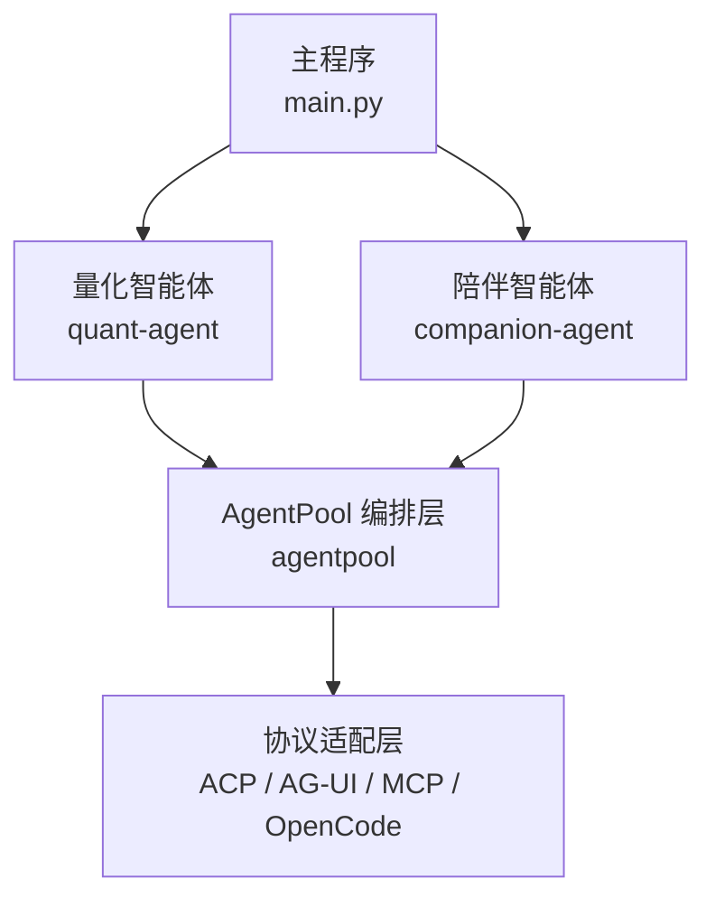
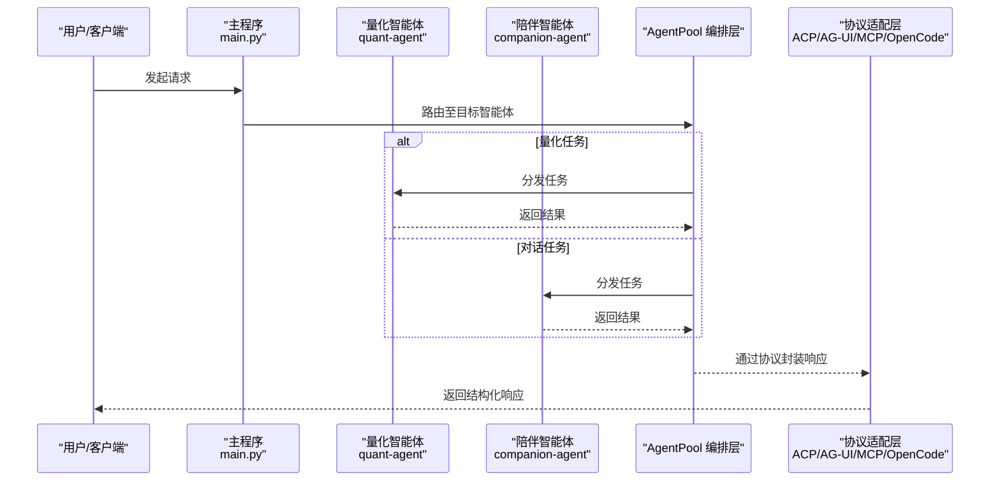
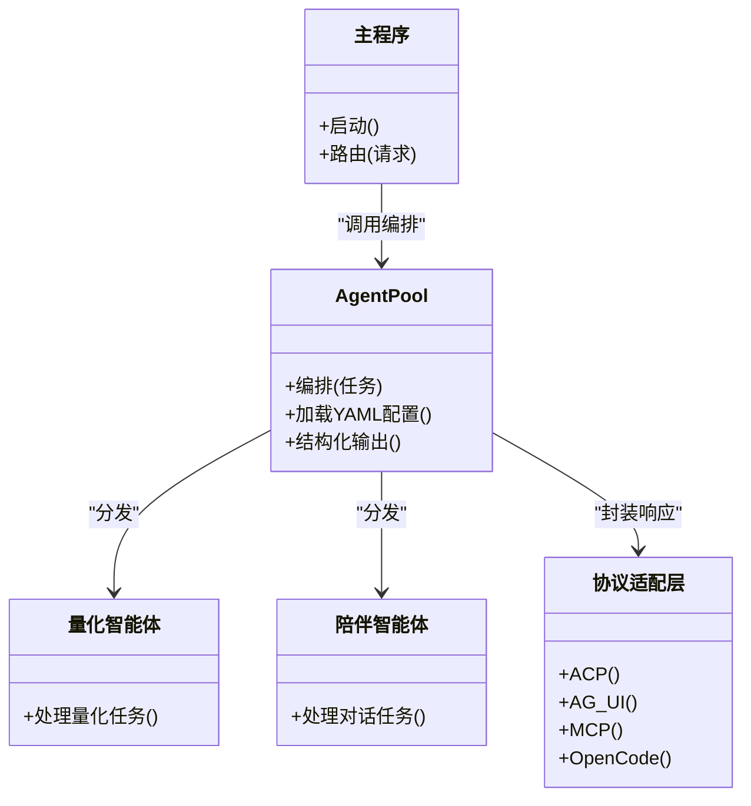
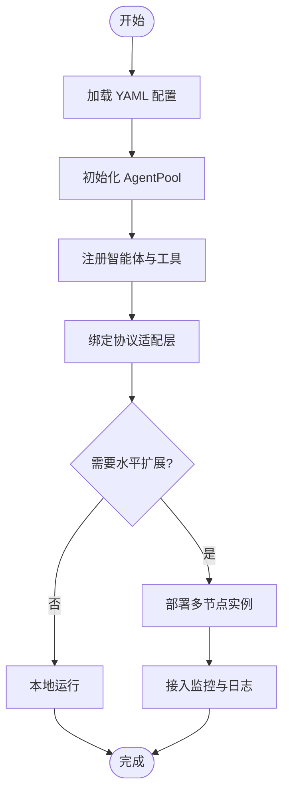
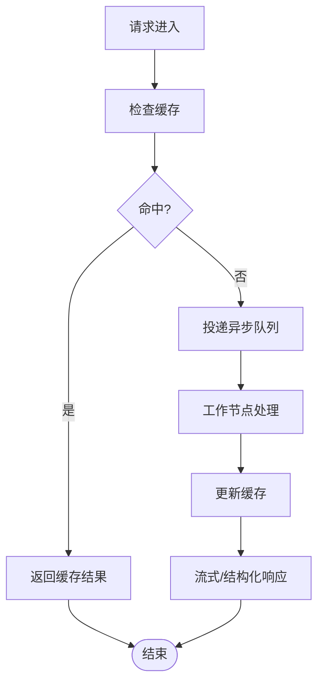
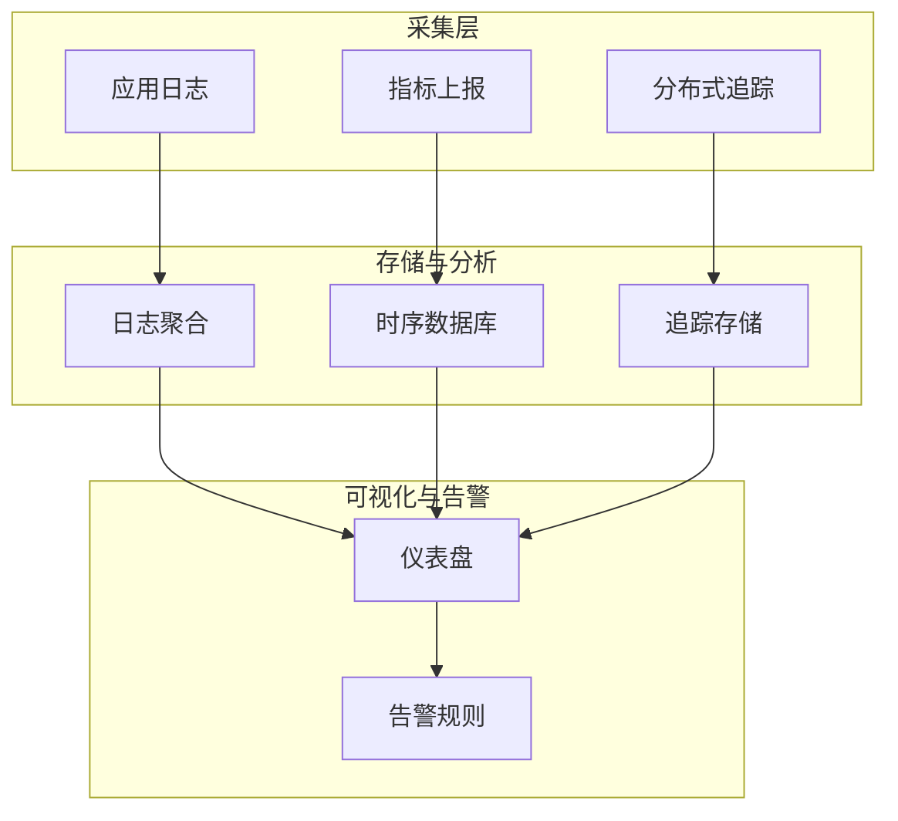
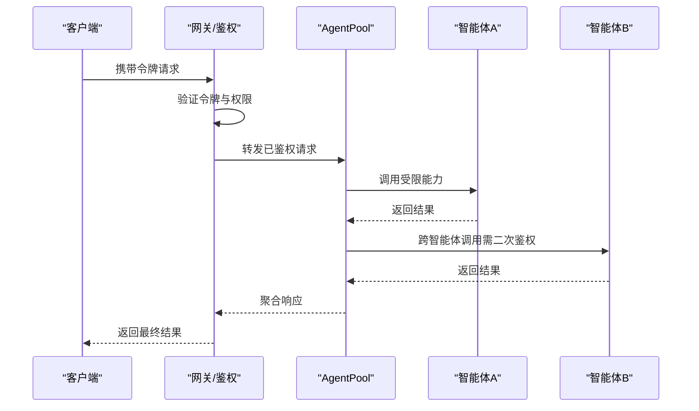
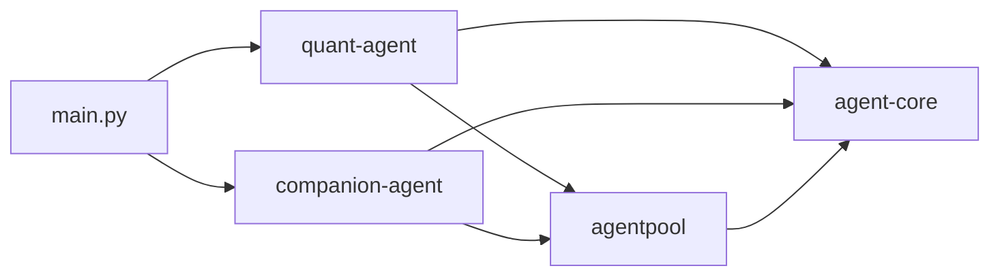

# 高级模式与最佳实践

<cite>
**本文引用的文件**   
- [main.py](file://main.py)
- [pyproject.toml](file://pyproject.toml)
- [项目上下文（project.md）](file://.agent/context/project.md)
- [智能体指令（AGENT.md）](file://.agent/AGENT.md)
- [agent-core 入口（__init__.py）](file://packages/agent-core/src/agent_core/__init__.py)
</cite>

## 目录
1. [引言](#引言)
2. [项目结构](#项目结构)
3. [核心组件](#核心组件)
4. [架构总览](#架构总览)
5. [详细组件分析](#详细组件分析)
6. [依赖关系分析](#依赖关系分析)
7. [性能考虑](#性能考虑)
8. [故障排查指南](#故障排查指南)
9. [结论](#结论)
10. [附录](#附录)

## 引言
本文件面向高级用户与运维工程师，聚焦多智能体协作的高级使用模式与最佳实践。内容涵盖：
- 多智能体协作架构设计模式（通信协议、数据共享机制）
- 分布式部署配置方案与扩展策略
- 性能优化技巧（缓存、异步、资源管理）
- 生产环境监控、日志收集与故障诊断方法
- 安全与权限管理实现方案
每个模式均提供架构图、代码示例路径与部署指南，帮助读者快速落地并规模化演进。

## 项目结构
JanusAgent 采用 UV Workspace 组织四个子包：agent-core、agentpool、quant-agent、companion-agent。框架入口 main.py 负责编排两个业务智能体（量化分析与陪伴助手），并通过 AgentPool 统一接入多种协议（ACP、AG-UI、MCP、OpenCode）。

图表来源
- [main.py:1-13](file://main.py#L1-L13)
- [项目上下文（project.md）:52-92](file://.agent/context/project.md#L52-L92)

章节来源
- [项目上下文（project.md）:1-48](file://.agent/context/project.md#L1-L48)
- [智能体指令（AGENT.md）:10-16](file://.agent/AGENT.md#L10-L16)

## 核心组件
- 主程序（main.py）：启动框架，加载并调用各智能体的能力入口。
- 量化智能体（quant-agent）：面向数据分析与量化任务。
- 陪伴智能体（companion-agent）：对话式个人助理。
- AgentPool：多协议编排中枢，支持 YAML 配置、团队/链式/并行执行、结构化输出与技能命令等。
- agent-core：基础抽象与通用能力（作为其他包的依赖）。

章节来源
- [main.py:1-13](file://main.py#L1-L13)
- [项目上下文（project.md）:77-92](file://.agent/context/project.md#L77-L92)
- [agent-core 入口（__init__.py）:1-2](file://packages/agent-core/src/agent_core/__init__.py#L1-L2)

## 架构总览
下图展示从主程序到智能体再到协议适配的端到端交互流程。

图表来源
- [main.py:1-13](file://main.py#L1-L13)
- [项目上下文（project.md）:77-92](file://.agent/context/project.md#L77-L92)

## 详细组件分析

### 多智能体协作架构与通信协议
- 设计模式
  - 编排器模式：AgentPool 作为统一编排中心，屏蔽底层协议差异。
  - 适配器模式：将不同协议（ACP、AG-UI、MCP、OpenCode）统一为内部接口。
  - 工厂/注册表模式：按 YAML 配置动态创建智能体实例与工具集。
- 通信协议
  - ACP：IDE 集成场景下的智能体通信协议。
  - AG-UI：面向 UI 的交互协议。
  - MCP：模型上下文协议，用于跨进程/跨服务的数据交换。
  - OpenCode：TUI/桌面集成协议。
- 数据共享机制
  - 基于 YAML 的配置驱动，集中声明模型、工具、触发器与存储后端。
  - 结构化输出与 Schema 校验，确保跨智能体数据一致性。
  - 可结合外部消息总线或对象存储进行持久化共享（在 AgentPool 之上扩展）。

图表来源
- [项目上下文（project.md）:77-92](file://.agent/context/project.md#L77-L92)
- [main.py:1-13](file://main.py#L1-L13)

章节来源
- [项目上下文（project.md）:77-92](file://.agent/context/project.md#L77-L92)

### 分布式部署配置方案与扩展策略
- 部署拓扑建议
  - 单节点开发：本地运行 main.py，使用内置协议适配。
  - 多节点生产：将 AgentPool 与协议适配层独立部署，量化与陪伴智能体横向扩展。
  - 外部依赖：消息队列（如 Redis/RabbitMQ）、对象存储（S3/OSS）、数据库（PostgreSQL/MySQL）。
- 配置要点
  - 使用 YAML 定义智能体、模型、工具、触发器与存储后端。
  - 通过环境变量注入敏感信息（密钥、连接串）。
  - 使用 uv workspace 统一管理依赖版本与发布。
- 扩展策略
  - 新增智能体：在 packages 下新建包，注册到 AgentPool 配置。
  - 新增协议：在协议适配层实现新协议适配器，并在 AgentPool 中注册。
  - 插件化：通过 SKILL.md 与 Skill Commands 扩展能力。

章节来源
- [项目上下文（project.md）:77-92](file://.agent/context/project.md#L77-L92)
- [智能体指令（AGENT.md）:86-91](file://.agent/AGENT.md#L86-L91)

### 性能优化技巧
- 缓存策略
  - 对高频查询结果进行缓存（Redis/内存缓存），结合 TTL 与失效策略。
  - 结构化输出缓存：对相同输入与参数的结果进行缓存命中。
- 异步处理
  - 将耗时任务（数据处理、模型推理）放入异步队列，采用生产者-消费者模式。
  - 流式响应：对长时任务采用 SSE/流式传输提升用户体验。
- 资源管理
  - 连接池：数据库、HTTP、消息队列连接复用。
  - 限流与熔断：防止下游过载，保障系统稳定性。
  - 并发控制：限制并发度，避免资源争用。

[本节为通用指导，不直接分析具体文件]

### 生产环境监控、日志收集与故障诊断
- 监控指标
  - 请求量、延迟、错误率、吞吐、队列积压、缓存命中率。
  - 智能体维度指标：任务类型、成功率、平均耗时。
- 日志规范
  - 结构化日志（JSON），包含 trace_id、span_id、智能体标识、阶段标签。
  - 分级记录：INFO/WARN/ERROR，关键路径全链路追踪。
- 故障诊断
  - 基于 trace_id 定位问题链路。
  - 告警规则：错误率阈值、超时阈值、资源水位。
  - 回放与复现：保存关键输入输出快照（脱敏）。

[本节为通用指导，不直接分析具体文件]

### 安全考虑与权限管理
- 身份认证与授权
  - 接入网关层统一鉴权（JWT/OAuth2），细粒度权限控制到智能体与方法级。
  - 最小权限原则：按需授予工具与数据访问权限。
- 数据安全
  - 传输加密（TLS），静态数据加密（KMS）。
  - 敏感字段脱敏与审计日志。
- 供应链与依赖安全
  - 锁定依赖版本（uv.lock），定期扫描漏洞。
  - 白名单机制：仅允许受信任的工具与模型源。

[本节为通用指导，不直接分析具体文件]

## 依赖关系分析
- 顶层依赖
  - 主程序依赖 quant-agent 与 companion-agent。
  - pyproject.toml 声明 workspace 成员与依赖组。
- 包内依赖
  - agent-core 提供基础能力，被其他包引用。
  - agentpool 作为编排层，被业务智能体依赖。

图表来源
- [main.py:1-13](file://main.py#L1-L13)
- [pyproject.toml:1-30](file://pyproject.toml#L1-L30)

章节来源
- [pyproject.toml:1-30](file://pyproject.toml#L1-L30)
- [main.py:1-13](file://main.py#L1-L13)

## 性能考虑
- 缓存优先：热点数据就近缓存，减少重复计算与 I/O。
- 异步与批处理：批量提交任务，降低上下文切换开销。
- 连接复用：数据库/HTTP/消息队列连接池。
- 弹性伸缩：根据负载自动扩缩容，保持 SLA。
- 观测先行：先埋点再优化，基于数据决策。

[本节为通用指导，不直接分析具体文件]

## 故障排查指南
- 常见问题定位
  - 启动失败：检查环境变量与配置文件完整性。
  - 协议不通：确认协议适配层状态与端口占用。
  - 智能体无响应：查看队列积压与工作节点健康。
- 日志与追踪
  - 使用 trace_id 串联跨服务调用。
  - 关注 ERROR 级别日志与堆栈信息。
- 恢复策略
  - 快速回滚：基于版本锁定与灰度发布。
  - 降级开关：关闭非核心功能保主链路。
  - 重试与退避：对瞬时故障进行指数退避重试。

章节来源
- [项目上下文（project.md）:110-127](file://.agent/context/project.md#L110-L127)

## 结论
通过以 AgentPool 为核心的编排层与多协议适配，JanusAgent 实现了灵活的多智能体协作架构。在生产环境中，应结合缓存、异步与资源管理提升性能，完善监控与日志体系，强化安全与权限控制，从而实现稳定、可扩展、可观测的智能体平台。

## 附录
- 快速上手
  - 安装依赖：参考开发命令。
  - 运行框架：执行主程序入口。
- 参考路径
  - 主程序入口：[main.py:1-13](file://main.py#L1-L13)
  - 项目上下文与架构说明：[项目上下文（project.md）:52-92](file://.agent/context/project.md#L52-L92)
  - 智能体指令与技能：[智能体指令（AGENT.md）:86-91](file://.agent/AGENT.md#L86-L91)
  - 基础能力入口：[agent-core 入口（__init__.py）:1-2](file://packages/agent-core/src/agent_core/__init__.py#L1-L2)