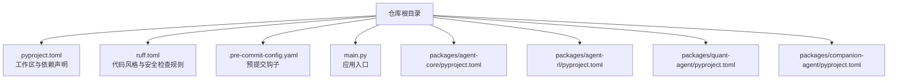
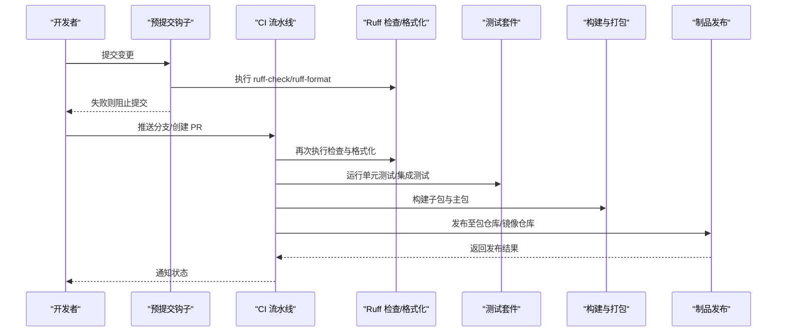
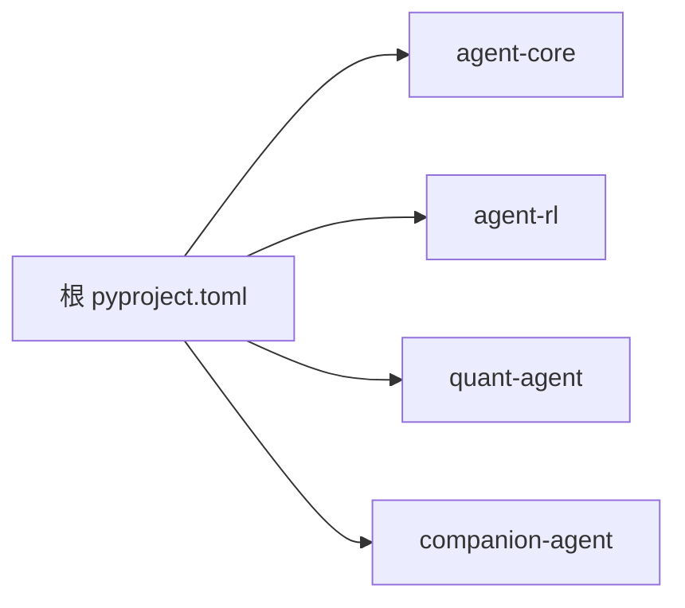

# CI/CD 流水线

<cite>
**本文引用的文件**
- [.pre-commit-config.yaml](file://.pre-commit-config.yaml)
- [pyproject.toml](file://pyproject.toml)
- [ruff.toml](file://ruff.toml)
- [main.py](file://main.py)
- [packages/agent-core/pyproject.toml](file://packages/agent-core/pyproject.toml)
- [packages/companion-agent/pyproject.toml](file://packages/companion-agent/pyproject.toml)
- [packages/quant-agent/pyproject.toml](file://packages/quant-agent/pyproject.toml)
</cite>

## 目录
1. [简介](#简介)
2. [项目结构](#项目结构)
3. [核心组件](#核心组件)
4. [架构总览](#架构总览)
5. [详细组件分析](#详细组件分析)
6. [依赖分析](#依赖分析)
7. [性能考虑](#性能考虑)
8. [故障排查指南](#故障排查指南)
9. [结论](#结论)
10. [附录](#附录)

## 简介
本文件为 JanusAgent 的持续集成与持续部署（CI/CD）流水线配置文档，覆盖以下目标：
- 预提交钩子：代码检查、格式化与安全扫描规则
- CI 流水线：代码质量检查、自动化测试、包发布流程（GitHub Actions/GitLab CI 通用方案）
- 多环境部署策略：开发、测试、生产差异化配置
- 性能与负载测试集成方案
- 回滚机制与蓝绿部署实现方法

本项目采用 uv 工作区管理多个 Python 子包，使用 Ruff 进行统一的质量检查与格式化，并通过 pre-commit 在本地与 CI 中保持一致性。

## 项目结构
仓库根目录包含工作区配置与工具链配置；packages 下为多个独立可发布的子包；入口脚本位于根目录 main.py。

图示来源
- [pyproject.toml:1-30](file://pyproject.toml#L1-L30)
- [ruff.toml:1-70](file://ruff.toml#L1-L70)
- [.pre-commit-config.yaml:1-18](file://.pre-commit-config.yaml#L1-L18)
- [main.py:1-13](file://main.py#L1-L13)
- [packages/agent-core/pyproject.toml:1-18](file://packages/agent-core/pyproject.toml#L1-L18)
- [packages/companion-agent/pyproject.toml:1-18](file://packages/companion-agent/pyproject.toml#L1-L18)
- [packages/quant-agent/pyproject.toml:1-18](file://packages/quant-agent/pyproject.toml#L1-L18)

章节来源
- [pyproject.toml:1-30](file://pyproject.toml#L1-L30)
- [ruff.toml:1-70](file://ruff.toml#L1-L70)
- [.pre-commit-config.yaml:1-18](file://.pre-commit-config.yaml#L1-L18)
- [main.py:1-13](file://main.py#L1-L13)
- [packages/agent-core/pyproject.toml:1-18](file://packages/agent-core/pyproject.toml#L1-L18)
- [packages/companion-agent/pyproject.toml:1-18](file://packages/companion-agent/pyproject.toml#L1-L18)
- [packages/quant-agent/pyproject.toml:1-18](file://packages/quant-agent/pyproject.toml#L1-L18)

## 核心组件
- 工作区与依赖
  - 根 pyproject.toml 声明了 Python 版本要求与工作区成员 packages/*，并将各子包以 workspace 方式引入，便于统一构建与依赖解析。
- 代码质量与安全
  - ruff.toml 定义了行宽、目标版本、排除目录、格式器选项以及 lint/select/ignore 规则集，涵盖语法、安全、异步、日志、导入顺序等维度。
- 预提交钩子
  - .pre-commit-config.yaml 集成了 uv-lock、ruff-check（含自动修复）、ruff-format，确保提交前完成锁文件更新、静态检查与格式化。
- 应用入口
  - main.py 作为演示入口，调用子包提供的能力并打印信息，便于快速验证运行链路。

章节来源
- [pyproject.toml:1-30](file://pyproject.toml#L1-L30)
- [ruff.toml:1-70](file://ruff.toml#L1-L70)
- [.pre-commit-config.yaml:1-18](file://.pre-commit-config.yaml#L1-L18)
- [main.py:1-13](file://main.py#L1-L13)

## 架构总览
下图展示了从开发者提交到制品发布的端到端流水线阶段，包括本地预提交、CI 质量检查、测试、打包与发布。

图示来源
- [.pre-commit-config.yaml:1-18](file://.pre-commit-config.yaml#L1-L18)
- [ruff.toml:1-70](file://ruff.toml#L1-L70)
- [pyproject.toml:1-30](file://pyproject.toml#L1-L30)

## 详细组件分析

### 预提交钩子配置
- 钩子清单
  - uv-lock：保证依赖锁定文件一致性
  - ruff-check：静态检查，支持自动修复
  - ruff-format：统一代码格式
- 行为说明
  - 提交时若任一钩子失败，将阻断提交
  - 建议在 CI 中也重复执行相同钩子，确保本地与远程一致

章节来源
- [.pre-commit-config.yaml:1-18](file://.pre-commit-config.yaml#L1-L18)

### 代码质量与安全规则（Ruff）
- 关键设置
  - 目标 Python 版本、行宽、引号风格、排除目录
  - 启用规则集合：语法、安全、异步、日志、导入顺序、异常处理、性能等
  - 忽略部分过于主观或不适用的规则，保持团队规范平衡
- 建议
  - 在 CI 中开启严格模式（不自动修复），仅报告问题
  - 对安全相关规则（S 系列）保持默认启用，避免绕过

章节来源
- [ruff.toml:1-70](file://ruff.toml#L1-L70)

### 工作区与子包构建
- 工作区
  - 根 pyproject.toml 通过 workspace.members 聚合 packages/*，统一依赖与构建
- 子包
  - agent-core、companion-agent、quant-agent 各自提供独立的元数据与脚本入口，便于单独发布与复用
- 构建后端
  - 子包使用 uv_build 作为构建后端，配合 uv 生态实现快速构建

章节来源
- [pyproject.toml:1-30](file://pyproject.toml#L1-L30)
- [packages/agent-core/pyproject.toml:1-18](file://packages/agent-core/pyproject.toml#L1-L18)
- [packages/companion-agent/pyproject.toml:1-18](file://packages/companion-agent/pyproject.toml#L1-L18)
- [packages/quant-agent/pyproject.toml:1-18](file://packages/quant-agent/pyproject.toml#L1-L18)

### 应用入口与运行验证
- main.py 作为演示入口，加载子包能力并输出信息，可用于快速验证依赖与运行环境是否正确。

章节来源
- [main.py:1-13](file://main.py#L1-L13)

## 依赖分析
- 直接依赖
  - 根项目依赖四个子包：agent-core、agent-rl、quant-agent、companion-agent
- 工作区引用
  - 通过 workspace=true 的方式引用子包，简化依赖管理与版本同步
- 构建依赖
  - 子包构建系统依赖 uv_build，确保与 uv 生态兼容

图示来源
- [pyproject.toml:1-30](file://pyproject.toml#L1-L30)

章节来源
- [pyproject.toml:1-30](file://pyproject.toml#L1-L30)

## 性能考虑
- 缓存策略
  - 缓存 uv 依赖安装结果与构建产物，减少重复下载与编译时间
- 并行化
  - 在多核环境中并行执行检查、测试与构建任务
- 增量构建
  - 利用 uv 的工作区特性，仅构建受影响的子包
- 资源限制
  - 为 CI 作业设置合理的内存与 CPU 上限，避免资源争用

[本节为通用指导，无需源码引用]

## 故障排查指南
- 预提交失败
  - 检查 ruff 规则是否被修改或新增违规项
  - 确认 uv-lock 是否与当前依赖一致
- CI 构建失败
  - 核对 Python 版本与目标版本匹配
  - 检查子包构建后端与 uv 版本兼容性
- 测试失败
  - 查看测试输出与覆盖率报告，定位失败用例
  - 对于网络或外部依赖导致的间歇性失败，考虑重试策略

[本节为通用指导，无需源码引用]

## 结论
通过统一的预提交钩子与 Ruff 规则，结合 uv 工作区的构建能力，JanusAgent 可在本地与 CI 中保持一致的代码质量与构建体验。后续可在现有基础上扩展自动化测试、性能与负载测试、多环境部署与蓝绿发布等能力，形成完整的 CI/CD 闭环。

[本节为总结，无需源码引用]

## 附录

### GitHub Actions 流水线参考（概念性）
- 触发条件
  - push 到主要分支、创建/更新 PR
- 作业矩阵
  - Python 版本矩阵（基于 requires-python 要求）
- 阶段
  - 安装 uv 与依赖、预提交检查、测试、构建与发布
- 缓存
  - 缓存 uv 依赖与构建产物
- 环境变量
  - 使用密钥管理服务注入敏感信息（如包仓库凭据）

[本节为概念性说明，无需源码引用]

### GitLab CI 流水线参考（概念性）
- 触发条件
  - push、MR 事件
- 阶段
  - lint/format、test、build、publish
- 缓存与镜像
  - 使用 Docker 镜像加速依赖安装
- 变量与密钥
  - 使用 GitLab CI/CD Variables 管理敏感配置

[本节为概念性说明，无需源码引用]

### 多环境部署策略（概念性）
- 环境划分
  - 开发（dev）、测试（staging）、生产（prod）
- 差异化配置
  - 通过环境变量区分数据库、缓存、第三方服务地址与开关
- 部署流程
  - 构建一次制品，按环境注入不同配置进行部署
- 灰度与回滚
  - 先小流量灰度，再全量；保留上一版本以便快速回滚

[本节为概念性说明，无需源码引用]

### 性能与负载测试集成（概念性）
- 单元与集成测试
  - 在 CI 中运行基础用例，确保功能正确
- 性能基准
  - 定义关键路径的性能指标，记录历史趋势
- 负载测试
  - 使用压测工具模拟并发请求，评估吞吐与延迟
- 阈值告警
  - 当性能回归超过阈值时阻断合并或发出告警

[本节为概念性说明，无需源码引用]

### 回滚机制与蓝绿部署（概念性）
- 回滚机制
  - 保留最近稳定版本，一键切换流量至旧版本
- 蓝绿部署
  - 同时维护两套环境，通过负载均衡切换流量
- 健康检查
  - 部署后执行健康检查，失败自动回滚
- 数据迁移
  - 向前兼容的数据迁移策略，避免回滚导致数据不一致

[本节为概念性说明，无需源码引用]