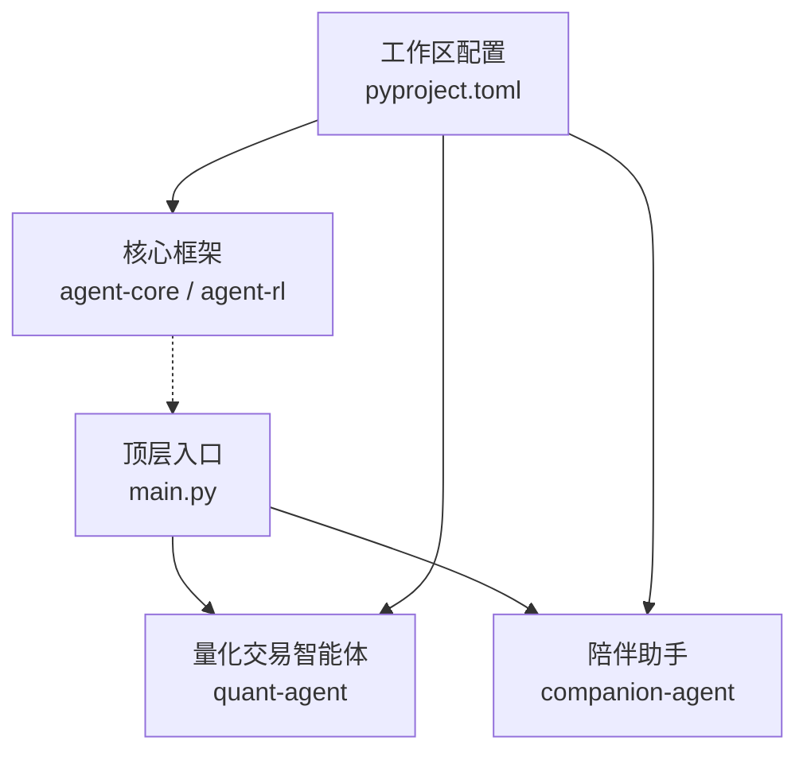
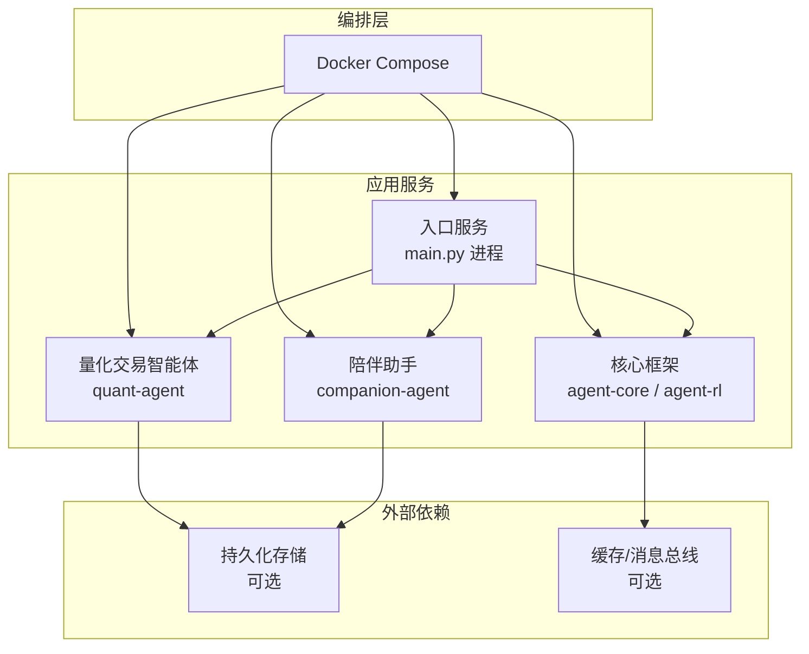
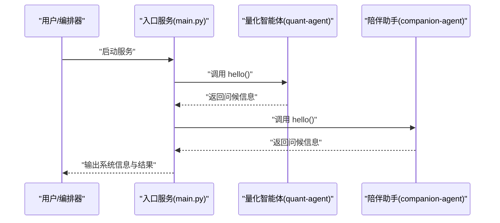
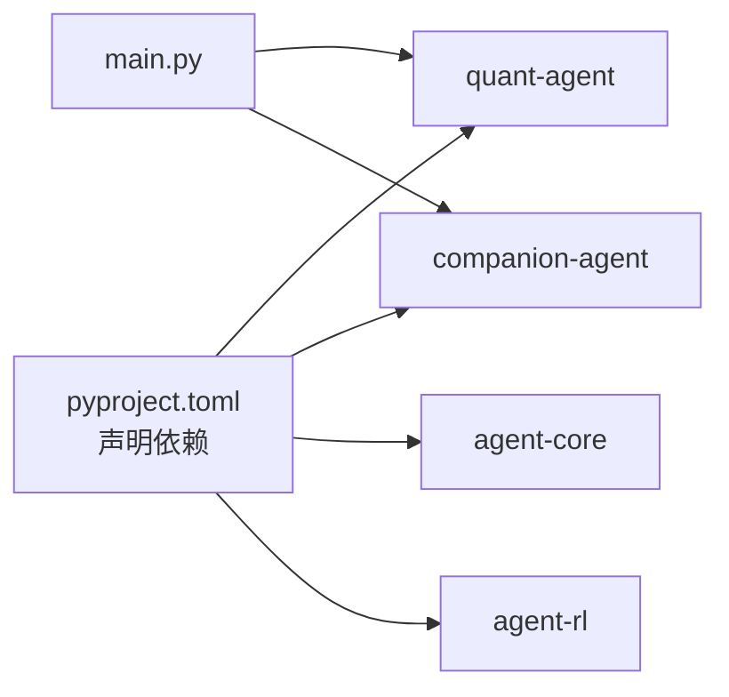
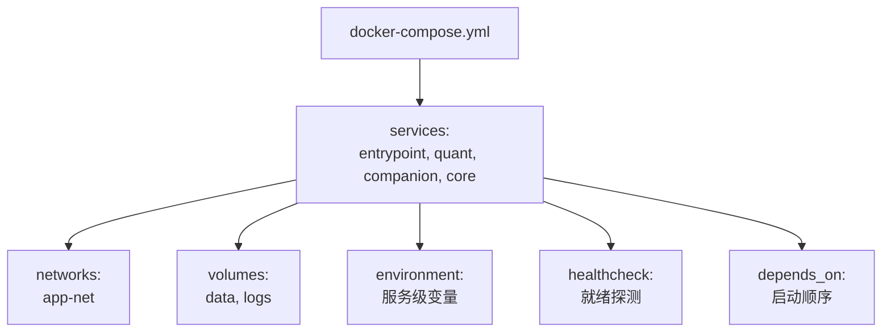

# Docker Compose 编排

<cite>
**本文引用的文件**   
- [main.py](file://main.py)
- [pyproject.toml](file://pyproject.toml)
</cite>

## 目录
1. [简介](#简介)
2. [项目结构](#项目结构)
3. [核心组件](#核心组件)
4. [架构总览](#架构总览)
5. [详细组件分析](#详细组件分析)
6. [依赖关系分析](#依赖关系分析)
7. [性能与扩展性](#性能与扩展性)
8. [故障排查指南](#故障排查指南)
9. [结论](#结论)
10. [附录：Compose 配置模板与差异说明](#附录compose-配置模板与差异说明)

## 简介
本文件面向 JanusAgent 的容器化部署，提供基于 Docker Compose 的多服务编排方案。目标包括：
- 将量化交易智能体、陪伴助手与核心框架服务以容器形式组织与编排
- 定义服务间通信机制、网络与数据卷管理策略
- 明确环境变量、依赖关系与服务发现方案
- 区分开发环境与生产环境的 Compose 差异
- 给出服务扩展与负载均衡策略建议

## 项目结构
仓库采用多包工作区（workspace）组织，顶层入口 main.py 聚合并调用各子包能力；依赖通过 pyproject.toml 声明，并使用 uv 的工作区特性引用 packages/* 下的本地包。

图示来源
- [main.py:1-13](file://main.py#L1-L13)
- [pyproject.toml:1-30](file://pyproject.toml#L1-L30)

章节来源
- [main.py:1-13](file://main.py#L1-L13)
- [pyproject.toml:1-30](file://pyproject.toml#L1-L30)

## 核心组件
- 顶层入口服务（JanusAgent 主进程）
  - 职责：初始化并调用 quant-agent 与 companion-agent 的能力，作为统一入口对外暴露或作为调度器运行
  - 关键路径：[main.py:1-13](file://main.py#L1-L13)
- 量化交易智能体（quant-agent）
  - 职责：提供量化策略执行、回测、行情接入等能力
  - 依赖：由顶层入口导入并调用
- 陪伴助手（companion-agent）
  - 职责：提供对话、任务辅助、知识检索等能力
  - 依赖：由顶层入口导入并调用
- 核心框架（agent-core / agent-rl）
  - 职责：为上层智能体提供通用能力（如记忆、规则、技能、RL 训练/推理基础设施等）
  - 依赖：通过工作区在 pyproject.toml 中声明

章节来源
- [main.py:1-13](file://main.py#L1-L13)
- [pyproject.toml:1-30](file://pyproject.toml#L1-30)

## 架构总览
下图展示推荐的容器化分层与交互方式：入口服务作为编排中心，按需调用量化与陪伴服务；核心框架以共享库或独立服务形式存在，视具体实现而定。

图示来源
- [main.py:1-13](file://main.py#L1-L13)
- [pyproject.toml:1-30](file://pyproject.toml#L1-30)

## 详细组件分析

### 入口服务（main.py）
- 功能要点
  - 打印系统标识与版本信息
  - 依次调用 quant-agent 与 companion-agent 的 hello 接口，验证依赖可用
- 容器化建议
  - 使用轻量 Python 基础镜像，安装 uv 与工作区依赖
  - 以单进程模式运行 main.py，便于调试与日志收集
- 关键路径
  - [main.py:1-13](file://main.py#L1-L13)

图示来源
- [main.py:1-13](file://main.py#L1-L13)

章节来源
- [main.py:1-13](file://main.py#L1-L13)

### 量化交易智能体（quant-agent）
- 职责边界
  - 策略执行、回测、数据拉取、风控校验等
- 容器化建议
  - 独立镜像打包，暴露必要端口（如 HTTP/gRPC），供入口服务或其他服务调用
  - 通过环境变量注入 API Key、数据库连接串、策略参数等敏感信息
- 依赖关系
  - 由入口服务直接导入与调用（本地包）；若拆分为微服务，则改为远程调用

章节来源
- [pyproject.toml:1-30](file://pyproject.toml#L1-30)

### 陪伴助手（companion-agent）
- 职责边界
  - 对话管理、意图识别、知识库检索、工具调用等
- 容器化建议
  - 独立镜像打包，暴露 REST/gRPC 接口
  - 结合向量数据库或对象存储进行会话与知识持久化
- 依赖关系
  - 由入口服务直接导入与调用（本地包）；若拆分为微服务，则改为远程调用

章节来源
- [pyproject.toml:1-30](file://pyproject.toml#L1-30)

### 核心框架（agent-core / agent-rl）
- 职责边界
  - 提供通用 Agent 能力（上下文、记忆、规则、技能）、强化学习训练/推理基础设施
- 容器化建议
  - 可作为共享库随入口服务打包，也可作为独立服务（例如模型服务、训练服务）单独部署
- 依赖关系
  - 通过工作区在 pyproject.toml 中声明，被入口服务与其他智能体间接依赖

章节来源
- [pyproject.toml:1-30](file://pyproject.toml#L1-30)

## 依赖关系分析
- 工作区与依赖声明
  - 顶层 pyproject.toml 声明了四个本地包依赖，并通过 workspace 源解析到 packages/* 下
- 运行时依赖
  - 入口服务 main.py 仅依赖 quant-agent 与 companion-agent 的导出函数
- 容器内依赖安装
  - 建议使用 uv sync --frozen 在工作区内一次性安装所有依赖，确保一致性

图示来源
- [pyproject.toml:1-30](file://pyproject.toml#L1-30)
- [main.py:1-13](file://main.py#L1-L13)

章节来源
- [pyproject.toml:1-30](file://pyproject.toml#L1-30)
- [main.py:1-13](file://main.py#L1-L13)

## 性能与扩展性
- 资源隔离
  - 为每个服务设置 CPU/内存限制，避免相互影响
- 水平扩展
  - 对无状态服务（如陪伴助手）可复制多个实例，配合反向代理做负载均衡
- 缓存与异步
  - 引入缓存/消息队列提升吞吐，注意幂等与重试策略
- 监控与可观测性
  - 集中日志、指标采集与健康检查端点

## 故障排查指南
- 启动失败
  - 检查 uv 工作区依赖是否安装成功，确认镜像基础环境满足 Python>=3.12
- 服务间调用失败
  - 核对网络连通性与端口映射，确认环境变量中的地址/端口正确
- 数据持久化异常
  - 检查数据卷挂载路径权限与容量，确认数据库/对象存储服务可达
- 日志定位
  - 优先查看入口服务日志，再按调用链逐层排查

## 结论
通过 Docker Compose 将量化交易智能体、陪伴助手与核心框架服务进行容器化编排，可实现清晰的职责边界、灵活的环境切换与可扩展的服务形态。建议在开发阶段采用本地工作区快速迭代，在生产阶段逐步解耦为独立服务并引入负载均衡与可观测性设施。

## 附录：Compose 配置模板与差异说明

### 推荐服务清单
- 入口服务（janus-entrypoint）
  - 基于 Python 镜像，安装 uv 与工作区依赖，运行 main.py
- 量化交易智能体（quant-agent）
  - 独立镜像，暴露必要端口，读取环境变量配置
- 陪伴助手（companion-agent）
  - 独立镜像，暴露必要端口，读取环境变量配置
- 核心框架（core）
  - 可与入口服务合并或独立部署，视实现复杂度决定
- 可选外部依赖
  - 数据库、缓存/消息总线、对象存储等

### 网络与数据卷
- 网络
  - 使用默认桥接网络，服务间通过服务名访问
- 数据卷
  - 为需要持久化的服务挂载命名卷或绑定挂载目录
  - 将日志、模型权重、策略文件等放入卷中

### 环境变量与配置
- 通用变量
  - 服务监听端口、日志级别、时区等
- 敏感信息
  - API Key、数据库连接串、证书等通过环境变量注入，避免硬编码
- 配置优先级
  - 环境变量 > 配置文件 > 默认值

### 依赖关系与服务发现
- 依赖顺序
  - 使用 depends_on 控制启动顺序（不保证就绪）
- 健康检查
  - 为关键服务添加 healthcheck，确保依赖服务真正可用后再启动
- 服务发现
  - 在同一自定义网络内的服务可通过服务名解析

### 开发环境与生产环境差异
- 开发环境
  - 启用热重载、详细日志、调试端口映射
  - 使用绑定挂载源码以便即时修改
- 生产环境
  - 关闭热重载，精简镜像层，只保留运行期依赖
  - 启用资源限制、滚动更新、优雅停机

### 服务扩展与负载均衡
- 无状态服务
  - 通过副本数扩展，前置反向代理进行请求分发
- 有状态服务
  - 保持单一主节点或使用外部集群化数据库/缓存
- 弹性伸缩
  - 根据 CPU/内存/队列长度等指标触发扩缩容

### 示例：Compose 文件结构（概念示意）

[本节为概念性说明，未直接分析具体源码文件]