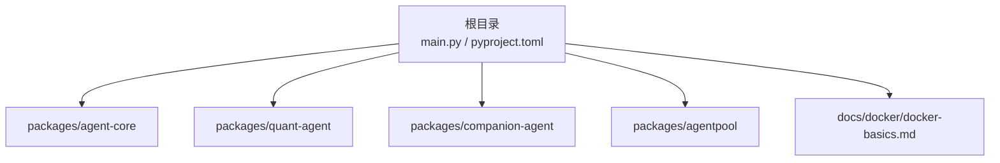
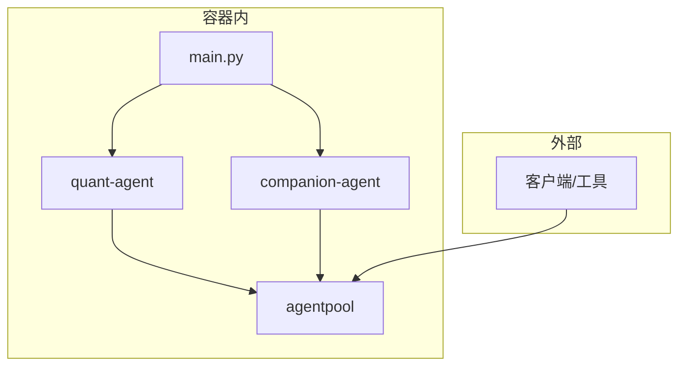
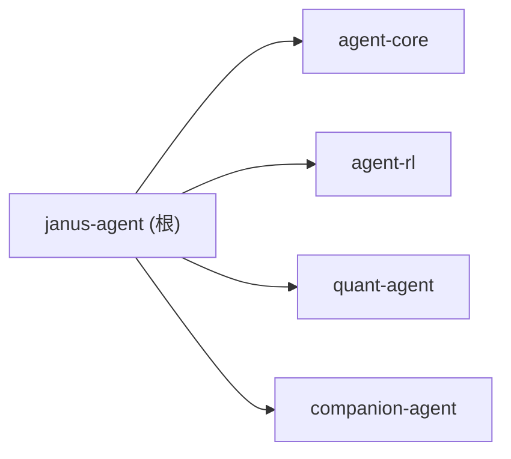

# Docker 容器化部署

<cite>
**本文引用的文件**   
- [main.py](file://main.py)
- [pyproject.toml](file://pyproject.toml)
- [uv.lock](file://uv.lock)
- [README.md](file://README.md)
- [docker-basics.md](file://docs/docker/docker-basics.md)
- [agent-core/README.md](file://packages/agent-core/README.md)
- [quant-agent/README.md](file://packages/quant-agent/README.md)
- [companion-agent/README.md](file://packages/companion-agent/README.md)
- [agentpool/README.md](file://packages/agentpool/README.md)
</cite>

## 目录
1. [简介](#简介)
2. [项目结构](#项目结构)
3. [核心组件](#核心组件)
4. [架构总览](#架构总览)
5. [详细组件分析](#详细组件分析)
6. [依赖关系分析](#依赖关系分析)
7. [性能与镜像优化](#性能与镜像优化)
8. [生产环境部署策略](#生产环境部署策略)
9. [Kubernetes 部署清单示例](#kubernetes-部署清单示例)
10. [监控与调试最佳实践](#监控与调试最佳实践)
11. [故障排除指南](#故障排除指南)
12. [结论](#结论)

## 简介
本指南面向 JanusAgent 的容器化落地，覆盖以下目标：
- Dockerfile 编写规范：多阶段构建、镜像体积最小化与安全加固
- 容器编排方案：Docker Compose 配置与服务间通信
- 生产部署策略：资源限制、健康检查、日志收集
- Kubernetes 部署清单：Deployment、Service、ConfigMap、Secret
- 监控与调试：可观测性、排障方法

JanusAgent 是一个 Python 工作区（uv workspace）应用，入口为 main.py，依赖多个子包（agent-core、quant-agent、companion-agent、agentpool）。运行环境要求 Python >= 3.12。

章节来源
- [README.md:39-84](file://README.md#L39-L84)
- [pyproject.toml:1-30](file://pyproject.toml#L1-L30)
- [main.py:1-13](file://main.py#L1-L13)

## 项目结构
仓库采用 uv workspace 组织多包工程，根目录包含入口脚本与全局配置，子包位于 packages 下。

图示来源
- [README.md:39-84](file://README.md#L39-L84)
- [pyproject.toml:14-17](file://pyproject.toml#L14-L17)

章节来源
- [README.md:39-84](file://README.md#L39-L84)
- [pyproject.toml:14-17](file://pyproject.toml#L14-L17)

## 核心组件
- 框架入口：main.py 负责初始化并调用各子包的 hello/main 能力
- 子包职责：
  - agent-core：核心抽象层（内核、生命周期、插件接口）
  - quant-agent：量化交易智能体
  - companion-agent：情感陪伴智能体
  - agentpool：编排中枢（多协议桥接）

章节来源
- [main.py:1-13](file://main.py#L1-L13)
- [agent-core/README.md:1-16](file://packages/agent-core/README.md#L1-L16)
- [quant-agent/README.md:1-16](file://packages/quant-agent/README.md#L1-L16)
- [companion-agent/README.md:1-16](file://packages/companion-agent/README.md#L1-L16)
- [agentpool/README.md:1-16](file://packages/agentpool/README.md#L1-L16)

## 架构总览
从容器视角，JanusAgent 以单进程方式启动，加载多个子包能力；对外可通过 AgentPool 暴露多种协议（ACP/AG-UI/MCP/OpenCode）。

图示来源
- [README.md:61-84](file://README.md#L61-L84)
- [main.py:1-13](file://main.py#L1-L13)

## 详细组件分析

### 容器镜像构建（Dockerfile 规范）
建议采用多阶段构建，将“构建期”和“运行期”分离，仅将产物与必要运行时放入最终镜像。

- 构建阶段
  - 使用带 uv 的轻量基础镜像（如 python:3.12-slim）
  - 安装系统依赖（若需要），清理缓存
  - 复制 pyproject.toml 与 uv.lock，执行 uv sync --frozen 生成只读依赖
  - 复制源码并安装工作区（editable 或 wheel 打包后安装）
- 运行阶段
  - 使用更小的运行时镜像（如 python:3.12-slim）
  - 创建非 root 用户，设置 WORKDIR
  - 拷贝构建产物（dist/wheels 或 site-packages）
  - 设置 ENTRYPOINT/CMD 指向 main.py 或可执行脚本
- 安全加固
  - 非 root 运行、最小权限、关闭不必要的系统服务
  - 固定基础镜像版本与依赖哈希，避免漂移
  - 扫描镜像漏洞（Trivy/Grype），定期更新基础镜像
- 体积优化
  - 合并 RUN 指令、删除 apt/pip 缓存
  - .dockerignore 排除 __pycache__、.venv、*.egg-info、测试与文档等
  - 使用多阶段减少冗余层

章节来源
- [pyproject.toml:1-30](file://pyproject.toml#L1-L30)
- [uv.lock:1-20](file://uv.lock#L1-L20)
- [docker-basics.md:263-304](file://docs/docker/docker-basics.md#L263-L304)

### 本地与开发环境（Docker Compose）
适用于本地联调与演示，包含主应用与可选的外部依赖（如 Redis、数据库等）。

- 服务定义
  - janus-agent：基于构建镜像，挂载代码目录用于热更新（开发模式）
  - 可选：redis、postgres 等持久化服务
- 网络与端口
  - 通过自定义网络隔离服务
  - 对外暴露必要端口（如 API 端口）
- 环境变量与配置
  - 使用 .env 或 compose env_file 注入配置
  - 敏感信息通过 Secret 管理（见 K8s 部分）
- 数据持久化
  - 使用命名卷或绑定挂载保存模型权重、日志、会话等

章节来源
- [README.md:95-112](file://README.md#L95-L112)
- [docker-basics.md:213-234](file://docs/docker/docker-basics.md#L213-L234)

### 生产环境部署策略
- 资源限制
  - CPU/内存限制与请求值，防止资源争用
  - 共享内存按需调整（若使用多进程 DataLoader 等）
- 健康检查
  - HTTP/TCP 探针验证服务就绪
  - 启动延迟与重试次数合理配置
- 日志收集
  - 标准输出/错误输出，由容器运行时统一采集
  - 结构化日志便于检索与分析
- 滚动更新与回滚
  - 蓝绿/金丝雀发布，配合就绪探针保障零停机
- 安全基线
  - 最小镜像、非 root、只读根文件系统（可选）、密钥外置

章节来源
- [docker-basics.md:238-259](file://docs/docker/docker-basics.md#L238-L259)
- [docker-basics.md:342-355](file://docs/docker/docker-basics.md#L342-L355)

## 依赖关系分析
JanusAgent 根项目依赖四个子包，均为工作区内成员。

图示来源
- [pyproject.toml:7-12](file://pyproject.toml#L7-L12)
- [uv.lock:12-20](file://uv.lock#L12-L20)

章节来源
- [pyproject.toml:7-12](file://pyproject.toml#L7-L12)
- [uv.lock:12-20](file://uv.lock#L12-L20)

## 性能与镜像优化
- 多阶段构建：构建期安装编译依赖，运行期仅保留运行时
- 依赖缓存：先复制锁文件再复制源码，利用层缓存加速构建
- 精简基础镜像：优先使用 slim/alpine 变体（注意 glibc 兼容）
- 并行安装：合理使用 pip/uv 的并行选项（视镜像基础镜像支持）
- 清理中间产物：apt-get clean、pip cache purge、rm -rf 临时目录
- 镜像分层优化：频繁变更的代码放在靠近 CMD 的层

章节来源
- [docker-basics.md:263-304](file://docs/docker/docker-basics.md#L263-L304)
- [docker-basics.md:342-355](file://docs/docker/docker-basics.md#L342-L355)

## 生产环境部署策略
- 资源配额
  - requests/limits 明确 CPU/内存，避免 OOMKill
  - 针对 GPU 场景按需分配显存与设备（参考通用 GPU 容器实践）
- 健康检查
  - livenessProbe/readinessProbe 结合业务就绪逻辑
  - 失败阈值与初始延迟根据冷启动时间设定
- 日志与指标
  - 输出 JSON 格式日志，集中到 ELK/Loki
  - 暴露 Prometheus 指标端点（如适用）
- 配置与密钥
  - 配置项通过 ConfigMap 注入
  - 密钥通过 Secret 注入，避免硬编码
- 弹性与高可用
  - 副本数与水平扩缩容策略
  - 优雅退出与连接池回收

章节来源
- [docker-basics.md:238-259](file://docs/docker/docker-basics.md#L238-L259)
- [docker-basics.md:342-355](file://docs/docker/docker-basics.md#L342-L355)

## Kubernetes 部署清单示例
以下为概念性清单要点，实际字段需按集群与业务需求完善。

- Deployment
  - 镜像：使用多阶段构建后的最小镜像
  - 资源：requests/limits 设置 CPU/内存
  - 探针：liveness/readiness 配置
  - 环境变量：从 ConfigMap/Secret 注入
  - 存储：按需挂载 PVC 或 HostPath
- Service
  - ClusterIP/NodePort/LoadBalancer 暴露服务
  - 端口映射与协议选择
- ConfigMap
  - 存放非敏感配置（YAML/JSON/文本）
- Secret
  - 存放密钥（Base64 编码），通过环境变量或卷挂载
- Pod 级别
  - 非 root 用户运行
  - 只读根文件系统（可选）
  - 安全上下文与网络策略

章节来源
- [README.md:61-84](file://README.md#L61-L84)
- [docker-basics.md:213-234](file://docs/docker/docker-basics.md#L213-L234)

## 监控与调试最佳实践
- 可观测性
  - 结构化日志 + 统一采集
  - 指标暴露（Prometheus）+ 告警规则
  - 分布式追踪（如 OpenTelemetry）
- 调试技巧
  - 进入运行中容器 exec bash/sh
  - 查看容器日志与事件
  - 使用 kubectl describe/logs/exec 定位问题
- 容量规划
  - 观察 CPU/内存/GPU 使用率，调整资源配额
  - 关注磁盘 I/O 与网络带宽瓶颈

章节来源
- [docker-basics.md:238-259](file://docs/docker/docker-basics.md#L238-L259)
- [docker-basics.md:369-393](file://docs/docker/docker-basics.md#L369-L393)

## 故障排除指南
常见问题与处理思路：
- 镜像过大
  - 检查多阶段构建是否生效，确认 .dockerignore 是否排除无用文件
  - 合并 RUN 指令、清理缓存
- 启动失败
  - 查看容器日志与退出码
  - 校验环境变量与配置文件是否正确注入
- 依赖安装缓慢或失败
  - 使用国内镜像源或私有仓库
  - 锁定依赖版本，确保 uv.lock 与构建一致
- 资源不足
  - 调整 requests/limits，排查内存泄漏或大对象
- 网络不通
  - 检查 Service/Ingress 配置与网络策略
  - 确认端口映射与域名解析

章节来源
- [docker-basics.md:369-393](file://docs/docker/docker-basics.md#L369-L393)
- [docker-basics.md:342-355](file://docs/docker/docker-basics.md#L342-L355)

## 结论
通过多阶段构建与严格的安全加固，可将 JanusAgent 的镜像体积与攻击面降至最低；借助 Compose 与 Kubernetes 的组合，实现从本地到生产的平滑演进。配合完善的健康检查、日志与指标体系，可获得稳定、可观测的生产体验。