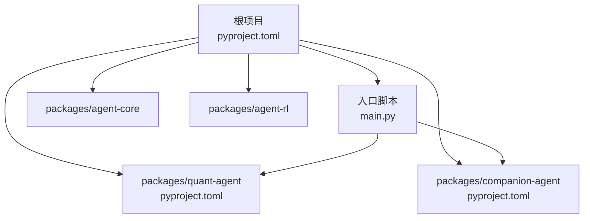
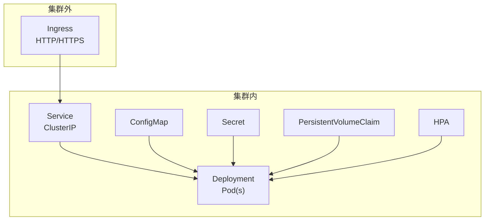
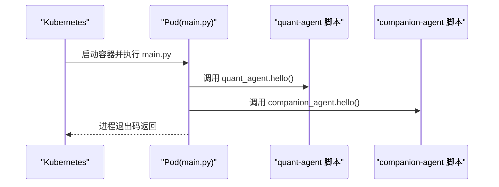
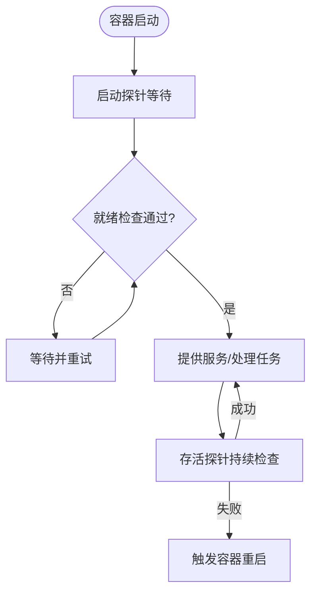
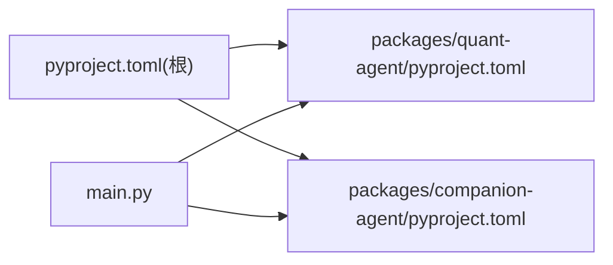

# Kubernetes 部署

<cite>
**本文引用的文件**   
- [main.py](file://main.py)
- [pyproject.toml](file://pyproject.toml)
- [quant-agent/pyproject.toml](file://packages/quant-agent/pyproject.toml)
- [companion-agent/pyproject.toml](file://packages/companion-agent/pyproject.toml)
</cite>

## 目录
1. [简介](#简介)
2. [项目结构](#项目结构)
3. [核心组件](#核心组件)
4. [架构总览](#架构总览)
5. [详细组件分析](#详细组件分析)
6. [依赖分析](#依赖分析)
7. [性能考虑](#性能考虑)
8. [故障排查指南](#故障排查指南)
9. [结论](#结论)
10. [附录](#附录)

## 简介
本指南面向在 Kubernetes 集群中部署 JanusAgent 的工程师与运维人员，提供从资源清单（Deployment、Service、ConfigMap、Secret）到水平扩缩容、健康检查、Ingress 路由、持久化存储、日志与监控指标暴露，以及 Helm Chart 打包发布、滚动更新与回滚策略的完整说明。文档基于仓库现有代码结构与入口点进行分析，确保建议与实现一致。

## 项目结构
JanusAgent 采用 Python 多包工作区组织，根项目通过 uv 管理依赖与工作区成员，主入口 main.py 启动后调用两个子智能体模块并输出信息。各子包各自维护独立的 pyproject.toml，并通过脚本入口暴露命令行工具。

图表来源
- [main.py:1-13](file://main.py#L1-L13)
- [pyproject.toml:1-30](file://pyproject.toml#L1-L30)
- [quant-agent/pyproject.toml:1-18](file://packages/quant-agent/pyproject.toml#L1-L18)
- [companion-agent/pyproject.toml:1-18](file://packages/companion-agent/pyproject.toml#L1-L18)

章节来源
- [main.py:1-13](file://main.py#L1-L13)
- [pyproject.toml:1-30](file://pyproject.toml#L1-L30)
- [quant-agent/pyproject.toml:1-18](file://packages/quant-agent/pyproject.toml#L1-L18)
- [companion-agent/pyproject.toml:1-18](file://packages/companion-agent/pyproject.toml#L1-L18)

## 核心组件
- 应用入口：main.py 作为容器进程入口，负责初始化并调用子智能体模块。
- 子智能体脚本：quant-agent 与 companion-agent 分别通过各自的 pyproject.scripts 暴露可执行命令，便于在容器中以独立进程或任务方式运行。
- 依赖与工作区：根 pyproject.toml 声明 uv 工作区成员与依赖关系，构建镜像时需确保工作区依赖安装完成。

章节来源
- [main.py:1-13](file://main.py#L1-L13)
- [quant-agent/pyproject.toml:12-13](file://packages/quant-agent/pyproject.toml#L12-L13)
- [companion-agent/pyproject.toml:12-13](file://packages/companion-agent/pyproject.toml#L12-L13)
- [pyproject.toml:14-17](file://pyproject.toml#L14-L17)

## 架构总览
Kubernetes 部署由以下关键资源构成：
- Deployment：定义 Pod 模板、副本数、滚动更新策略、探针、环境变量挂载等。
- Service：为 Pod 提供稳定的 ClusterIP 访问入口。
- ConfigMap：注入非敏感配置项（如日志级别、外部服务地址等）。
- Secret：注入敏感配置（如 API Key、数据库凭据等）。
- Ingress：对外暴露 HTTP/HTTPS 访问路径，结合 TLS 与域名。
- HPA：根据 CPU/内存或自定义指标进行水平扩缩容。
- PersistentVolumeClaim：为需要持久化的数据提供卷绑定。

[此图为概念性架构图，不直接映射具体源码文件]

## 详细组件分析

### 入口与进程模型
- 容器进程模型：推荐将 main.py 作为容器主进程（ENTRYPOINT/CMD），其内部会依次调用 quant-agent 与 companion-agent 的逻辑。若需将两者拆分为独立 Sidecar 或 Job，可在 Deployment 中定义多个容器或使用 CronJob/Job。
- 脚本入口：quant-agent 与 companion-agent 的脚本名已在各自 pyproject.scripts 中定义，可用于在容器中以命令形式直接调用。

图表来源
- [main.py:5-8](file://main.py#L5-L8)
- [quant-agent/pyproject.toml:12-13](file://packages/quant-agent/pyproject.toml#L12-L13)
- [companion-agent/pyproject.toml:12-13](file://packages/companion-agent/pyproject.toml#L12-L13)

章节来源
- [main.py:1-13](file://main.py#L1-L13)
- [quant-agent/pyproject.toml:12-13](file://packages/quant-agent/pyproject.toml#L12-L13)
- [companion-agent/pyproject.toml:12-13](file://packages/companion-agent/pyproject.toml#L12-L13)

### 资源清单编写要点
- Deployment
  - 容器镜像：使用包含已安装工作区依赖的镜像。
  - 资源限制与请求：设置 requests/limits 的 CPU 与内存，避免节点过载。
  - 滚动更新策略：使用 RollingUpdate，合理设置 maxUnavailable 与 maxSurge。
  - 探针：
    - livenessProbe：用于检测进程是否存活。
    - readinessProbe：用于判断是否就绪接收流量。
    - startupProbe：针对冷启动较长的场景，避免误判失败。
  - 环境变量与挂载：通过 envFrom 引用 ConfigMap 与 Secret；如需持久化，挂载 PVC。
- Service
  - 类型：默认 ClusterIP；如需 NodePort/LoadBalancer 暴露，按需调整。
  - 端口映射：将 Service 端口映射至容器端口。
- ConfigMap
  - 用途：存放非敏感配置，如日志级别、外部服务 URL、功能开关等。
- Secret
  - 用途：存放敏感信息，如 API Key、数据库连接串、证书等。
- Ingress
  - 注解：根据 Ingress 控制器（如 Nginx、ALB、Contour）添加相应注解。
  - 规则：按路径或主机名转发到 Service。
  - TLS：配置证书与域名。
- HPA
  - 指标：CPU/内存利用率或自定义指标（如 QPS、队列长度）。
  - 范围：minReplicas/maxReplicas 与目标利用率阈值。
- 持久化存储
  - StorageClass：选择合适后端（云盘、NFS、Ceph RBD 等）。
  - PVC：声明容量与访问模式（ReadWriteOnce/ReadWriteMany）。

[本节为通用实践说明，未直接分析具体源码文件]

### 健康检查设计
- 进程级健康：
  - livenessProbe：对 main.py 进程执行轻量检查（例如读取 /proc/self/status 或执行简单命令），失败则重启容器。
  - readinessProbe：当依赖加载完毕且子智能体可用时返回成功，使 Service 开始转发流量。
  - startupProbe：为长启动场景预留时间，避免过早判定失败。
- 业务级健康：
  - 若后续扩展出 HTTP 接口，可提供 /healthz 与 /readyz 端点，分别对应存活与就绪。
  - 对于仅 CLI 模式的当前实现，可通过周期性执行轻量命令或探测依赖可用性来模拟就绪状态。

[此图为概念性流程图，不直接映射具体源码文件]

### 水平扩缩容（HPA）
- 基于资源的扩缩容：
  - 依据 CPU/内存平均利用率自动调整副本数。
  - 建议先采集一段时间基线，再设定合理的 targetUtilizationPercentage。
- 基于指标的扩缩容：
  - 若引入 Prometheus Adapter，可基于自定义指标（如消息队列积压、请求延迟）进行扩缩容。
- 行为参数：
  - scaleDown.stabilizationWindowSeconds：防止抖动频繁缩容。
  - scaleUp.stabilizationWindowSeconds：快速扩容时的稳定窗口。

[本节为通用实践说明，未直接分析具体源码文件]

### Ingress 路由与外部访问
- 域名与路径：
  - 为不同环境或租户配置不同 host/path，指向同一 Service。
- 安全：
  - 启用 TLS，配置证书管理（如 cert-manager）。
  - 根据需求开启 WAF、限流、鉴权等注解。
- 负载均衡：
  - 根据 Ingress 控制器选择合适的负载均衡方案（云厂商 LB、Nginx Ingress 等）。

[本节为通用实践说明，未直接分析具体源码文件]

### 持久化存储配置
- 适用场景：
  - 缓存、临时文件、日志落盘、模型权重或中间结果持久化。
- 配置要点：
  - 选择高性能 StorageClass（如 SSD 云盘）。
  - 合理设置容量与 IOPS 配额。
  - 多副本写入需使用 ReadWriteMany 的存储后端。

[本节为通用实践说明，未直接分析具体源码文件]

### 日志收集方案
- 容器标准输出：
  - 将 stdout/stderr 输出结构化 JSON，便于集中采集。
- 采集器：
  - 使用 DaemonSet 形式的日志采集器（如 Fluent Bit、Fluentd、Filebeat）收集所有 Pod 日志。
- 索引与查询：
  - 将日志投递至 Elasticsearch/OpenSearch、Cloud Logging 或 Loki 等平台。
- 轮转与保留：
  - 在采集层或存储层配置轮转与保留策略，控制成本。

[本节为通用实践说明，未直接分析具体源码文件]

### 监控指标暴露
- 系统指标：
  - 通过 cAdvisor/Kubelet 获取容器 CPU/内存/网络/磁盘指标。
- 应用指标：
  - 若后续扩展出 HTTP 接口，可暴露 /metrics 端点供 Prometheus 抓取。
  - 使用 OpenMetrics/Prometheus Client 库导出自定义指标（如任务计数、错误率、耗时分布）。
- 告警：
  - 基于 Prometheus Alertmanager 或云监控平台配置告警规则。

[本节为通用实践说明，未直接分析具体源码文件]

### Helm Chart 打包与发布流程
- 目录结构：
  - templates/：放置 Kubernetes 资源模板（Deployment、Service、ConfigMap、Secret、Ingress、HPA、PVC 等）。
  - values.yaml：默认值与环境差异配置。
  - Chart.yaml：Chart 元信息（名称、版本、依赖等）。
- 本地验证：
  - 使用 helm template/helm lint 校验模板语法与渲染结果。
- 打包与发布：
  - 使用 helm package 打包，上传至私有仓库（OCI 或 Helm Repository）。
  - 使用 helm install/upgrade 进行部署与升级。
- 版本管理：
  - 遵循语义化版本，变更 Chart 时同步更新版本号。

[本节为通用实践说明，未直接分析具体源码文件]

### 滚动更新与回滚策略
- 滚动更新：
  - 使用 RollingUpdate 策略，逐步替换旧 Pod，保证服务可用。
  - 合理设置 maxUnavailable 与 maxSurge，平衡更新速度与稳定性。
- 健康检查：
  - 利用 readinessProbe 确保新 Pod 完全就绪后再继续滚动。
- 回滚：
  - 使用 kubectl rollout undo 或 Helm rollback 快速回退到上一版本。
- 灰度与金丝雀：
  - 借助 Ingress 权重或 Service 拆分，逐步放量新版本。

[本节为通用实践说明，未直接分析具体源码文件]

## 依赖分析
- 工作区依赖：
  - 根 pyproject.toml 声明 uv 工作区成员 packages/*，构建镜像时应确保工作区依赖安装完成。
- 脚本入口：
  - quant-agent 与 companion-agent 分别在各自 pyproject.toml 中定义脚本入口，便于在容器中以命令形式调用。
- 主入口：
  - main.py 导入并调用 quant_agent 与 companion_agent 模块，作为容器主进程。

图表来源
- [pyproject.toml:14-17](file://pyproject.toml#L14-L17)
- [quant-agent/pyproject.toml:12-13](file://packages/quant-agent/pyproject.toml#L12-L13)
- [companion-agent/pyproject.toml:12-13](file://packages/companion-agent/pyproject.toml#L12-L13)
- [main.py:1-8](file://main.py#L1-L8)

章节来源
- [pyproject.toml:14-17](file://pyproject.toml#L14-L17)
- [quant-agent/pyproject.toml:12-13](file://packages/quant-agent/pyproject.toml#L12-L13)
- [companion-agent/pyproject.toml:12-13](file://packages/companion-agent/pyproject.toml#L12-L13)
- [main.py:1-8](file://main.py#L1-L8)

## 性能考虑
- 资源配额：
  - 为每个容器设置合理的 requests/limits，避免争抢与 OOM。
- 副本数：
  - 根据负载基线与峰值设定初始副本数，并结合 HPA 动态调整。
- 启动优化：
  - 使用多阶段构建减小镜像体积，预热依赖，缩短启动时间。
- 存储 IO：
  - 选择低延迟高吞吐的存储后端，避免 I/O 瓶颈影响任务处理。
- 网络：
  - 减少跨节点通信开销，必要时在同一节点调度相关 Pod。

[本节为通用实践说明，未直接分析具体源码文件]

## 故障排查指南
- 容器无法启动：
  - 查看事件与日志：kubectl describe pod/pod-name、kubectl logs pod/pod-name。
  - 检查镜像拉取权限与镜像是否存在。
- 进程异常退出：
  - 确认 main.py 与子模块导入正确，依赖已安装。
  - 检查环境变量与 Secret/ConfigMap 是否正确挂载。
- 健康检查失败：
  - 核对探针路径/命令与返回值，确保就绪逻辑覆盖依赖加载完成。
- 滚动更新卡住：
  - 检查 readinessProbe 是否长期失败，必要时降低 maxUnavailable 或延长探针超时。
- 回滚操作：
  - 使用 kubectl rollout undo deployment/deployment-name 或 Helm rollback 恢复上一版本。

[本节为通用实践说明，未直接分析具体源码文件]

## 结论
通过在 Kubernetes 中合理编排 Deployment、Service、ConfigMap、Secret、Ingress、HPA 与 PVC，并结合完善的健康检查、日志与监控体系，可实现 JanusAgent 的高可用、可扩展与易运维部署。配合 Helm 的标准化打包与发布流程，能够显著提升交付效率与一致性。

## 附录
- 参考入口与脚本：
  - 主入口：main.py
  - 子智能体脚本：quant-agent、companion-agent（见各自 pyproject.scripts）
- 工作区与依赖：
  - 根 pyproject.toml 中的 uv workspace 成员与依赖声明

章节来源
- [main.py:1-13](file://main.py#L1-L13)
- [quant-agent/pyproject.toml:12-13](file://packages/quant-agent/pyproject.toml#L12-L13)
- [companion-agent/pyproject.toml:12-13](file://packages/companion-agent/pyproject.toml#L12-L13)
- [pyproject.toml:14-17](file://pyproject.toml#L14-L17)