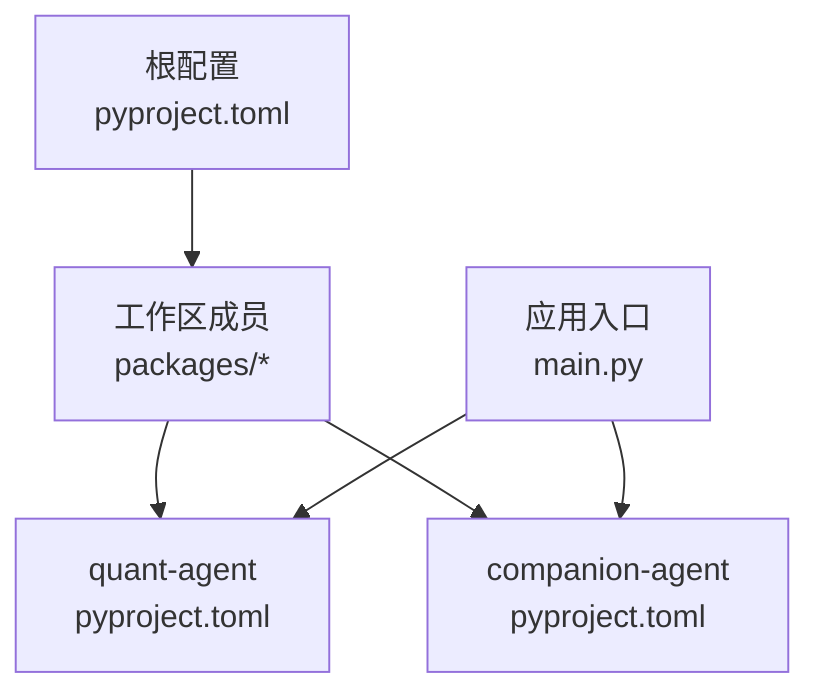
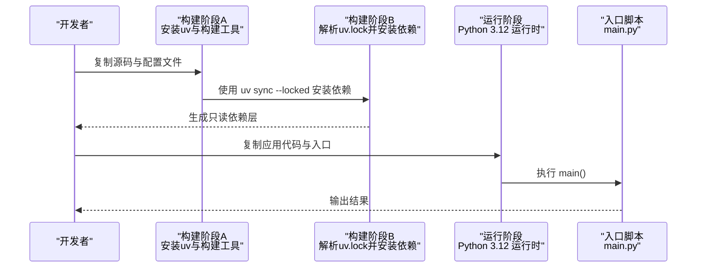
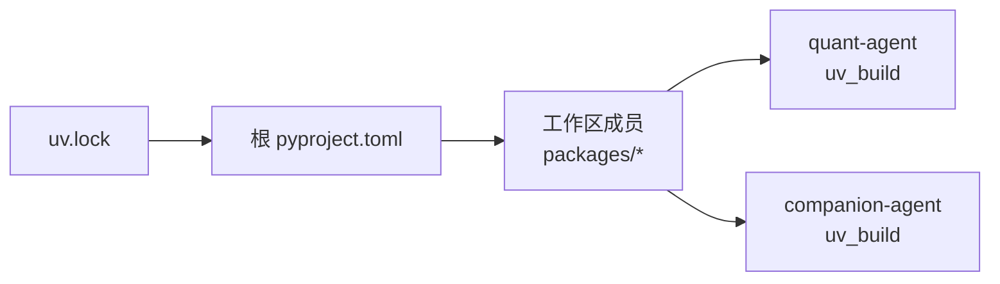

# 基础镜像构建

<cite>
**本文引用的文件**   
- [pyproject.toml](file://pyproject.toml)
- [uv.lock](file://uv.lock)
- [main.py](file://main.py)
- [quant-agent/pyproject.toml](file://packages/quant-agent/pyproject.toml)
- [companion-agent/pyproject.toml](file://packages/companion-agent/pyproject.toml)
</cite>

## 目录
1. [简介](#简介)
2. [项目结构](#项目结构)
3. [核心组件](#核心组件)
4. [架构总览](#架构总览)
5. [详细组件分析](#详细组件分析)
6. [依赖分析](#依赖分析)
7. [性能考虑](#性能考虑)
8. [故障排查指南](#故障排查指南)
9. [结论](#结论)
10. [附录](#附录)

## 简介
本指南面向 JanusAgent 的“基础 Docker 镜像”构建，目标是：
- 使用多阶段构建策略，最小化最终镜像体积并提升可维护性
- 基于 Python 3.12+ 环境，集成 uv 包管理器与 uv.lock 锁定依赖
- 优化镜像分层与缓存，缩短构建时间
- 提供安全加固、漏洞修复与生产扫描建议
- 建立镜像版本管理与标签策略

## 项目结构
仓库采用多包工作区（workspace）组织，根 pyproject.toml 声明了 Python 版本约束与工作区成员；各子包通过 uv_build 作为后端进行打包。入口脚本 main.py 聚合多个子包的 CLI 能力。

图表来源
- [pyproject.toml:1-30](file://pyproject.toml#L1-L30)
- [quant-agent/pyproject.toml:1-18](file://packages/quant-agent/pyproject.toml#L1-L18)
- [companion-agent/pyproject.toml:1-18](file://packages/companion-agent/pyproject.toml#L1-L18)
- [main.py:1-13](file://main.py#L1-L13)

章节来源
- [pyproject.toml:1-30](file://pyproject.toml#L1-L30)
- [main.py:1-13](file://main.py#L1-L13)

## 核心组件
- 工作区与依赖声明：根 pyproject.toml 定义 requires-python>=3.12，并通过 workspace 将 packages/* 纳入工作区，同时声明对 agent-core、agent-rl、quant-agent、companion-agent 的依赖。
- 子包构建系统：quant-agent 与 companion-agent 使用 uv_build 作为构建后端，确保在容器内以 uv 生态完成构建与安装。
- 应用入口：main.py 调用 quant_agent 与 companion_agent 的 hello 函数，演示多包组合运行。

章节来源
- [pyproject.toml:1-30](file://pyproject.toml#L1-L30)
- [quant-agent/pyproject.toml:15-18](file://packages/quant-agent/pyproject.toml#L15-L18)
- [companion-agent/pyproject.toml:15-18](file://packages/companion-agent/pyproject.toml#L15-L18)
- [main.py:1-13](file://main.py#L1-L13)

## 架构总览
下图展示从源码到生产镜像的多阶段构建流程，以及运行时入口。

图表来源
- [pyproject.toml:1-30](file://pyproject.toml#L1-L30)
- [uv.lock:1-20](file://uv.lock#L1-L20)
- [main.py:1-13](file://main.py#L1-L13)

## 详细组件分析

### 多阶段构建策略与分层最佳实践
- 阶段一（构建器）：基于 python:3.12-slim，安装 uv 与必要的编译工具链（如需要），用于解析 uv.lock 并生成 wheel 缓存。
- 阶段二（运行器）：仅包含 Python 运行时与应用代码，不携带构建工具与中间产物，显著减小镜像体积。
- 分层优化要点：
  - 先复制 pyproject.toml 与 uv.lock，再复制完整源码，使依赖层变更时能命中缓存。
  - 使用 uv sync --locked 严格遵循锁文件，避免非确定性安装。
  - 将应用代码置于独立层，便于增量更新。
  - 清理构建缓存与临时文件，避免带入运行镜像。

章节来源
- [pyproject.toml:1-30](file://pyproject.toml#L1-L30)
- [uv.lock:1-20](file://uv.lock#L1-L20)

### Python 3.12+ 环境与 uv 集成
- 基础镜像选择：python:3.12-slim，兼顾体积与兼容性。
- uv 集成：在构建阶段安装 uv，并使用 uv sync --locked 依据 uv.lock 安装所有工作区依赖，保证可重复构建。
- 工作区支持：根 pyproject.toml 已声明 workspace members=packages/*，构建时需在工作区根目录执行 uv 命令，以便解析本地包源。

章节来源
- [pyproject.toml:14-17](file://pyproject.toml#L14-L17)
- [pyproject.toml:25-30](file://pyproject.toml#L25-L30)

### 安全加固措施
- 使用非 root 用户运行容器，降低权限风险。
- 最小化基础镜像，移除不必要的系统包与文档。
- 固定依赖版本（uv.lock），避免上游变更引入未知风险。
- 启用只读文件系统（可选），限制写入路径。
- 定期扫描镜像漏洞并升级依赖。

[本节为通用安全建议，不直接分析具体文件]

### 镜像大小最小化技巧
- 优先使用 slim 或 distroless 类基础镜像。
- 合并 RUN 指令减少层数。
- 删除构建缓存与 pip/uv 缓存。
- 仅拷贝必要文件，排除 .git、测试与文档。
- 使用 .dockerignore 排除无关文件。

[本节为通用优化建议，不直接分析具体文件]

### 生产环境镜像的安全扫描与漏洞修复
- 使用 Trivy、Grype 等工具扫描镜像，定位 CVE 与高危依赖。
- 针对关键漏洞升级相关依赖，重新生成 uv.lock 并提交。
- 在 CI 中集成扫描门禁，阻断含高危漏洞的镜像发布。
- 定期拉取基础镜像更新，评估兼容性与影响范围。

[本节为通用运维建议，不直接分析具体文件]

### 镜像版本管理与标签策略
- 语义化标签：主版本.次版本.修订号（例如 v0.1.0）。
- 分支标签：按功能分支打前缀标签（feature-xxx）。
- 构建时间戳：附加短哈希或时间戳用于追溯（例如 sha256:xxxx）。
- 推送策略：CI 自动构建并推送至镜像仓库，保留 latest 指向最新稳定版。

[本节为通用管理建议，不直接分析具体文件]

## 依赖分析
- 根 pyproject.toml 声明 requires-python>=3.12，并通过 workspace 将 packages/* 纳入工作区，依赖包括 agent-core、agent-rl、quant-agent、companion-agent。
- uv.lock 记录了精确的依赖树与版本，构建时应使用 uv sync --locked 以确保一致性。
- 子包使用 uv_build 作为构建后端，确保在容器内以 uv 生态完成构建与安装。

图表来源
- [pyproject.toml:1-30](file://pyproject.toml#L1-L30)
- [uv.lock:1-20](file://uv.lock#L1-L20)
- [quant-agent/pyproject.toml:15-18](file://packages/quant-agent/pyproject.toml#L15-L18)
- [companion-agent/pyproject.toml:15-18](file://packages/companion-agent/pyproject.toml#L15-L18)

章节来源
- [pyproject.toml:1-30](file://pyproject.toml#L1-L30)
- [uv.lock:1-20](file://uv.lock#L1-L20)

## 性能考虑
- 利用 uv 的高速解析与缓存机制，结合 uv.lock 实现快速、可重复的安装。
- 合理分层：依赖层与应用层分离，最大化缓存命中率。
- 并行构建：在多核环境中启用 uv 的并发选项（若适用）。
- 精简依赖：按需启用可选依赖组，避免引入不必要的大包。

[本节为通用性能建议，不直接分析具体文件]

## 故障排查指南
- 构建失败：检查 requires-python 与基础镜像版本是否匹配；确认 uv.lock 与当前源码一致。
- 依赖解析异常：核对 workspace members 与本地包路径是否正确；必要时重新生成 uv.lock。
- 运行时错误：确认入口脚本与子包导出函数存在且可被导入。
- 权限问题：确保容器内非 root 用户对必要路径有读写权限。

章节来源
- [pyproject.toml:6](file://pyproject.toml#L6)
- [pyproject.toml:14-17](file://pyproject.toml#L14-L17)
- [main.py:1-13](file://main.py#L1-L13)

## 结论
通过多阶段构建、uv 与 uv.lock 的深度集成、严格的分层与缓存策略，以及完善的安全加固与版本管理，可以为 JanusAgent 构建出体积小、可重复、易维护的生产级基础镜像。建议在 CI 中固化构建与扫描流程，持续保障镜像质量与安全。

[本节为总结性内容，不直接分析具体文件]

## 附录
- 参考命令（概念性说明，不包含具体代码）：
  - 构建镜像：在仓库根目录执行 docker build，指定多阶段 Dockerfile。
  - 运行镜像：以非 root 用户启动容器，挂载必要数据卷，设置环境变量。
  - 扫描镜像：使用 Trivy 扫描并生成报告，根据报告修复依赖。
  - 版本标签：按语义化规则打标签并推送到镜像仓库。

[本节为补充信息，不直接分析具体文件]