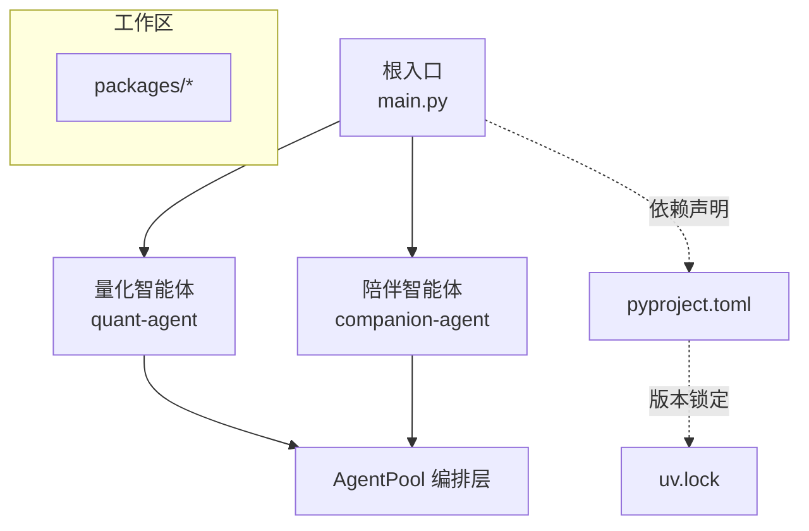
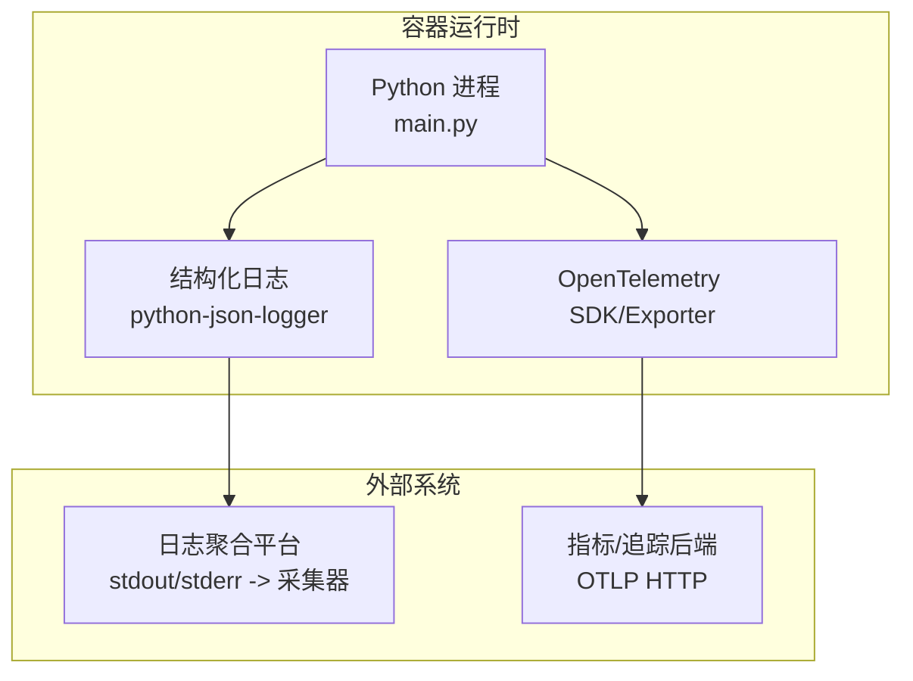
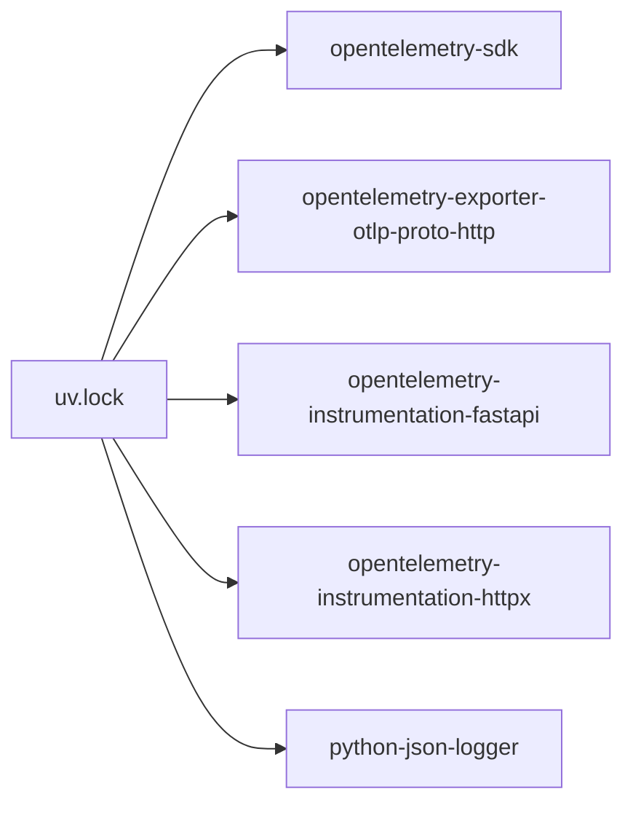
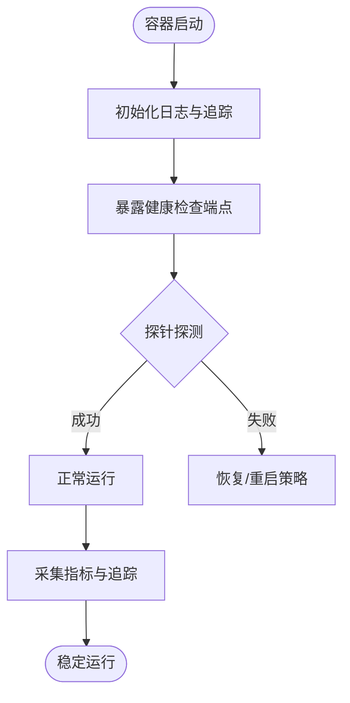

# 容器监控与调试

<cite>
**本文引用的文件**   
- [main.py](file://main.py)
- [pyproject.toml](file://pyproject.toml)
- [uv.lock](file://uv.lock)
- [systematic-debugging/SKILL.md](file://.agent/skills/systematic-debugging/SKILL.md)
- [project.md](file://.agent/context/project.md)
</cite>

## 目录
1. [简介](#简介)
2. [项目结构](#项目结构)
3. [核心组件](#核心组件)
4. [架构总览](#架构总览)
5. [详细组件分析](#详细组件分析)
6. [依赖分析](#依赖分析)
7. [性能考虑](#性能考虑)
8. [故障排查指南](#故障排查指南)
9. [结论](#结论)
10. [附录](#附录)

## 简介
本指南面向将 JanusAgent 以容器化方式运行的团队，聚焦于可观测性与可维护性：日志收集策略（结构化与聚合）、性能指标定义与采集、健康检查与存活探针、远程调试配置与常用诊断工具，以及常见问题定位与优化建议。文档基于仓库现有代码与依赖信息整理，确保内容与实际实现一致。

## 项目结构
JanusAgent 采用多包工作区组织，根入口 main.py 负责编排子模块并输出基础运行信息；依赖通过 pyproject.toml 声明，实际锁定版本在 uv.lock 中体现。当前仓库未包含 Dockerfile 或 Kubernetes 清单，但已具备用于遥测/可观测性的第三方库依赖线索。

图示来源
- [main.py:1-13](file://main.py#L1-L13)
- [pyproject.toml:1-30](file://pyproject.toml#L1-L30)
- [uv.lock:2534-2553](file://uv.lock#L2534-L2553)

章节来源
- [main.py:1-13](file://main.py#L1-L13)
- [pyproject.toml:1-30](file://pyproject.toml#L1-L30)
- [uv.lock:2534-2553](file://uv.lock#L2534-L2553)

## 核心组件
- 应用入口与启动流程
  - 根入口 main.py 打印框架标识并调用各子模块的 hello 方法，作为容器启动后的首个可见输出点，便于验证镜像与进程是否正常拉起。
- 依赖与可观测性能力
  - 通过 uv.lock 可见项目引入了 OpenTelemetry 生态（SDK、导出器、FastAPI/HTTPX 自动埋点）以及 python-json-logger，为结构化日志与分布式追踪提供基础。

章节来源
- [main.py:1-13](file://main.py#L1-L13)
- [uv.lock:2534-2553](file://uv.lock#L2534-L2553)

## 架构总览
从容器视角看，JanusAgent 由单进程 Python 应用组成，内部按功能划分为多个包。可观测性层面，建议在容器内统一输出结构化日志，并通过 OTLP 上报遥测数据至后端系统。

图示来源
- [main.py:1-13](file://main.py#L1-L13)
- [uv.lock:2534-2553](file://uv.lock#L2534-L2553)

## 详细组件分析

### 日志收集策略（结构化与聚合）
- 目标
  - 所有关键路径输出结构化 JSON 日志，便于集中检索、过滤与告警。
- 推荐方案
  - 使用 python-json-logger 对标准日志进行结构化封装，统一字段如时间戳、级别、服务名、实例 ID、请求上下文等。
  - 容器内仅输出到 stdout/stderr，交由容器运行时或日志采集器统一抓取，避免在容器内落盘造成 I/O 压力。
- 与 OpenTelemetry 的关系
  - 日志与追踪可结合：在日志中注入 trace_id/span_id，以便跨系统关联。
- 注意事项
  - 控制日志粒度与采样率，避免高吞吐场景下产生过多日志。
  - 敏感信息脱敏后再输出。

章节来源
- [uv.lock:4380-4384](file://uv.lock#L4380-L4384)

### 性能监控指标（CPU、内存与应用指标）
- 系统级指标
  - CPU 使用率、内存占用、GC 统计、线程/协程数、文件描述符数量等。
- 应用级指标
  - 请求量、延迟分布、错误率、队列长度、任务完成计数、外部依赖调用耗时等。
- 采集方式
  - 优先使用容器编排平台提供的指标采集（例如 cgroup 指标），并在应用侧暴露必要的业务指标端点或通过 OTLP 上报。
- 与 OpenTelemetry 集成
  - 利用 opentelemetry-sdk 与相关 instrumentation 自动采集 HTTP/FastAPI/HTTPX 等调用链与指标。

章节来源
- [uv.lock:2534-2553](file://uv.lock#L2534-L2553)

### 健康检查与存活探针
- 设计原则
  - 就绪探针：验证依赖可用、初始化完成、端口监听正常。
  - 存活探针：检测进程是否仍在运行且能响应基本请求。
- 建议实现
  - 提供一个轻量 /healthz 接口，返回 200 表示存活；/readyz 接口在依赖就绪后返回 200。
  - 若未内置 Web 框架，可通过最小 HTTP 服务器或进程心跳文件配合外部探针实现。
- 容器编排提示
  - 合理设置初始延迟、探测间隔与失败阈值，避免误杀。

说明：当前仓库未包含健康检查端点的具体实现，建议在上层服务中补充。

### 远程调试配置
- 适用场景
  - 开发/测试环境联调、问题复现与定位。
- 建议做法
  - 在容器启动参数中启用 Python 调试器（如 debugpy），绑定到宿主网络或映射端口，限制访问范围。
  - 生产环境默认关闭远程调试，仅在必要时临时开启并严格审计。
- 安全注意
  - 仅在内网或受控网络中暴露调试端口，避免公网可达。

说明：当前仓库未包含调试器依赖或启动脚本，需按需添加。

### 分布式追踪与链路关联
- 目标
  - 跨服务/跨组件的请求链路可视化与耗时分析。
- 方案
  - 使用 OpenTelemetry SDK 与 FastAPI/HTTPX 自动埋点，统一 trace_id 传播。
  - 将 trace_id 写入结构化日志，便于日志与追踪联动。

章节来源
- [uv.lock:2534-2553](file://uv.lock#L2534-L2553)

## 依赖分析
- 可观测性相关依赖
  - OpenTelemetry：SDK、导出器（HTTP）、FastAPI/HTTPX 自动埋点。
  - 结构化日志：python-json-logger。
- 作用域
  - 这些依赖位于 uv.lock 中，表明项目已具备接入可观测性基础设施的能力。

图示来源
- [uv.lock:2534-2553](file://uv.lock#L2534-L2553)
- [uv.lock:4380-4384](file://uv.lock#L4380-L4384)

章节来源
- [uv.lock:2534-2553](file://uv.lock#L2534-L2553)
- [uv.lock:4380-4384](file://uv.lock#L4380-L4384)

## 性能考虑
- 日志与追踪开销
  - 在高吞吐场景下，建议对日志与追踪进行采样与批处理，降低序列化与网络开销。
- 资源隔离
  - 为容器设置合理的 CPU/内存限制，避免抖动影响整体稳定性。
- 外部依赖
  - 对下游服务的超时、重试与熔断策略要完善，防止雪崩。
- 指标采集频率
  - 合理设置指标采集周期，平衡实时性与负载。

## 故障排查指南
- 系统化排障流程
  - 遵循“先定位根因再修复”的原则，分阶段收集证据、复现问题、追溯数据流，避免盲目打补丁。
- 常见步骤
  - 查看容器日志与事件，确认启动顺序与依赖状态。
  - 核对环境变量与配置注入是否正确。
  - 使用最小用例复现问题，逐步缩小范围。
  - 结合追踪与结构化日志，定位慢调用与异常分支。
- 参考方法论
  - 参见系统化调试技能文档中的四阶段法与支撑技巧。

章节来源
- [.agent/skills/systematic-debugging/SKILL.md:1-297](file://.agent/skills/systematic-debugging/SKILL.md#L1-L297)

## 结论
通过统一的日志规范、完善的指标与追踪体系、稳健的健康检查与探针策略，以及规范的远程调试与排障流程，可以显著提升 JanusAgent 在容器环境下的可观测性与可维护性。建议尽快补齐健康检查端点与日志/追踪初始化逻辑，并与平台侧采集系统对接，形成闭环。

## 附录
- 快速核对清单
  - 是否输出结构化日志？trace_id 是否注入日志？
  - 是否启用 OpenTelemetry 并正确导出？
  - 是否提供 /healthz 与 /readyz 端点？
  - 是否配置了合理的探针参数？
  - 是否限制了远程调试的访问范围？
- 参考架构图（概念）
