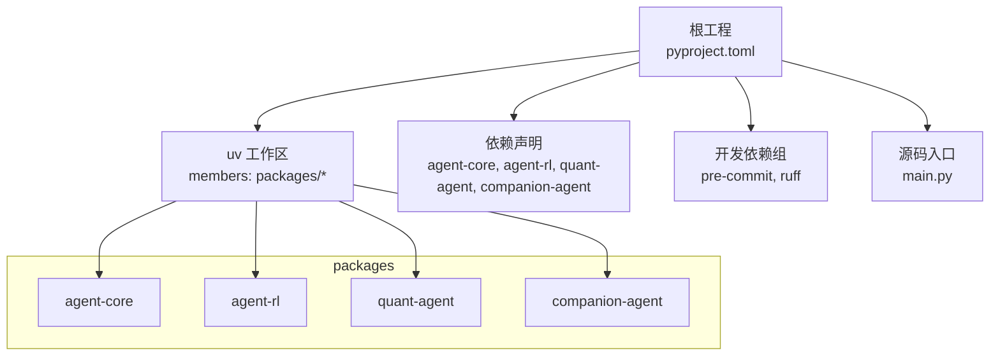
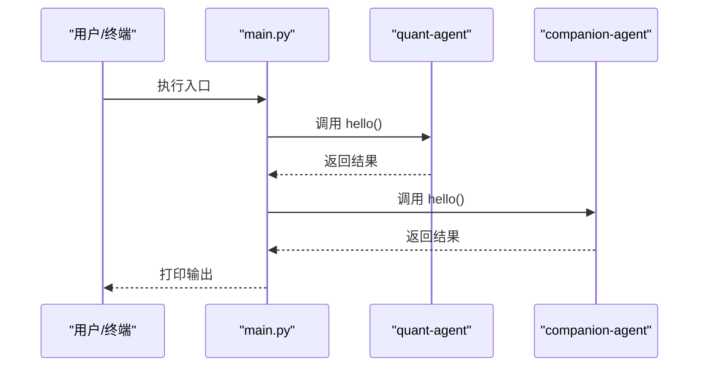
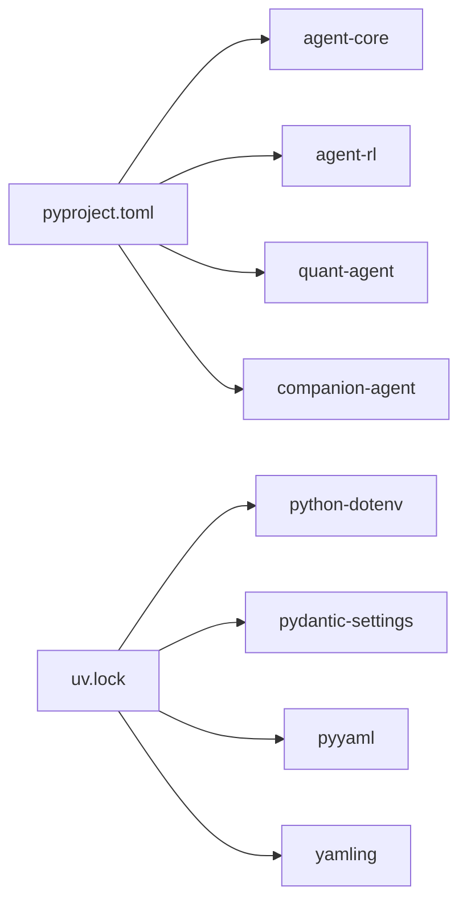

# YAML 配置系统

<cite>
**本文引用的文件**   
- [pyproject.toml](file://pyproject.toml)
- [uv.lock](file://uv.lock)
- [main.py](file://main.py)
</cite>

## 目录
1. [简介](#简介)
2. [项目结构](#项目结构)
3. [核心组件](#核心组件)
4. [架构总览](#架构总览)
5. [详细组件分析](#详细组件分析)
6. [依赖分析](#依赖分析)
7. [性能考虑](#性能考虑)
8. [故障排查指南](#故障排查指南)
9. [结论](#结论)
10. [附录](#附录)

## 简介
本文件聚焦于 JanusAgent 的“YAML 配置系统”与“基于 pyproject.toml 的项目元数据、依赖管理与 uv workspace 配置”。文档将：
- 解析根目录 pyproject.toml 的结构与作用，包括项目元数据、依赖声明、uv workspace 成员与工具链设置。
- 梳理 agent-core、quant-agent、companion-agent、agent-rl 等模块在顶层工程中的集成方式与可配置点（以现有仓库信息为准）。
- 说明环境变量管理机制（结合已引入的第三方库）与环境切换策略建议。
- 给出配置文件最佳实践与验证规则，确保配置的完整性与正确性。
- 讨论配置热重载与动态加载的实现思路与注意事项（概念性内容，不绑定具体源码）。

## 项目结构
当前仓库采用多包工作区组织，顶层通过 pyproject.toml 声明依赖与工作区成员，并使用 uv 进行依赖解析与锁定。关键要点：
- 顶层 pyproject.toml 定义项目名称、版本、描述、Python 版本要求与依赖集合。
- 使用 tool.uv.workspace.members 指定子包路径为 packages/*，形成 uv 工作区。
- 使用 dependency-groups.dev 声明开发期依赖（如 pre-commit、ruff）。
- 使用 tool.uv.sources 将各子包指向 workspace=true，表示从本地工作区解析而非远程索引。

图表来源
- [pyproject.toml:1-30](file://pyproject.toml#L1-L30)
- [main.py:1-13](file://main.py#L1-L13)

章节来源
- [pyproject.toml:1-30](file://pyproject.toml#L1-L30)
- [main.py:1-13](file://main.py#L1-L13)

## 核心组件
- 项目元数据与运行环境
  - 名称、版本、描述、README 引用与 Python 最低版本要求由顶层 pyproject.toml 的 project 段定义。
- 依赖管理
  - 运行时依赖包含四个子包：agent-core、agent-rl、quant-agent、companion-agent。
  - 开发依赖通过 dependency-groups.dev 管理，便于在开发环境中启用代码质量工具。
- uv workspace 配置
  - members 使用通配符 packages/* 自动纳入所有子包。
  - sources 中各子包均指向 workspace=true，确保本地开发时直接解析到 packages 下的对应包。
- 工具链
  - 开发依赖中包含 pre-commit 与 ruff，用于提交前检查与代码风格统一。

章节来源
- [pyproject.toml:1-30](file://pyproject.toml#L1-L30)

## 架构总览
从应用启动到子模块调用的流程如下：
- main.py 作为入口，导入并调用 quant-agent 与 companion-agent 提供的 hello 函数。
- 顶层 pyproject.toml 声明对这四个子包的依赖，并通过 uv 工作区机制解析本地实现。
- 运行期若需要读取 YAML 或 .env 配置，通常会在子包内部完成（例如使用 pydantic-settings、python-dotenv 等），但当前仓库未提供相关源码片段。

图表来源
- [main.py:1-13](file://main.py#L1-L13)
- [pyproject.toml:1-30](file://pyproject.toml#L1-L30)

## 详细组件分析

### 顶层 pyproject.toml 配置详解
- 项目元数据
  - name/version/description/readme/requires-python 定义了项目基本信息与运行环境约束。
- 依赖声明
  - dependencies 列出四个子包，表明应用组合了多个能力域（量化交易、陪伴式智能体、强化学习、核心框架）。
- uv workspace
  - members 使用 packages/* 自动发现子包，简化维护。
  - sources 将各子包映射到 workspace=true，避免误从远端拉取。
- 工具链与开发依赖
  - dependency-groups.dev 集中管理开发期工具，便于在 CI 或本地快速启用。

章节来源
- [pyproject.toml:1-30](file://pyproject.toml#L1-L30)

### 子包配置选项（按现有仓库信息）
- 现状说明
  - 当前仓库未提供 packages 下各子包的源码与配置文件，因此无法直接枚举其具体的 YAML 配置项。
- 建议的组织方式（通用实践）
  - 每个子包可在自身目录下提供默认配置模板（如 config.yaml / settings.yaml），并在包内通过配置加载器合并环境变量与外部覆盖文件。
  - 推荐将敏感信息（密钥、令牌、连接串）置于环境变量或专用 .env 文件中，不在仓库中硬编码。
- 与顶层工程的集成
  - 通过顶层 pyproject.toml 的 dependencies 与 uv workspace，子包可直接被 main.py 导入与使用。

章节来源
- [pyproject.toml:1-30](file://pyproject.toml#L1-L30)
- [main.py:1-13](file://main.py#L1-L13)

### 环境变量管理机制
- 已引入的相关依赖
  - uv.lock 显示项目中存在 python-dotenv、pydantic-settings 等依赖，常用于加载 .env 与类型化配置。
- 典型用法（概念性说明）
  - 使用 python-dotenv 加载 .env 文件；使用 pydantic-settings 将环境变量映射为强类型配置对象。
  - 支持分层覆盖：默认值 < 配置文件 < 环境变量 < 命令行参数（按优先级叠加）。
- 敏感信息处理
  - 将密钥、密码、API Key 等放入 .env 或平台级密钥管理服务，避免进入版本控制。
  - 在配置模型中将敏感字段标记为 SecretStr 或等价类型，避免日志泄露。
- 环境切换策略
  - 通过环境变量选择不同环境（如 development/staging/production），配合不同的 .env 或配置中心。
  - 建议在 CI 中使用受管密钥注入，在本地使用 .env.local 忽略进仓库。

章节来源
- [uv.lock:4086-4095](file://uv.lock#L4086-L4095)
- [uv.lock:4469-4476](file://uv.lock#L4469-L4476)

### 配置文件最佳实践与验证规则
- 文件组织
  - 将公共基础配置放在共享位置，子包按需继承与覆盖。
  - 使用 include 机制（如 pyyaml-include）拆分大配置，提升可读性与复用性。
- 命名与结构
  - 使用小写下划线命名键名，保持层级清晰；为每个配置项添加注释说明用途与取值范围。
- 校验与默认值
  - 使用 pydantic 模型进行类型校验与默认值填充，启动时尽早失败。
  - 对必填项进行显式校验，缺失则抛出明确错误。
- 安全
  - 禁止在仓库中存放真实密钥；使用占位符与示例文件（如 .env.example）。
  - 对日志输出做脱敏处理，避免打印完整密钥。
- 可观测性
  - 记录加载的配置摘要（不含敏感信息），便于问题定位。
  - 为配置变更增加版本号或哈希，辅助回滚与审计。

[本节为通用指导，不直接分析具体文件]

### 配置热重载与动态加载（概念性说明）
- 热重载触发源
  - 文件系统监听（如 inotify/watchdog）、配置中心推送、HTTP 接口更新。
- 加载流程
  - 检测变更 -> 解析新配置 -> 校验 -> 原子替换内存中的配置对象 -> 通知订阅者。
- 并发与一致性
  - 使用读写锁或不可变配置对象，保证读路径无锁且线程安全。
  - 对关键资源（连接池、缓存）在配置变更后优雅重建。
- 降级与回滚
  - 新配置校验失败时回退到上一份有效配置，并告警。
  - 保留历史快照，支持一键回滚。

[本节为概念性说明，不绑定具体源码]

## 依赖分析
- 顶层依赖与工作区
  - 顶层 pyproject.toml 声明四个子包依赖，并通过 uv workspace 与 sources 指向本地实现。
- 锁定与解析
  - uv.lock 记录了精确的依赖树与版本，确保构建可重复。
- 与配置相关的第三方库
  - uv.lock 中出现 python-dotenv、pydantic-settings、pyyaml、yamling 等，表明项目具备加载 YAML 与 .env 的能力。

图表来源
- [pyproject.toml:1-30](file://pyproject.toml#L1-L30)
- [uv.lock:4086-4095](file://uv.lock#L4086-L4095)
- [uv.lock:4469-4476](file://uv.lock#L4469-L4476)

章节来源
- [pyproject.toml:1-30](file://pyproject.toml#L1-L30)
- [uv.lock:4086-4095](file://uv.lock#L4086-L4095)
- [uv.lock:4469-4476](file://uv.lock#L4469-L4476)

## 性能考虑
- 配置加载时机
  - 在进程启动阶段一次性加载并校验，避免在请求路径中重复 IO。
- 缓存与惰性加载
  - 对非频繁变更的配置项进行内存缓存；对大型配置使用懒加载与按需解析。
- 序列化与反序列化
  - 使用高效的 YAML 解析器，必要时开启流式解析以减少峰值内存。
- 监控与度量
  - 统计配置加载耗时与失败率，接入指标与告警。

[本节为通用指导，不直接分析具体文件]

## 故障排查指南
- 常见问题
  - 环境变量缺失：确认 .env 已加载且变量名大小写一致。
  - 类型不匹配：检查 pydantic 模型定义与实际值是否兼容。
  - 权限问题：确认对配置文件的读取权限与路径正确。
- 定位步骤
  - 打印配置加载摘要（不含敏感信息）。
  - 逐步缩小范围：先加载最小配置集，再逐步叠加。
  - 对比 uv.lock 与本地环境，排除依赖版本差异导致的兼容问题。
- 恢复策略
  - 使用最近一次已知良好的配置快照进行回滚。
  - 临时关闭热重载，稳定后再灰度启用。

[本节为通用指导，不直接分析具体文件]

## 结论
- 顶层 pyproject.toml 清晰定义了项目元数据、依赖与工作区，配合 uv.lock 实现了可重复的依赖解析。
- 当前仓库未暴露子包的具体 YAML 配置项，建议在各子包内建立统一的配置模型与加载器，遵循本文的最佳实践。
- 借助 python-dotenv 与 pydantic-settings，可实现类型安全的环境变量与配置管理；结合热重载与校验回滚，可进一步提升系统的可运维性。

[本节为总结性内容，不直接分析具体文件]

## 附录
- 术语
  - uv：现代 Python 包管理器与工作区工具。
  - pydantic-settings：基于 pydantic 的类型化配置加载器。
  - python-dotenv：加载 .env 文件的环境变量注入工具。
- 参考路径
  - 顶层工程配置：[pyproject.toml](file://pyproject.toml)
  - 依赖锁定：[uv.lock](file://uv.lock)
  - 应用入口：[main.py](file://main.py)