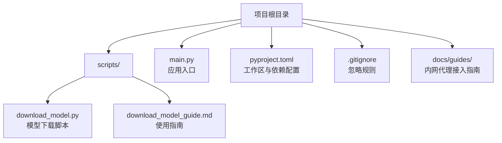
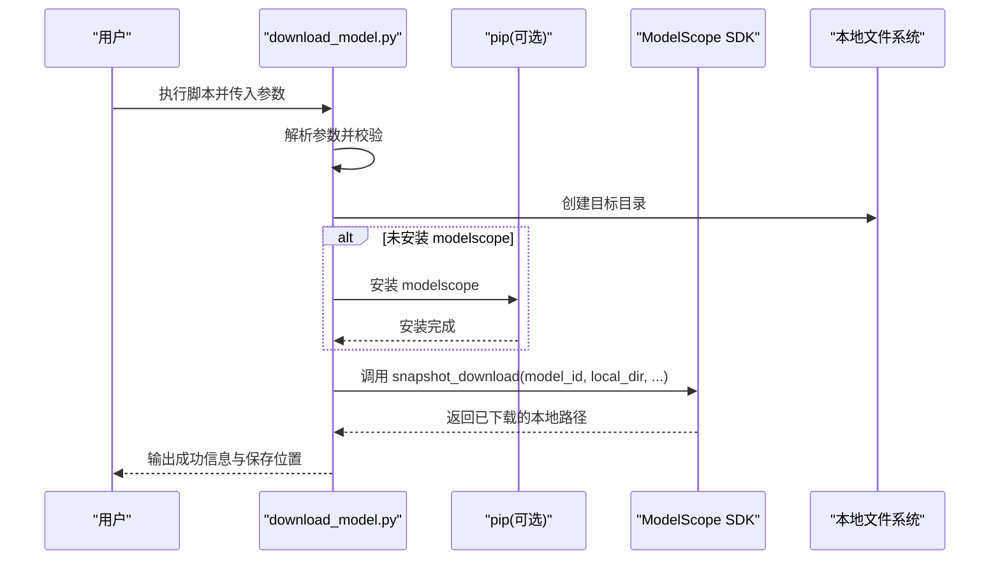
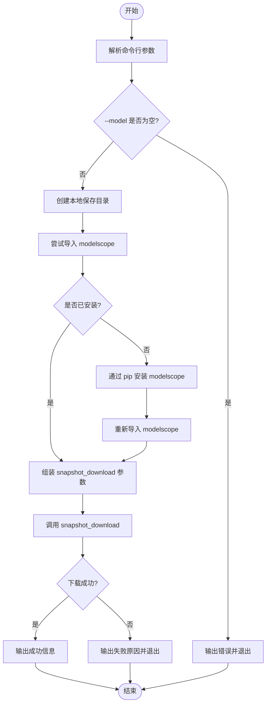
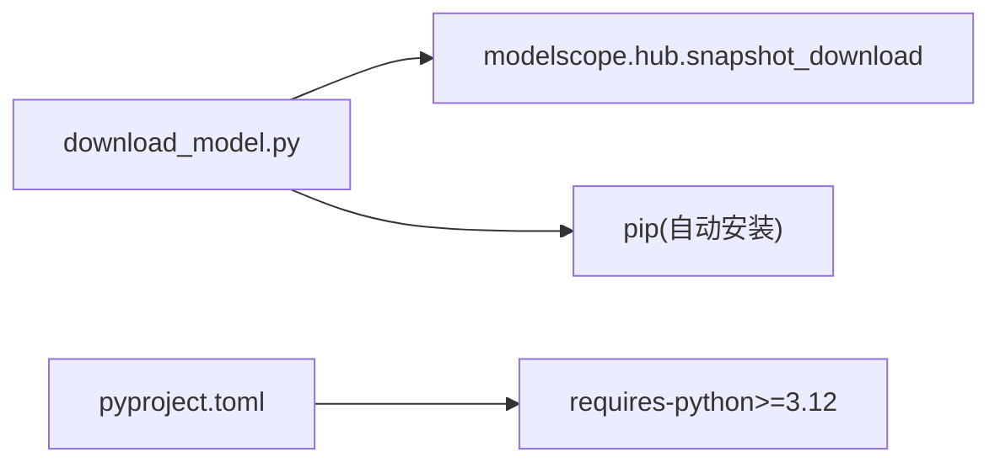

# 模型下载工具

<cite>
**本文引用的文件**   
- [scripts/download_model.py](file://scripts/download_model.py)
- [scripts/download_model_guide.md](file://scripts/download_model_guide.md)
- [main.py](file://main.py)
- [pyproject.toml](file://pyproject.toml)
- [.gitignore](file://.gitignore)
- [docs/guides/gitlab内网代理接入指南.md](file://docs/guides/gitlab内网代理接入指南.md)
</cite>

## 目录
1. [简介](#简介)
2. [项目结构](#项目结构)
3. [核心组件](#核心组件)
4. [架构总览](#架构总览)
5. [详细组件分析](#详细组件分析)
6. [依赖关系分析](#依赖关系分析)
7. [性能与可靠性](#性能与可靠性)
8. [故障排查指南](#故障排查指南)
9. [结论](#结论)
10. [附录](#附录)

## 简介
本仓库包含一个轻量、易用的“模型下载工具”，用于从 ModelScope 平台拉取指定模型到本地。该工具以命令行脚本形式提供，支持断点续传、版本选择、文件过滤（忽略/允许模式）、私有模型访问令牌以及静默模式等能力，适合在个人开发或团队环境中快速准备模型资源。

## 项目结构
围绕“模型下载工具”的相关文件主要位于 scripts 目录，配套使用说明文档也在同一目录下；项目根目录的 main.py 为应用入口，pyproject.toml 定义工作区与依赖，.gitignore 管理忽略规则，docs/guides 下提供网络代理相关参考指南。

图表来源
- [scripts/download_model.py:1-139](file://scripts/download_model.py#L1-L139)
- [scripts/download_model_guide.md:1-148](file://scripts/download_model_guide.md#L1-L148)
- [main.py:1-13](file://main.py#L1-L13)
- [pyproject.toml:1-30](file://pyproject.toml#L1-L30)
- [.gitignore:1-228](file://.gitignore#L1-L228)
- [docs/guides/gitlab内网代理接入指南.md:1-259](file://docs/guides/gitlab内网代理接入指南.md#L1-L259)

章节来源
- [scripts/download_model.py:1-139](file://scripts/download_model.py#L1-L139)
- [scripts/download_model_guide.md:1-148](file://scripts/download_model_guide.md#L1-L148)
- [main.py:1-13](file://main.py#L1-L13)
- [pyproject.toml:1-30](file://pyproject.toml#L1-L30)
- [.gitignore:1-228](file://.gitignore#L1-L228)
- [docs/guides/gitlab内网代理接入指南.md:1-259](file://docs/guides/gitlab内网代理接入指南.md#L1-L259)

## 核心组件
- 命令行参数解析：提供 --model、--local-dir、--revision、--ignore-patterns、--allow-patterns、--token、--quiet、--help 等选项，便于灵活控制下载行为。
- 依赖自动安装：首次运行若未安装 modelscope，将尝试通过 pip 自动安装并继续执行。
- 下载流程封装：基于 ModelScope SDK 的 snapshot_download 接口，统一构建参数并调用，输出清晰的进度与结果信息。
- 错误处理与提示：对常见失败原因给出友好提示，包括网络、模型 ID、版本号、私有模型令牌等。

章节来源
- [scripts/download_model.py:17-72](file://scripts/download_model.py#L17-L72)
- [scripts/download_model.py:75-139](file://scripts/download_model.py#L75-L139)

## 架构总览
整体流程为“用户输入 → 参数校验 → 环境准备 → 调用 SDK 下载 → 结果反馈”。

图表来源
- [scripts/download_model.py:75-139](file://scripts/download_model.py#L75-L139)

## 详细组件分析

### 参数解析与默认值
- 默认模型：OpenDataLab/MinerU2.5-Pro-2605-1.2B
- 默认保存路径：/home/zengqiang/models/MinerU2.5-Pro-2605-1.2B
- 其他关键参数：
  - --revision：指定模型版本或分支
  - --ignore-patterns / --allow-patterns：文件过滤
  - --token：私有模型访问令牌
  - --quiet：静默模式
  - --help：帮助信息

章节来源
- [scripts/download_model.py:17-72](file://scripts/download_model.py#L17-L72)

### 主流程与异常处理
- 参数校验：当 --model 为空时直接退出并提示错误。
- 目录准备：确保 --local-dir 存在。
- 依赖检查：动态导入 modelscope.hub.snapshot_download，缺失则通过 pip 安装后重试导入。
- 下载调用：组装 kwargs 并调用 snapshot_download，捕获异常并打印可能原因。
- 结果输出：成功后打印最终保存路径。

图表来源
- [scripts/download_model.py:75-139](file://scripts/download_model.py#L75-L139)

章节来源
- [scripts/download_model.py:75-139](file://scripts/download_model.py#L75-L139)

### 使用指南与场景
- 快速开始：不传参即下载默认模型到默认路径。
- 指定模型与路径：--model 与 --local-dir 组合使用。
- 指定版本：--revision 指定分支或标签。
- 文件过滤：--ignore-patterns 跳过不必要的大文件；--allow-patterns 仅下载匹配的文件。
- 私有模型：--token 传入访问令牌。
- 静默模式：--quiet 减少输出。

章节来源
- [scripts/download_model_guide.md:17-92](file://scripts/download_model_guide.md#L17-L92)

### 网络与代理
- 环境变量方式：设置 http_proxy/https_proxy 或使用 MODELSCOPE_ENDPOINT 指向国内镜像。
- 内网代理参考：如需通过跳板机访问内网服务，可参考 GitLab 内网代理接入指南中的 SSH 隧道方案。

章节来源
- [scripts/download_model_guide.md:95-114](file://scripts/download_model_guide.md#L95-L114)
- [docs/guides/gitlab内网代理接入指南.md:1-259](file://docs/guides/gitlab内网代理接入指南.md#L1-L259)

## 依赖关系分析
- 运行时依赖：
  - Python >= 3.12（由 pyproject.toml 声明）
  - modelscope（按需自动安装）
- 项目工作区：
  - packages/* 下的多个子包由 uv workspace 管理，但模型下载脚本独立于这些包，仅依赖外部 SDK。

图表来源
- [scripts/download_model.py:86-100](file://scripts/download_model.py#L86-L100)
- [pyproject.toml:1-12](file://pyproject.toml#L1-L12)

章节来源
- [scripts/download_model.py:86-100](file://scripts/download_model.py#L86-L100)
- [pyproject.toml:1-12](file://pyproject.toml#L1-L12)

## 性能与可靠性
- 断点续传：底层 SDK 会跳过已存在且校验通过的文件，重复执行只下载缺失部分。
- 并发下载：SDK 内部多线程并行拉取，提升下载效率。
- 完整性校验：SDK 自动进行文件完整性校验，降低损坏风险。
- 磁盘空间优化：可通过 --ignore-patterns 跳过大权重文件，或调整 --local-dir 至更大磁盘。

章节来源
- [scripts/download_model_guide.md:118-148](file://scripts/download_model_guide.md#L118-L148)

## 故障排查指南
- 无法访问 modelscope.cn：检查网络连通性与代理设置，必要时设置 http_proxy/https_proxy 或 MODELSCOPE_ENDPOINT。
- 模型 ID 不存在或版本错误：确认 --model 与 --revision 是否正确。
- 私有模型无权限：确保 --token 有效。
- 磁盘空间不足：使用 --ignore-patterns 跳过大型权重文件或更换更大的存储路径。
- 依赖安装失败：检查 pip 可用性与网络，必要时手动安装 modelscope。

章节来源
- [scripts/download_model.py:127-134](file://scripts/download_model.py#L127-L134)
- [scripts/download_model_guide.md:118-148](file://scripts/download_model_guide.md#L118-L148)

## 结论
该模型下载工具以极简的方式封装了 ModelScope 的核心下载能力，提供了灵活的参数控制与友好的错误提示，配合断点续传与文件过滤机制，能够满足大多数模型资源准备场景。结合内网代理指南，可在受限网络环境下稳定获取所需模型。

## 附录
- 应用入口：main.py 作为项目启动入口，与模型下载脚本相互独立。
- 忽略规则：.gitignore 中排除了大量构建产物与环境目录，避免误提交。

章节来源
- [main.py:1-13](file://main.py#L1-L13)
- [.gitignore:1-228](file://.gitignore#L1-L228)