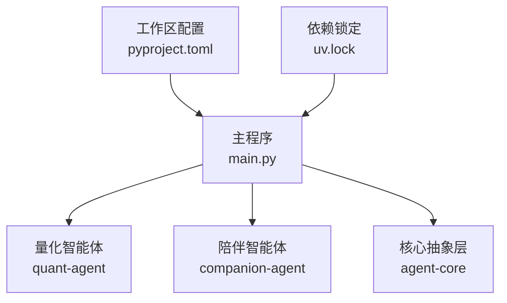
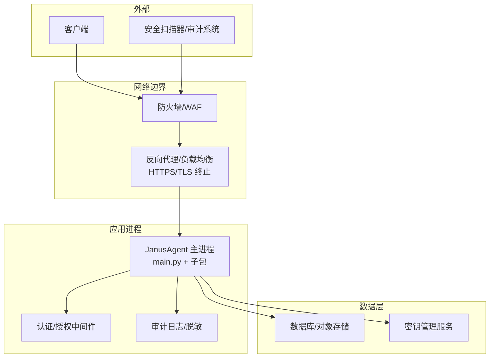
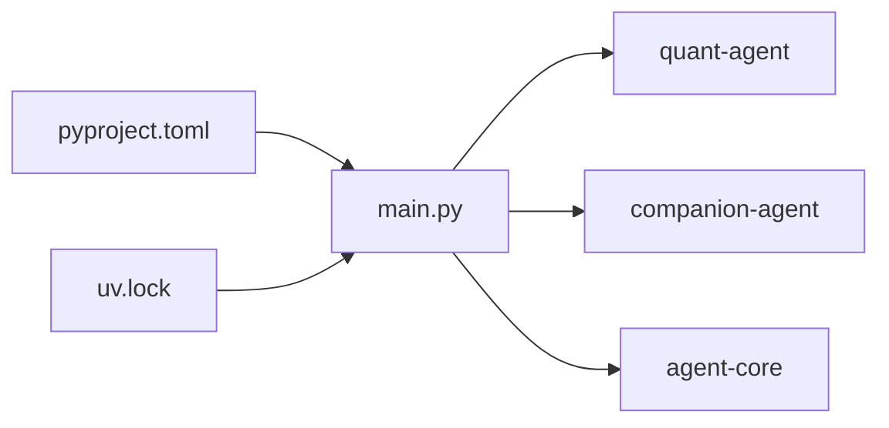

# 安全配置

<cite>
**本文引用的文件**   
- [main.py](file://main.py)
- [pyproject.toml](file://pyproject.toml)
- [README.md](file://README.md)
- [uv.lock](file://uv.lock)
- [agent-core __init__.py](file://packages/agent-core/src/agent_core/__init__.py)
- [companion-agent __init__.py](file://packages/companion-agent/src/companion_agent/__init__.py)
- [quant-agent __init__.py](file://packages/quant-agent/src/quant_agent/__init__.py)
</cite>

## 目录
1. [简介](#简介)
2. [项目结构](#项目结构)
3. [核心组件](#核心组件)
4. [架构总览](#架构总览)
5. [详细组件分析](#详细组件分析)
6. [依赖分析](#依赖分析)
7. [性能考虑](#性能考虑)
8. [故障排查指南](#故障排查指南)
9. [结论](#结论)
10. [附录](#附录) 

## 简介
本指南面向生产环境，聚焦 JanusAgent 的安全配置与最佳实践。内容覆盖：
- 密钥管理（API 密钥、数据库凭据、第三方服务认证）
- 访问控制（身份验证、权限管理、会话管理）
- 网络安全（HTTPS、防火墙、CORS）
- 安全审计与漏洞扫描
- 安全事件监控与响应流程
- 敏感数据加密、传输安全与存储安全实现要点

本项目为多包工作区，入口 main.py 仅做轻量编排；具体业务与安全能力由子包提供。因此，生产安全落地需结合各子包的实际实现进行扩展与加固。

## 项目结构
仓库采用 uv 工作区组织，根目录包含入口脚本与统一配置，子包分别承载不同智能体能力。当前代码库未内建显式的安全配置模块，需在部署层与各子包中补齐。

图示来源
- [main.py:1-13](file://main.py#L1-L13)
- [pyproject.toml:1-30](file://pyproject.toml#L1-L30)
- [uv.lock:1930-2052](file://uv.lock#L1930-L2052)

章节来源
- [README.md:39-84](file://README.md#L39-L84)
- [main.py:1-13](file://main.py#L1-L13)
- [pyproject.toml:1-30](file://pyproject.toml#L1-L30)

## 核心组件
- 主程序 main.py：负责初始化并调用子包的 hello/main 方法，作为框架编排的起点。
- 子包入口：
  - quant-agent：量化交易智能体
  - companion-agent：情感陪伴智能体
  - agent-core：核心抽象层

这些入口目前仅输出欢迎信息，不包含安全相关逻辑。生产环境应在启动阶段加载并校验必要的安全配置，并在后续请求处理链路中注入鉴权、日志脱敏等横切能力。

章节来源
- [main.py:1-13](file://main.py#L1-L13)
- [quant-agent __init__.py:1-15](file://packages/quant-agent/src/quant_agent/__init__.py#L1-L15)
- [companion-agent __init__.py:1-15](file://packages/companion-agent/src/companion_agent/__init__.py#L1-L15)
- [agent-core __init__.py:1-3](file://packages/agent-core/src/agent_core/__init__.py#L1-L3)

## 架构总览
从安全视角，建议将安全能力分层放置：
- 网关/反向代理层：HTTPS、TLS、WAF、速率限制、CORS、IP 白名单
- 应用进程层：环境变量/密钥管理服务注入、配置校验、最小权限原则
- 业务层：身份认证、授权策略、输入校验、输出过滤、审计日志
- 数据层：传输加密、静态加密、备份加密、最小可见性

图示来源
- [main.py:1-13](file://main.py#L1-L13)
- [pyproject.toml:1-30](file://pyproject.toml#L1-L30)

## 详细组件分析

### 密钥管理与配置注入
- 环境变量与 .env
  - 所有 API 密钥、数据库连接串、第三方服务凭据必须通过环境变量或受控的配置中心注入，严禁硬编码。
  - 在启动时校验必需变量存在性与格式，缺失则拒绝启动。
- 配置文件与版本控制
  - 使用 .gitignore 排除 .env、证书、私钥等敏感文件，避免入库。
  - 对模板化配置（如 .env.example）仅保留占位符与说明。
- 密钥轮换与最小权限
  - 为每个服务/环境分配独立凭据，遵循最小权限原则。
  - 建立轮换计划与自动化脚本，缩短泄露窗口。
- 运行时保护
  - 禁止将密钥写入日志、错误堆栈或调试输出。
  - 对外部请求头、URL、Body 中的敏感字段进行脱敏。

章节来源
- [README.md:182-182](file://README.md#L182-L182)

### 访问控制机制
- 身份认证
  - 对外暴露的接口应启用统一的认证中间件（如 JWT/OAuth2），校验签名、过期时间与受众。
  - 内部服务间通信建议使用 mTLS 或短期令牌。
- 权限管理
  - 基于角色的访问控制（RBAC）或基于属性的访问控制（ABAC）。
  - 资源级鉴权：确保用户只能访问自身数据或经授权的共享资源。
- 会话管理
  - 会话 Cookie 设置 HttpOnly、Secure、SameSite=Strict/Lax。
  - 会话绑定 User-Agent/IP 指纹，异常检测后强制失效。
  - 合理设置 TTL 与刷新策略，支持主动登出与批量撤销。

章节来源
- [README.md:39-84](file://README.md#L39-L84)

### 网络安全设置
- HTTPS 与 TLS
  - 强制 HTTPS，禁用旧版协议与弱密码套件，启用 HSTS。
  - 证书自动续期与告警，私钥不出主机。
- 防火墙与网络隔离
  - 仅开放必要端口，数据库与缓存仅允许应用网段访问。
  - 使用 VPC/安全组/ACL 划分生产、测试、开发域。
- CORS 策略
  - 明确允许的源、方法与头部，禁止通配符与凭据混用。
  - 预检请求缓存时间最小化，定期审查变更。

章节来源
- [README.md:39-84](file://README.md#L39-L84)

### 安全审计与漏洞扫描
- 依赖与镜像扫描
  - 在 CI 中集成依赖漏洞扫描（如 pip audit、Trivy、Grype），阻断高危漏洞合并。
  - 容器镜像构建后进行完整性与漏洞扫描。
- 代码与配置检查
  - 使用 pre-commit 钩子在提交前执行 ruff 检查与规则扫描。
  - 引入安全规则集（如 Secret Detection、SAST）防止密钥泄漏。
- 运行时审计
  - 记录关键操作审计日志（登录、权限变更、数据导出），集中收集与不可篡改存储。

章节来源
- [README.md:114-124](file://README.md#L114-L124)

### 安全事件监控与响应
- 指标与告警
  - 认证失败率、越权尝试、异常流量、证书到期、磁盘/内存阈值等。
  - 告警分级与升级路径，支持值班与自动处置。
- 事件响应流程
  - 发现 → 抑制 → 根因分析 → 修复 → 复盘与加固。
  - 演练与回溯，完善预案与自动化剧本。

章节来源
- [README.md:39-84](file://README.md#L39-L84)

### 敏感数据加密与传输/存储安全
- 传输安全
  - 全链路 HTTPS/mTLS，严格证书校验，禁用明文 HTTP。
- 存储安全
  - 静态数据加密（数据库透明加密、对象存储服务端加密）。
  - 密钥由 KMS/云密钥管理服务托管，应用仅持有短期凭证。
- 数据最小化
  - 仅采集与留存必要的个人/业务数据，设定保留周期与销毁策略。

章节来源
- [README.md:39-84](file://README.md#L39-L84)

## 依赖分析
- 工作区与依赖
  - pyproject.toml 声明了工作区成员与运行依赖，便于统一安装与版本管理。
  - uv.lock 锁定了第三方包版本，有助于可重复构建与供应链安全基线。
- 潜在风险点
  - 若上游包引入不安全默认值或过时的 TLS 实现，需在网关与应用层加固。
  - 建议在 CI 中对 uv.lock 进行变更审查与漏洞扫描。

图示来源
- [pyproject.toml:1-30](file://pyproject.toml#L1-L30)
- [uv.lock:1930-2052](file://uv.lock#L1930-L2052)
- [main.py:1-13](file://main.py#L1-L13)

章节来源
- [pyproject.toml:1-30](file://pyproject.toml#L1-L30)
- [uv.lock:1930-2052](file://uv.lock#L1930-L2052)

## 性能考虑
- 安全不牺牲性能
  - 使用硬件加速的 TLS 卸载与连接复用。
  - 鉴权与授权结果缓存（注意缓存键与失效策略）。
  - 审计日志异步落盘与采样，避免阻塞主流程。
- 容量规划
  - 根据并发与峰值评估 WAF/网关与数据库的连接池上限。
  - 对大对象上传/下载启用分片与断点续传，降低超时风险。

## 故障排查指南
- 常见问题定位
  - 环境变量缺失或格式错误：在启动阶段打印清晰的必填项校验失败信息。
  - 证书问题：检查证书链、域名匹配、HSTS 与浏览器缓存。
  - 鉴权失败：核对签名算法、时钟同步、Token 签发方与受众。
- 诊断步骤
  - 开启调试日志（脱敏后），追踪请求链路。
  - 复现最小用例，逐步缩小范围至具体组件。
  - 对比生产与本地差异（依赖版本、环境变量、网络策略）。

章节来源
- [README.md:114-124](file://README.md#L114-L124)

## 结论
当前仓库以轻量编排为主，尚未内置完整的安全配置模块。生产环境应优先补齐：
- 统一的密钥与配置注入、启动校验
- 认证/授权中间件与最小权限策略
- 网关层的 HTTPS/TLS、CORS、WAF 与速率限制
- 依赖与镜像扫描、审计日志与告警
- 数据加密与密钥托管

以上措施可在不影响现有功能的前提下，显著提升整体安全性与可运维性。

## 附录
- 快速开始与安全前置条件
  - 安装依赖与运行入口参考 README 的快速开始部分。
  - 在运行前准备 .env 与证书，并确保被 .gitignore 正确忽略。

章节来源
- [README.md:95-112](file://README.md#L95-L112)