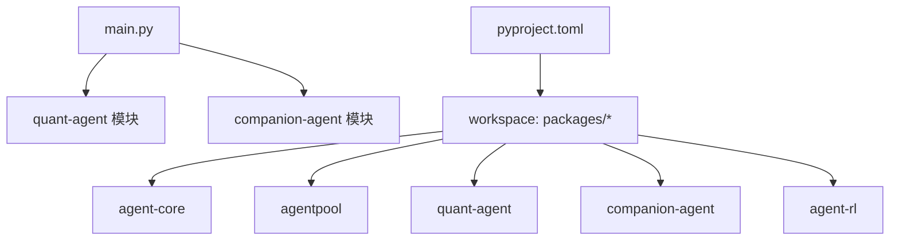
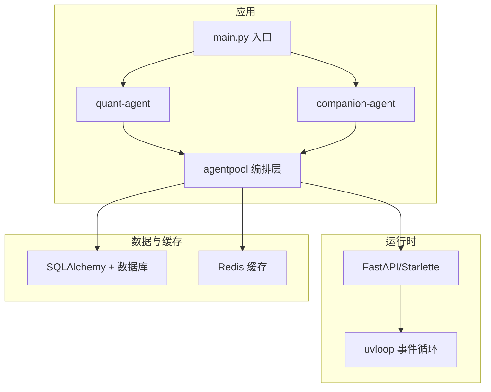
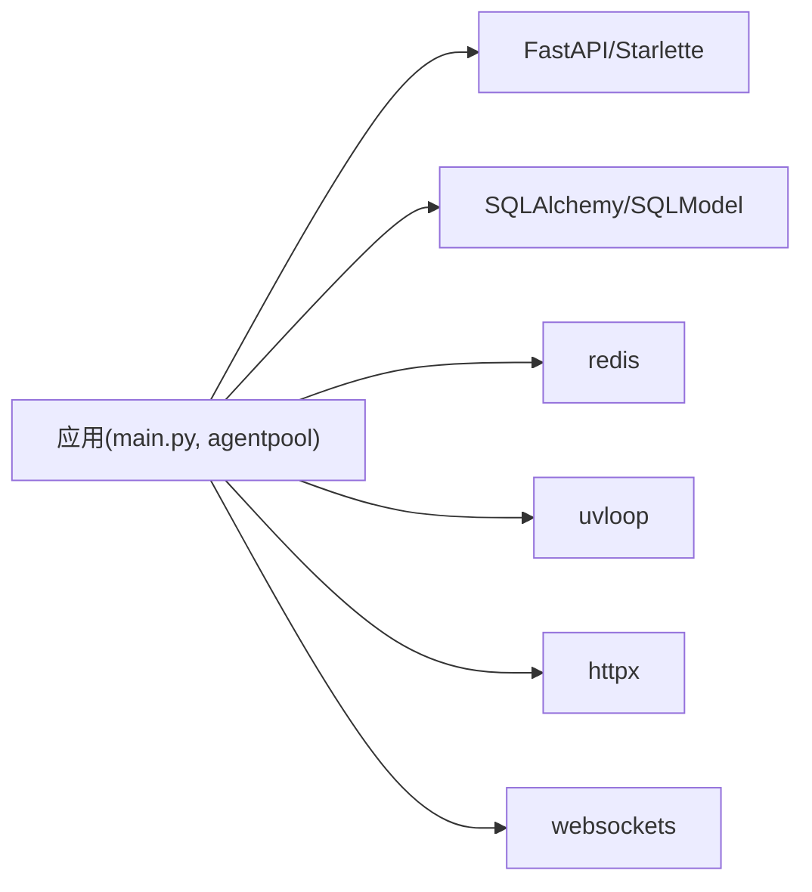

# 性能调优

<cite>
**本文引用的文件**   
- [main.py](file://main.py)
- [pyproject.toml](file://pyproject.toml)
- [agent-core/pyproject.toml](file://packages/agent-core/pyproject.toml)
- [companion-agent/pyproject.toml](file://packages/companion-agent/pyproject.toml)
- [quant-agent/pyproject.toml](file://packages/quant-agent/pyproject.toml)
- [.agent/context/project.md](file://.agent/context/project.md)
- [uv.lock](file://uv.lock)
</cite>

## 目录
1. [简介](#简介)
2. [项目结构](#项目结构)
3. [核心组件](#核心组件)
4. [架构总览](#架构总览)
5. [详细组件分析](#详细组件分析)
6. [依赖分析](#依赖分析)
7. [性能考虑](#性能考虑)
8. [故障排查指南](#故障排查指南)
9. [结论](#结论)
10. [附录](#附录)

## 简介
本指南面向 JanusAgent 生产环境的性能调优，覆盖以下关键主题：
- 内存管理优化：Python 垃圾回收配置、内存泄漏检测与内存使用监控
- 并发处理调优：多线程/多进程配置、异步任务队列优化与资源池管理
- 数据库连接池配置：连接数限制、超时设置与连接复用策略
- 缓存策略配置：Redis 缓存、本地缓存与分布式缓存集成方案
- 性能瓶颈诊断工具与指标监控配置

本仓库采用 uv workspace 组织多个子包（agent-core、agentpool、quant-agent、companion-agent、agent-rl），入口为 main.py。整体技术栈包含 FastAPI、SQLAlchemy、Redis、uvloop 等高性能组件，适合在高并发场景下通过合理配置获得稳定吞吐与低延迟。

## 项目结构
- 顶层入口 main.py 负责启动并调用各子包的 hello 能力，便于快速验证环境
- pyproject.toml 定义工作区成员与依赖分组，统一构建与运行
- .agent/context/project.md 提供开发栈、命令与设计决策说明
- uv.lock 锁定第三方依赖版本，包含 fastapi、sqlalchemy、redis、uvloop 等

图表来源
- [main.py:1-13](file://main.py#L1-L13)
- [pyproject.toml:1-30](file://pyproject.toml#L1-L30)

章节来源
- [main.py:1-13](file://main.py#L1-L13)
- [pyproject.toml:1-30](file://pyproject.toml#L1-L30)
- [.agent/context/project.md:77-137](file://.agent/context/project.md#L77-L137)

## 核心组件
- agent-core：通用内核抽象层，提供 Agent 生命周期与插件接口
- agentpool：编排引擎，支持多协议（ACP/AG-UI/MCP/OpenCode）与 YAML 配置
- quant-agent：量化交易智能体
- companion-agent：情感陪伴智能体
- agent-rl：强化学习相关（远期规划）

这些组件在 uv workspace 中统一管理，便于独立演进与组合部署。

章节来源
- [agent-core/pyproject.toml:1-18](file://packages/agent-core/pyproject.toml#L1-L18)
- [companion-agent/pyproject.toml:1-18](file://packages/companion-agent/pyproject.toml#L1-L18)
- [quant-agent/pyproject.toml:1-18](file://packages/quant-agent/pyproject.toml#L1-L18)
- [.agent/context/project.md:77-137](file://.agent/context/project.md#L77-L137)

## 架构总览
JanusAgent 以 agentpool 为核心编排层，向上暴露多种协议，向下协调模型、工具、存储与外部服务。FastAPI 作为 Web 框架承载 HTTP/WebSocket 接口；SQLAlchemy 提供 ORM 与连接池；Redis 用于缓存与会话；uvloop 提升事件循环性能。

图表来源
- [main.py:1-13](file://main.py#L1-L13)
- [uv.lock:45-86](file://uv.lock#L45-L86)
- [uv.lock:4965-4982](file://uv.lock#L4965-L4982)
- [uv.lock:4517-4523](file://uv.lock#L4517-L4523)
- [uv.lock:5662-5668](file://uv.lock#L5662-L5668)

## 详细组件分析

### 内存管理与 GC 调优
- Python 垃圾回收
  - 建议在生产环境开启分代回收并适度降低触发阈值，减少大对象频繁回收带来的抖动
  - 针对长生命周期对象（如全局缓存、连接池句柄）避免隐式引用导致无法释放
- 内存泄漏检测
  - 使用 tracemalloc 或 objgraph 定位增长热点对象
  - 结合压测脚本观察 RSS/虚拟内存曲线，识别异常增长
- 内存使用监控
  - 采集进程级指标（RSS、堆大小、GC 次数、分配速率）
  - 对关键路径进行采样式内存快照，辅助回归分析

实践要点
- 控制一次性加载的大对象规模，优先流式/分页读取
- 及时关闭外部资源（文件、网络、数据库连接）
- 避免在高频路径创建闭包/匿名函数持有外部变量引用

[本节为通用指导，不直接分析具体文件]

### 并发处理调优
- 多线程/多进程
  - CPU 密集型任务优先使用多进程（multiprocessing 或进程池），规避 GIL 限制
  - I/O 密集型任务使用协程（asyncio）+ uvloop 提升并发度
- 异步任务队列
  - 使用带背压的队列（如 asyncio.Queue）限流，防止上游突发打满下游
  - 为队列设置最大长度与消费者数量，结合重试与死信队列保障可靠性
- 资源池管理
  - 对外部资源（HTTP 客户端、数据库连接、消息通道）建立连接池，限制最大连接数与空闲回收时间
  - 为每个池配置超时与熔断，避免雪崩

参考依赖
- uvloop 可显著提升事件循环性能（非 Windows 平台）
- anyio、httpx、websockets 等异步生态组件配合使用

章节来源
- [uv.lock:5662-5668](file://uv.lock#L5662-L5668)
- [uv.lock:45-86](file://uv.lock#L45-L86)

### 数据库连接池配置
- 连接数限制
  - 根据 CPU 核数与业务 I/O 特征设定 pool_size 与 max_overflow，避免过多连接导致上下文切换开销
- 超时设置
  - 配置 connect_timeout、statement_timeout、idle_timeout，确保连接健康与资源回收
- 连接复用策略
  - 启用连接池复用，避免频繁建连/断连
  - 使用事务边界明确化，缩短持锁时间

参考依赖
- SQLAlchemy 2.x 提供现代连接池 API
- aiosqlite 适用于轻量异步 SQLite 场景

章节来源
- [uv.lock:4965-4982](file://uv.lock#L4965-L4982)
- [uv.lock:414-420](file://uv.lock#L414-L420)

### 缓存策略配置
- Redis 缓存
  - 配置连接池大小、读写超时、序列化策略与键空间清理策略
  - 使用 Pipeline 与批量操作降低 RTT
- 本地缓存
  - 使用内存字典或 cachetools 实现进程内缓存，注意 TTL 与容量上限
  - 跨进程共享需借助 Redis 或共享内存
- 分布式缓存
  - 多级缓存：本地 L1 + Redis L2，命中优先走 L1，未命中回源 L2
  - 缓存一致性：写穿透/写失效策略，避免脏读

参考依赖
- redis 客户端
- cachetools 本地缓存工具

章节来源
- [uv.lock:4517-4523](file://uv.lock#L4517-L4523)
- [uv.lock:879-885](file://uv.lock#L879-L885)

### 性能瓶颈诊断与指标监控
- 诊断工具
  - cProfile/py-spy 定位热点函数
  - memory_profiler/tracemalloc 追踪内存增长
  - aiofiles/asyncio 监控异步任务堆积
- 指标采集
  - 进程指标：CPU、内存、GC、线程/协程数
  - 应用指标：QPS、P95/P99 延迟、错误率、队列积压
  - 基础设施指标：数据库连接池使用率、Redis 命中率、网络带宽
- 可视化与告警
  - 将指标导出至 Prometheus/Grafana 或自建看板
  - 基于阈值与趋势变化设置告警规则

[本节为通用指导，不直接分析具体文件]

## 依赖分析
- 关键依赖
  - FastAPI/Starlette：Web 框架与路由
  - SQLAlchemy/SQLModel：ORM 与迁移
  - Redis：缓存与会话
  - uvloop：高性能事件循环
  - httpx/websockets：异步网络通信
- 依赖关系图

图表来源
- [uv.lock:45-86](file://uv.lock#L45-L86)
- [uv.lock:4965-4982](file://uv.lock#L4965-L4982)
- [uv.lock:4517-4523](file://uv.lock#L4517-L4523)
- [uv.lock:5662-5668](file://uv.lock#L5662-L5668)

章节来源
- [uv.lock:45-86](file://uv.lock#L45-L86)
- [uv.lock:4965-4982](file://uv.lock#L4965-L4982)
- [uv.lock:4517-4523](file://uv.lock#L4517-L4523)
- [uv.lock:5662-5668](file://uv.lock#L5662-L5668)

## 性能考虑
- 启动与冷启动
  - 预加载必要模型与索引，减少首次请求延迟
  - 使用 gunicorn/uwsgi 多 worker 模式，按 CPU 核数配置进程数
- 请求处理路径
  - 短事务、批量化写入、避免 N+1 查询
  - 大响应体使用流式传输与压缩
- 资源隔离
  - 不同业务域使用独立连接池与缓存命名空间
  - 关键路径与后台任务分离，避免相互影响
- 弹性与降级
  - 设置超时、重试与熔断，保护后端服务
  - 非关键功能降级，保证核心链路可用

[本节为通用指导，不直接分析具体文件]

## 故障排查指南
- 常见问题
  - 内存持续增长：检查是否存在全局引用、未关闭资源、缓存无界增长
  - 高 CPU：热点函数定位、算法复杂度优化、减少不必要的序列化/反序列化
  - 数据库慢查询：执行计划分析、索引优化、连接池耗尽排查
  - Redis 延迟：网络抖动、大 Key、热 Key 倾斜
- 排查步骤
  - 采集快照：CPU profile、内存快照、线程/协程栈
  - 关联日志：结构化日志记录关键路径耗时与状态码
  - 复现与回归：最小化复现场景，逐步引入变更定位根因

[本节为通用指导，不直接分析具体文件]

## 结论
通过合理的内存管理、并发与资源池配置、数据库连接池与缓存策略，以及完善的性能监控与诊断体系，JanusAgent 可在生产环境中获得更高的吞吐与更稳定的延迟表现。建议在上线前完成基线压测与容量规划，持续跟踪指标并在迭代中不断优化。

[本节为总结性内容，不直接分析具体文件]

## 附录
- 运行与开发命令参考
  - 安装依赖、格式化、测试、运行框架等命令见项目文档
- 设计决策
  - 工作区优先、YAML 驱动配置、协议无关的编排层设计

章节来源
- [.agent/context/project.md:110-137](file://.agent/context/project.md#L110-L137)
- [.agent/context/project.md:131-137](file://.agent/context/project.md#L131-L137)