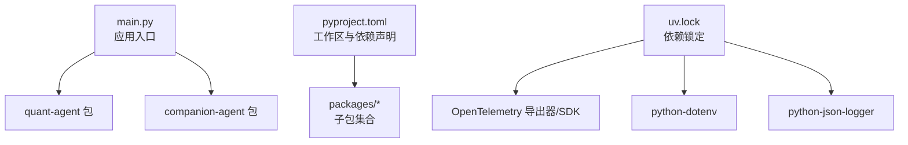
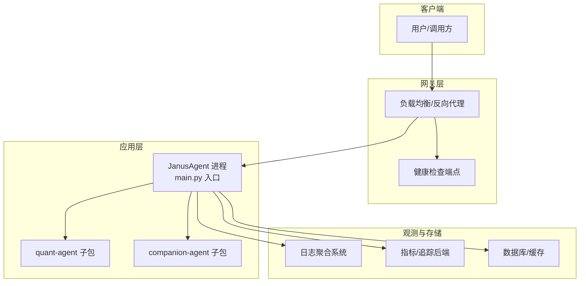
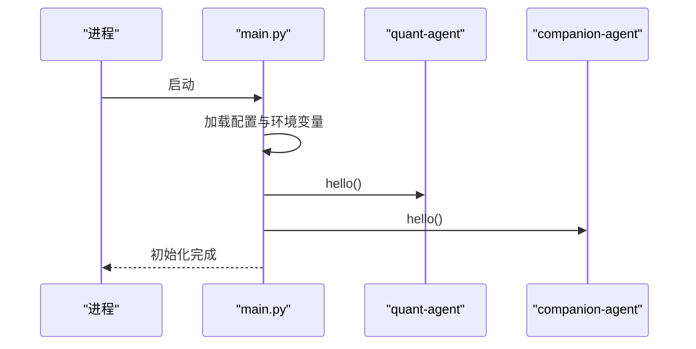
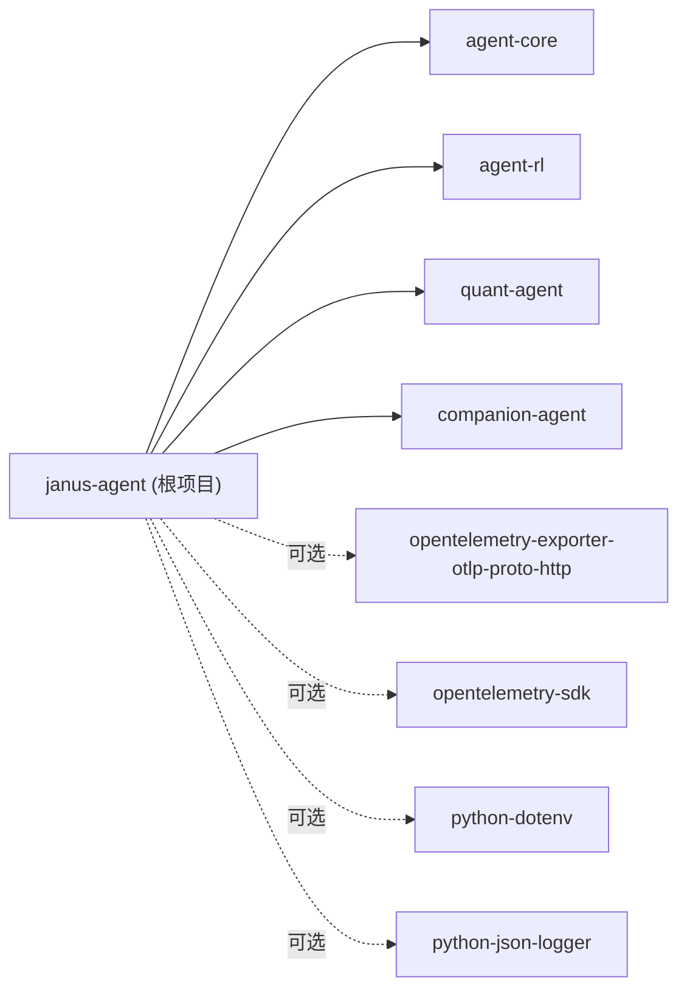

# 生产环境配置

<cite>
**本文引用的文件**   
- [main.py](file://main.py)
- [pyproject.toml](file://pyproject.toml)
- [uv.lock](file://uv.lock)
</cite>

## 目录
1. [简介](#简介)
2. [项目结构](#项目结构)
3. [核心组件](#核心组件)
4. [架构总览](#架构总览)
5. [详细组件分析](#详细组件分析)
6. [依赖分析](#依赖分析)
7. [性能考虑](#性能考虑)
8. [故障排查指南](#故障排查指南)
9. [结论](#结论)
10. [附录](#附录) 

## 简介
本指南面向 JanusAgent 的生产环境部署与运维，聚焦以下目标：
- 安全配置要求：密钥管理、访问控制、网络安全
- 性能调优参数：内存管理、并发处理、数据库连接池
- 监控与日志：指标采集、告警规则、日志聚合
- 高可用架构：负载均衡、故障转移、数据备份
- 容量规划与扩展性：瓶颈诊断与优化方法

说明：当前仓库为多包工作区（packages/*），主入口 main.py 仅初始化并调用子包能力。生产化落地需结合各子包的实际实现进行细化；本节基于现有代码与依赖信息给出可落地的最佳实践建议。

## 项目结构
- 根级入口：main.py 负责启动流程与子模块初始化
- 工作区定义：pyproject.toml 声明 Python 版本、依赖与工作区成员
- 锁定依赖：uv.lock 记录第三方库版本与可选特性（如 OpenTelemetry、python-dotenv、python-json-logger）

图示来源
- [main.py:1-13](file://main.py#L1-L13)
- [pyproject.toml:1-30](file://pyproject.toml#L1-L30)
- [uv.lock:2534-2553](file://uv.lock#L2534-L2553)
- [uv.lock:4370-4384](file://uv.lock#L4370-L4384)

章节来源
- [main.py:1-13](file://main.py#L1-L13)
- [pyproject.toml:1-30](file://pyproject.toml#L1-L30)

## 核心组件
- 应用入口 main.py
  - 职责：打印标识信息并调用 quant-agent 与 companion-agent 的 hello 函数完成基础初始化
  - 生产建议：在入口中加载环境变量、初始化日志与遥测、注册优雅关闭钩子
- 工作区与依赖 pyproject.toml
  - 职责：声明 Python 版本、依赖与工作区成员
  - 生产建议：固定 Python 版本、使用 uv.lock 锁定依赖、按环境拆分依赖组
- 依赖锁定 uv.lock
  - 职责：锁定第三方库版本与可选特性
  - 生产建议：启用 OpenTelemetry 导出器、使用 python-dotenv 加载配置、使用 python-json-logger 输出结构化日志

章节来源
- [main.py:1-13](file://main.py#L1-L13)
- [pyproject.toml:1-30](file://pyproject.toml#L1-L30)
- [uv.lock:2534-2553](file://uv.lock#L2534-L2553)
- [uv.lock:4370-4384](file://uv.lock#L4370-L4384)

## 架构总览
从运行期视角，JanusAgent 由入口进程驱动，按需加载子包能力。生产环境通常置于容器或进程管理器中，通过反向代理暴露健康检查与业务接口，配合外部日志与指标系统。

[此图为概念性架构图，不直接映射具体源码文件]

## 详细组件分析

### 入口与初始化流程
- 启动顺序
  - 加载环境变量与配置
  - 初始化日志与遥测
  - 调用子包 hello 完成能力就绪
  - 注册信号处理与优雅退出
- 关键注意点
  - 避免在导入阶段执行重逻辑
  - 将耗时初始化放入延迟加载或后台任务

图示来源
- [main.py:1-13](file://main.py#L1-L13)

章节来源
- [main.py:1-13](file://main.py#L1-L13)

### 依赖与可观测性集成
- OpenTelemetry
  - 存在 exporter-http 与 SDK 依赖，可用于指标与链路追踪
  - 建议：在生产开启 OTLP HTTP 导出，设置采样率与资源属性
- 日志
  - python-json-logger 提供结构化 JSON 日志
  - 建议：统一字段规范（trace_id、span_id、service、level、msg）
- 配置加载
  - python-dotenv 支持 .env 文件
  - 建议：生产使用平台注入的环境变量，禁用默认 .env

章节来源
- [uv.lock:2534-2553](file://uv.lock#L2534-L2553)
- [uv.lock:4370-4384](file://uv.lock#L4370-L4384)

## 依赖分析
- 工作区成员：packages/* 下的多个子包
- 运行时依赖：agent-core、agent-rl、quant-agent、companion-agent
- 可选特性：OpenTelemetry FastAPI/HTTPX 插桩、Logfire API、JSON Logger

图示来源
- [pyproject.toml:1-30](file://pyproject.toml#L1-L30)
- [uv.lock:2534-2553](file://uv.lock#L2534-L2553)
- [uv.lock:4370-4384](file://uv.lock#L4370-L4384)

章节来源
- [pyproject.toml:1-30](file://pyproject.toml#L1-L30)
- [uv.lock:2534-2553](file://uv.lock#L2534-L2553)
- [uv.lock:4370-4384](file://uv.lock#L4370-L4384)

## 性能考虑
- 内存管理
  - 合理设置进程数与每进程线程数，避免过度并发导致上下文切换开销
  - 对大对象采用流式处理与分页读取，减少峰值内存占用
- 并发处理
  - 根据 CPU/IO 类型选择同步/异步模型；对外部 IO（DB、网络）优先异步
  - 限制并发度与队列长度，防止雪崩
- 数据库连接池
  - 依据 QPS 与平均时延估算连接数，避免连接耗尽与频繁创建销毁
  - 设置超时、重试与退避策略，提升稳定性
- 缓存与幂等
  - 热点数据加缓存，降低下游压力
  - 对外部调用增加幂等键，保障重复请求安全

[本节为通用指导，无需源码引用]

## 故障排查指南
- 启动失败
  - 检查环境变量是否缺失或格式错误
  - 查看日志是否包含初始化异常堆栈
- 性能退化
  - 观察指标：CPU、内存、GC、线程阻塞、连接池等待
  - 定位慢查询与长尾请求，结合链路追踪分析
- 外部依赖异常
  - 校验网络连通性与证书
  - 确认远端服务健康状态与配额限制
- 回滚与降级
  - 保留上一稳定版本镜像/包
  - 针对不稳定依赖启用熔断与降级开关

[本节为通用指导，无需源码引用]

## 结论
- 以最小化入口与清晰初始化流程为基础，结合 OpenTelemetry 与结构化日志构建可观测体系
- 通过环境变量与依赖锁定确保一致性与可复现性
- 在生产环境中落实安全、性能、高可用与容量规划的最佳实践，持续监控与迭代优化

[本节为总结性内容，无需源码引用]

## 附录

### 安全配置要求
- 密钥管理
  - 禁止硬编码敏感信息，统一通过环境变量注入
  - 使用平台密钥管理服务（KMS/Secrets Manager）动态获取
  - 定期轮换密钥，最小权限原则
- 访问控制
  - 对外接口强制鉴权与授权校验
  - 遵循最小权限与零信任原则，细粒度控制资源访问
- 网络安全
  - 全链路 TLS 加密，严格证书校验
  - 内网隔离与白名单策略，限制出站访问
  - 输入校验与输出过滤，防范注入与 XSS

[本节为通用指导，无需源码引用]

### 性能调优参数
- 内存管理
  - 调整进程/线程数量与堆大小，避免频繁 GC
  - 使用对象池与复用连接，降低分配成本
- 并发处理
  - 合理设置最大并发与队列深度
  - 对热点路径引入限流与背压
- 数据库连接池
  - 根据负载曲线设定 min/max 连接数与空闲回收时间
  - 配置超时、重试与指数退避

[本节为通用指导，无需源码引用]

### 监控与日志收集方案
- 指标采集
  - 启用 OpenTelemetry 导出到指标后端
  - 采集 JVM/Python 运行时指标与应用自定义指标
- 告警规则
  - 基于错误率、P99/P95 时延、饱和度与资源水位设置阈值
  - 分级告警与降噪策略
- 日志聚合
  - 使用 python-json-logger 输出结构化日志
  - 统一 trace_id/span_id 关联日志与链路

章节来源
- [uv.lock:2534-2553](file://uv.lock#L2534-L2553)
- [uv.lock:4370-4384](file://uv.lock#L4370-L4384)

### 高可用性部署架构
- 负载均衡
  - 前置负载均衡分发流量，健康检查剔除异常实例
- 故障转移
  - 多副本部署，自动重启与滚动更新
  - 外部依赖具备冗余与快速失败机制
- 数据备份
  - 定时快照与增量备份，跨地域容灾
  - 演练恢复流程，验证 RPO/RTO

[本节为通用指导，无需源码引用]

### 容量规划与扩展性
- 容量规划
  - 基于历史峰值与增长趋势评估资源需求
  - 预留缓冲容量应对突发流量
- 扩展性
  - 无状态服务水平扩展
  - 有状态组件垂直扩展与分片
- 瓶颈诊断与优化
  - 使用指标与链路追踪定位热点
  - 优化算法复杂度与 IO 路径，引入缓存与批处理

[本节为通用指导，无需源码引用]