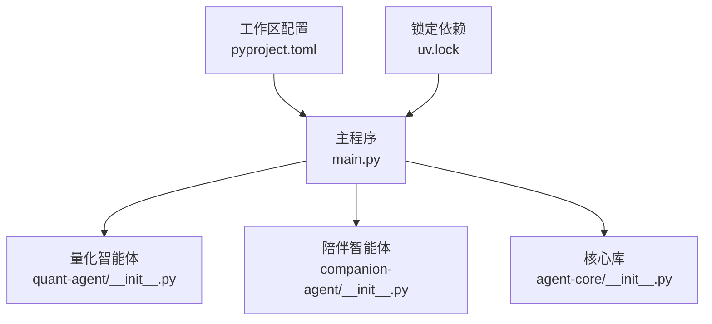
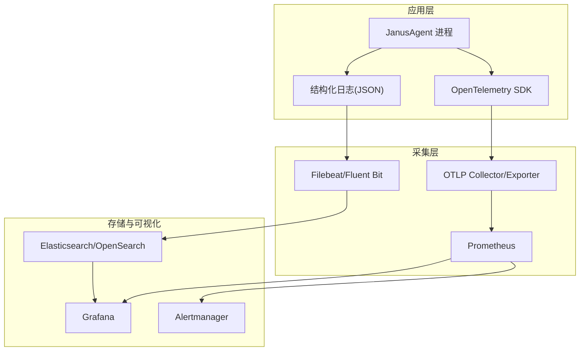
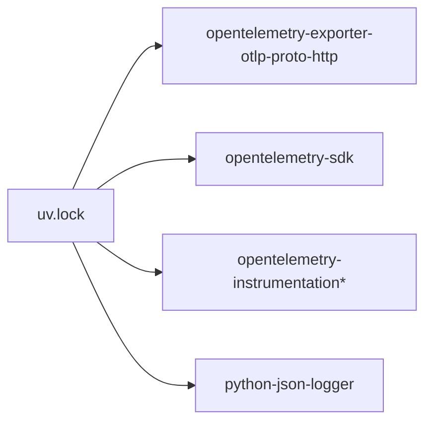

# 监控与日志

<cite>
**本文引用的文件**   
- [main.py](file://main.py)
- [pyproject.toml](file://pyproject.toml)
- [uv.lock](file://uv.lock)
- [agent-core/__init__.py](file://packages/agent-core/src/agent_core/__init__.py)
- [quant-agent/__init__.py](file://packages/quant-agent/src/quant_agent/__init__.py)
- [companion-agent/__init__.py](file://packages/companion-agent/src/companion_agent/__init__.py)
</cite>

## 目录
1. [简介](#简介)
2. [项目结构](#项目结构)
3. [核心组件](#核心组件)
4. [架构总览](#架构总览)
5. [详细组件分析](#详细组件分析)
6. [依赖分析](#依赖分析)
7. [性能考虑](#性能考虑)
8. [故障诊断指南](#故障诊断指南)
9. [结论](#结论)
10. [附录](#附录)

## 简介
本方案面向 JanusAgent 生产环境，提供完整的可观测性与日志收集体系，覆盖应用性能监控（APM）、结构化日志、告警规则、日志聚合与分析平台集成以及故障诊断工具配置。目标是在不侵入业务代码的前提下，通过标准化配置与最小化接入点，实现：
- 统一的指标采集与可视化（Prometheus + Grafana）
- 标准化的结构化日志输出与轮转（ELK Stack / OpenSearch）
- 基于阈值与多通道的告警与升级机制
- 可复现的基准测试与回归基线
- 快速定位问题的诊断流程与工具链

## 项目结构
JanusAgent 采用多包工作区组织，入口为根级 main.py，各子包以独立模块形式提供能力。当前仓库中已包含 OpenTelemetry 生态依赖，具备接入 APM 的基础条件；同时存在 python-json-logger 等依赖，便于结构化日志输出。

图示来源
- [main.py:1-13](file://main.py#L1-L13)
- [pyproject.toml:1-30](file://pyproject.toml#L1-L30)
- [uv.lock:3300-3450](file://uv.lock#L3300-L3450)

章节来源
- [main.py:1-13](file://main.py#L1-L13)
- [pyproject.toml:1-30](file://pyproject.toml#L1-L30)

## 核心组件
- 进程入口与启动流程
  - 入口函数负责初始化并调用各子包的 hello/main 方法，是注入可观测性探针的最佳位置。
- 子包能力
  - quant-agent：量化交易智能体（市场数据、策略、回测与执行）。
  - companion-agent：情感陪伴智能体（对话、记忆、共情）。
  - agent-core：核心基础能力。
- 可观测性依赖
  - OpenTelemetry SDK、Exporter（OTLP HTTP）、Instrumentation（FastAPI、HTTPX、ASGI 等）已在依赖锁定文件中出现，可作为 APM 基础设施。
  - python-json-logger 可用于结构化日志输出。

章节来源
- [main.py:1-13](file://main.py#L1-L13)
- [quant-agent/__init__.py:1-15](file://packages/quant-agent/src/quant_agent/__init__.py#L1-L15)
- [companion-agent/__init__.py:1-15](file://packages/companion-agent/src/companion_agent/__init__.py#L1-L15)
- [agent-core/__init__.py:1-3](file://packages/agent-core/src/agent_core/__init__.py#L1-L3)
- [uv.lock:3300-3450](file://uv.lock#L3300-L3450)

## 架构总览
下图展示生产环境下的端到端可观测性架构：应用通过 OpenTelemetry 导出指标与追踪，日志经结构化输出后由 Filebeat/Fluent Bit 采集至 Elasticsearch/OpenSearch，Prometheus 抓取 OTLP Exporter 或中间层指标，Grafana 统一可视化，Alertmanager 负责告警路由与升级。

图示来源
- [uv.lock:3300-3450](file://uv.lock#L3300-L3450)

## 详细组件分析

### 应用性能监控（APM）
- 接入点建议
  - 在进程入口处初始化 OpenTelemetry，设置服务名、版本、实例标识、环境标签等。
  - 启用必要的自动插桩（如 FastAPI、HTTPX、ASGI），减少手动埋点成本。
- 关键指标采集
  - 通用指标：进程 CPU/内存/GC、线程数、句柄数、磁盘 IO、网络 IO。
  - 应用指标：请求 QPS、延迟分布（P50/P90/P99）、错误率、重试次数、超时次数。
  - 业务指标：量化侧（订单量、成交金额、滑点、回撤）、陪伴侧（会话数、消息吞吐、响应时延、情绪分类准确率）。
- 追踪与链路
  - 跨进程传播 TraceID/SpanID，确保从网关到下游依赖的全链路可见。
  - 对关键路径（策略计算、外部 API 调用、数据库访问）添加自定义 Span。
- 性能基准测试
  - 定义压测场景（并发度、负载曲线、持续时间），记录基线指标。
  - 将基准结果纳入 CI，发布前后对比，超阈即阻断。

章节来源
- [uv.lock:3300-3450](file://uv.lock#L3300-L3450)

### 结构化日志收集
- 日志格式标准化
  - 使用 JSON 格式输出，固定字段包括：时间戳、级别、服务名、实例、TraceID、SpanID、模块、消息、上下文键值对。
  - 借助 python-json-logger 进行格式化，避免拼接字符串带来的解析困难。
- 日志级别配置
  - 生产默认 INFO/WARN/ERROR，按模块开关 DEBUG。
  - 对高频路径降低级别，避免 I/O 抖动。
- 日志轮转策略
  - 按大小与时间双维度轮转（例如单文件不超过 100MB，保留 7 天）。
  - 压缩归档，清理过期文件，控制磁盘占用。
- 敏感信息脱敏
  - 对密码、密钥、令牌、个人身份信息等进行掩码或丢弃。
- 采集与投递
  - 标准输出 JSON 日志，由 Filebeat/Fluent Bit 采集并投递至 Elasticsearch/OpenSearch。
  - 索引命名规范：janus-agent-{YYYY.MM.DD}，按天滚动。

章节来源
- [uv.lock:4380-4384](file://uv.lock#L4380-L4384)

### 告警规则配置
- 阈值设置原则
  - 基于 SLO/SLI 设定：可用性、延迟、错误率、资源饱和度。
  - 分阶段阈值：警告（接近阈值）、严重（超过阈值）、紧急（持续恶化）。
- 告警通知渠道
  - 邮件、企业微信/钉钉、短信、电话、PagerDuty 等。
  - 按业务域与影响面路由到不同接收组。
- 告警升级机制
  - 静默期与抑制规则，避免风暴。
  - 未处理超时自动升级至更高级别通道与人员。
- 示例规则类别
  - 应用错误率 > 1% 持续 5 分钟 → 严重
  - P99 延迟 > 500ms 持续 10 分钟 → 严重
  - 磁盘使用率 > 85% → 警告
  - 进程崩溃/重启频繁 → 紧急

[本节为概念性说明，无需列出具体源码引用]

### 日志聚合与分析平台集成
- ELK Stack / OpenSearch
  - 部署 Elasticsearch/OpenSearch 集群，合理分片与副本。
  - 配置 Filebeat/Fluent Bit 采集容器或主机日志，映射字段并建立索引模板。
  - Kibana/OpenSearch Dashboards 创建看板，关联 TraceID 检索全链路日志。
- Prometheus + Grafana
  - 部署 Prometheus，配置 scrape 任务拉取 OTLP Exporter 或中间层指标。
  - 在 Grafana 中导入官方仪表盘，结合自定义面板展示业务指标。
  - 配置 Alertmanager 对接通知渠道与升级策略。

[本节为概念性说明，无需列出具体源码引用]

### 故障诊断工具与调试方法
- 诊断清单
  - 确认环境变量与配置加载正确。
  - 检查健康检查端点与就绪探针。
  - 查看最近变更（代码、依赖、配置、基础设施）。
- 分层取证
  - 在组件边界增加入参/出参日志，验证状态传递。
  - 使用 TraceID 串联跨进程调用，定位失败环节。
- 常用命令与脚本
  - 查看实时日志流、过滤关键字、统计错误占比。
  - 回放压测脚本，复现场景并采集指标差异。

章节来源
- [.agent/skills/systematic-debugging/SKILL.md:50-120](file://.agent/skills/systematic-debugging/SKILL.md#L50-L120)

## 依赖分析
- OpenTelemetry 生态
  - SDK、API、语义约定、Exporter（OTLP HTTP）、Instrumentation（FastAPI、HTTPX、ASGI）均已出现在 uv.lock 中，表明项目具备接入 APM 的依赖基础。
- 结构化日志
  - python-json-logger 存在于依赖锁定文件，可用于 JSON 日志输出。
- 其他相关
  - loguru、logfire 等日志/可观测性工具亦在依赖中出现，可根据团队偏好选择。

图示来源
- [uv.lock:3300-3450](file://uv.lock#L3300-L3450)
- [uv.lock:4380-4384](file://uv.lock#L4380-L4384)

章节来源
- [uv.lock:3300-3450](file://uv.lock#L3300-L3450)
- [uv.lock:4380-4384](file://uv.lock#L4380-L4384)

## 性能考虑
- 采样与降采样
  - 对高流量路径启用动态采样，降低追踪开销。
- 指标粒度与聚合
  - 合理设置直方图桶与聚合窗口，平衡精度与存储成本。
- 日志写入优化
  - 异步写入、批量发送、合并小文件，避免阻塞主流程。
- 资源隔离
  - 为采集器（Filebeat/Fluent Bit）与主进程分配独立资源，防止争抢。

[本节为通用指导，无需列出具体源码引用]

## 故障诊断指南
- 快速定位步骤
  - 从 Grafana 异常面板入手，定位时间窗口与受影响实例。
  - 在 Elasticsearch/OpenSearch 中以 TraceID 检索全链路日志。
  - 核对 Prometheus 指标趋势，识别突增/突降。
- 常见症状与对策
  - 错误率飙升：检查上游依赖与健康检查，必要时降级或熔断。
  - 延迟升高：排查慢查询、GC 停顿、CPU 争用、网络抖动。
  - 日志缺失：确认采集器运行状态、索引模板与权限。
- 复盘与改进
  - 记录根因、影响范围、恢复时间与改进项。
  - 更新告警阈值与巡检脚本，完善预案。

章节来源
- [.agent/skills/systematic-debugging/SKILL.md:50-120](file://.agent/skills/systematic-debugging/SKILL.md#L50-L120)

## 结论
通过在入口集中初始化 OpenTelemetry 与结构化日志框架，配合 Prometheus/Grafana 与 ELK/OpenSearch 的采集与可视化，JanusAgent 可在生产环境获得稳定、可扩展的可观测性能力。结合明确的告警规则与升级机制、完善的基准测试与诊断流程，能够显著提升问题发现速度与修复效率，保障系统稳定性与业务连续性。

[本节为总结性内容，无需列出具体源码引用]

## 附录
- 术语
  - APM：应用性能监控
  - SLO/SLI：服务等级目标/指标
  - OTLP：开放遥测协议
- 参考实践
  - 在入口初始化可观测性探针
  - 使用 TraceID 贯穿日志与追踪
  - 以 SLO 为导向制定告警阈值

[本节为补充说明，无需列出具体源码引用]