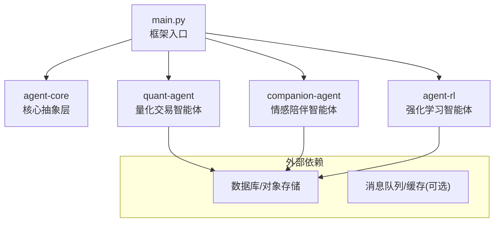
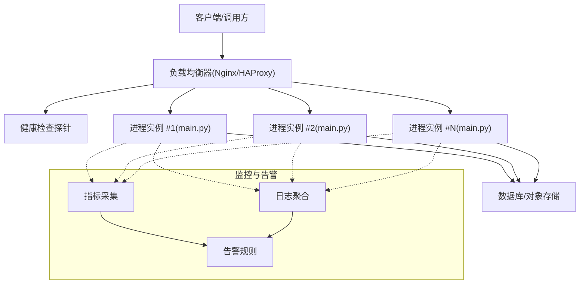
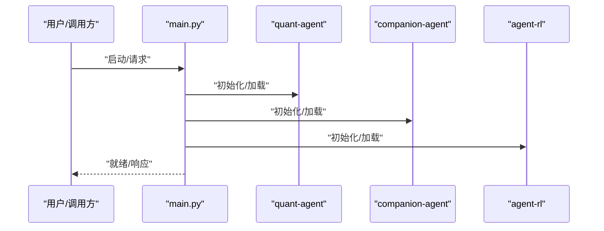
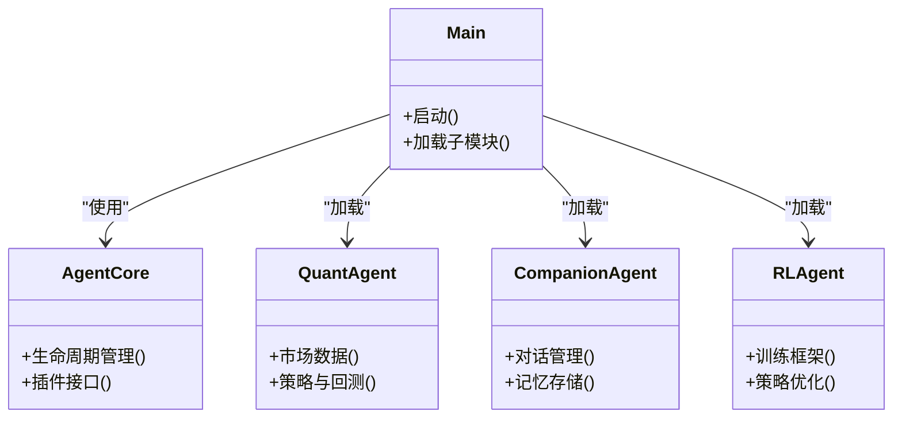
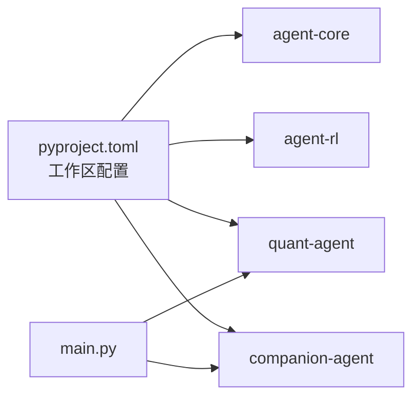
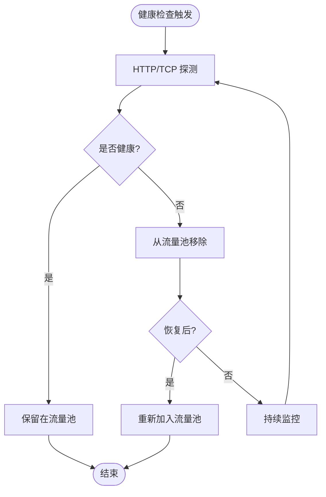
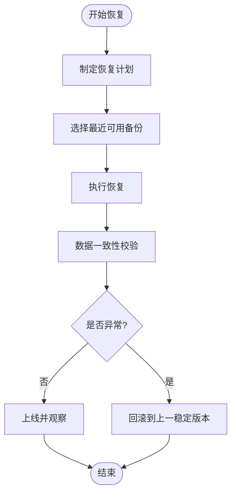
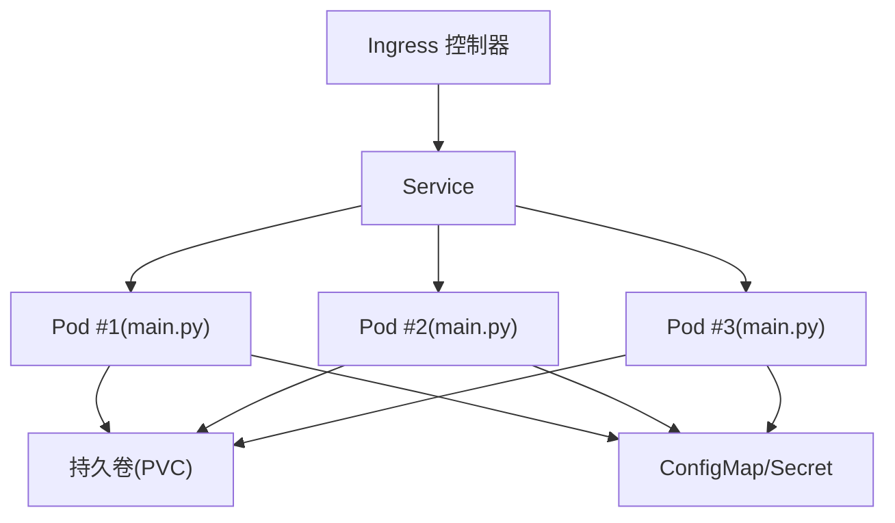

# 高可用部署

<cite>
**本文引用的文件**   
- [main.py](file://main.py)
- [pyproject.toml](file://pyproject.toml)
- [README.md](file://README.md)
- [agent-core/README.md](file://packages/agent-core/README.md)
- [companion-agent/README.md](file://packages/companion-agent/README.md)
- [quant-agent/README.md](file://packages/quant-agent/README.md)
- [agent-rl/README.md](file://packages/agent-rl/README.md)
</cite>

## 目录
1. [简介](#简介)
2. [项目结构](#项目结构)
3. [核心组件](#核心组件)
4. [架构总览](#架构总览)
5. [详细组件分析](#详细组件分析)
6. [依赖分析](#依赖分析)
7. [性能考虑](#性能考虑)
8. [故障转移与负载均衡](#故障转移与负载均衡)
9. [数据备份与恢复](#数据备份与恢复)
10. [容器化与编排](#容器化与编排)
11. [灾难恢复与业务连续性](#灾难恢复与业务连续性)
12. [结论](#结论)

## 简介
本指南面向生产环境，提供 JanusAgent 的高可用性部署方案。内容覆盖反向代理与健康检查、流量分发策略、主从切换与自动重启、服务发现、数据备份与一致性保障、Docker Compose 与 Kubernetes 编排、以及灾难恢复与业务连续性措施。文档基于仓库现有结构与入口程序进行设计，确保落地可执行且与代码组织一致。

## 项目结构
JanusAgent 采用多包工作区模式，由根入口 main.py 统一编排 agent-core、quant-agent、companion-agent 等子能力；agent-rl 作为强化学习扩展面。整体为“内核 + 领域智能体 + 编排中枢”的模块化架构。

图示来源
- [main.py:1-13](file://main.py#L1-L13)
- [pyproject.toml:1-30](file://pyproject.toml#L1-L30)
- [README.md:39-94](file://README.md#L39-L94)

章节来源
- [README.md:39-94](file://README.md#L39-L94)
- [pyproject.toml:1-30](file://pyproject.toml#L1-L30)
- [main.py:1-13](file://main.py#L1-L13)

## 核心组件
- 框架入口：负责加载并启动各智能体模块，对外暴露统一运行态。
- 核心抽象层：定义 Agent 生命周期、插件接口与通用能力。
- 量化智能体：市场数据接入、策略定义与回测。
- 陪伴智能体：对话管理、记忆存储与多轮交互。
- 强化学习智能体：训练框架、策略优化与模型部署。

章节来源
- [agent-core/README.md:1-16](file://packages/agent-core/README.md#L1-L16)
- [quant-agent/README.md:1-16](file://packages/quant-agent/README.md#L1-L16)
- [companion-agent/README.md:1-16](file://packages/companion-agent/README.md#L1-L16)
- [agent-rl/README.md:1-15](file://packages/agent-rl/README.md#L1-L15)

## 架构总览
生产环境建议采用“反向代理 + 多实例进程 + 健康检查 + 持久化存储”的组合，实现横向扩展与故障自愈。

图示来源
- [main.py:1-13](file://main.py#L1-L13)
- [README.md:61-84](file://README.md#L61-L84)

## 详细组件分析

### 入口与编排流程
- 入口职责：初始化并调用各子模块，完成基础能力装配与对外就绪。
- 编排关系：通过工作区依赖将多个智能体组合为一个可运行的系统。

图示来源
- [main.py:1-13](file://main.py#L1-L13)
- [pyproject.toml:7-12](file://pyproject.toml#L7-L12)

章节来源
- [main.py:1-13](file://main.py#L1-L13)
- [pyproject.toml:1-30](file://pyproject.toml#L1-L30)

### 类与模块关系（概念映射）
- 入口 main.py 依赖 agent-core、quant-agent、companion-agent、agent-rl。
- 各智能体共享 agent-core 提供的抽象与生命周期管理能力。

图示来源
- [main.py:1-13](file://main.py#L1-L13)
- [agent-core/README.md:1-16](file://packages/agent-core/README.md#L1-L16)
- [quant-agent/README.md:1-16](file://packages/quant-agent/README.md#L1-L16)
- [companion-agent/README.md:1-16](file://packages/companion-agent/README.md#L1-L16)
- [agent-rl/README.md:1-15](file://packages/agent-rl/README.md#L1-L15)

## 依赖分析
- 工作区依赖：根 pyproject.toml 声明了 agent-core、agent-rl、quant-agent、companion-agent 四个成员包。
- 入口依赖：main.py 导入 quant-agent 与 companion-agent，并在运行时输出其 hello 能力。

图示来源
- [pyproject.toml:1-30](file://pyproject.toml#L1-L30)
- [main.py:1-13](file://main.py#L1-L13)

章节来源
- [pyproject.toml:1-30](file://pyproject.toml#L1-L30)
- [main.py:1-13](file://main.py#L1-L13)

## 性能考虑
- 水平扩展：以无状态进程为主，结合反向代理做会话亲和或无状态路由。
- 资源隔离：每个进程实例独立内存空间，避免相互影响。
- I/O 分离：将计算密集型任务下沉到专用节点或异步队列。
- 连接池：数据库与外部 API 连接复用，减少握手开销。
- 缓存策略：热点数据本地缓存 + 分布式缓存双写，注意一致性边界。

## 故障转移与负载均衡

### 反向代理与健康检查
- Nginx/HAProxy 作为入口，启用主动健康检查与被动剔除。
- 健康端点：在应用侧暴露轻量 /health 接口，返回进程就绪与依赖连通性。
- 失败阈值：连续失败次数与超时时间合理设置，避免抖动误判。
- 权重与灰度：按实例规格分配权重，支持灰度发布与逐步放量。

### 流量分发策略
- 最小连接数/最少请求数：优先选择负载较低的实例。
- 会话保持：如需会话状态，使用粘性会话或外置会话存储。
- 重试与熔断：对下游依赖设置重试上限与熔断阈值，防止雪崩。

### 主从切换与服务发现
- 进程级主从：通过进程管理器（如 systemd/supervisor）保证存活与自动重启。
- 集群主从：若引入有状态组件（如数据库），采用原生主从复制与故障切换。
- 服务发现：在容器环境中使用内置 DNS 或服务网格（如 K8s Service/Ingress）。

## 数据备份与恢复

### 备份策略
- 数据库：全量 + 增量备份，跨地域复制，定期演练恢复。
- 配置文件：版本化管理，变更审计，灰度下发。
- 对象存储：快照与生命周期策略，防篡改与加密。

### 一致性保障
- 事务与幂等：关键写入具备事务或补偿机制。
- 最终一致性：跨域复制允许短暂不一致，但需明确 RPO/RTO 目标。
- 校验与比对：备份完成后进行完整性校验与抽样恢复验证。

### 恢复流程

## 容器化与编排

### Docker 镜像构建
- 多阶段构建：编译期与运行期分离，减小镜像体积。
- 非 root 运行：提升安全性。
- 健康检查：镜像内集成健康脚本，供编排平台使用。

### Docker Compose 编排
- 单节点多实例：通过副本数量实现水平扩展。
- 网络与卷：内部网络互通，持久卷挂载至数据库与对象存储。
- 环境变量：集中注入敏感信息与运行时参数。

### Kubernetes 部署
- Deployment：定义副本数、滚动更新策略与资源限制。
- Service/Ingress：暴露服务与域名路由，启用 TLS。
- ConfigMap/Secret：管理与注入配置与密钥。
- HorizontalPodAutoscaler：基于 CPU/内存或自定义指标自动扩缩容。
- PodDisruptionBudget：保障维护窗口下的最低可用副本。
- Liveness/Readiness：区分存活与就绪探针，配合滚动更新。

## 灾难恢复与业务连续性

### 灾备架构
- 多可用区/多地域：关键组件跨 AZ/Region 部署。
- 冷/温/热备：根据 RTO/RPO 目标选择不同级别的热备。
- 数据同步：数据库主从复制与对象存储跨区域复制。

### 演练与预案
- 定期演练：模拟节点宕机、网络分区、磁盘损坏等场景。
- 自动化切换：通过编排平台与运维脚本实现一键切换。
- 回滚策略：版本与数据双回滚，确保可逆。

### 监控与告警
- 指标：CPU/内存/磁盘/网络、请求延迟、错误率、队列积压。
- 日志：结构化日志与链路追踪，便于定位问题。
- 告警：分级告警与升级策略，联动工单与通知渠道。

## 结论
通过“反向代理 + 多实例 + 健康检查 + 持久化 + 自动化编排”的组合，JanusAgent 可在生产环境实现高可用与弹性伸缩。结合完善的备份恢复与灾备演练，可显著降低故障影响面，保障业务连续性。建议在灰度发布与容量规划上持续优化，逐步完善可观测性与自动化运维体系。