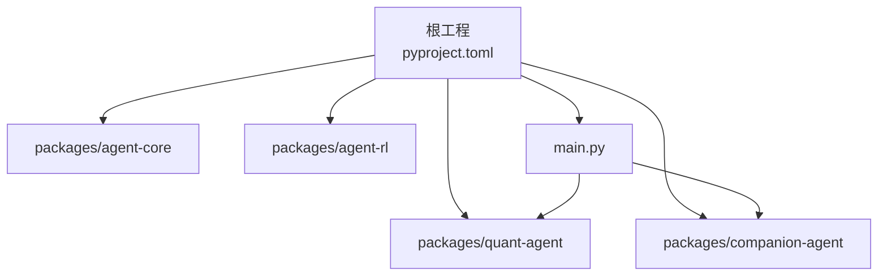
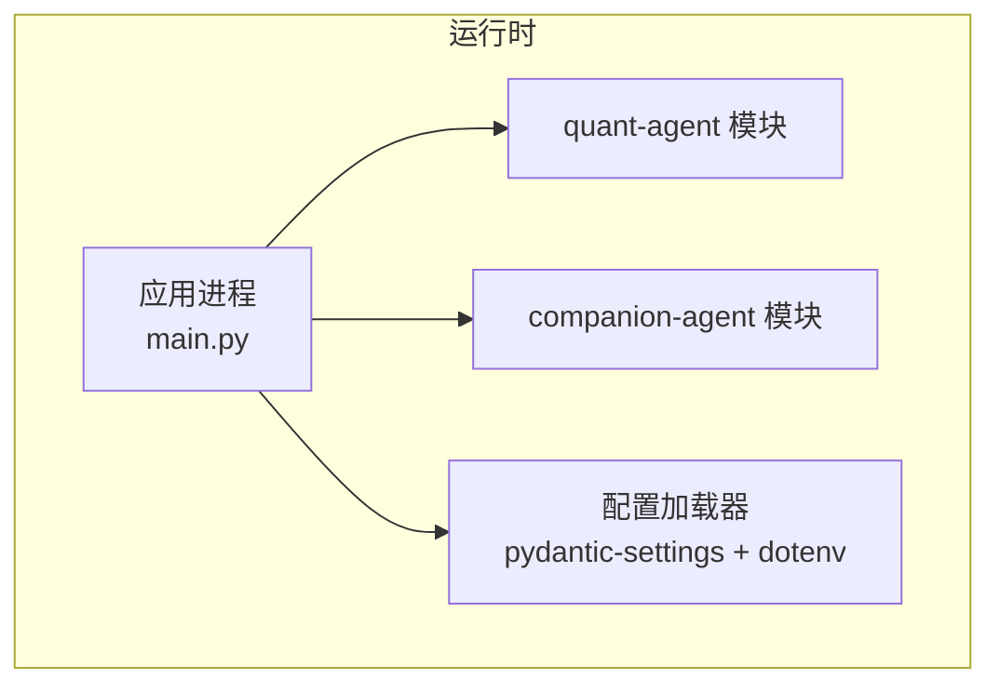
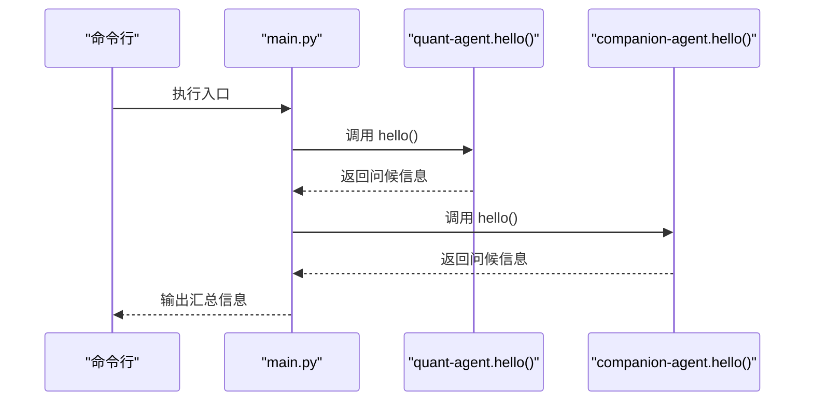
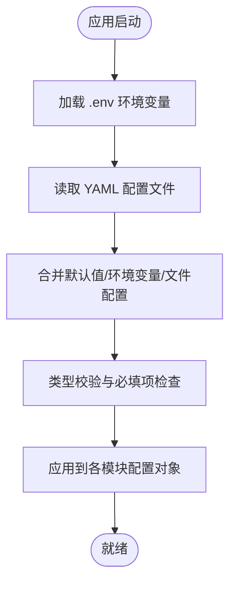
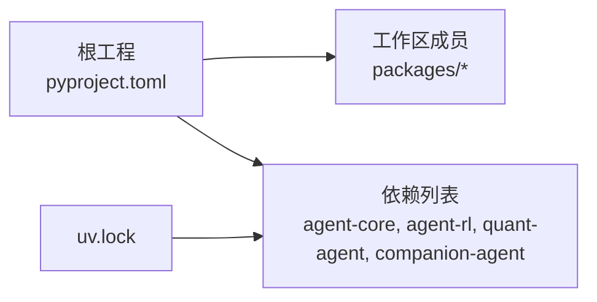
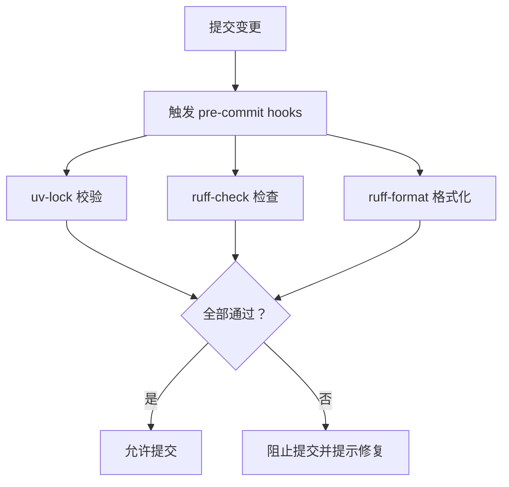
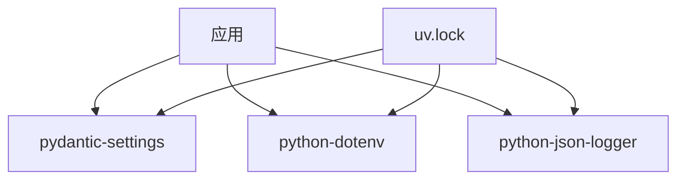

# 配置与部署

<cite>
**本文引用的文件**   
- [main.py](file://main.py)
- [pyproject.toml](file://pyproject.toml)
- [.pre-commit-config.yaml](file://.pre-commit-config.yaml)
- [uv.lock](file://uv.lock)
</cite>

## 目录
1. [简介](#简介)
2. [项目结构](#项目结构)
3. [核心组件](#核心组件)
4. [架构总览](#架构总览)
5. [详细组件分析](#详细组件分析)
6. [依赖分析](#依赖分析)
7. [性能考虑](#性能考虑)
8. [故障排除指南](#故障排除指南)
9. [结论](#结论)
10. [附录](#附录)

## 简介
本指南面向 JanusAgent 的配置管理与部署实践，聚焦以下目标：
- 说明 YAML 配置文件语法与结构（结合现有工作区与包组织方式）
- 环境变量与动态配置加载机制（基于 pydantic-settings、python-dotenv 等依赖）
- Docker 容器化与编排方案（镜像构建、服务发现、多环境管理）
- 生产环境最佳实践（安全、性能、监控）
- CI/CD 流水线示例（代码检查、测试自动化、持续部署）
- 故障排除与性能瓶颈诊断方法

## 项目结构
仓库采用 uv workspace 的多包组织方式，根工程通过 pyproject.toml 声明成员包与依赖。入口脚本 main.py 负责初始化并调用各子包的对外能力。

图表来源
- [pyproject.toml:1-30](file://pyproject.toml#L1-L30)
- [main.py:1-13](file://main.py#L1-L13)

章节来源
- [pyproject.toml:1-30](file://pyproject.toml#L1-L30)
- [main.py:1-13](file://main.py#L1-L13)

## 核心组件
- 入口程序 main.py：打印启动信息并调用 quant-agent 与 companion-agent 的 hello 接口，作为应用启动的聚合点。
- 工作区与依赖：pyproject.toml 定义项目名称、版本、Python 版本约束、依赖列表与工作区成员；uv.lock 锁定第三方依赖版本。
- 开发工具链：.pre-commit-config.yaml 集成 uv-lock、ruff-check、ruff-format，保障提交前代码质量与锁文件一致性。

章节来源
- [main.py:1-13](file://main.py#L1-L13)
- [pyproject.toml:1-30](file://pyproject.toml#L1-L30)
- [.pre-commit-config.yaml:1-18](file://.pre-commit-config.yaml#L1-L18)
- [uv.lock:4085-4095](file://uv.lock#L4085-L4095)

## 架构总览
从运行期视角，JanusAgent 由入口程序聚合多个 agent 包的能力，并通过工作区统一依赖管理。配置层可借助 pydantic-settings 与 python-dotenv 实现类型安全的配置加载与环境变量注入。

图表来源
- [main.py:1-13](file://main.py#L1-L13)
- [uv.lock:4085-4095](file://uv.lock#L4085-L4095)

## 详细组件分析

### 入口与启动流程
入口 main.py 在进程启动时执行主函数，依次调用 quant-agent 与 companion-agent 的 hello 方法，用于快速验证模块可用性与基础连通性。

图表来源
- [main.py:1-13](file://main.py#L1-L13)

章节来源
- [main.py:1-13](file://main.py#L1-L13)

### 配置模型与加载机制
- 配置模型：建议使用 pydantic-settings 定义强类型配置类，集中管理各模块参数。
- 环境变量：通过 python-dotenv 支持 .env 文件加载，便于本地与 CI 环境隔离。
- 动态加载：可在应用启动阶段按需读取外部配置源（如文件系统或远程配置中心），并进行校验与合并。

图表来源
- [uv.lock:4085-4095](file://uv.lock#L4085-L4095)

章节来源
- [uv.lock:4085-4095](file://uv.lock#L4085-L4095)

### 工作区与包依赖
- 工作区成员：packages/* 下的子包作为独立可发布包，被根工程引用。
- 依赖声明：根 pyproject.toml 中声明对 agent-core、agent-rl、quant-agent、companion-agent 的依赖。
- 版本锁定：uv.lock 记录所有依赖及其哈希，确保构建可重复。

图表来源
- [pyproject.toml:1-30](file://pyproject.toml#L1-L30)
- [uv.lock:4085-4095](file://uv.lock#L4085-L4095)

章节来源
- [pyproject.toml:1-30](file://pyproject.toml#L1-L30)
- [uv.lock:4085-4095](file://uv.lock#L4085-L4095)

### 预提交与代码质量
- uv-lock：保证锁文件与依赖一致。
- ruff-check：静态检查与自动修复。
- ruff-format：统一代码风格。

图表来源
- [.pre-commit-config.yaml:1-18](file://.pre-commit-config.yaml#L1-L18)

章节来源
- [.pre-commit-config.yaml:1-18](file://.pre-commit-config.yaml#L1-L18)

## 依赖分析
- 配置相关依赖：pydantic-settings、python-dotenv 提供类型安全配置与环境变量加载能力。
- 日志与工具：python-json-logger 可用于结构化日志输出，便于监控与排障。
- 锁文件：uv.lock 固定依赖版本，提升构建稳定性与可重现性。

图表来源
- [uv.lock:4085-4095](file://uv.lock#L4085-L4095)
- [uv.lock:4370-4377](file://uv.lock#L4370-L4377)
- [uv.lock:4379-4384](file://uv.lock#L4379-L4384)

章节来源
- [uv.lock:4085-4095](file://uv.lock#L4085-L4095)
- [uv.lock:4370-4377](file://uv.lock#L4370-L4377)
- [uv.lock:4379-4384](file://uv.lock#L4379-L4384)

## 性能考虑
- 配置加载优化：将配置解析与校验置于应用冷启动阶段，避免热路径重复计算。
- 资源限制：为容器设置合理的 CPU/内存上限与请求阈值，防止抖动与雪崩。
- 日志级别：生产环境使用 INFO/WARN 级别，减少 I/O 开销；仅在排查问题时临时调高。
- 依赖最小化：仅引入必要依赖，降低镜像体积与启动时间。

## 故障排除指南
- 启动失败
  - 现象：入口 main.py 调用子模块时报 ImportError。
  - 排查：确认工作区成员已正确安装，uv.lock 与当前环境一致；检查 Python 版本满足 >=3.12。
  - 参考：[pyproject.toml:1-30](file://pyproject.toml#L1-L30)、[main.py:1-13](file://main.py#L1-L13)
- 配置缺失或类型错误
  - 现象：应用启动时抛出配置校验异常。
  - 排查：核对 .env 与 YAML 配置键名、类型与必填项；使用 pydantic-settings 的错误信息进行定位。
  - 参考：[uv.lock:4085-4095](file://uv.lock#L4085-L4095)
- 依赖不一致
  - 现象：本地与 CI 行为不一致。
  - 排查：重新生成 uv.lock，确保 uv-lock hook 在提交前生效。
  - 参考：[.pre-commit-config.yaml:1-18](file://.pre-commit-config.yaml#L1-L18)

章节来源
- [pyproject.toml:1-30](file://pyproject.toml#L1-L30)
- [main.py:1-13](file://main.py#L1-L13)
- [uv.lock:4085-4095](file://uv.lock#L4085-L4095)
- [.pre-commit-config.yaml:1-18](file://.pre-commit-config.yaml#L1-L18)

## 结论
JanusAgent 以 uv workspace 为核心组织多包工程，入口程序聚合子模块能力，配合 pydantic-settings 与 python-dotenv 可实现类型安全的环境与配置管理。通过 pre-commit 钩子保障提交质量，结合 uv.lock 确保依赖稳定。在生产环境中，建议遵循安全、性能与监控的最佳实践，并使用 CI/CD 流水线实现自动化交付与回滚。

## 附录

### YAML 配置语法与结构建议
- 推荐分层结构：全局、模块级、运行时三类配置，便于覆盖与继承。
- 命名规范：使用小写加下划线，避免歧义；布尔值使用 true/false。
- 校验策略：在应用启动阶段进行 schema 校验，缺失必填项立即失败。

### 环境变量与动态配置加载
- 优先级：默认值 < 配置文件 < 环境变量 < 运行时注入。
- 安全：敏感字段（密钥、令牌）仅通过环境变量注入，不写入配置文件。
- 动态更新：可通过信号或健康检查端点触发配置重载，注意并发安全与幂等。

### Docker 容器化与编排
- 镜像构建：使用多阶段构建，仅包含运行期依赖；利用 uv.lock 锁定依赖版本。
- 容器编排：推荐使用 Kubernetes Deployment/Service/ConfigMap/Secret 管理配置与服务发现。
- 健康检查：暴露 /healthz 端点，供探针探测存活与就绪状态。

### 生产环境最佳实践
- 安全：最小权限原则、网络隔离、密钥外置、审计日志。
- 性能：连接池、缓存、限流、熔断、优雅关闭。
- 监控：指标采集（Prometheus）、日志聚合（ELK/Loki）、链路追踪（OpenTelemetry）。

### CI/CD 流水线示例
- 代码检查：ruff-check、ruff-format、uv-lock。
- 测试自动化：单元测试、集成测试、覆盖率报告。
- 持续部署：构建镜像、推送镜像仓库、滚动更新、灰度发布与回滚。

### 多环境管理策略
- 环境隔离：dev/staging/prod 分离，使用不同 ConfigMap/Secret。
- 配置模板：基于模板生成环境特定配置，避免硬编码。
- 版本化：配置随代码版本管理，变更需评审与审计。