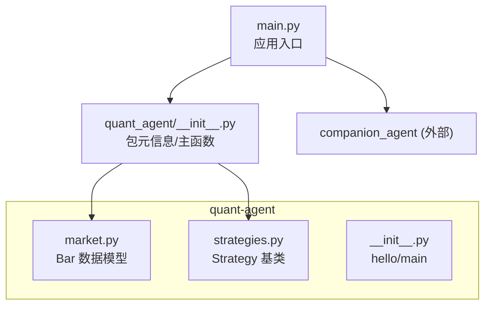
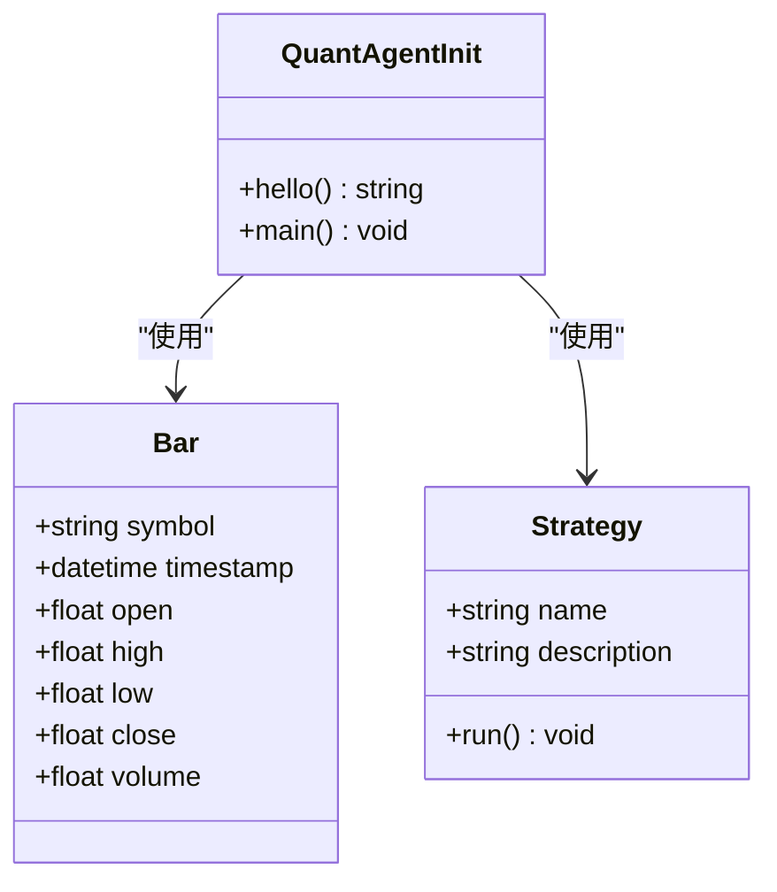
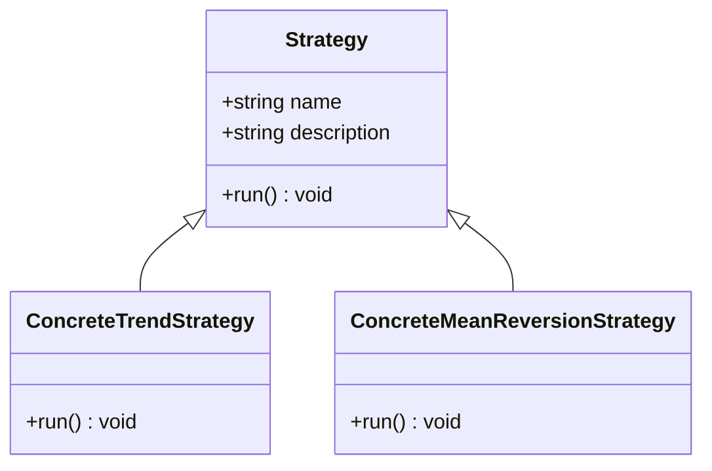
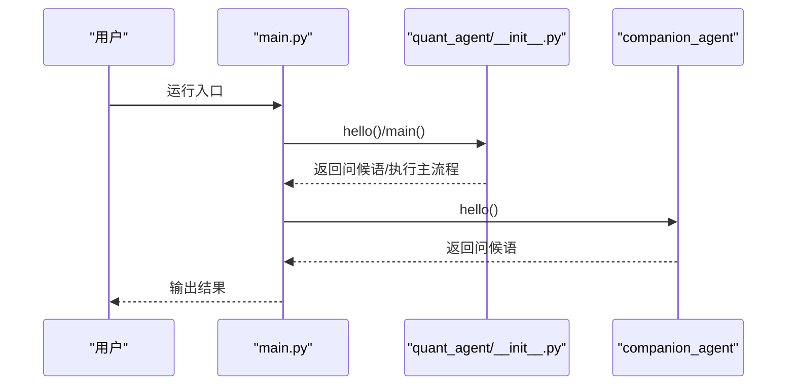
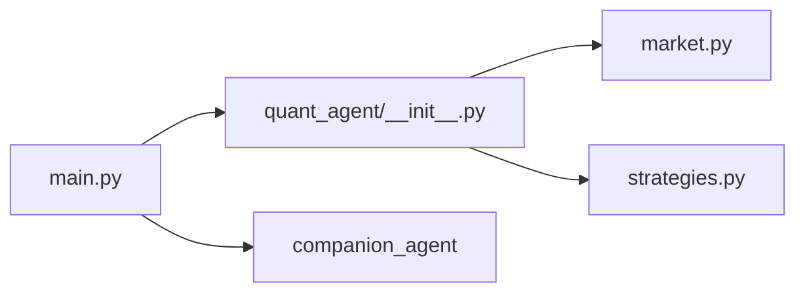

# 交易策略框架

<cite>
**本文引用的文件**   
- [main.py](file://main.py)
- [quant_agent/__init__.py](file://packages/quant-agent/src/quant_agent/__init__.py)
- [market.py](file://packages/quant-agent/src/quant_agent/market.py)
- [strategies.py](file://packages/quant-agent/src/quant_agent/strategies.py)
- [README.md](file://packages/quant-agent/README.md)
</cite>

## 目录
1. [简介](#简介)
2. [项目结构](#项目结构)
3. [核心组件](#核心组件)
4. [架构总览](#架构总览)
5. [详细组件分析](#详细组件分析)
6. [依赖关系分析](#依赖关系分析)
7. [性能与扩展性考虑](#性能与扩展性考虑)
8. [故障排查指南](#故障排查指南)
9. [结论](#结论)
10. [附录：开发规范与演进路线](#附录开发规范与演进路线)

## 简介
本仓库为“JanusAgent 理性之面”的量化交易智能体子模块，目标是提供市场数据、策略定义与回测框架的基础能力，面向数据驱动的投资决策。当前版本实现了最小可用的策略基类与市场数据模型，并提供了入口程序以快速验证运行环境。后续将在此基础上完善事件驱动引擎、参数配置系统、组合与权重分配、指标评估与可视化等能力。

## 项目结构
- 顶层入口 main.py 负责初始化并调用各子模块的 hello/main 方法，用于快速冒烟测试。
- quant-agent 包提供：
  - 市场数据模型 Bar（K线）
  - 策略抽象基类 Strategy（run 接口）
  - 包级元信息与主函数
- README.md 给出开发与运行说明。

图表来源
- [main.py:1-13](file://main.py#L1-L13)
- [quant_agent/__init__.py:1-15](file://packages/quant-agent/src/quant_agent/__init__.py#L1-L15)
- [market.py:1-16](file://packages/quant-agent/src/quant_agent/market.py#L1-L16)
- [strategies.py:1-13](file://packages/quant-agent/src/quant_agent/strategies.py#L1-L13)

章节来源
- [main.py:1-13](file://main.py#L1-L13)
- [quant_agent/__init__.py:1-15](file://packages/quant-agent/src/quant_agent/__init__.py#L1-L15)
- [README.md:1-16](file://packages/quant-agent/README.md#L1-L16)

## 核心组件
- 市场数据模型 Bar：统一 K 线数据结构，包含标的、时间戳、开高低收与成交量。
- 策略基类 Strategy：定义策略名称、描述与 run 生命周期钩子，要求子类实现具体执行逻辑。
- 包入口：提供 hello 与 main 方法，便于快速验证与集成。

章节来源
- [market.py:1-16](file://packages/quant-agent/src/quant_agent/market.py#L1-L16)
- [strategies.py:1-13](file://packages/quant-agent/src/quant_agent/strategies.py#L1-L13)
- [quant_agent/__init__.py:1-15](file://packages/quant-agent/src/quant_agent/__init__.py#L1-L15)

## 架构总览
当前为最小可用架构：入口程序加载 quant-agent 包，暴露 Bar 与 Strategy 两个核心类型；未来将在此之上扩展事件总线、回测引擎、参数系统与组合管理。

图表来源
- [market.py:1-16](file://packages/quant-agent/src/quant_agent/market.py#L1-L16)
- [strategies.py:1-13](file://packages/quant-agent/src/quant_agent/strategies.py#L1-L13)
- [quant_agent/__init__.py:1-15](file://packages/quant-agent/src/quant_agent/__init__.py#L1-L15)

## 详细组件分析

### 市场数据模型 Bar
- 职责：标准化单根 K 线的字段，作为策略输入的最小数据单元。
- 设计要点：
  - 使用数据类简化构造与序列化。
  - 字段覆盖 OHLCV 基本要素，便于后续技术指标计算与回测。
- 复杂度：O(1) 构造与访问。
- 可扩展点：
  - 增加复权因子、涨跌停价、盘口快照等字段。
  - 支持批量序列或流式迭代器。

章节来源
- [market.py:1-16](file://packages/quant-agent/src/quant_agent/market.py#L1-L16)

### 策略基类 Strategy
- 职责：定义策略的统一接口与必要元信息，强制子类实现 run 生命周期。
- 设计要点：
  - 通过抽象 run 方法约束策略实现。
  - 提供 name/description 便于注册、展示与日志追踪。
- 复杂度：O(1) 实例化；run 由子类决定。
- 可扩展点：
  - 增加 on_bar/on_tick/on_order 等事件回调。
  - 增加状态机（未初始化/运行中/暂停/停止）。
  - 增加参数校验与默认值注入。

图表来源
- [strategies.py:1-13](file://packages/quant-agent/src/quant_agent/strategies.py#L1-L13)

章节来源
- [strategies.py:1-13](file://packages/quant-agent/src/quant_agent/strategies.py#L1-L13)

### 包入口与运行流程
- 职责：对外暴露 hello/main，供上层入口或命令行工具调用。
- 运行流程：
  - main.py 导入 quant_agent 与 companion_agent，打印欢迎信息。
  - quant_agent.__init__.py 提供 hello 与 main，便于独立运行。

图表来源
- [main.py:1-13](file://main.py#L1-L13)
- [quant_agent/__init__.py:1-15](file://packages/quant-agent/src/quant_agent/__init__.py#L1-L15)

章节来源
- [main.py:1-13](file://main.py#L1-L13)
- [quant_agent/__init__.py:1-15](file://packages/quant-agent/src/quant_agent/__init__.py#L1-L15)

## 依赖关系分析
- main.py 依赖 quant_agent 与 companion_agent 两个子包。
- quant_agent 内部 market.py 与 strategies.py 相互独立，均由 __init__.py 聚合导出。
- 当前无第三方运行时依赖，便于快速部署与二次开发。

图表来源
- [main.py:1-13](file://main.py#L1-L13)
- [quant_agent/__init__.py:1-15](file://packages/quant-agent/src/quant_agent/__init__.py#L1-L15)
- [market.py:1-16](file://packages/quant-agent/src/quant_agent/market.py#L1-L16)
- [strategies.py:1-13](file://packages/quant-agent/src/quant_agent/strategies.py#L1-L13)

章节来源
- [main.py:1-13](file://main.py#L1-L13)
- [quant_agent/__init__.py:1-15](file://packages/quant-agent/src/quant_agent/__init__.py#L1-L15)

## 性能与扩展性考虑
- 数据模型：Bar 为轻量数据类，内存占用低，适合批处理与流式处理。
- 策略基类：run 为纯虚接口，建议子类采用增量更新（on_bar）避免全量重算。
- 可扩展方向：
  - 事件总线：基于发布-订阅模式解耦信号生成、仓位计算与执行。
  - 参数系统：引入可热重载的配置中心，支持动态调参与灰度切换。
  - 组合管理：多策略权重分配与再平衡机制。
  - 指标体系：收益、回撤、夏普、最大回撤、胜率、盈亏比等。

[本节为通用指导，不直接分析具体文件]

## 故障排查指南
- 运行入口报错
  - 现象：运行 main.py 时报找不到模块。
  - 排查：确认已安装依赖且工作区路径正确；参考 README 中的 uv 命令进行同步与运行。
- 策略未实现 run
  - 现象：继承 Strategy 后未实现 run 导致运行时异常。
  - 排查：确保子类重写 run 方法并实现业务逻辑。
- 数据字段缺失
  - 现象：策略读取 Bar 字段时出现空值。
  - 排查：检查数据源是否完整填充 OHLCV 字段，必要时增加空值校验与降级逻辑。

章节来源
- [README.md:1-16](file://packages/quant-agent/README.md#L1-L16)
- [strategies.py:1-13](file://packages/quant-agent/src/quant_agent/strategies.py#L1-L13)
- [market.py:1-16](file://packages/quant-agent/src/quant_agent/market.py#L1-L16)

## 结论
当前版本完成了量化交易框架的最小闭环：统一的 K 线数据模型与策略基类，配合入口程序完成基础验证。下一步应围绕事件驱动、参数系统、组合管理与指标评估持续演进，逐步构建可生产化的策略平台。

[本节为总结性内容，不直接分析具体文件]

## 附录：开发规范与演进路线

### 策略定义接口规范
- 基类抽象
  - 所有策略需继承 Strategy，并提供 name/description。
  - 必须实现 run 生命周期方法；建议进一步拆分为 on_bar/on_tick/on_order 等事件钩子。
- 生命周期管理
  - 初始化阶段：加载参数、准备历史数据、建立缓存。
  - 运行阶段：逐条消费 Bar，生成信号、计算仓位、提交订单。
  - 收尾阶段：统计指标、持久化结果、释放资源。
- 事件驱动机制
  - 建议引入事件总线，将信号、风控、执行解耦，提升可测试性与可维护性。

章节来源
- [strategies.py:1-13](file://packages/quant-agent/src/quant_agent/strategies.py#L1-L13)

### 信号生成、仓位计算与执行逻辑
- 信号生成
  - 基于技术指标或基本面因子产生买卖信号。
  - 建议对信号进行阈值过滤与去噪。
- 仓位计算
  - 结合风险预算、波动率目标与资金曲线，动态调整头寸规模。
- 执行逻辑
  - 将信号转换为订单，考虑滑点、手续费与流动性约束。
  - 建议加入风控拦截（止损/止盈/最大持仓限制）。

[本节为通用指导，不直接分析具体文件]

### 策略参数配置系统（规划）
- 支持 JSON/YAML 配置文件，定义策略名、参数、标的与周期。
- 运行时热重载：监听配置变更，安全地切换参数而不中断运行。
- 参数校验：在启动与热重载时进行范围与依赖校验。

[本节为规划性内容，不直接分析具体文件]

### 经典策略示例（规划）
- 趋势跟踪：均线交叉、通道突破等。
- 均值回归：布林带回归、协整配对等。
- 动量策略：相对强度、跨期动量等。
- 示例将遵循统一接口，复用事件与执行基础设施。

[本节为规划性内容，不直接分析具体文件]

### 策略组合与权重分配（规划）
- 多策略并行运行，按风险平价、等权或优化目标分配权重。
- 定期再平衡与动态调仓，控制整体回撤与相关性风险。

[本节为规划性内容，不直接分析具体文件]

### 绩效评估与回测分析（规划）
- 指标：年化收益、最大回撤、夏普比率、索提诺比率、胜率、盈亏比、换手率。
- 分析方法：分时段表现、滚动窗口稳定性、压力测试与蒙特卡洛模拟。

[本节为规划性内容，不直接分析具体文件]

### 开发环境与运行
- 使用 uv 进行依赖管理与运行，详见 README。
- 建议为每个策略创建独立模块，并通过注册表集中发现与加载。

章节来源
- [README.md:1-16](file://packages/quant-agent/README.md#L1-L16)