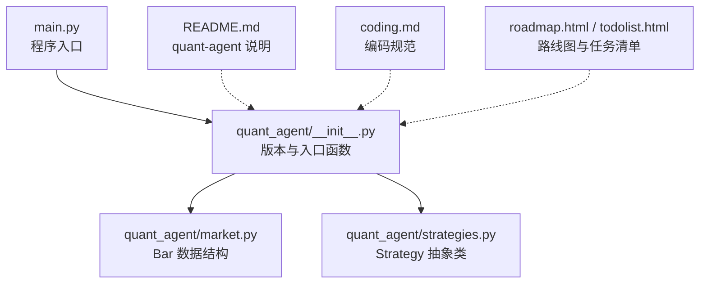
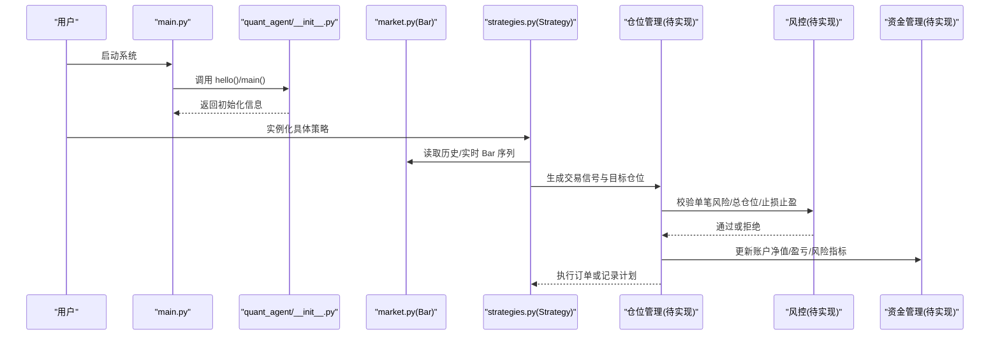
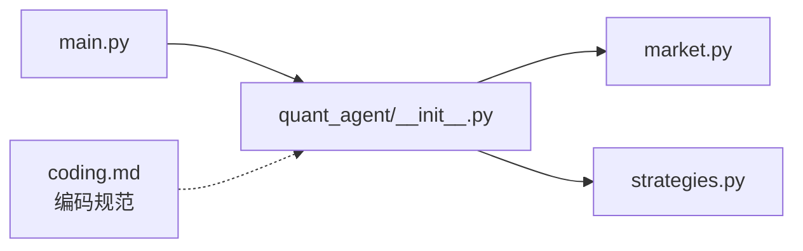
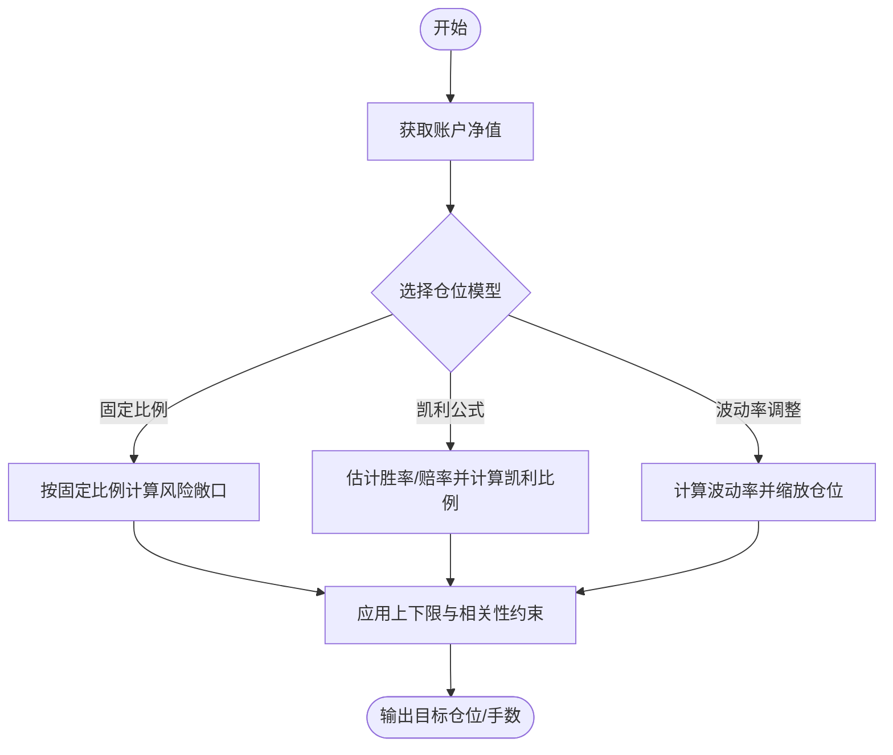
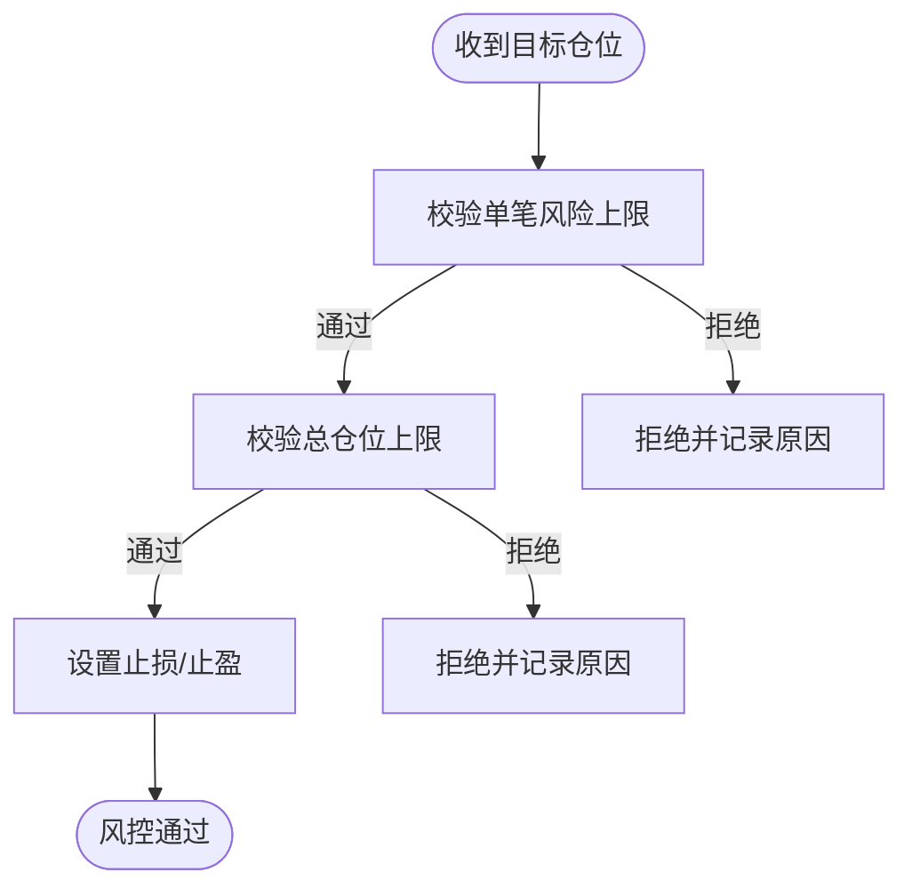
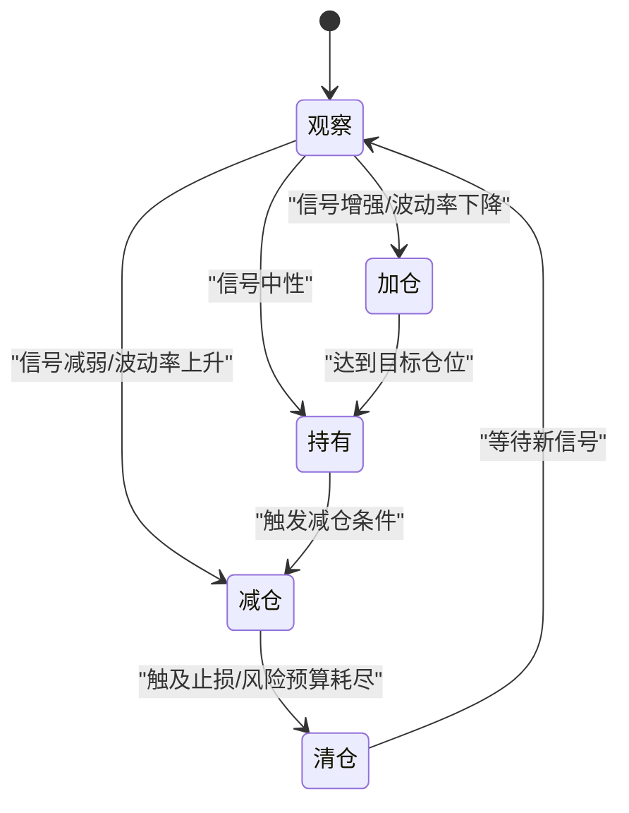
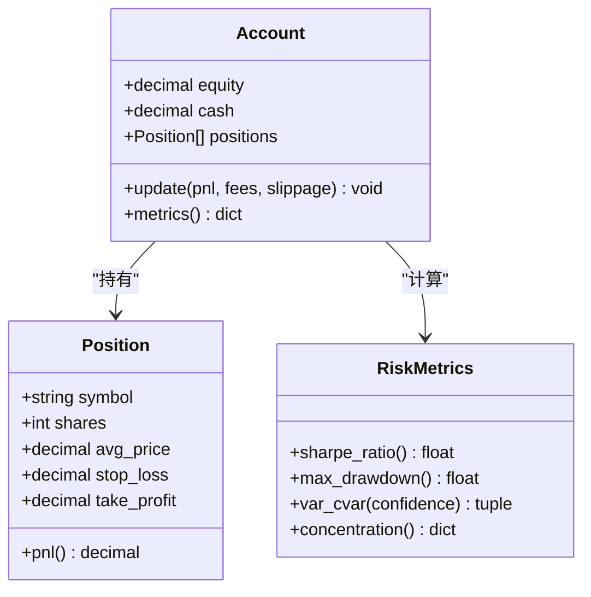
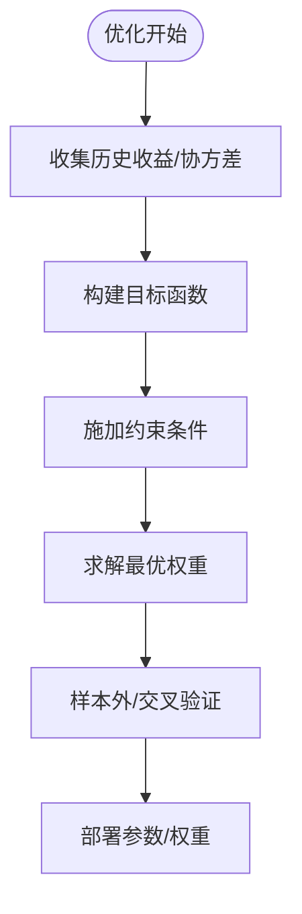
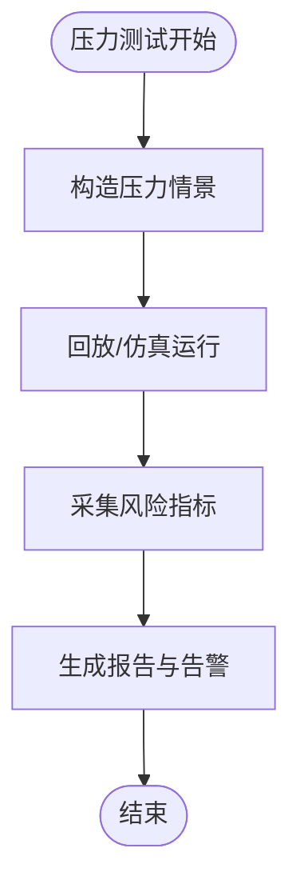

# 仓位管理系统

<cite>
**本文引用的文件**   
- [main.py](file://main.py)
- [quant_agent/__init__.py](file://packages/quant-agent/src/quant_agent/__init__.py)
- [market.py](file://packages/quant-agent/src/quant_agent/market.py)
- [strategies.py](file://packages/quant-agent/src/quant_agent/strategies.py)
- [README.md](file://packages/quant-agent/README.md)
- [coding.md](file://.agent/rules/coding.md)
- [roadmap.html](file://docs/plans/roadmap.html)
- [todolist.html](file://docs/plans/todolist.html)
</cite>

## 目录
1. [引言](#引言)
2. [项目结构](#项目结构)
3. [核心组件](#核心组件)
4. [架构总览](#架构总览)
5. [详细组件分析](#详细组件分析)
6. [依赖关系分析](#依赖关系分析)
7. [性能与扩展性考虑](#性能与扩展性考虑)
8. [故障排查指南](#故障排查指南)
9. [结论](#结论)
10. [附录：仓位模型与风控实现蓝图](#附录仓位模型与风控实现蓝图)

## 引言
本技术文档面向“仓位管理系统”的设计与实现，聚焦以下目标：
- 仓位计算模型：固定比例法、凯利公式、波动率调整等规模确定方法
- 风险控制机制：单笔交易风险限制、总仓位上限、止损止盈设置
- 仓位调整逻辑：加仓减仓条件、动态调仓策略、再平衡机制
- 资金管理模块：账户净值跟踪、盈亏统计、风险指标监控
- 仓位优化算法与压力测试方法

当前仓库处于早期阶段，已提供量化智能体（quant-agent）的基础骨架：市场数据模型 Bar、策略抽象 Strategy、以及顶层入口 main.py。仓位管理相关的具体算法尚未落地，本文在严格基于现有代码的基础上，给出可落地的架构蓝图与实现建议，确保后续开发可直接对接已有模块。

## 项目结构
仓库采用多包组织方式，量化交易能力集中在 quant-agent 包中；顶层 main.py 作为统一入口，负责加载并调用各子模块的 hello/main 函数。

图表来源
- [main.py:1-13](file://main.py#L1-L13)
- [quant_agent/__init__.py:1-14](file://packages/quant-agent/src/quant_agent/__init__.py#L1-L14)
- [market.py:1-16](file://packages/quant-agent/src/quant_agent/market.py#L1-L16)
- [strategies.py:1-13](file://packages/quant-agent/src/quant_agent/strategies.py#L1-L13)
- [README.md:1-16](file://packages/quant-agent/README.md#L1-L16)
- [coding.md:1-65](file://.agent/rules/coding.md#L1-L65)
- [roadmap.html:314-333](file://docs/plans/roadmap.html#L314-L333)
- [todolist.html:184-242](file://docs/plans/todolist.html#L184-L242)

章节来源
- [main.py:1-13](file://main.py#L1-L13)
- [quant_agent/__init__.py:1-14](file://packages/quant-agent/src/quant_agent/__init__.py#L1-L14)
- [market.py:1-16](file://packages/quant-agent/src/quant_agent/market.py#L1-L16)
- [strategies.py:1-13](file://packages/quant-agent/src/quant_agent/strategies.py#L1-L13)
- [README.md:1-16](file://packages/quant-agent/README.md#L1-L16)
- [coding.md:1-65](file://.agent/rules/coding.md#L1-L65)
- [roadmap.html:314-333](file://docs/plans/roadmap.html#L314-L333)
- [todolist.html:184-242](file://docs/plans/todolist.html#L184-L242)

## 核心组件
- 市场数据模型 Bar：定义单根 K 线的基本字段（标的、时间戳、开高低收、成交量），为后续技术指标与仓位计算提供基础输入。
- 策略抽象 Strategy：定义策略的统一接口 run()，便于扩展多种策略（趋势、均值回归、动量等）。
- 顶层入口 main.py：聚合调用 quant_agent 与 companion_agent 的 hello 函数，用于快速验证环境。

章节来源
- [market.py:1-16](file://packages/quant-agent/src/quant_agent/market.py#L1-L16)
- [strategies.py:1-13](file://packages/quant-agent/src/quant_agent/strategies.py#L1-L13)
- [main.py:1-13](file://main.py#L1-L13)

## 架构总览
下图展示从行情到策略再到仓位管理的端到端流程。当前仓库仅包含数据与策略骨架，仓位管理与风控将在后续模块中接入。

图表来源
- [main.py:1-13](file://main.py#L1-L13)
- [quant_agent/__init__.py:1-14](file://packages/quant-agent/src/quant_agent/__init__.py#L1-L14)
- [market.py:1-16](file://packages/quant-agent/src/quant_agent/market.py#L1-L16)
- [strategies.py:1-13](file://packages/quant-agent/src/quant_agent/strategies.py#L1-L13)

## 详细组件分析

### 数据层：Bar 市场数据模型
- 职责：标准化单根 Bar 的数据结构，供策略与风控模块消费。
- 关键字段：symbol、timestamp、open、high、low、close、volume。
- 复杂度：O(1) 访问；批量处理时按时间排序后线性扫描。
- 扩展点：可追加派生字段（如 ATR、波动率窗口）以支持波动率调整仓位。

章节来源
- [market.py:1-16](file://packages/quant-agent/src/quant_agent/market.py#L1-L16)

### 策略层：Strategy 抽象
- 职责：定义策略统一接口 run()，子类实现入场/出场与仓位建议。
- 设计模式：模板方法/策略模式，便于回测与实盘复用。
- 扩展点：run() 内可组合 Bar 序列、技术指标、信号与仓位计算。

章节来源
- [strategies.py:1-13](file://packages/quant-agent/src/quant_agent/strategies.py#L1-L13)

### 入口层：main.py 与 quant_agent 初始化
- 职责：聚合调用子模块，提供最小可用入口。
- 现状：打印问候语，未包含业务逻辑。
- 下一步：可在 main 中编排“数据→策略→仓位→风控→资金”的流水线。

章节来源
- [main.py:1-13](file://main.py#L1-L13)
- [quant_agent/__init__.py:1-14](file://packages/quant-agent/src/quant_agent/__init__.py#L1-L14)

## 依赖关系分析
- main.py 依赖 quant_agent 与 companion_agent 的 hello 函数。
- quant_agent 内部依赖 market.py 与 strategies.py 提供的数据与策略抽象。
- 编码规范 coding.md 对类型注解、异常处理、文档字符串等提出约束，影响后续仓位与风控模块的实现风格。

图表来源
- [main.py:1-13](file://main.py#L1-L13)
- [quant_agent/__init__.py:1-14](file://packages/quant-agent/src/quant_agent/__init__.py#L1-L14)
- [market.py:1-16](file://packages/quant-agent/src/quant_agent/market.py#L1-L16)
- [strategies.py:1-13](file://packages/quant-agent/src/quant_agent/strategies.py#L1-L13)
- [coding.md:1-65](file://.agent/rules/coding.md#L1-L65)

章节来源
- [main.py:1-13](file://main.py#L1-L13)
- [quant_agent/__init__.py:1-14](file://packages/quant-agent/src/quant_agent/__init__.py#L1-L14)
- [coding.md:1-65](file://.agent/rules/coding.md#L1-L65)

## 性能与扩展性考虑
- 数据流：Bar 序列建议按时间有序存储，避免重复排序；批量计算指标时使用向量化或滑动窗口。
- 并发：策略与风控可解耦，策略产生信号，风控独立校验，便于并行回测与压测。
- 可扩展性：遵循 coding.md 的类型注解与异常处理规范，新增仓位模型与风控规则时保持接口稳定。

[本节为通用指导，不直接分析具体文件]

## 故障排查指南
- 运行入口：确认 main.py 能正确导入并调用 quant_agent.hello()。
- 策略实现：若自定义策略未实现 run()，将触发未实现异常，需检查继承与覆盖。
- 数据格式：Bar 字段缺失或类型不符会导致后续计算失败，建议在数据接入层增加校验。
- 编码规范：遵循 Google-style docstrings、PEP 8、ruff 检查，减少静态问题。

章节来源
- [main.py:1-13](file://main.py#L1-L13)
- [strategies.py:1-13](file://packages/quant-agent/src/quant_agent/strategies.py#L1-L13)
- [coding.md:1-65](file://.agent/rules/coding.md#L1-L65)

## 结论
当前仓库提供了量化智能体的基础骨架：Bar 数据模型与 Strategy 抽象，为后续仓位管理与风控模块奠定了良好基础。下一步应优先补齐仓位计算、风控校验与资金管理三大模块，并与现有数据/策略层无缝集成。

[本节为总结性内容，不直接分析具体文件]

## 附录：仓位模型与风控实现蓝图
本节为“仓位管理系统”的完整实现蓝图，结合现有 Bar 与 Strategy 接口，给出可落地的设计与流程。该蓝图旨在指导后续开发，不直接对应现有源码。

### 仓位计算模型
- 固定比例法：按账户净值的固定百分比分配单笔风险，例如每笔风险不超过净值的 r%。
- 凯利公式：基于胜率与赔率估算最优下注比例，适用于有正期望的策略；需配合截断与平滑以避免极端仓位。
- 波动率调整：根据近期波动率（如 ATR 或滚动标准差）动态缩放仓位，高波动降仓、低波动升仓。

### 风险控制机制
- 单笔交易风险限制：单笔最大亏损不超过账户净值的一定比例。
- 总仓位上限：所有持仓市值/风险暴露的上限，防止过度集中。
- 止损止盈：入场即挂止损/止盈，或基于波动率的追踪止损。
- 相关性控制：同方向相关头寸合并计算风险，避免隐性集中。

### 仓位调整逻辑
- 加仓条件：趋势延续、回撤修复、波动率回落至阈值、信号强度增强。
- 减仓条件：趋势弱化、波动率上升、触及风险预算、相关性升高。
- 动态调仓：基于状态机或阈值带（band）进行阶梯式调仓。
- 再平衡：定期或事件驱动（如净值回撤阈值）触发再平衡，使权重回到目标。

### 资金管理模块
- 账户净值跟踪：逐日/逐笔更新权益曲线，记录手续费与滑点。
- 盈亏统计：累计收益、日度收益分布、最大回撤、夏普比率、索提诺比率。
- 风险指标监控：VaR、CVaR、波动率、相关性矩阵、集中度指标。
- 报告与告警：阈值告警、日报周报、异常检测。

### 仓位优化算法
- 目标函数：最大化风险调整后收益（如 Sharpe），或最小化回撤。
- 约束：单笔风险、总仓位、行业/因子暴露、流动性限制。
- 求解器：二次规划或启发式搜索（网格/贝叶斯优化），回测中离线优化，盘中只评估。

### 压力测试方法
- 历史情景：选取极端年份/黑天鹅片段回放，评估回撤与流动性冲击。
- 蒙特卡洛：对收益率路径进行随机扰动，评估尾部风险。
- 参数敏感性：关键参数（如凯利系数、波动率窗口）扰动，观察稳健性。
- 熔断与降级：模拟数据源中断、滑点放大、涨跌停等场景下的行为。

### 与现有代码的对接建议
- 在 Strategy.run() 中读取 Bar 序列，计算信号并输出目标仓位。
- 新增仓位管理器模块，接收信号并调用风控与资金管理。
- 使用 Bar 的 close/volume 等字段计算波动率与流动性指标，支撑波动率调整与流动性约束。

章节来源
- [market.py:1-16](file://packages/quant-agent/src/quant_agent/market.py#L1-L16)
- [strategies.py:1-13](file://packages/quant-agent/src/quant_agent/strategies.py#L1-L13)
- [README.md:1-16](file://packages/quant-agent/README.md#L1-L16)
- [coding.md:1-65](file://.agent/rules/coding.md#L1-L65)
- [roadmap.html:314-333](file://docs/plans/roadmap.html#L314-L333)
- [todolist.html:184-242](file://docs/plans/todolist.html#L184-L242)