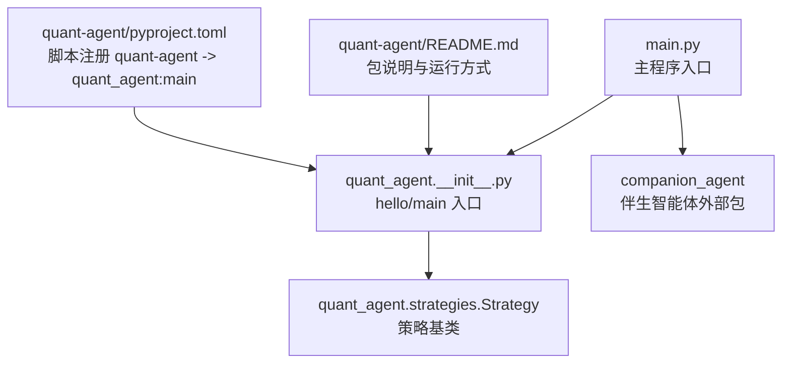
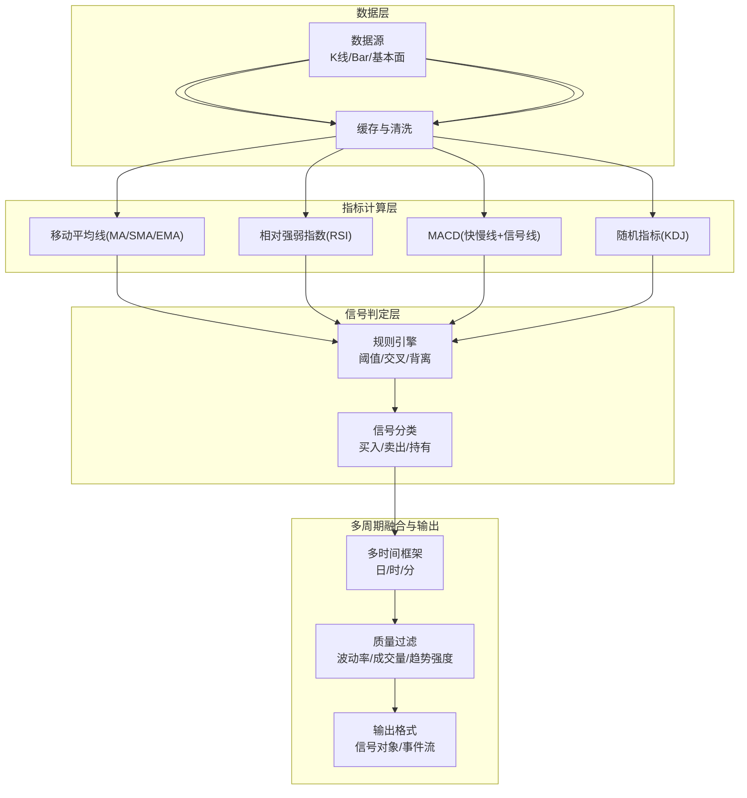
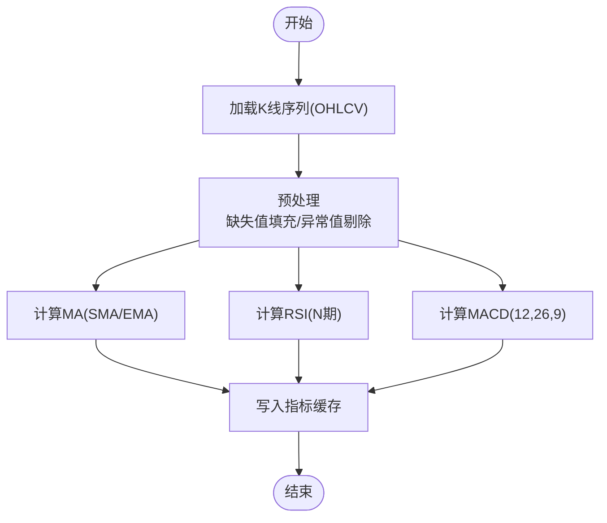
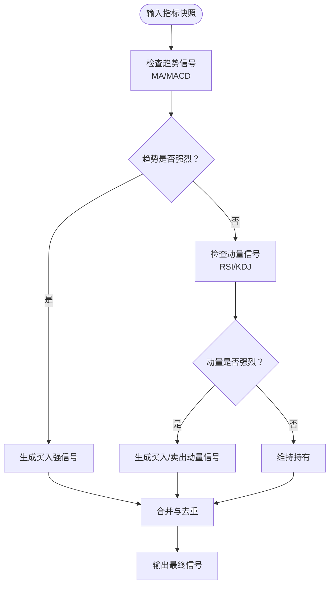
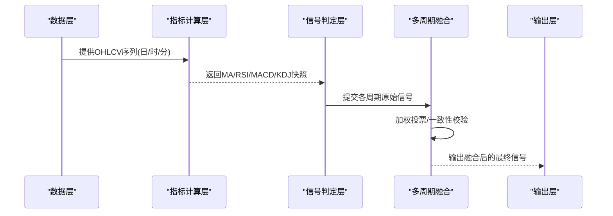
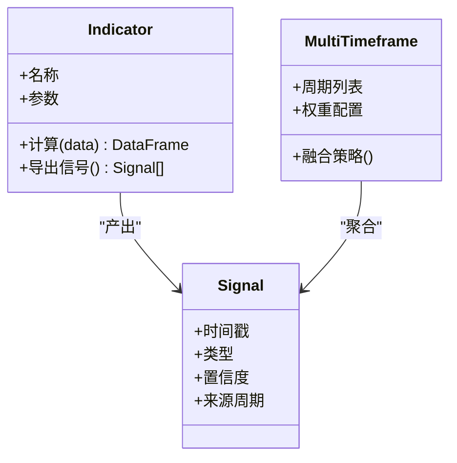
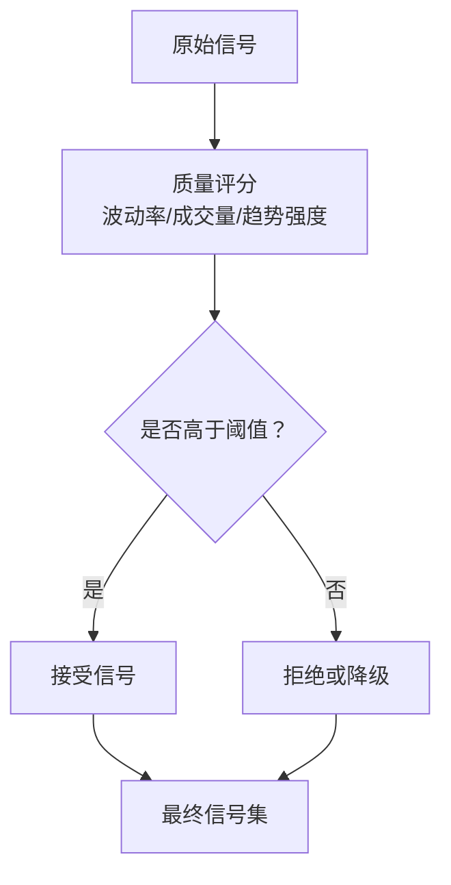
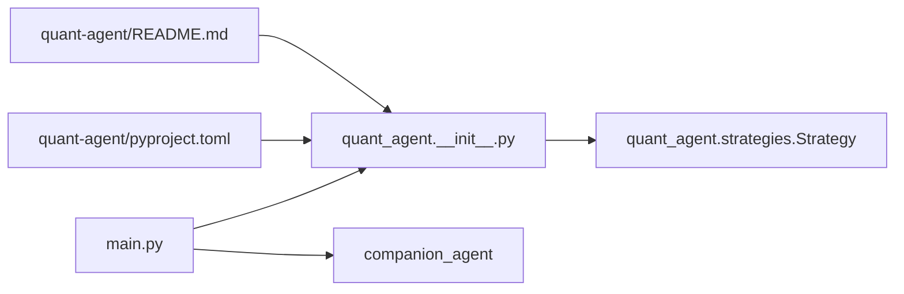

# 信号生成系统

<cite>
**本文引用的文件**   
- [main.py](file://main.py)
- [__init__.py](file://packages/quant-agent/src/quant_agent/__init__.py)
- [strategies.py](file://packages/quant-agent/src/quant_agent/strategies.py)
- [README.md](file://packages/quant-agent/README.md)
- [pyproject.toml](file://packages/quant-agent/pyproject.toml)
- [todolist.html](file://docs/plans/todolist.html)
</cite>

## 目录
1. [简介](#简介)
2. [项目结构](#项目结构)
3. [核心组件](#核心组件)
4. [架构总览](#架构总览)
5. [详细组件分析](#详细组件分析)
6. [依赖关系分析](#依赖关系分析)
7. [性能考虑](#性能考虑)
8. [故障排查指南](#故障排查指南)
9. [结论](#结论)
10. [附录](#附录)

## 简介
本技术文档围绕“信号生成系统”展开，聚焦于技术指标计算引擎、信号分类体系、多时间框架融合机制、自定义指标开发规范以及信号质量评估与过滤策略。当前仓库处于早期阶段，量化智能体（quant-agent）已提供基础入口与策略骨架，计划任务中明确包含技术指标（MA/MACD/RSI/KDJ等）的实现与封装。本文在现有代码基础上，给出可落地的系统设计蓝图与实现建议，帮助团队快速推进从“数据接入—指标计算—信号判定—多周期融合—质量过滤—输出执行”的完整链路。

## 项目结构
仓库采用多包组织方式，根目录 main.py 作为统一入口，调用 quant-agent 与 companion-agent 两个子包。quant-agent 包负责量化交易智能体的核心能力：市场数据、策略定义与回测框架。其入口脚本由 pyproject.toml 注册，模块 __init__.py 暴露 hello/main 方法；strategies.py 定义了策略基类，为后续具体策略与信号生成器扩展提供抽象。

图表来源
- [main.py:1-13](file://main.py#L1-L13)
- [__init__.py:1-14](file://packages/quant-agent/src/quant_agent/__init__.py#L1-L14)
- [strategies.py:1-12](file://packages/quant-agent/src/quant_agent/strategies.py#L1-L12)
- [README.md:1-16](file://packages/quant-agent/README.md#L1-L16)
- [pyproject.toml:1-18](file://packages/quant-agent/pyproject.toml#L1-L18)

章节来源
- [main.py:1-13](file://main.py#L1-L13)
- [__init__.py:1-14](file://packages/quant-agent/src/quant_agent/__init__.py#L1-L14)
- [strategies.py:1-12](file://packages/quant-agent/src/quant_agent/strategies.py#L1-L12)
- [README.md:1-16](file://packages/quant-agent/README.md#L1-L16)
- [pyproject.toml:1-18](file://packages/quant-agent/pyproject.toml#L1-L18)

## 核心组件
- 策略基类 Strategy：提供统一的 run 接口，便于后续扩展各类策略与信号生成器。
- 量化智能体入口：通过 quant_agent.hello/main 暴露最小可用能力，配合 pyproject 脚本命令 uv run quant-agent 启动。
- 计划与路线图：todolist.html 明确了“行情数据接入”和“行情分析工具（含 MA/MACD/RSI/KDJ 等）”的开发任务，为信号生成系统的落地提供需求依据。

章节来源
- [strategies.py:1-12](file://packages/quant-agent/src/quant_agent/strategies.py#L1-L12)
- [__init__.py:1-14](file://packages/quant-agent/src/quant_agent/__init__.py#L1-L14)
- [pyproject.toml:1-18](file://packages/quant-agent/pyproject.toml#L1-L18)
- [todolist.html:184-203](file://docs/plans/todolist.html#L184-L203)

## 架构总览
信号生成系统整体分为四层：数据层、指标计算层、信号判定层、多周期融合与输出层。数据层负责 K 线/Bar 结构与基本面数据的获取与缓存；指标计算层实现移动平均线、RSI、MACD 等经典指标；信号判定层基于阈值、交叉、背离等规则进行买入/卖出/持有分类；多周期融合层将日线、小时线、分钟线的信号按权重或投票机制融合，并叠加质量过滤以降低假信号干扰。

[此图为概念性架构图，不直接映射到具体源码文件]

## 详细组件分析

### 技术指标计算引擎
本节面向 MA、RSI、MACD 等经典指标的算法实现与优化建议。由于当前仓库尚未包含具体实现，以下给出工程化落地方案与复杂度分析，供后续开发参考。

- 移动平均线（SMA/EMA）
  - 算法要点：SMA 为窗口内均值；EMA 引入平滑系数以增强近期价格权重。
  - 复杂度：SMA 滑动窗口 O(n)，EMA 递推 O(n)。
  - 优化建议：向量化计算（如 pandas/numpy）、增量更新避免重复求和。
- RSI（相对强弱指数）
  - 算法要点：基于 N 期涨跌幅度均值比构建，常用 14 期。
  - 复杂度：O(n)，注意初始段处理与平滑过渡。
  - 优化建议：使用双缓冲或滚动统计量减少中间数组分配。
- MACD（指数平滑异同移动平均线）
  - 算法要点：DIF=EMA(12)-EMA(26)，DEA=EMA(DIF,9)，柱状图=DIF-DEA。
  - 复杂度：三次 EMA 递推，总体 O(n)。
  - 优化建议：复用 EMA 计算内核，避免重复遍历。

[此图为概念性流程图，不直接映射到具体源码文件]

### 信号分类体系与优先级规则
信号分类包括买入、卖出、持有三类，判定逻辑应结合指标状态与交叉事件，并设置明确的优先级以避免冲突。

- 判定维度
  - 趋势跟随：MA 金叉/死叉、MACD 零轴上穿/下穿。
  - 动量超买超卖：RSI 突破阈值区间。
  - 辅助确认：KDJ 超买超卖区间的转向。
- 优先级规则（示例）
  - 强信号优先：MACD 零轴上穿 + RSI 未超买 → 买入强信号。
  - 冲突消解：当出现买入与卖出同时触发时，按“趋势 > 动量 > 震荡”的优先级选择。
  - 持有态：无明确方向或信号强度不足时维持持有。

[此图为概念性流程图，不直接映射到具体源码文件]

### 多时间框架分析机制
支持日线、小时线、分钟线的信号融合，常见做法包括：
- 加权投票：各周期赋予不同权重（例如日:时:分 = 5:3:2），综合得分超过阈值则发出信号。
- 条件一致：要求至少两个周期同时满足同一方向的条件。
- 趋势主导：以日线趋势为主，小时线与分钟线用于择时与入场点优化。

[此图为概念性时序图，不直接映射到具体源码文件]

### 自定义技术指标开发指南
为便于扩展新的指标，建议遵循以下规范：
- 数据预处理
  - 输入校验：确保 OHLCV 非空、时间戳有序、频率一致。
  - 缺失值处理：前向填充或插值，标注不可用区间。
- 窗口计算
  - 固定窗口：SMA、ATR 等使用滑动窗口。
  - 指数平滑：EMA、MACD 等使用递推公式。
  - 边界处理：冷启动期返回 NaN 或逐步预热。
- 信号输出格式
  - 标准化对象：包含时间戳、指标值、信号类型（买入/卖出/持有）、置信度、来源周期。
  - 事件流：支持增量推送，便于下游消费。

[此图为概念性类图，不直接映射到具体源码文件]

### 信号质量评估与过滤机制
为降低假信号干扰，建议引入以下过滤与评分机制：
- 波动率过滤：在高波动环境下放宽阈值或降低信号强度。
- 成交量确认：放量突破更可靠，缩量反转需谨慎。
- 趋势强度：ADX 或均线斜率作为趋势过滤器。
- 信号评分：对每个信号打分（0-1），低于阈值的信号丢弃或降级为观望。

[此图为概念性流程图，不直接映射到具体源码文件]

## 依赖关系分析
当前量化智能体包的依赖极简，主要依赖 Python 运行时与 uv 构建系统。入口脚本通过 pyproject.toml 注册，main.py 作为顶层入口调用 quant_agent 与 companion_agent。

图表来源
- [main.py:1-13](file://main.py#L1-L13)
- [__init__.py:1-14](file://packages/quant-agent/src/quant_agent/__init__.py#L1-L14)
- [strategies.py:1-12](file://packages/quant-agent/src/quant_agent/strategies.py#L1-L12)
- [pyproject.toml:1-18](file://packages/quant-agent/pyproject.toml#L1-L18)
- [README.md:1-16](file://packages/quant-agent/README.md#L1-L16)

章节来源
- [main.py:1-13](file://main.py#L1-L13)
- [__init__.py:1-14](file://packages/quant-agent/src/quant_agent/__init__.py#L1-L14)
- [strategies.py:1-12](file://packages/quant-agent/src/quant_agent/strategies.py#L1-L12)
- [pyproject.toml:1-18](file://packages/quant-agent/pyproject.toml#L1-L18)
- [README.md:1-16](file://packages/quant-agent/README.md#L1-L16)

## 性能考虑
- 向量化与内存管理：优先使用 numpy/pandas 的向量化操作，减少 Python 循环；合理设置 chunk 大小，避免一次性加载过大历史数据。
- 增量计算：对于实时场景，采用增量更新（如 EMA、滑动窗口统计量）降低 CPU 与内存占用。
- 缓存与复用：指标结果缓存至磁盘或内存数据库，避免重复计算；跨周期共享公共指标（如 SMA）。
- 并发与异步：多标的并行计算可使用线程池或进程池；IO 密集的数据拉取使用异步框架。

[本节为通用性能建议，不直接分析具体文件]

## 故障排查指南
- 入口无法运行
  - 检查 pyproject 脚本注册是否正确，确认 uv run quant-agent 能定位到 quant_agent:main。
  - 验证 Python 版本与依赖环境。
- 指标计算异常
  - 检查输入数据的时间戳顺序与缺失值处理逻辑。
  - 关注冷启动期的 NaN 传播问题，必要时设置预热期。
- 信号误报过多
  - 调整阈值与过滤条件（波动率、成交量、趋势强度）。
  - 引入多周期一致性校验与加权投票，提升稳健性。

章节来源
- [pyproject.toml:12-14](file://packages/quant-agent/pyproject.toml#L12-L14)
- [README.md:7-15](file://packages/quant-agent/README.md#L7-L15)

## 结论
当前仓库已具备量化智能体的基础骨架与开发指引，下一步应优先完成数据接入与指标计算层的实现，随后构建信号判定与多周期融合机制，并通过质量过滤提升信号稳健性。建议在开发过程中严格遵循数据预处理、窗口计算与信号输出格式的规范，确保可扩展性与可维护性。

[本节为总结性内容，不直接分析具体文件]

## 附录
- 开发环境与运行
  - 使用 uv sync 安装依赖，uv run quant-agent 启动量化智能体。
- 需求与规划
  - todolist.html 明确了 Week1 数据接入与 Week2 指标分析工具的任务目标，可作为里程碑参考。

章节来源
- [README.md:7-15](file://packages/quant-agent/README.md#L7-L15)
- [todolist.html:184-203](file://docs/plans/todolist.html#L184-L203)