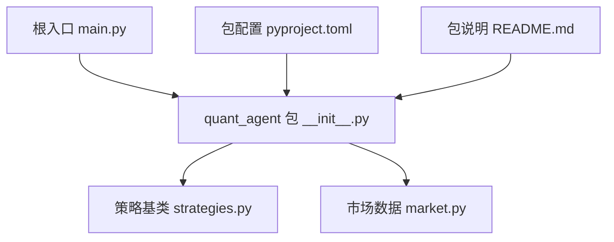
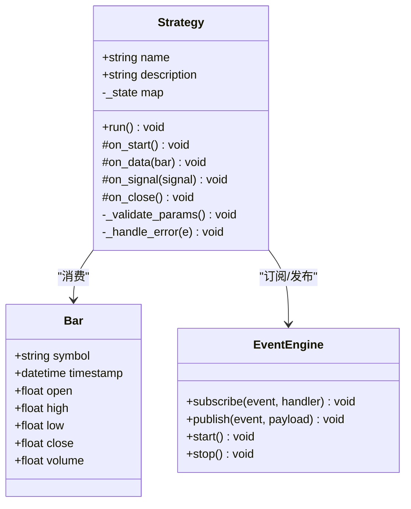
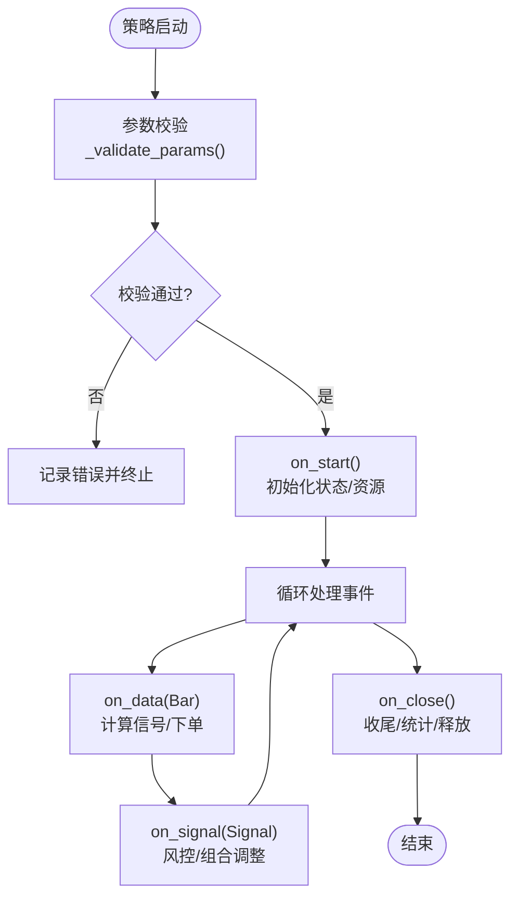
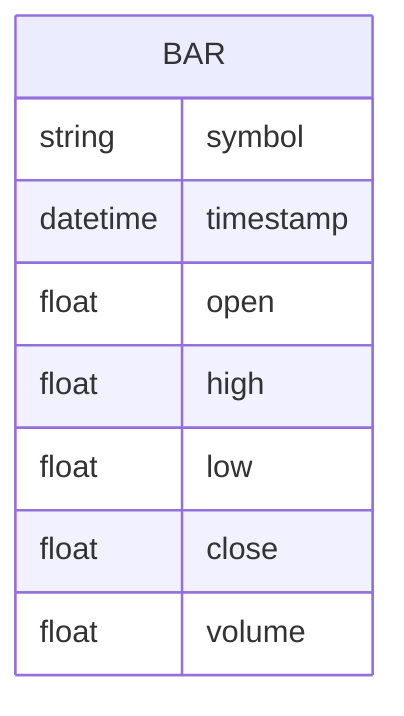
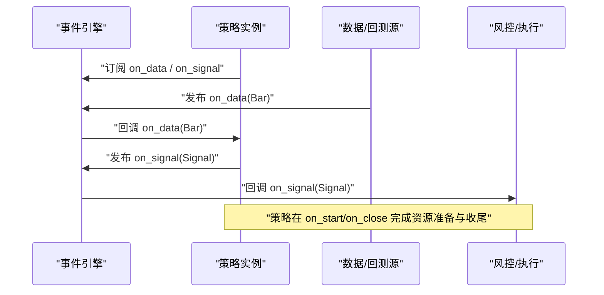
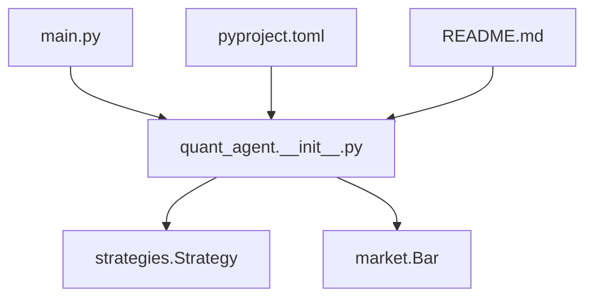

# 策略基类设计

<cite>
**本文引用的文件**   
- [strategies.py](file://packages/quant-agent/src/quant_agent/strategies.py)
- [market.py](file://packages/quant-agent/src/quant_agent/market.py)
- [__init__.py](file://packages/quant-agent/src/quant_agent/__init__.py)
- [README.md](file://packages/quant-agent/README.md)
- [pyproject.toml](file://packages/quant-agent/pyproject.toml)
- [main.py](file://main.py)
</cite>

## 目录
1. [简介](#简介)
2. [项目结构](#项目结构)
3. [核心组件](#核心组件)
4. [架构总览](#架构总览)
5. [详细组件分析](#详细组件分析)
6. [依赖关系分析](#依赖关系分析)
7. [性能考虑](#性能考虑)
8. [故障排查指南](#故障排查指南)
9. [结论](#结论)
10. [附录](#附录)

## 简介
本技术文档围绕“策略基类设计”展开，聚焦于量化交易智能体中的策略抽象与扩展点。当前仓库中已提供最小化的策略基类与市场数据模型，目标是：
- 明确策略基类的抽象接口定义与生命周期管理（如 on_start、on_data、on_signal、on_close 等）；
- 说明策略状态管理机制（初始化参数校验、运行时状态跟踪、异常处理）；
- 阐述事件驱动架构的实现原理（事件订阅、消息传递、异步处理）；
- 给出自定义策略开发的完整示例路径与最佳实践；
- 总结常见陷阱与规避方法。

需要特别说明的是：当前代码库中的策略基类为最小可用版本，尚未包含完整的事件驱动与生命周期钩子实现。本文在尊重现有代码的基础上，提出面向未来的演进方案与落地建议。

## 项目结构
quant-agent 包位于 packages/quant-agent，其源码位于 src/quant_agent。当前与策略相关的最小化实现包括：
- 策略基类：定义策略的标识信息与运行入口；
- 市场数据模型：定义统一的 Bar 数据结构，作为策略输入的基础单元；
- 包入口与脚本：提供命令行入口与模块描述。

图示来源
- [main.py:1-12](file://main.py#L1-L12)
- [__init__.py:1-15](file://packages/quant-agent/src/quant_agent/__init__.py#L1-L15)
- [strategies.py:1-13](file://packages/quant-agent/src/quant_agent/strategies.py#L1-L13)
- [market.py:1-16](file://packages/quant-agent/src/quant_agent/market.py#L1-L16)
- [pyproject.toml:1-17](file://packages/quant-agent/pyproject.toml#L1-L17)
- [README.md:1-16](file://packages/quant-agent/README.md#L1-L16)

章节来源
- [main.py:1-12](file://main.py#L1-L12)
- [__init__.py:1-15](file://packages/quant-agent/src/quant_agent/__init__.py#L1-L15)
- [strategies.py:1-13](file://packages/quant-agent/src/quant_agent/strategies.py#L1-L13)
- [market.py:1-16](file://packages/quant-agent/src/quant_agent/market.py#L1-L16)
- [pyproject.toml:1-17](file://packages/quant-agent/pyproject.toml#L1-L17)
- [README.md:1-16](file://packages/quant-agent/README.md#L1-L16)

## 核心组件
- 策略基类 Strategy
  - 职责：定义策略的名称与描述信息，并提供一个必须被覆盖的运行入口 run()；
  - 现状：run() 抛出未实现异常，要求子类必须实现具体逻辑；
  - 演进方向：引入生命周期钩子（on_start、on_data、on_signal、on_close），并内置状态管理与异常处理骨架。

- 市场数据模型 Bar
  - 职责：统一 K 线/Bar 的数据结构，包含标的、时间戳与 OHLCV 字段；
  - 作用：作为策略输入的标准载体，便于后续接入行情源与回测引擎。

- 包入口与脚本
  - quant_agent.hello()/main()：用于快速验证包可导入与可执行；
  - pyproject.scripts.quant-agent：将 quant_agent.main 暴露为命令行工具。

章节来源
- [strategies.py:1-13](file://packages/quant-agent/src/quant_agent/strategies.py#L1-L13)
- [market.py:1-16](file://packages/quant-agent/src/quant_agent/market.py#L1-L16)
- [__init__.py:1-15](file://packages/quant-agent/src/quant_agent/__init__.py#L1-L15)
- [pyproject.toml:1-17](file://packages/quant-agent/pyproject.toml#L1-L17)

## 架构总览
从“最小可用”到“事件驱动”的演进路线如下：
- 当前阶段：Strategy.run() 由子类实现，Bar 作为输入数据模型；
- 下一阶段：引入事件总线与生命周期钩子，形成标准的事件驱动架构；
- 目标形态：策略通过订阅事件（如 on_data、on_signal）响应市场变化，并在 on_start/on_close 完成资源准备与清理。

图示来源
- [strategies.py:1-13](file://packages/quant-agent/src/quant_agent/strategies.py#L1-L13)
- [market.py:1-16](file://packages/quant-agent/src/quant_agent/market.py#L1-L16)

## 详细组件分析

### 策略基类 Strategy 分析与演进
- 当前实现要点
  - 使用 dataclass 声明 name、description 两个属性；
  - run() 强制子类实现，避免空壳策略进入运行期。

- 生命周期钩子建议（未来实现）
  - on_start：策略启动时进行参数校验、资源初始化、指标预热；
  - on_data：接收 Bar 数据，触发信号计算与订单生成；
  - on_signal：对生成的信号进行风控检查、组合权重调整；
  - on_close：收尾工作，如持久化状态、释放资源、统计汇总。

- 状态管理建议
  - 内部状态字典 _state：记录策略运行态（如持仓、累计收益、滑点统计）；
  - 参数校验 _validate_params：在 on_start 中校验必填项、取值范围、业务约束；
  - 异常处理 _handle_error：统一捕获并上报，保证策略健壮性。

图示来源
- [strategies.py:1-13](file://packages/quant-agent/src/quant_agent/strategies.py#L1-L13)

章节来源
- [strategies.py:1-13](file://packages/quant-agent/src/quant_agent/strategies.py#L1-L13)

### 市场数据模型 Bar
- 字段说明
  - symbol：标的代码；
  - timestamp：K 线时间戳；
  - open/high/low/close/volume：开高低收量。

- 使用方式
  - 作为策略输入的基本单位，供 on_data 消费；
  - 可与事件引擎结合，按时间序列推送至策略。

图示来源
- [market.py:1-16](file://packages/quant-agent/src/quant_agent/market.py#L1-L16)

章节来源
- [market.py:1-16](file://packages/quant-agent/src/quant_agent/market.py#L1-L16)

### 事件驱动架构（概念性设计）
- 事件总线 EventEngine
  - subscribe(event, handler)：注册事件处理器；
  - publish(event, payload)：发布事件，调度对应处理器；
  - start()/stop()：控制事件循环启停。

- 典型调用序列
  - 策略在 on_start 中订阅 on_data、on_signal；
  - 外部数据源或回测引擎发布 Bar 事件；
  - 事件引擎分发到策略 on_data，策略产生信号并发布 on_signal；
  - 风控或执行子系统订阅 on_signal 进行处理。

图示来源
- [strategies.py:1-13](file://packages/quant-agent/src/quant_agent/strategies.py#L1-L13)
- [market.py:1-16](file://packages/quant-agent/src/quant_agent/market.py#L1-L16)

### 自定义策略开发示例（路径指引）
- 步骤概览
  - 新建策略类继承 Strategy；
  - 在 on_start 中完成参数校验与状态初始化；
  - 在 on_data 中读取 Bar 并计算信号；
  - 在 on_signal 中进行风控与下单决策；
  - 在 on_close 中输出统计与释放资源。

- 参考位置
  - 基类定义位置：[strategies.py:1-13](file://packages/quant-agent/src/quant_agent/strategies.py#L1-L13)
  - 数据模型位置：[market.py:1-16](file://packages/quant-agent/src/quant_agent/market.py#L1-L16)
  - 包入口与脚本：[__init__.py:1-15](file://packages/quant-agent/src/quant_agent/__init__.py#L1-L15)、[pyproject.toml:1-17](file://packages/quant-agent/pyproject.toml#L1-L17)

章节来源
- [strategies.py:1-13](file://packages/quant-agent/src/quant_agent/strategies.py#L1-L13)
- [market.py:1-16](file://packages/quant-agent/src/quant_agent/market.py#L1-L16)
- [__init__.py:1-15](file://packages/quant-agent/src/quant_agent/__init__.py#L1-L15)
- [pyproject.toml:1-17](file://packages/quant-agent/pyproject.toml#L1-L17)

## 依赖关系分析
- 包内依赖
  - main.py 导入 quant_agent 与 companion_agent；
  - quant_agent 包提供 hello()/main() 与策略/数据模型。

- 构建与脚本
  - pyproject.toml 定义 quant-agent 命令指向 quant_agent.main；
  - README.md 提供开发与运行说明。

图示来源
- [main.py:1-12](file://main.py#L1-L12)
- [__init__.py:1-15](file://packages/quant-agent/src/quant_agent/__init__.py#L1-L15)
- [strategies.py:1-13](file://packages/quant-agent/src/quant_agent/strategies.py#L1-L13)
- [market.py:1-16](file://packages/quant-agent/src/quant_agent/market.py#L1-L16)
- [pyproject.toml:1-17](file://packages/quant-agent/pyproject.toml#L1-L17)
- [README.md:1-16](file://packages/quant-agent/README.md#L1-L16)

章节来源
- [main.py:1-12](file://main.py#L1-L12)
- [__init__.py:1-15](file://packages/quant-agent/src/quant_agent/__init__.py#L1-L15)
- [strategies.py:1-13](file://packages/quant-agent/src/quant_agent/strategies.py#L1-L13)
- [market.py:1-16](file://packages/quant-agent/src/quant_agent/market.py#L1-L16)
- [pyproject.toml:1-17](file://packages/quant-agent/pyproject.toml#L1-L17)
- [README.md:1-16](file://packages/quant-agent/README.md#L1-L16)

## 性能考虑
- 事件分发效率
  - 采用轻量级事件队列与无锁环形缓冲，降低 on_data 延迟；
  - 批量合并 Bar 事件，减少频繁上下文切换。

- 计算开销控制
  - 指标计算尽量向量化，避免逐条循环；
  - 缓存中间结果，避免重复计算。

- I/O 与序列化
  - 对外部数据源的请求做限流与重试；
  - 日志与监控采样输出，避免高频写入阻塞主循环。

## 故障排查指南
- 常见问题定位
  - 未实现 run()：子类未覆盖 run() 会抛出未实现异常；
  - 参数校验失败：在 on_start 中打印缺失或非法参数；
  - 事件未触发：检查事件订阅是否成功、事件名称是否一致；
  - 状态不一致：在关键分支打印 _state 快照，确认更新时机。

- 调试建议
  - 在 on_start/on_data/on_signal/on_close 增加结构化日志；
  - 使用最小数据集复现问题，逐步缩小范围；
  - 对异常进行分层捕获，保留堆栈与上下文。

章节来源
- [strategies.py:1-13](file://packages/quant-agent/src/quant_agent/strategies.py#L1-L13)

## 结论
当前仓库提供了策略基类与市场数据模型的最小实现，为后续事件驱动与生命周期管理奠定了良好基础。建议在保持向后兼容的前提下，逐步引入事件引擎与生命周期钩子，完善参数校验、状态跟踪与异常处理机制，从而提升策略的可维护性与可扩展性。

## 附录
- 开发入口
  - 命令行入口：quant-agent → quant_agent.main；
  - 包说明与安装：参见 README.md。

章节来源
- [pyproject.toml:1-17](file://packages/quant-agent/pyproject.toml#L1-L17)
- [README.md:1-16](file://packages/quant-agent/README.md#L1-L16)
- [__init__.py:1-15](file://packages/quant-agent/src/quant_agent/__init__.py#L1-L15)