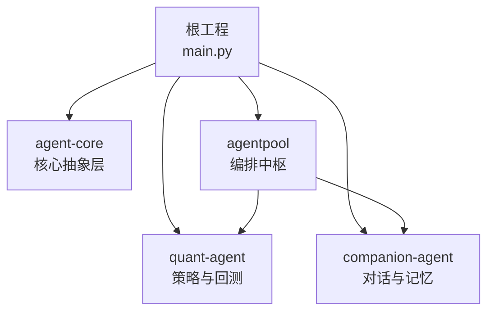
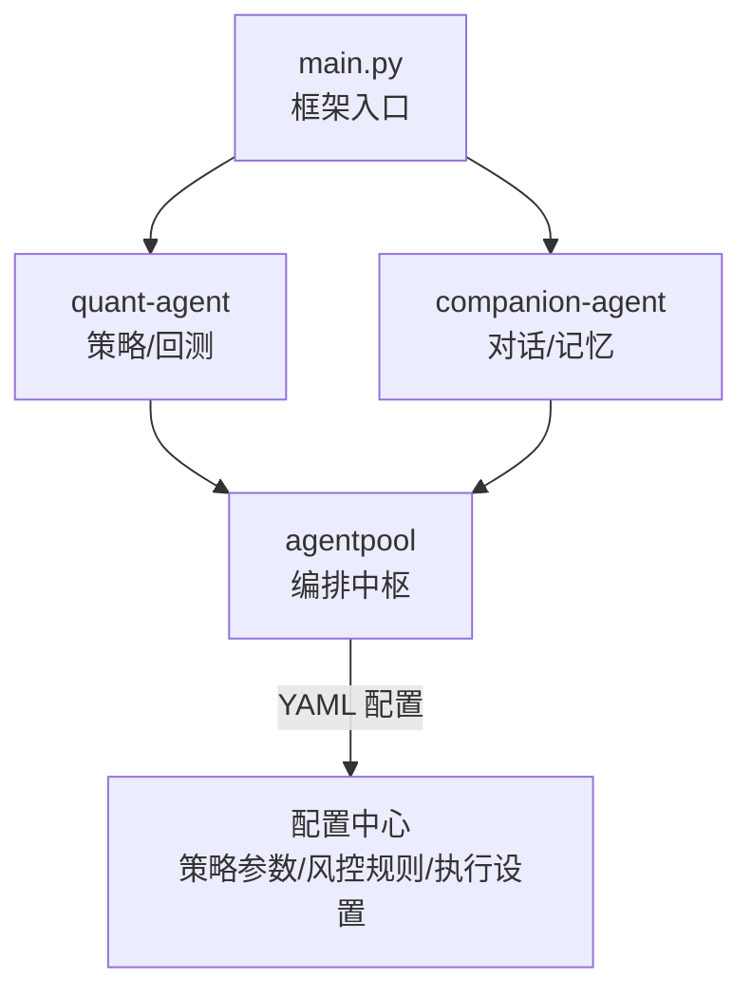
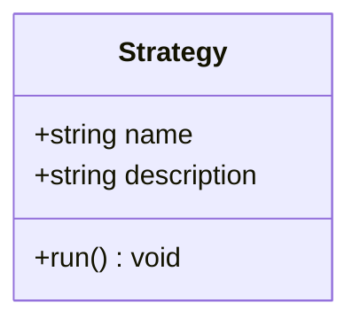
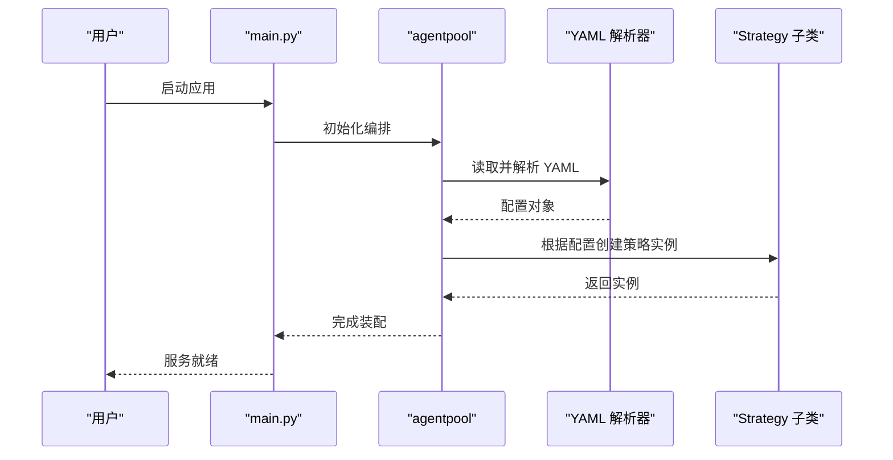
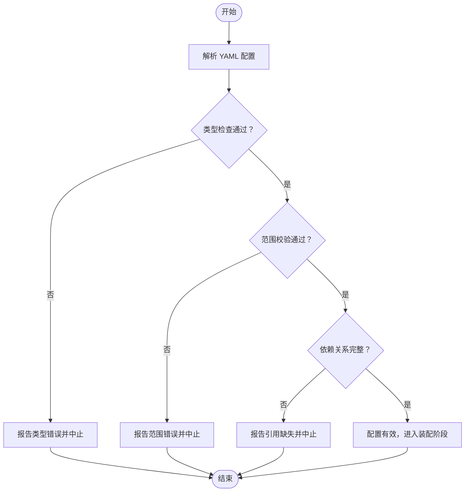
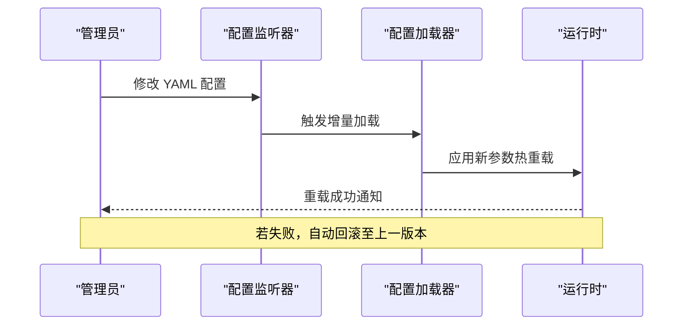
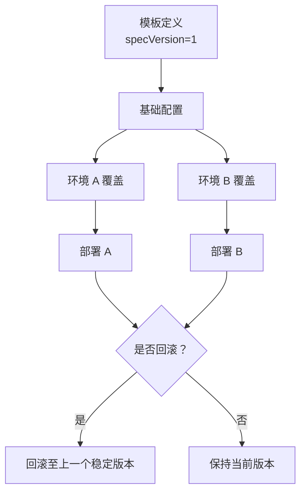
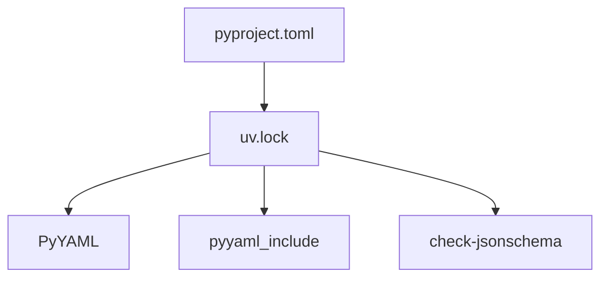

# 策略配置系统

<cite>
**本文引用的文件**   
- [main.py](file://main.py)
- [README.md](file://README.md)
- [pyproject.toml](file://pyproject.toml)
- [uv.lock](file://uv.lock)
- [strategies.py](file://packages/quant-agent/src/quant_agent/strategies.py)
- [agent-core README.md](file://packages/agent-core/README.md)
</cite>

## 目录
1. [简介](#简介)
2. [项目结构](#项目结构)
3. [核心组件](#核心组件)
4. [架构总览](#架构总览)
5. [详细组件分析](#详细组件分析)
6. [依赖分析](#依赖分析)
7. [性能考虑](#性能考虑)
8. [故障排查指南](#故障排查指南)
9. [结论](#结论)
10. [附录](#附录)

## 简介
本技术文档围绕“策略配置系统”展开，聚焦于 YAML 配置文件在量化与陪伴双智能体中的语法规范、结构组织、参数验证机制、动态参数调整（热重载与 A/B 测试切换）、模板系统与版本管理方案，以及最佳实践与常见问题排查。该系统的编排中枢由 AgentPool 提供，通过统一的 YAML 配置驱动多智能体运行；量化侧以策略定义为核心，配合风控规则与执行设置形成可配置、可扩展的策略体系。

## 项目结构
仓库采用工作区模式，根工程聚合多个子包：
- agent-core：核心抽象层，定义 Agent 内核基类、生命周期与插件接口
- agentpool：编排中枢，YAML 驱动的多智能体编排与协议桥接
- quant-agent：量化交易智能体，包含策略定义与回测框架
- companion-agent：情感陪伴智能体，负责对话管理与记忆存储

图表来源
- [main.py:1-13](file://main.py#L1-L13)
- [README.md:86-94](file://README.md#L86-L94)

章节来源
- [README.md:39-94](file://README.md#L39-L94)
- [pyproject.toml:1-30](file://pyproject.toml#L1-L30)

## 核心组件
- 策略定义与运行入口
  - 策略基类位于量化子包中，定义了策略名称、描述与运行接口，为后续 YAML 配置加载与运行时实例化提供基础。
- 编排与配置加载
  - 编排中枢通过 YAML 配置驱动多智能体装配与启动，统一暴露多种协议接口。
- 依赖与工作区
  - 根工程使用 uv 工作区管理依赖，锁定文件记录第三方库版本，确保构建与运行一致性。

章节来源
- [strategies.py:1-12](file://packages/quant-agent/src/quant_agent/strategies.py#L1-L12)
- [README.md:86-94](file://README.md#L86-L94)
- [pyproject.toml:1-30](file://pyproject.toml#L1-L30)
- [uv.lock:4502-4509](file://uv.lock#L4502-L4509)

## 架构总览
整体架构以 main.py 为入口，加载并协调 quant-agent 与 companion-agent，二者共享 agentpool 编排层与记忆底座，并通过统一 YAML 配置进行参数化控制。

图表来源
- [main.py:1-13](file://main.py#L1-L13)
- [README.md:86-94](file://README.md#L86-L94)

## 详细组件分析

### 策略基类与扩展点
- 职责
  - 定义策略的标识信息（名称、描述）与运行接口，作为 YAML 配置映射到具体策略类的契约。
- 设计要点
  - 使用数据类简化字段声明，便于序列化与校验。
  - 运行方法预留实现，供不同策略子类覆盖。
- 复杂度
  - 数据结构简单，时间复杂度 O(1)，空间复杂度 O(1)。
- 优化建议
  - 增加默认值与可选字段，提升配置灵活性。
  - 引入策略元数据（如版本、标签），支撑模板与 A/B 测试。

图表来源
- [strategies.py:1-12](file://packages/quant-agent/src/quant_agent/strategies.py#L1-L12)

章节来源
- [strategies.py:1-12](file://packages/quant-agent/src/quant_agent/strategies.py#L1-L12)

### 编排中枢与 YAML 配置加载
- 职责
  - 解析 YAML 配置，装配多智能体实例，桥接外部协议（ACP、AG-UI、MCP、OpenCode）。
- 关键流程
  - 读取 YAML → 校验结构 → 实例化策略/工具 → 注册协议端点 → 启动服务。
- 错误处理
  - 对缺失字段、类型不匹配、引用不存在等场景给出明确错误信息，便于快速定位。
- 性能考量
  - 配置解析应缓存结果，避免重复 IO；大配置建议分片加载。

图表来源
- [main.py:1-13](file://main.py#L1-L13)
- [README.md:86-94](file://README.md#L86-L94)

章节来源
- [README.md:86-94](file://README.md#L86-L94)

### 参数验证机制（类型检查、范围验证、依赖关系校验）
- 类型检查
  - 基于 YAML 键值与目标字段的类型约束，解析阶段即进行强类型校验，失败时输出具体字段路径与期望类型。
- 范围验证
  - 对数值型参数（如阈值、权重、超时）进行上下界检查，越界则拒绝加载或降级至安全默认值。
- 依赖关系校验
  - 校验节点/边引用完整性，确保输入输出键存在且可达，防止运行时断链。
- 验证流程示意

章节来源
- [README.md:86-94](file://README.md#L86-L94)

### 动态参数调整（热重载与 A/B 测试切换）
- 热重载
  - 监听配置变更事件，增量更新运行时参数，无需重启进程。
  - 支持按模块粒度重载，降低影响面。
- A/B 测试切换
  - 通过配置中的实验标识选择不同策略变体，结合流量分配比例实现灰度发布。
- 注意事项
  - 状态一致性：热重载需保证无状态或可恢复状态。
  - 幂等性：多次重载应得到一致结果。
  - 回滚能力：保留上一版本配置快照，支持一键回滚。

[此图为概念流程图，未直接映射具体源文件]

### 配置模板系统与版本管理
- 模板系统
  - 提供通用策略模板（含默认风控与执行设置），通过继承与覆盖实现差异化配置。
  - 支持变量替换与环境注入，便于跨环境复用。
- 版本管理
  - 每个配置附带 specVersion 与变更日志，支持向后兼容与渐进迁移。
  - 通过清单文件（manifest.yaml）集中管理默认值与启用策略。

[此图为概念流程图，未直接映射具体源文件]

## 依赖分析
- 工作区与依赖锁
  - pyproject.toml 声明工作区成员与开发依赖，uv.lock 锁定第三方库版本，确保可重现构建。
- 关键第三方库
  - PyYAML 用于 YAML 解析；pyyaml_include 支持配置合并与包含；check-jsonschema 可用于 JSON Schema 校验（在部分脚本中使用）。
- 依赖图

图表来源
- [pyproject.toml:1-30](file://pyproject.toml#L1-L30)
- [uv.lock:4502-4509](file://uv.lock#L4502-L4509)

章节来源
- [pyproject.toml:1-30](file://pyproject.toml#L1-L30)
- [uv.lock:4502-4509](file://uv.lock#L4502-L4509)

## 性能考虑
- 配置解析缓存：避免重复 IO 与解析开销。
- 增量重载：仅变更受影响模块，减少全局重建成本。
- 资源隔离：策略间内存与线程隔离，防止单点过载影响整体。
- 监控与度量：记录配置加载耗时、重载次数与失败率，辅助容量规划。

## 故障排查指南
- 常见错误
  - YAML 语法错误：检查缩进、引号与特殊字符。
  - 类型不匹配：确认字段类型与期望一致。
  - 范围越界：核对阈值与上限下限。
  - 引用缺失：确保节点与边、输入输出键完整。
- 定位步骤
  - 查看错误消息中的字段路径，定位具体位置。
  - 对比模板与覆盖配置，识别差异。
  - 使用清单文件与版本快照进行回滚验证。
- 日志与调试
  - 开启详细日志，捕获解析与装配过程。
  - 使用最小复现配置逐步缩小问题范围。

章节来源
- [README.md:86-94](file://README.md#L86-L94)

## 结论
本策略配置系统以 YAML 为中心，结合编排中枢与策略基类，实现了可配置、可扩展、可演进的量化与陪伴双智能体体系。通过严格的参数验证、动态热重载与 A/B 测试切换、模板与版本管理，系统在稳定性与灵活性之间取得平衡。建议在生产环境中完善监控与回滚机制，持续优化配置解析与重载性能。

## 附录
- 快速开始
  - 安装依赖并启动框架，参考根工程说明。
- 开发栈
  - Python 3.12+、uv 工作区、ruff、pytest 等。

章节来源
- [README.md:95-129](file://README.md#L95-L129)
- [agent-core README.md:1-16](file://packages/agent-core/README.md#L1-L16)