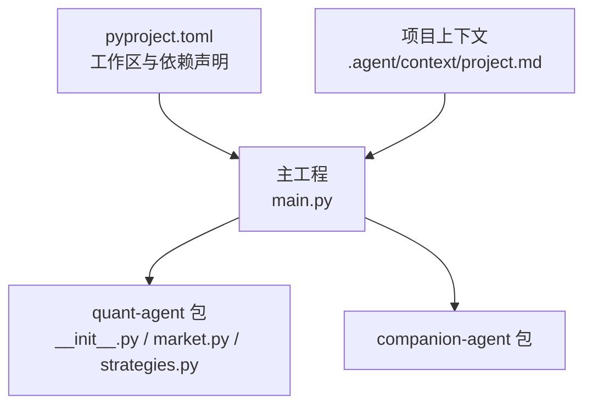
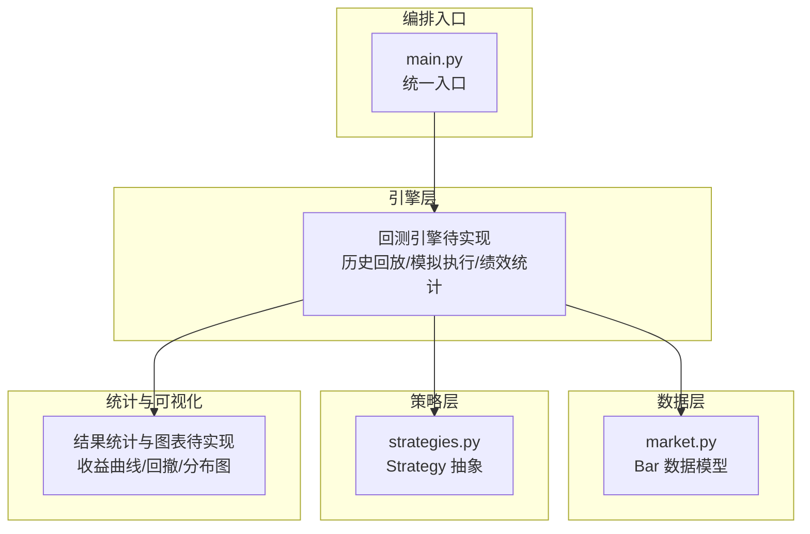
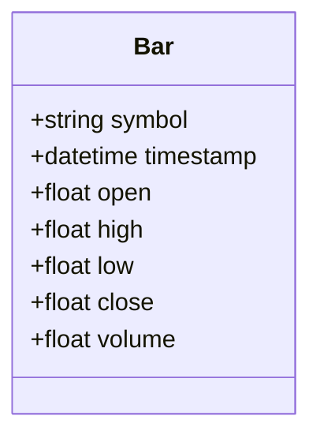
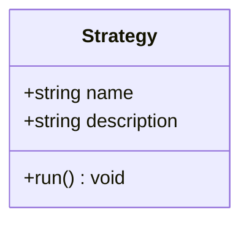
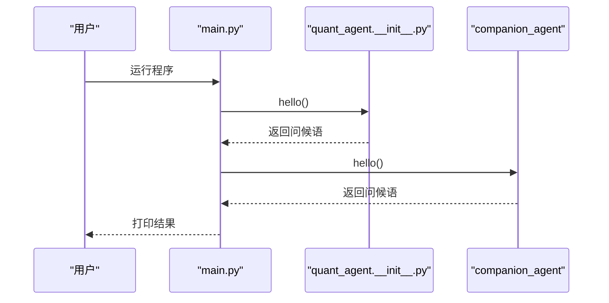
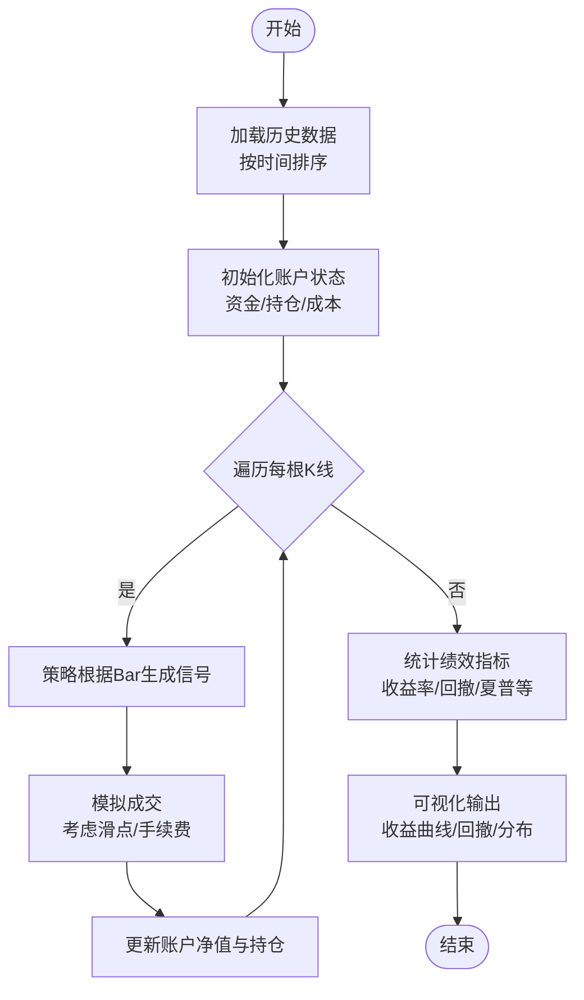
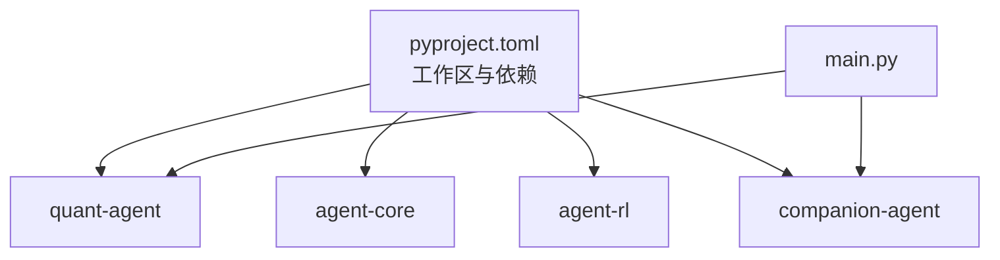

# 回测系统

<cite>
**本文引用的文件**   
- [main.py](file://main.py)
- [pyproject.toml](file://pyproject.toml)
- [packages/quant-agent/README.md](file://packages/quant-agent/README.md)
- [packages/quant-agent/src/quant_agent/__init__.py](file://packages/quant-agent/src/quant_agent/__init__.py)
- [packages/quant-agent/src/quant_agent/market.py](file://packages/quant-agent/src/quant_agent/market.py)
- [packages/quant-agent/src/quant_agent/strategies.py](file://packages/quant-agent/src/quant_agent/strategies.py)
- [.agent/context/project.md](file://.agent/context/project.md)
- [docs/plans/todolist.html](file://docs/plans/todolist.html)
</cite>

## 目录
1. [简介](#简介)
2. [项目结构](#项目结构)
3. [核心组件](#核心组件)
4. [架构总览](#架构总览)
5. [详细组件分析](#详细组件分析)
6. [依赖关系分析](#依赖关系分析)
7. [性能考虑](#性能考虑)
8. [故障排查指南](#故障排查指南)
9. [结论](#结论)
10. [附录](#附录)

## 简介
本技术文档面向“回测系统”的构建与使用，目标是为量化交易智能体提供可落地的回测能力。当前仓库已具备最小可行基础：市场数据模型（Bar）、策略抽象（Strategy）以及顶层编排入口（main.py）。同时，需求规划明确了“策略定义 + 回测”的工作流与产出指标（收益、回撤、胜率等），为后续实现提供了清晰的路线图。

## 项目结构
仓库采用多包工作区组织，主工程通过 pyproject.toml 声明成员包与依赖；quant-agent 作为“理性之面”，负责市场数据、策略与回测框架。顶层 main.py 作为统一入口，加载并调用各子模块。

图表来源
- [main.py:1-12](file://main.py#L1-L12)
- [pyproject.toml:1-30](file://pyproject.toml#L1-L30)
- [.agent/context/project.md:52-75](file://.agent/context/project.md#L52-L75)

章节来源
- [main.py:1-12](file://main.py#L1-L12)
- [pyproject.toml:1-30](file://pyproject.toml#L1-L30)
- [.agent/context/project.md:52-75](file://.agent/context/project.md#L52-L75)

## 核心组件
- 市场数据模型 Bar：统一 K 线数据结构，包含标的、时间戳与 OHLCV 字段，是历史数据回放的基础单元。
- 策略抽象 Strategy：定义策略名称与描述，并提供 run 接口用于扩展具体买卖逻辑。
- 顶层入口 main.py：聚合 quant-agent 与 companion-agent 的能力，便于统一运行与演示。

章节来源
- [packages/quant-agent/src/quant_agent/market.py:1-16](file://packages/quant-agent/src/quant_agent/market.py#L1-L16)
- [packages/quant-agent/src/quant_agent/strategies.py:1-13](file://packages/quant-agent/src/quant_agent/strategies.py#L1-L13)
- [main.py:1-12](file://main.py#L1-L12)

## 架构总览
从高层视角，回测系统由“数据层—策略层—引擎层—统计与可视化层”构成。当前代码库已提供数据层与策略层的骨架，引擎层与统计可视化层在需求规划中明确待实现。

图表来源
- [packages/quant-agent/src/quant_agent/market.py:1-16](file://packages/quant-agent/src/quant_agent/market.py#L1-L16)
- [packages/quant-agent/src/quant_agent/strategies.py:1-13](file://packages/quant-agent/src/quant_agent/strategies.py#L1-L13)
- [main.py:1-12](file://main.py#L1-L12)

## 详细组件分析

### 数据模型 Bar
- 职责：标准化单根 K 线数据，承载 symbol、timestamp、open/high/low/close/volume。
- 复杂度：O(1) 访问与构造，适合批量回放时按时间顺序迭代。
- 扩展建议：可增加复权因子、涨跌停标记、盘前盘后时段等元信息以支撑更复杂的回测场景。

图表来源
- [packages/quant-agent/src/quant_agent/market.py:1-16](file://packages/quant-agent/src/quant_agent/market.py#L1-L16)

章节来源
- [packages/quant-agent/src/quant_agent/market.py:1-16](file://packages/quant-agent/src/quant_agent/market.py#L1-L16)

### 策略抽象 Strategy
- 职责：定义策略的基本信息与运行入口 run()，供回测引擎调用。
- 设计要点：run 方法应接受或访问 Bar 序列，输出交易信号或订单指令。
- 可扩展性：可通过继承创建具体策略类，封装入场/出场规则与风控逻辑。

图表来源
- [packages/quant-agent/src/quant_agent/strategies.py:1-13](file://packages/quant-agent/src/quant_agent/strategies.py#L1-L13)

章节来源
- [packages/quant-agent/src/quant_agent/strategies.py:1-13](file://packages/quant-agent/src/quant_agent/strategies.py#L1-L13)

### 顶层入口 main.py
- 职责：聚合 quant-agent 与 companion-agent 的能力，打印欢迎信息，便于快速验证环境。
- 编排方式：直接导入并调用 hello()，可作为未来接入 CLI 或 Web 服务的起点。

图表来源
- [main.py:1-12](file://main.py#L1-L12)
- [packages/quant-agent/src/quant_agent/__init__.py:1-15](file://packages/quant-agent/src/quant_agent/__init__.py#L1-L15)

章节来源
- [main.py:1-12](file://main.py#L1-L12)
- [packages/quant-agent/src/quant_agent/__init__.py:1-15](file://packages/quant-agent/src/quant_agent/__init__.py#L1-L15)

### 回测流程（概念性）
以下流程图展示“历史数据回放 → 策略生成信号 → 模拟成交 → 记录净值 → 计算指标”的标准回测路径，便于后续实现对齐。

[此图为概念流程，不直接映射到具体源码文件]

## 依赖关系分析
- 工作区与依赖：pyproject.toml 声明了 agent-core、agent-rl、quant-agent、companion-agent 四个成员包，并通过 workspace 源进行本地解析。
- 入口耦合：main.py 仅依赖 quant-agent 与 companion-agent 的 hello 函数，耦合度低，便于替换或扩展。
- 模块内聚：quant-agent 内部将数据模型与策略抽象分文件管理，职责清晰。

图表来源
- [pyproject.toml:1-30](file://pyproject.toml#L1-L30)
- [main.py:1-12](file://main.py#L1-L12)

章节来源
- [pyproject.toml:1-30](file://pyproject.toml#L1-L30)
- [main.py:1-12](file://main.py#L1-L12)

## 性能考虑
- 大数据集处理
  - 使用惰性读取与分块回放，避免一次性载入全部历史数据。
  - 对 Bar 序列进行向量化预处理（如预计算均线），减少逐条循环开销。
- 并行回测
  - 参数网格搜索与多标的并行：基于进程池或线程池并发执行独立回测任务。
  - 结果汇总阶段再合并统计指标，降低锁竞争。
- I/O 优化
  - 使用列式存储（如 Parquet）与索引加速时间范围筛选。
  - 缓存常用技术指标，避免重复计算。
- 内存控制
  - 滑动窗口机制维护近期 Bar，限制峰值内存占用。
  - 及时释放中间变量，避免引用链过长导致 GC 压力。

[本节为通用性能指导，不直接分析具体文件]

## 故障排查指南
- 运行入口无输出
  - 检查 main.py 是否正确导入 quant-agent 与 companion-agent，确认 __init__.py 暴露 hello 函数。
- 策略未实现
  - Strategy.run 默认抛出异常，需继承并实现具体逻辑后再参与回测。
- 数据缺失或不一致
  - 确保 Bar.timestamp 严格递增且无重复；symbol 与时间戳组合唯一。
- 依赖安装失败
  - 使用 uv sync 同步工作区依赖，确认 packages/* 下存在对应包与 __init__.py。

章节来源
- [main.py:1-12](file://main.py#L1-L12)
- [packages/quant-agent/src/quant_agent/__init__.py:1-15](file://packages/quant-agent/src/quant_agent/__init__.py#L1-L15)
- [packages/quant-agent/src/quant_agent/strategies.py:1-13](file://packages/quant-agent/src/quant_agent/strategies.py#L1-L13)

## 结论
当前仓库已搭建回测系统的骨架：统一的 Bar 数据模型、可扩展的 Strategy 抽象与简洁的入口编排。结合需求规划中的“策略定义 + 回测”任务，下一步应优先实现回测引擎（历史回放、模拟执行、绩效统计）与可视化输出，形成“定义策略 → 回测 → 看结果”的闭环。在此基础上，逐步引入交易成本、滑点、过拟合检测与并行优化，提升系统的实战可用性与稳健性。

[本节为总结性内容，不直接分析具体文件]

## 附录

### 回测配置选项（建议）
- 时间范围设置
  - 起止日期、频率（日/小时/分钟）、复权方式。
- 初始资金配置
  - 起始现金、杠杆比例、保证金要求。
- 交易成本模型
  - 佣金费率、印花税、最低手续费、冲击成本。
- 滑点模拟
  - 固定滑点、百分比滑点、流动性相关滑点。
- 风控约束
  - 最大仓位、单笔止损/止盈、回撤阈值、禁买清单。

[本节为概念性说明，不直接分析具体文件]

### 回测结果的统计分析（建议）
- 收益率计算
  - 累计收益率、年化收益率、日频/周频/月频收益分布。
- 风险指标评估
  - 波动率、最大回撤、下行风险、VaR/CVaR。
- 夏普比率分析
  - 基于无风险利率与超额收益计算的夏普比率、索提诺比率。
- 交易质量
  - 胜率、盈亏比、平均持仓时长、换手率。

[本节为概念性说明，不直接分析具体文件]

### 可视化展示方案（建议）
- 收益曲线图：净值曲线与基准对比。
- 回撤分析：最大回撤区间与回撤热力图。
- 交易分布图：买入/卖出分布、行业/标的集中度。
- 月度收益矩阵：年度内月度收益的栅格展示。

[本节为概念性说明，不直接分析具体文件]

### 过拟合检测与稳健性验证（建议）
- 样本外测试：划分训练/验证/测试集，观察泛化表现。
- 滚动窗口与交叉验证：多期稳健性检验。
- 参数敏感性：关键参数扰动下的收益稳定性。
- 随机化与蒙特卡洛：打乱时间顺序或噪声注入，评估鲁棒性。

[本节为概念性说明，不直接分析具体文件]

### 开发计划与验收标准（参考）
- 需求规划明确“策略定义 + 回测”的最小示例与产出指标（收益/回撤/胜率），并强调“仅模拟盘”。
- 验收标准包括能跑通全流程、输出结构化结果，并与对话式工具串联。

章节来源
- [docs/plans/todolist.html:209-228](file://docs/plans/todolist.html#L209-L228)
- [packages/quant-agent/README.md:1-16](file://packages/quant-agent/README.md#L1-L16)