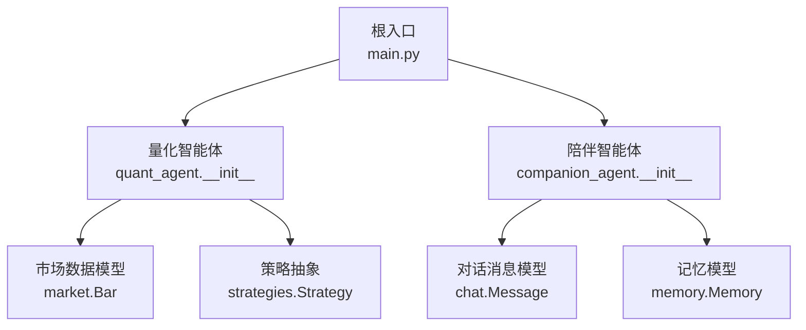
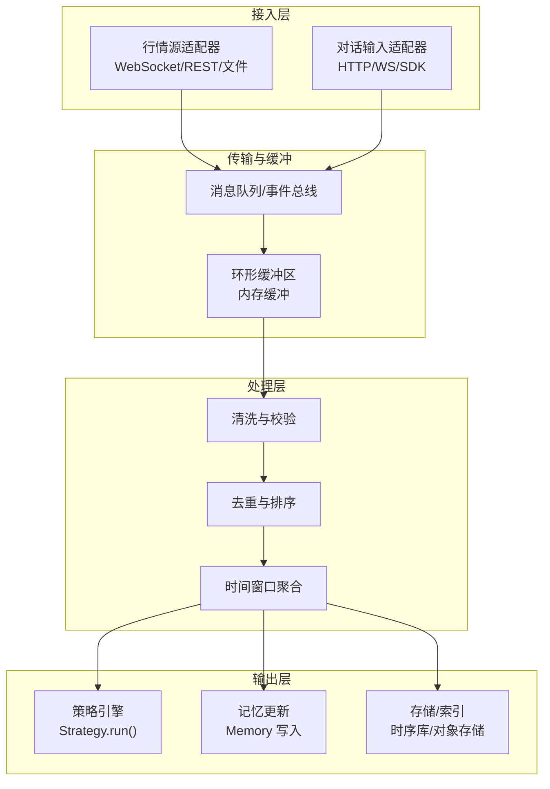
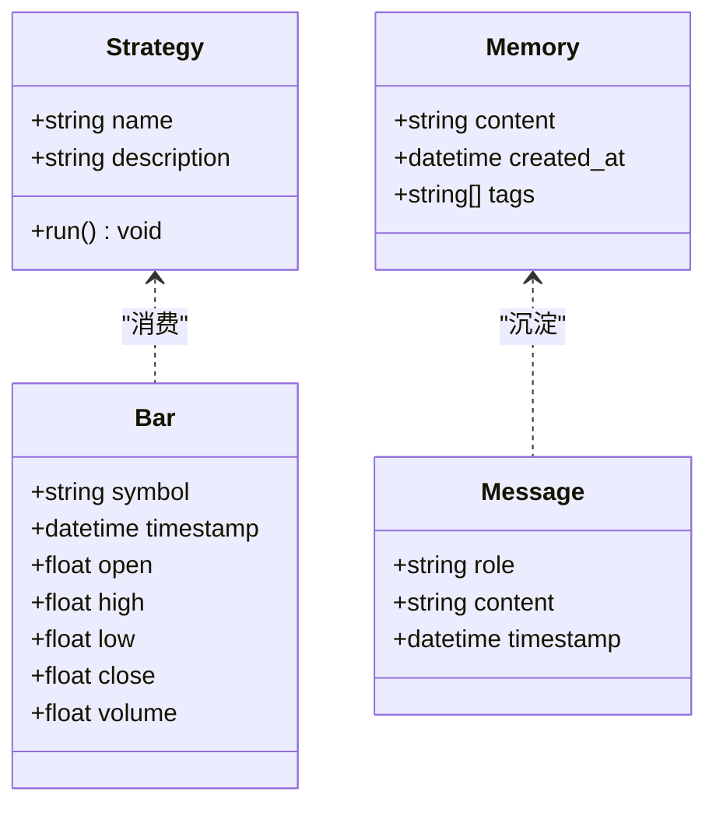
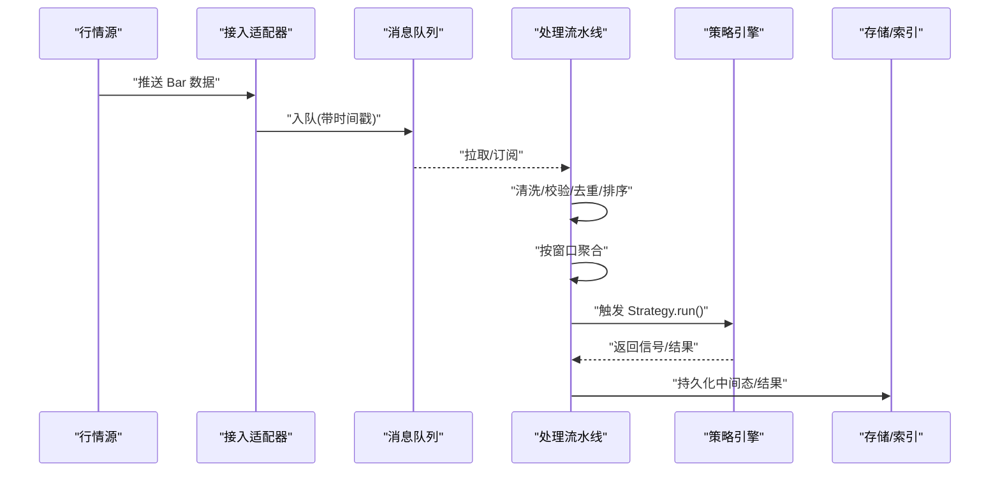
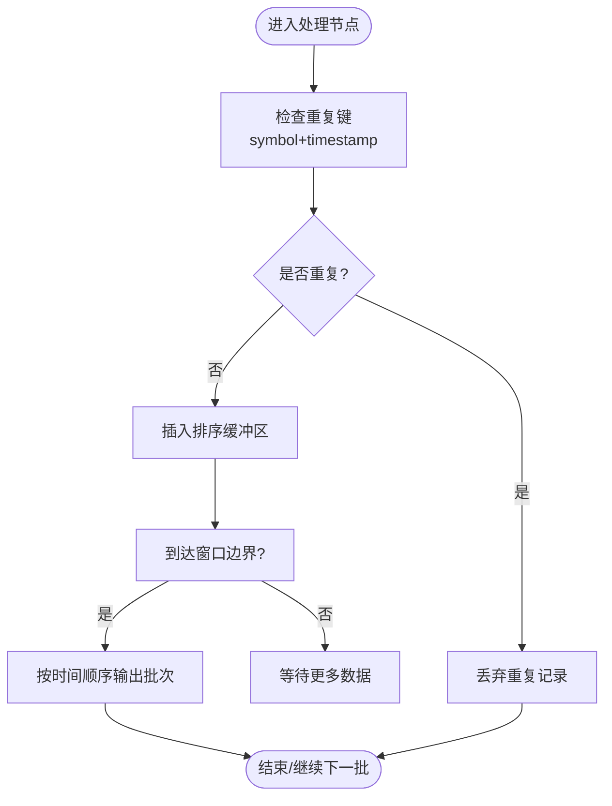
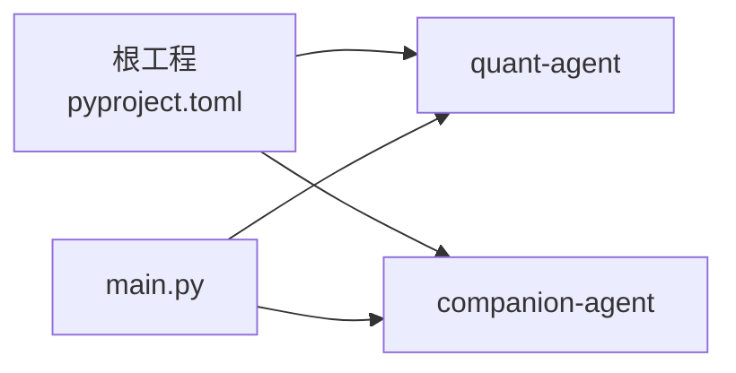

# 实时数据处理管道

<cite>
**本文引用的文件**   
- [main.py](file://main.py)
- [pyproject.toml](file://pyproject.toml)
- [packages/quant-agent/src/quant_agent/__init__.py](file://packages/quant-agent/src/quant_agent/__init__.py)
- [packages/quant-agent/src/quant_agent/market.py](file://packages/quant-agent/src/quant_agent/market.py)
- [packages/quant-agent/src/quant_agent/strategies.py](file://packages/quant-agent/src/quant_agent/strategies.py)
- [packages/companion-agent/src/companion_agent/__init__.py](file://packages/companion-agent/src/companion_agent/__init__.py)
- [packages/companion-agent/src/companion_agent/chat.py](file://packages/companion-agent/src/companion_agent/chat.py)
- [packages/companion-agent/src/companion_agent/memory.py](file://packages/companion-agent/src/companion_agent/memory.py)
</cite>

## 目录
1. [简介](#简介)
2. [项目结构](#项目结构)
3. [核心组件](#核心组件)
4. [架构总览](#架构总览)
5. [详细组件分析](#详细组件分析)
6. [依赖关系分析](#依赖关系分析)
7. [性能考虑](#性能考虑)
8. [故障恢复与一致性](#故障恢复与一致性)
9. [结论](#结论)
10. [附录：配置与监控示例](#附录配置与监控示例)

## 简介
本技术文档围绕“实时数据处理管道”的目标，结合仓库中已有的数据模型与模块边界，给出一个可落地的端到端设计蓝图。当前仓库提供了量化交易与对话陪伴两个智能体包的基础数据结构（如 Bar、Strategy、Message、Memory），并采用多包工作区组织。基于这些基础构件，本文提出一套面向低延迟的实时数据流处理方案，涵盖数据接收、清洗、验证、缓存、去重、排序、时间窗口聚合、消息队列与事件驱动集成、缓冲策略、内存管理、性能优化、断线重连与一致性保障，以及监控指标与配置建议。

## 项目结构
仓库采用 uv 工作区组织多个子包，根入口 main.py 负责启动并调用各子包的 hello 能力。量化侧提供市场数据与策略抽象；陪伴侧提供对话与记忆的数据模型。

图示来源
- [main.py:1-12](file://main.py#L1-L12)
- [packages/quant-agent/src/quant_agent/__init__.py:1-14](file://packages/quant-agent/src/quant_agent/__init__.py#L1-L14)
- [packages/companion-agent/src/companion_agent/__init__.py:1-14](file://packages/companion-agent/src/companion_agent/__init__.py#L1-L14)
- [packages/quant-agent/src/quant_agent/market.py:1-16](file://packages/quant-agent/src/quant_agent/market.py#L1-L16)
- [packages/quant-agent/src/quant_agent/strategies.py:1-13](file://packages/quant-agent/src/quant_agent/strategies.py#L1-L13)
- [packages/companion-agent/src/companion_agent/chat.py:1-12](file://packages/companion-agent/src/companion_agent/chat.py#L1-L12)
- [packages/companion-agent/src/companion_agent/memory.py:1-12](file://packages/companion-agent/src/companion_agent/memory.py#L1-L12)

章节来源
- [main.py:1-12](file://main.py#L1-L12)
- [pyproject.toml:1-30](file://pyproject.toml#L1-L30)

## 核心组件
- 数据模型层
  - 市场数据：Bar（K线/Bar）用于承载时序价格与成交量等字段。
  - 策略抽象：Strategy 定义策略接口，便于后续扩展具体实现。
  - 对话与记忆：Message、Memory 为陪伴智能体的基础数据单元。
- 运行入口
  - main.py 作为统一入口，初始化并调用各子包能力。

章节来源
- [packages/quant-agent/src/quant_agent/market.py:1-16](file://packages/quant-agent/src/quant_agent/market.py#L1-L16)
- [packages/quant-agent/src/quant_agent/strategies.py:1-13](file://packages/quant-agent/src/quant_agent/strategies.py#L1-L13)
- [packages/companion-agent/src/companion_agent/chat.py:1-12](file://packages/companion-agent/src/companion_agent/chat.py#L1-L12)
- [packages/companion-agent/src/companion_agent/memory.py:1-12](file://packages/companion-agent/src/companion_agent/memory.py#L1-L12)
- [main.py:1-12](file://main.py#L1-L12)

## 架构总览
下图展示了一个可扩展的实时数据处理管道，将现有数据模型融入端到端流程：从数据接入、清洗校验、去重排序、时间窗口聚合、到下游消费（策略执行、对话上下文更新、持久化）。

图示来源
- [packages/quant-agent/src/quant_agent/market.py:1-16](file://packages/quant-agent/src/quant_agent/market.py#L1-L16)
- [packages/quant-agent/src/quant_agent/strategies.py:1-13](file://packages/quant-agent/src/quant_agent/strategies.py#L1-L13)
- [packages/companion-agent/src/companion_agent/chat.py:1-12](file://packages/companion-agent/src/companion_agent/chat.py#L1-L12)
- [packages/companion-agent/src/companion_agent/memory.py:1-12](file://packages/companion-agent/src/companion_agent/memory.py#L1-L12)

## 详细组件分析

### 数据模型与类关系
- Bar：包含标的、时间戳与 OHLCV 字段，是时序聚合与策略计算的核心输入。
- Strategy：定义 run 方法作为策略执行入口，便于在管道末端触发交易或信号逻辑。
- Message/Memory：支撑对话上下文的构建与长期记忆的沉淀。

图示来源
- [packages/quant-agent/src/quant_agent/market.py:1-16](file://packages/quant-agent/src/quant_agent/market.py#L1-L16)
- [packages/quant-agent/src/quant_agent/strategies.py:1-13](file://packages/quant-agent/src/quant_agent/strategies.py#L1-L13)
- [packages/companion-agent/src/companion_agent/chat.py:1-12](file://packages/companion-agent/src/companion_agent/chat.py#L1-L12)
- [packages/companion-agent/src/companion_agent/memory.py:1-12](file://packages/companion-agent/src/companion_agent/memory.py#L1-L12)

章节来源
- [packages/quant-agent/src/quant_agent/market.py:1-16](file://packages/quant-agent/src/quant_agent/market.py#L1-L16)
- [packages/quant-agent/src/quant_agent/strategies.py:1-13](file://packages/quant-agent/src/quant_agent/strategies.py#L1-L13)
- [packages/companion-agent/src/companion_agent/chat.py:1-12](file://packages/companion-agent/src/companion_agent/chat.py#L1-L12)
- [packages/companion-agent/src/companion_agent/memory.py:1-12](file://packages/companion-agent/src/companion_agent/memory.py#L1-L12)

### 关键处理流程（序列图）
以下序列图描述一条典型的市场数据从接入到策略执行的调用链。

图示来源
- [packages/quant-agent/src/quant_agent/market.py:1-16](file://packages/quant-agent/src/quant_agent/market.py#L1-L16)
- [packages/quant-agent/src/quant_agent/strategies.py:1-13](file://packages/quant-agent/src/quant_agent/strategies.py#L1-L13)

章节来源
- [packages/quant-agent/src/quant_agent/market.py:1-16](file://packages/quant-agent/src/quant_agent/market.py#L1-L16)
- [packages/quant-agent/src/quant_agent/strategies.py:1-13](file://packages/quant-agent/src/quant_agent/strategies.py#L1-L13)

### 复杂逻辑流程图（去重与排序）
针对高吞吐场景，去重与排序是关键路径。下图给出一种高效实现思路。

图示来源
- [packages/quant-agent/src/quant_agent/market.py:1-16](file://packages/quant-agent/src/quant_agent/market.py#L1-L16)

章节来源
- [packages/quant-agent/src/quant_agent/market.py:1-16](file://packages/quant-agent/src/quant_agent/market.py#L1-L16)

## 依赖关系分析
- 工作区与依赖
  - pyproject.toml 声明了工作区成员与依赖组，使用 uv 进行依赖管理与运行。
- 模块耦合
  - main.py 仅依赖 quant_agent 与 companion_agent 的 hello 能力，保持松耦合。
  - 数据模型集中在各自包内，便于独立演进。

图示来源
- [pyproject.toml:1-30](file://pyproject.toml#L1-L30)
- [main.py:1-12](file://main.py#L1-L12)

章节来源
- [pyproject.toml:1-30](file://pyproject.toml#L1-L30)
- [main.py:1-12](file://main.py#L1-L12)

## 性能考虑
- 缓冲策略
  - 使用固定容量环形缓冲区承接突发流量，避免阻塞上游。
  - 批量拉取与批量写入，减少系统调用开销。
- 内存管理
  - 对大对象及时释放引用，避免长生命周期持有。
  - 使用不可变数据类（dataclass）降低拷贝成本。
- 去重与排序
  - 以 symbol+timestamp 作为唯一键，利用哈希表 O(1) 去重。
  - 小批量有序合并，避免全量排序。
- 时间窗口
  - 滑动窗口与滚动窗口结合，按需触发聚合。
  - 窗口关闭时一次性输出，减少频繁 I/O。
- 并发与并行
  - 生产者-消费者分离，消费者池按 CPU/IO 类型调整大小。
  - 无锁队列或分片队列降低竞争。
- 序列化与网络
  - 二进制序列化（如 Protobuf/MessagePack）替代 JSON，降低解析开销。
  - 连接复用与零拷贝传输。

[本节为通用指导，不直接分析具体文件]

## 故障恢复与一致性
- 断线重连
  - 指数退避重试，配合心跳检测与超时熔断。
  - 本地预写日志（WAL）保证消息至少一次投递。
- 幂等与去重
  - 基于唯一键的幂等处理，确保重复消息不改变状态。
- 一致性
  - 事务性写入与补偿机制，失败回滚或二次修复。
  - 检查点（Checkpoint）定期保存处理进度，支持快速恢复。
- 观测与自愈
  - 指标告警与自动扩缩容，异常自动隔离与降级。

[本节为通用指导，不直接分析具体文件]

## 结论
本仓库已具备清晰的模块化结构与基础数据模型，适合在此基础上构建高性能实时数据处理管道。通过引入消息队列、事件驱动、缓冲与窗口聚合、去重排序、断线重连与一致性保障，可实现低延迟、高吞吐且稳定的端到端数据流处理。建议在后续迭代中逐步落地上述设计，并以监控指标驱动持续优化。

[本节为总结性内容，不直接分析具体文件]

## 附录：配置与监控示例

### 管道配置项（建议）
- 接入层
  - 源地址、端口、协议（WebSocket/REST）、鉴权信息
  - 重连策略：最大重试次数、初始退避、最大退避、心跳间隔
- 缓冲与队列
  - 队列容量、分区数、消费者线程数
  - 批量大小、超时时间、背压阈值
- 处理层
  - 去重键组合、排序策略（稳定/非稳定）
  - 窗口类型（滚动/滑动）、窗口长度、允许乱序容忍度
- 输出层
  - 策略参数、并发度
  - 存储目标（时序库/对象存储）、压缩与保留策略

[本节为通用指导，不直接分析具体文件]

### 监控指标（建议）
- 接入层
  - 入站速率（条/秒）、丢包率、重连次数、平均延迟
- 处理层
  - 队列深度、消费者积压、处理耗时分布（P50/P95/P99）
  - 去重命中率、排序溢出次数、窗口触发次数
- 输出层
  - 策略触发频率、输出成功率、存储写入延迟
- 资源
  - CPU/内存占用、GC 停顿、文件句柄与网络连接数

[本节为通用指导，不直接分析具体文件]