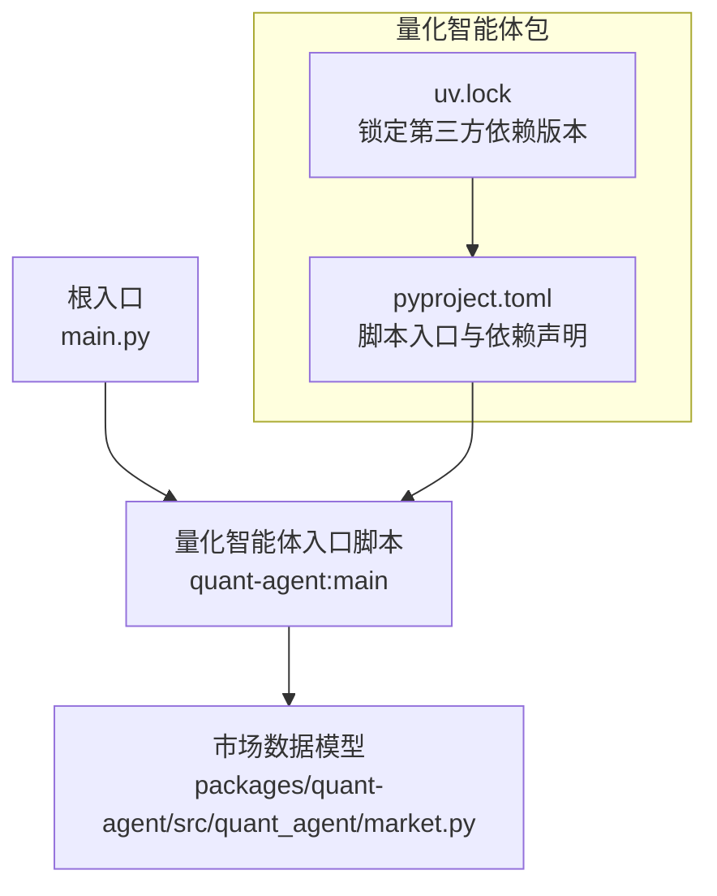
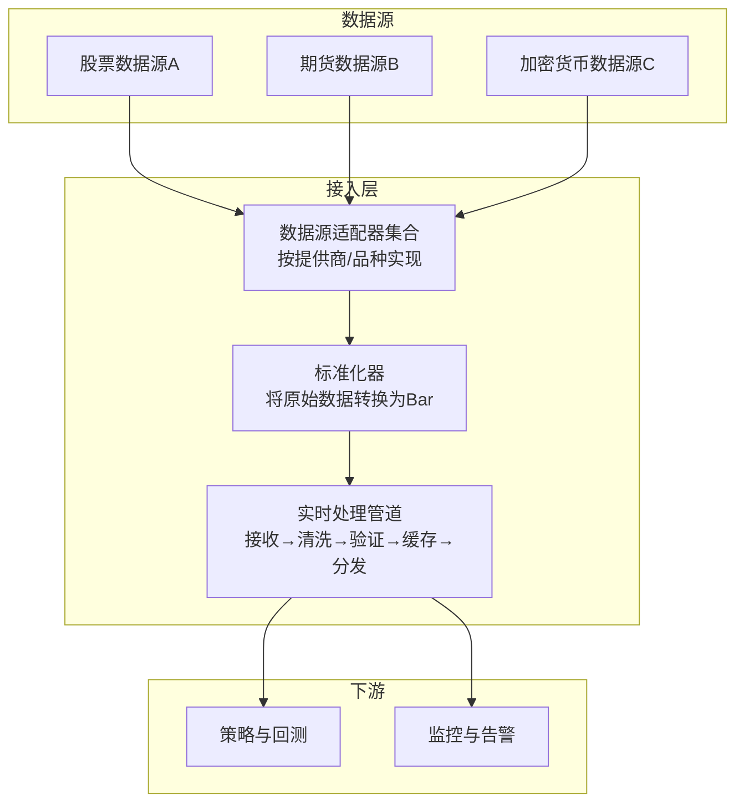
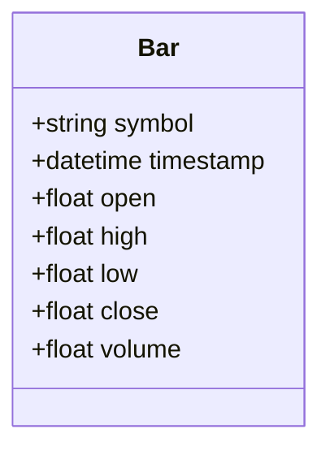
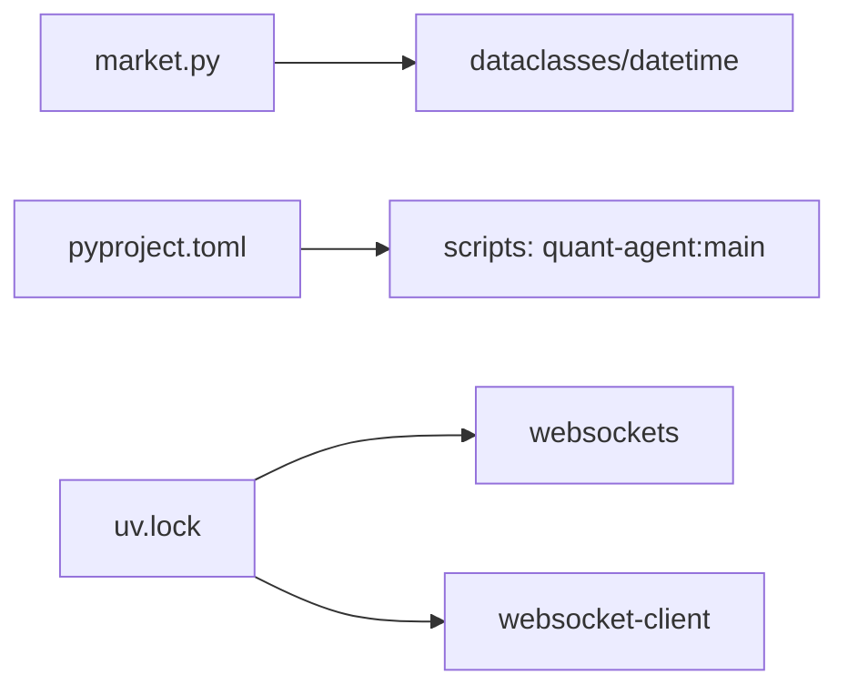

# 市场数据接入层

<cite>
**本文引用的文件**   
- [main.py](file://main.py)
- [market.py](file://packages/quant-agent/src/quant_agent/market.py)
- [pyproject.toml](file://packages/quant-agent/pyproject.toml)
- [uv.lock](file://uv.lock)
</cite>

## 目录
1. [简介](#简介)
2. [项目结构](#项目结构)
3. [核心组件](#核心组件)
4. [架构总览](#架构总览)
5. [详细组件分析](#详细组件分析)
6. [依赖分析](#依赖分析)
7. [性能考虑](#性能考虑)
8. [故障排查指南](#故障排查指南)
9. [结论](#结论)
10. [附录](#附录)

## 简介
本技术文档聚焦于“市场数据接入层”的设计与实现，目标包括：
- 解释数据源适配器架构，支持连接不同金融市场数据提供商（股票、期货、加密货币等）
- 定义并文档化数据格式标准化机制，确保多来源数据统一处理
- 设计实时数据流处理管道（接收、清洗、验证、缓存）
- 提供新增数据源的接入示例与最佳实践
- 说明数据质量控制与错误处理机制
- 给出性能优化建议与监控指标

当前仓库已包含市场数据的基础模型与入口点，为后续扩展适配器与流式管道提供了稳固基础。

## 项目结构
仓库采用多包组织方式，量化交易智能体相关代码位于 packages/quant-agent 下。根入口 main.py 负责启动各子模块；quant-agent 包通过 pyproject.toml 声明脚本入口，便于命令行调用。

图表来源
- [main.py:1-12](file://main.py#L1-L12)
- [pyproject.toml:1-18](file://packages/quant-agent/pyproject.toml#L1-L18)
- [market.py:1-16](file://packages/quant-agent/src/quant_agent/market.py#L1-L16)

章节来源
- [main.py:1-12](file://main.py#L1-L12)
- [pyproject.toml:1-18](file://packages/quant-agent/pyproject.toml#L1-L18)

## 核心组件
- 市场数据标准模型 Bar：用于统一表示K线数据，字段包括标的、时间戳、开高低收、成交量。该模型作为所有数据源适配器的输出契约，确保上层策略与回测对数据结构的稳定依赖。
- 应用入口 main.py：打印系统信息并初始化子模块，是整体运行的起点。
- 包配置 pyproject.toml：定义 quant-agent 包的元数据、Python 版本要求与可执行脚本入口。

章节来源
- [market.py:1-16](file://packages/quant-agent/src/quant_agent/market.py#L1-L16)
- [main.py:1-12](file://main.py#L1-L12)
- [pyproject.toml:1-18](file://packages/quant-agent/pyproject.toml#L1-L18)

## 架构总览
下图展示市场数据接入层的总体架构，从数据源到标准化模型的映射关系，以及未来可扩展的适配器与流式管道位置。

图表来源
- [market.py:1-16](file://packages/quant-agent/src/quant_agent/market.py#L1-L16)
- [pyproject.toml:1-18](file://packages/quant-agent/pyproject.toml#L1-L18)

## 详细组件分析

### 数据模型 Bar
Bar 作为市场数据的统一载体，承载单根K线的核心字段。其职责是：
- 提供强类型的数据契约，避免上游数据源差异导致的解析歧义
- 作为标准化后的最小粒度的数据单元，供后续清洗、校验、缓存与分发使用

图表来源
- [market.py:1-16](file://packages/quant-agent/src/quant_agent/market.py#L1-L16)

章节来源
- [market.py:1-16](file://packages/quant-agent/src/quant_agent/market.py#L1-L16)

### 应用入口 main.py
main.py 作为程序入口，负责初始化与打印系统信息，并调用子模块的 hello 方法以确认运行环境正常。该入口为后续集成数据接入层提供了统一的启动点。

章节来源
- [main.py:1-12](file://main.py#L1-L12)

### 包配置与脚本入口 pyproject.toml
pyproject.toml 定义了 quant-agent 包的名称、描述、作者、Python 版本要求与依赖列表，并通过 project.scripts 暴露命令行入口 quant-agent = "quant_agent:main"，使外部可直接调用量化智能体的主函数。

章节来源
- [pyproject.toml:1-18](file://packages/quant-agent/pyproject.toml#L1-L18)

### 第三方依赖 websockets 与 websocket-client
在 uv.lock 中可见 websockets 与 websocket-client 的锁定版本，表明系统具备基于 WebSocket 的实时通信能力，适合用于订阅交易所或数据商的实时行情推送通道。

章节来源
- [uv.lock:5756-5775](file://uv.lock#L5756-L5775)

## 依赖分析
- 包内依赖
  - market.py 仅依赖 Python 标准库 dataclasses 与 datetime，无第三方依赖，保证数据模型的轻量与稳定。
- 包级依赖
  - quant-agent 包在 pyproject.toml 中未声明额外依赖，但 uv.lock 显示存在 websockets 与 websocket-client，可用于构建实时数据接入层。
- 入口依赖
  - main.py 导入 quant_agent 与 companion_agent 两个子模块，体现分层解耦的组织方式。

图表来源
- [market.py:1-16](file://packages/quant-agent/src/quant_agent/market.py#L1-L16)
- [pyproject.toml:1-18](file://packages/quant-agent/pyproject.toml#L1-L18)
- [uv.lock:5756-5775](file://uv.lock#L5756-L5775)

章节来源
- [market.py:1-16](file://packages/quant-agent/src/quant_agent/market.py#L1-L16)
- [pyproject.toml:1-18](file://packages/quant-agent/pyproject.toml#L1-L18)
- [uv.lock:5756-5775](file://uv.lock#L5756-L5775)

## 性能考虑
- 低延迟传输
  - 使用 websockets 进行实时订阅，减少轮询开销，提升端到端时延。
- 内存与序列化
  - Bar 使用 dataclass，避免冗余对象创建；在高频场景下可采用对象池或复用实例以减少GC压力。
- 批处理与背压
  - 在清洗与验证阶段采用批量处理，结合有界队列实现背压，防止上游突发流量导致内存膨胀。
- 缓存策略
  - 最近N条K线缓存至内存环形缓冲区，加速策略计算；历史快照落盘持久化，重启后快速恢复。
- 并发模型
  - 网络接收与数据处理分离，使用生产者-消费者模式；CPU密集型校验与转换可放入线程池或进程池。
- 监控指标
  - 关键指标包括：消息吞吐率、端到端延迟分布、丢包率、校验失败率、缓存命中率、内存占用与GC次数。

[本节为通用指导，不直接分析具体文件]

## 故障排查指南
- 常见错误定位
  - 数据缺失或字段类型不符：在标准化阶段增加严格校验，记录异常样本与上下文信息（symbol、timestamp、原始报文片段）。
  - 网络中断与重连：对 WebSocket 连接实现指数退避重连，记录断连时长与重试次数。
  - 时钟漂移：对时间戳进行一致性检查，丢弃明显超前的数据并告警。
- 日志与追踪
  - 为每个数据源适配器添加唯一标识，关联 trace_id，便于跨链路追踪。
  - 关键路径埋点：接收、清洗、验证、缓存、分发的耗时与计数。
- 降级与熔断
  - 当某数据源错误率超过阈值，自动熔断并切换到备用源或只读缓存，保障系统可用性。

[本节为通用指导，不直接分析具体文件]

## 结论
当前仓库已提供市场数据的基础模型与入口点，具备向数据源适配器与实时流式管道扩展的条件。建议在现有 Bar 模型基础上，逐步完善：
- 数据源适配器抽象与注册机制
- 标准化器与校验器
- 实时处理管道（接收、清洗、验证、缓存、分发）
- 监控与告警体系
- 测试与回归用例

以上工作将使系统具备高可用、高性能、易扩展的市场数据接入能力。

[本节为总结性内容，不直接分析具体文件]

## 附录

### 新增数据源接入步骤（示例）
- 定义适配器接口
  - 约定统一的 subscribe/unsubscribe、on_message 回调与错误处理语义。
- 实现具体适配器
  - 针对特定数据商协议（REST/WebSocket/FIX），解析原始报文，映射为标准 Bar。
- 注册与发现
  - 将适配器注册到管理器，支持按 provider/symbol 路由。
- 标准化与校验
  - 在标准化器中对字段范围、时序、去重等进行校验。
- 接入管道
  - 将适配器输出接入实时处理管道，完成清洗、缓存与分发。
- 测试与回归
  - 编写单元测试与集成测试，覆盖正常、异常与边界场景。

[本节为概念性指导，不直接分析具体文件]