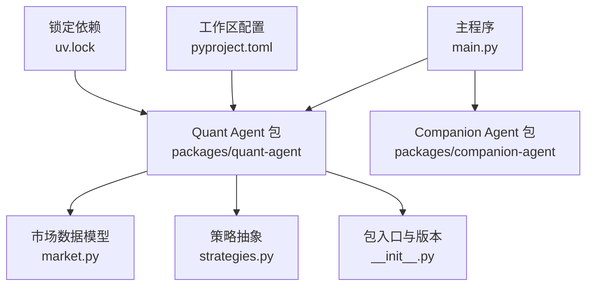
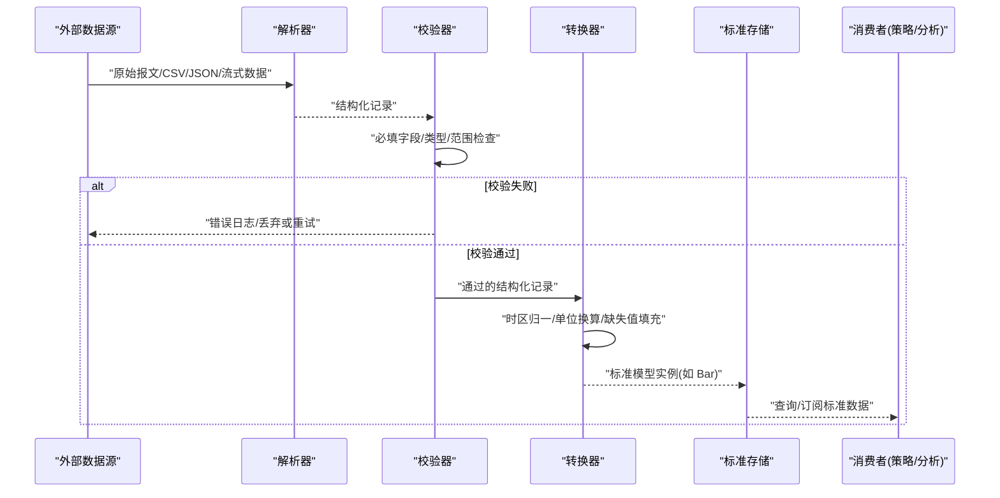
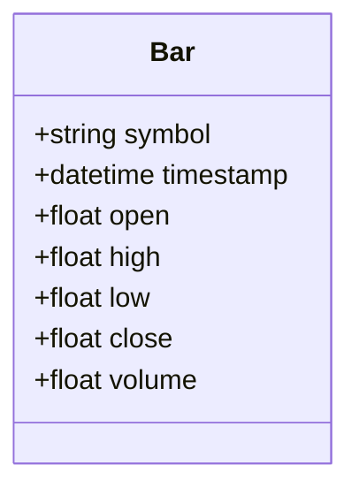
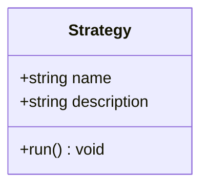
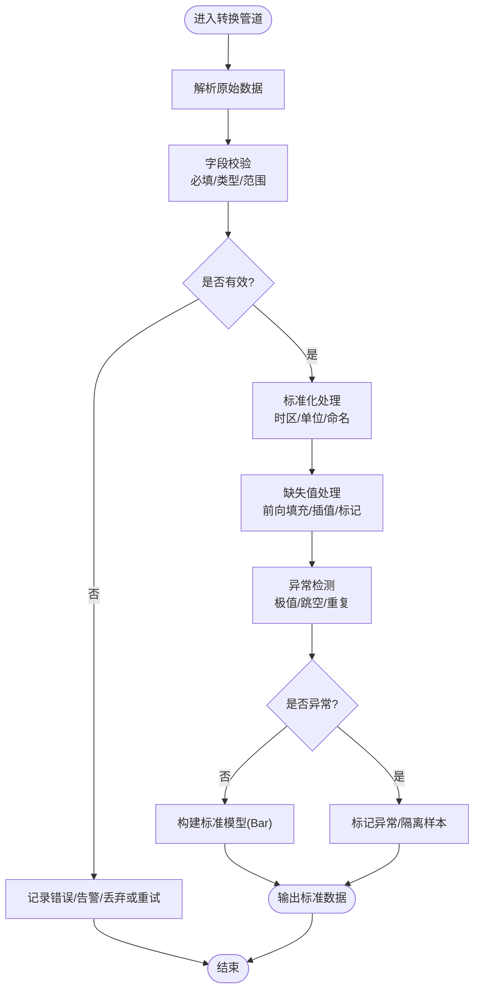
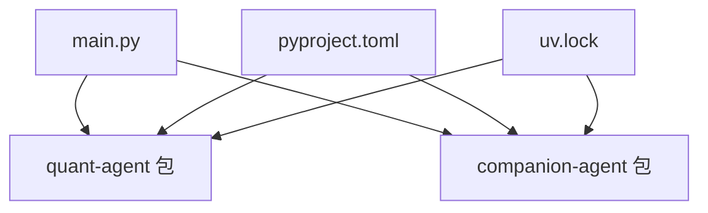

# 数据格式标准化

<cite>
**本文引用的文件**   
- [main.py](file://main.py)
- [pyproject.toml](file://pyproject.toml)
- [uv.lock](file://uv.lock)
- [agent-core README.md](file://packages/agent-core/README.md)
- [quant_agent/__init__.py](file://packages/quant-agent/src/quant_agent/__init__.py)
- [quant_agent/market.py](file://packages/quant-agent/src/quant_agent/market.py)
- [quant_agent/strategies.py](file://packages/quant-agent/src/quant_agent/strategies.py)
</cite>

## 目录
1. [简介](#简介)
2. [项目结构](#项目结构)
3. [核心组件](#核心组件)
4. [架构总览](#架构总览)
5. [详细组件分析](#详细组件分析)
6. [依赖关系分析](#依赖关系分析)
7. [性能考虑](#性能考虑)
8. [故障排查指南](#故障排查指南)
9. [结论](#结论)
10. [附录](#附录)

## 简介
本技术文档围绕“数据格式标准化机制”展开，目标是为多源异构数据（时间序列、OHLCV、订单簿等）提供统一的数据模型与转换管道设计说明。当前仓库中已包含量化领域的基础数据模型（如 OHLCV 的 Bar），并具备清晰的包结构与入口点。本文将基于现有代码，给出标准数据模型定义、转换管道设计要点、版本兼容策略以及面向不同提供商的标准化实现思路，帮助读者在已有基础上扩展出完整的数据标准化体系。

## 项目结构
仓库采用多包工作区组织，主入口通过 main.py 启动，聚合多个子包能力；量化相关的数据与策略位于 quant-agent 包内。

图表来源
- [main.py:1-13](file://main.py#L1-L13)
- [pyproject.toml:1-30](file://pyproject.toml#L1-L30)
- [uv.lock:2158-2195](file://uv.lock#L2158-L2195)
- [quant_agent/__init__.py:1-15](file://packages/quant-agent/src/quant_agent/__init__.py#L1-L15)
- [quant_agent/market.py:1-16](file://packages/quant-agent/src/quant_agent/market.py#L1-L16)
- [quant_agent/strategies.py:1-13](file://packages/quant-agent/src/quant_agent/strategies.py#L1-L13)

章节来源
- [main.py:1-13](file://main.py#L1-L13)
- [pyproject.toml:1-30](file://pyproject.toml#L1-L30)
- [uv.lock:2158-2195](file://uv.lock#L2158-L2195)
- [agent-core README.md:1-16](file://packages/agent-core/README.md#L1-L16)

## 核心组件
本节聚焦于量化数据的核心数据结构与最小可用实现，为后续标准化管道提供锚点。

- 标准 OHLCV 数据模型：Bar
  - 字段语义：标的符号、时间戳、开盘价、最高价、最低价、收盘价、成交量
  - 类型约定：symbol 为字符串，timestamp 为日期时间对象，其余数值均为浮点数
  - 用途：作为时间序列与 K 线数据的统一载体，便于跨提供商对齐

- 策略抽象：Strategy
  - 职责：定义策略运行接口，具体策略需实现 run 方法
  - 作用：将数据处理与交易逻辑解耦，使标准化后的数据可被策略消费

- 包入口与版本：quant_agent.__init__
  - 提供版本号与便捷 hello 函数，便于运行时识别与调试

章节来源
- [quant_agent/market.py:1-16](file://packages/quant-agent/src/quant_agent/market.py#L1-L16)
- [quant_agent/strategies.py:1-13](file://packages/quant-agent/src/quant_agent/strategies.py#L1-L13)
- [quant_agent/__init__.py:1-15](file://packages/quant-agent/src/quant_agent/__init__.py#L1-L15)

## 架构总览
下图展示从外部数据源到内部标准模型的端到端流程，包括验证、转换、缺失值处理与异常检测环节。该图为概念性设计，用于指导后续实现。

[此图为概念流程图，不直接映射具体源码文件]

## 详细组件分析

### 标准数据模型：Bar（OHLCV）
Bar 是 OHLCV 的标准载体，所有提供商的 K 线数据最终都应转换为该结构，确保下游一致消费。

图表来源
- [quant_agent/market.py:1-16](file://packages/quant-agent/src/quant_agent/market.py#L1-L16)

章节来源
- [quant_agent/market.py:1-16](file://packages/quant-agent/src/quant_agent/market.py#L1-L16)

### 策略抽象：Strategy
Strategy 定义了策略的统一运行接口，便于接入标准化后的数据管线。

图表来源
- [quant_agent/strategies.py:1-13](file://packages/quant-agent/src/quant_agent/strategies.py#L1-L13)

章节来源
- [quant_agent/strategies.py:1-13](file://packages/quant-agent/src/quant_agent/strategies.py#L1-L13)

### 数据转换管道设计（概念）
以下流程图描述从原始数据到标准模型的典型步骤，涵盖验证、类型转换、缺失值处理与异常检测。

[此图为概念流程图，不直接映射具体源码文件]

### 多提供商标准化示例（概念）
以两家不同提供商的 K 线数据为例，展示如何将其统一为 Bar：

- 提供商 A（字段名差异）
  - 输入字段：code, time, o, h, l, c, vol
  - 标准化步骤：
    - 字段映射：code→symbol, time→timestamp, o→open, h→high, l→low, c→close, vol→volume
    - 类型转换：time 转为 datetime，数值转为 float
    - 缺失值：若某字段为空，按策略进行前向填充或标记
    - 异常检测：对价格非正、成交量为负等进行过滤或标记

- 提供商 B（时间粒度与单位差异）
  - 输入字段：ts_ms, price_open, price_high, price_low, price_close, qty
  - 标准化步骤：
    - 时间转换：毫秒时间戳转 UTC 时间，必要时对齐到分钟/小时粒度
    - 单位统一：价格保留两位小数，成交量统一为手/股
    - 去重：同一 symbol+timestamp 仅保留一条记录
    - 异常检测：高低价小于等于零、收盘价远偏离合理区间等

[此部分为概念示例，不直接映射具体源码文件]

### 版本兼容性与向后兼容策略（概念）
为保证数据模型演进不影响既有消费者，建议遵循如下策略：

- 字段演进
  - 新增字段默认可选，并提供默认值或空值策略
  - 废弃字段保留一段时间并输出弃用告警
- 命名规范
  - 严格使用小写下划线命名，避免大小写敏感问题
- 类型稳定
  - 关键数值类型保持稳定，变更需提供迁移脚本
- 时间与时区
  - 统一使用 UTC 时间戳，对外暴露本地化时间由消费方决定
- 校验与回退
  - 强校验失败时快速失败，弱校验失败时降级并记录日志
- 版本标识
  - 在数据元信息中标注 schema 版本，便于消费者适配

[此部分为概念策略，不直接映射具体源码文件]

## 依赖关系分析
仓库通过 pyproject.toml 声明工作区成员与依赖，uv.lock 锁定实际安装版本。主程序 main.py 导入 quant-agent 与 companion-agent 两个包，体现分层与解耦。

图表来源
- [main.py:1-13](file://main.py#L1-L13)
- [pyproject.toml:1-30](file://pyproject.toml#L1-L30)
- [uv.lock:2158-2195](file://uv.lock#L2158-L2195)

章节来源
- [main.py:1-13](file://main.py#L1-L13)
- [pyproject.toml:1-30](file://pyproject.toml#L1-L30)
- [uv.lock:2158-2195](file://uv.lock#L2158-L2195)

## 性能考虑
- 批量处理：优先批量化解析与转换，减少对象创建与 I/O 次数
- 惰性计算：对大体积时间序列采用分块读取与延迟求值
- 内存管理：及时释放中间结果，避免长生命周期引用
- 索引优化：对 symbol+timestamp 建立复合索引，加速查询与去重
- 异常隔离：异常样本隔离写入，避免污染主数据流
- 并行化：解析与转换阶段可按 symbol 或时间窗口并行处理

[本节为通用性能建议，不直接分析具体文件]

## 故障排查指南
- 常见错误定位
  - 字段缺失：核对字段映射表与必填清单
  - 类型不匹配：确认时间戳、数值类型的转换规则
  - 重复记录：检查 symbol+timestamp 的唯一性约束
  - 异常值：查看异常检测阈值与告警日志
- 诊断手段
  - 增加详细日志：记录输入摘要、转换前后样例、错误堆栈
  - 抽样回放：对失败样本进行离线回放与断点调试
  - 指标监控：统计各提供商数据质量指标（缺失率、异常率）

[本节为通用排障建议，不直接分析具体文件]

## 结论
当前仓库已提供量化数据的最小可行模型（Bar）与策略抽象（Strategy），为数据标准化奠定了良好基础。建议在现有基础上完善解析器、校验器、转换器与异常检测模块，形成端到端的标准化管道，并通过版本兼容策略保障长期演进。

[本节为总结性内容，不直接分析具体文件]

## 附录
- 术语
  - OHLCV：开盘价、最高价、最低价、收盘价、成交量
  - 时间序列：按时间顺序排列的观测值集合
  - 订单簿：买卖盘口快照与增量更新
- 参考路径
  - 标准模型定义：[quant_agent/market.py](file://packages/quant-agent/src/quant_agent/market.py)
  - 策略抽象：[quant_agent/strategies.py](file://packages/quant-agent/src/quant_agent/strategies.py)
  - 包入口与版本：[quant_agent/__init__.py](file://packages/quant-agent/src/quant_agent/__init__.py)
  - 工作区与依赖：[pyproject.toml](file://pyproject.toml), [uv.lock](file://uv.lock)
  - 主入口：[main.py](file://main.py)