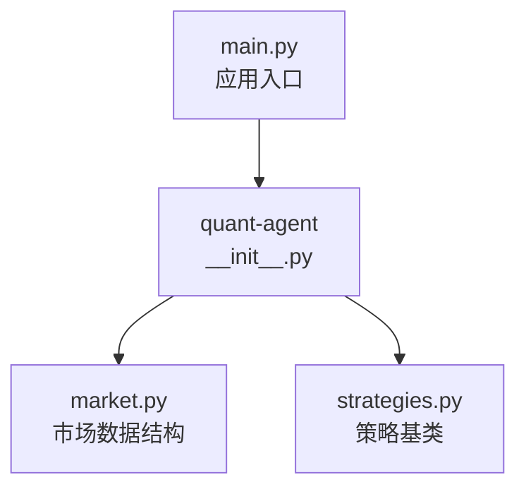
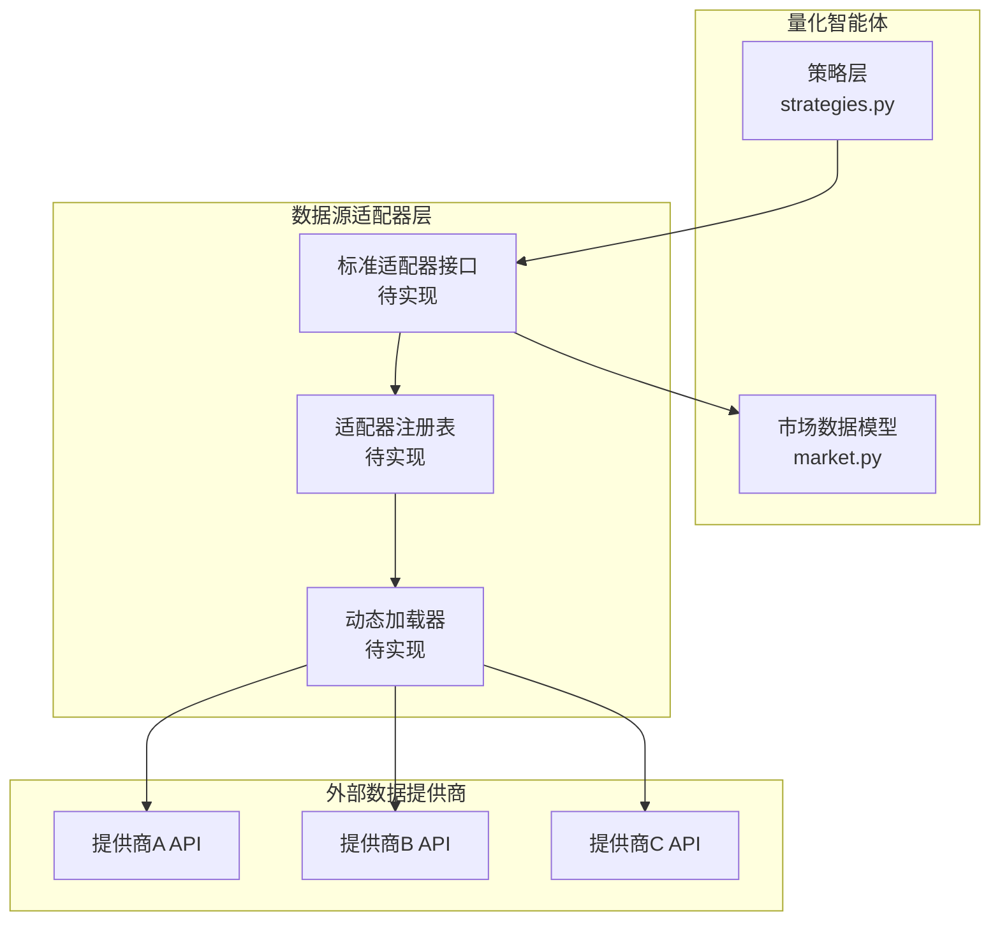
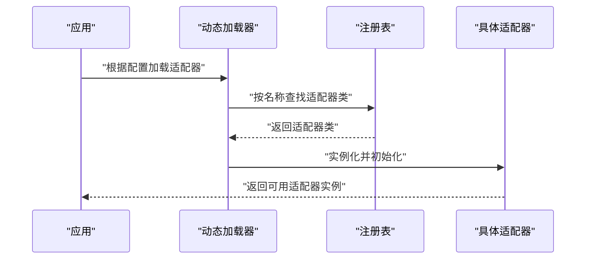
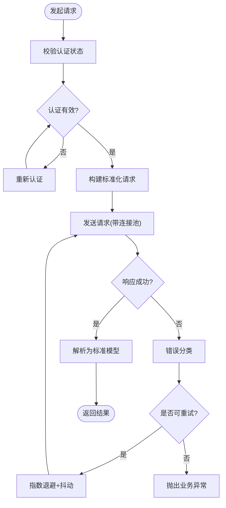
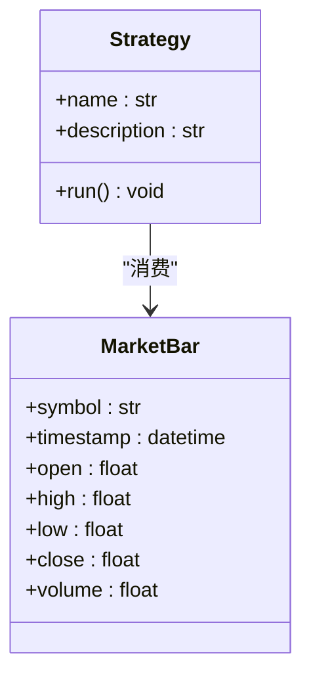
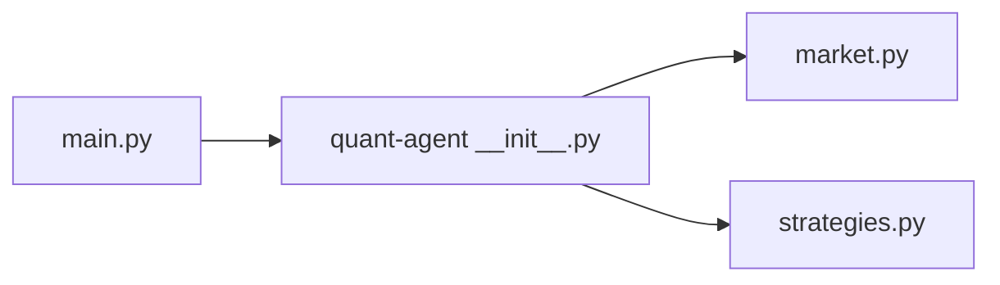

# 数据源适配器

<cite>
**本文引用的文件**
- [packages/quant-agent/src/quant_agent/__init__.py](file://packages/quant-agent/src/quant_agent/__init__.py)
- [packages/quant-agent/src/quant_agent/market.py](file://packages/quant-agent/src/quant_agent/market.py)
- [packages/quant-agent/src/quant_agent/strategies.py](file://packages/quant-agent/src/quant_agent/strategies.py)
- [main.py](file://main.py)
</cite>

## 目录
1. [简介](#简介)
2. [项目结构](#项目结构)
3. [核心组件](#核心组件)
4. [架构总览](#架构总览)
5. [详细组件分析](#详细组件分析)
6. [依赖分析](#依赖分析)
7. [性能考虑](#性能考虑)
8. [故障排查指南](#故障排查指南)
9. [结论](#结论)
10. [附录](#附录)

## 简介
本技术文档围绕“数据源适配器”展开，目标是为不同金融市场数据提供商提供统一的抽象接口，屏蔽底层差异（连接、认证、请求封装、响应解析等），并给出实现新适配器的步骤与最佳实践。同时说明适配器注册机制与动态加载策略，以及错误处理、重试机制和连接池管理的实现要点。

当前仓库中已包含量化交易智能体模块的骨架与基础数据结构，为构建数据源适配器提供了良好的扩展点。

## 项目结构
仓库采用多包组织方式，量化相关能力集中在 quant-agent 包内，主入口 main.py 负责启动各子包的能力。

图表来源
- [main.py:1-12](file://main.py#L1-L12)
- [packages/quant-agent/src/quant_agent/__init__.py:1-15](file://packages/quant-agent/src/quant_agent/__init__.py#L1-L15)
- [packages/quant-agent/src/quant_agent/market.py:1-15](file://packages/quant-agent/src/quant_agent/market.py#L1-L15)
- [packages/quant-agent/src/quant_agent/strategies.py:1-12](file://packages/quant-agent/src/quant_agent/strategies.py#L1-L12)

章节来源
- [main.py:1-12](file://main.py#L1-L12)
- [packages/quant-agent/src/quant_agent/__init__.py:1-15](file://packages/quant-agent/src/quant_agent/__init__.py#L1-L15)

## 核心组件
- 市场数据结构：用于统一表示 K 线等行情数据，便于上层策略与回测消费。
- 策略基类：定义策略运行入口，便于后续接入数据源进行信号生成与执行。

这些组件为数据源适配器提供了清晰的数据契约与调用边界。

章节来源
- [packages/quant-agent/src/quant_agent/market.py:1-15](file://packages/quant-agent/src/quant_agent/market.py#L1-L15)
- [packages/quant-agent/src/quant_agent/strategies.py:1-12](file://packages/quant-agent/src/quant_agent/strategies.py#L1-L12)

## 架构总览
下图展示了数据源适配器在系统中的位置与交互关系。适配器作为“数据提供方”，向策略层暴露统一的数据获取接口；策略通过标准接口拉取数据，完成分析与决策。

[此图为概念性架构图，未直接映射到具体源码文件，故不附图表来源]

## 详细组件分析

### 标准适配器接口设计
建议将标准适配器接口定义为面向策略的统一数据访问面，涵盖以下职责：
- 连接管理：建立/维护与数据提供商的连接或会话。
- 认证机制：处理 Token、密钥、签名等鉴权流程。
- 请求封装：构造标准化请求（标的、时间范围、频率、复权等）。
- 响应解析：将不同提供商的原始响应转换为统一的市场数据结构。
- 错误处理与重试：对网络抖动、限流、临时失败等进行可配置的重试与退避。
- 连接池：复用连接与会话，降低握手成本。

为实现上述职责，建议在 quant-agent 包内新增如下模块（命名仅为示例）：
- adapters/base.py：定义标准适配器抽象基类与通用方法。
- adapters/registry.py：实现适配器注册表与按名称查找。
- adapters/loader.py：实现基于配置文件或约定的动态加载。
- adapters/http_client.py：封装 HTTP 客户端、超时、重试、连接池等。
- adapters/auth.py：封装常见认证模式（API Key、OAuth、HMAC 签名等）。
- adapters/models.py：复用 market.py 中的数据结构，确保一致的数据契约。

章节来源
- [packages/quant-agent/src/quant_agent/market.py:1-15](file://packages/quant-agent/src/quant_agent/market.py#L1-L15)

### 适配器注册机制与动态加载
- 注册机制：提供一个全局注册表，支持以字符串名称映射到适配器类或工厂函数。注册可在导入时自动完成，也可显式调用注册 API。
- 动态加载：从配置文件读取需要启用的适配器列表，按名称反射加载对应模块并实例化。加载过程应包含校验、异常捕获与降级策略。

[此图为概念性流程图，未直接映射到具体源码文件，故不附图表来源]

### 错误处理、重试与连接池
- 错误分类：区分可重试错误（如网络超时、限流）、不可重试错误（如参数非法、鉴权失败）。
- 重试策略：指数退避、抖动、最大重试次数、重试回调（记录日志/指标）。
- 连接池：基于 HTTP 客户端的连接复用，设置最大连接数、空闲回收、健康检查。
- 熔断与降级：当错误率超过阈值时快速失败，避免雪崩；必要时返回缓存或默认值。

[此图为概念性流程图，未直接映射到具体源码文件，故不附图表来源]

### 如何实现新的数据源适配器（步骤与最佳实践）
- 步骤
  - 新建适配器类，继承标准适配器基类，实现必要方法（连接、认证、请求、解析）。
  - 在注册表中注册适配器名称与类的映射。
  - 在配置文件中声明启用该适配器，并在启动阶段由加载器完成实例化。
  - 编写单元测试覆盖正常路径与异常路径（含重试与超时）。
- 最佳实践
  - 严格遵循标准接口契约，不引入私有协议。
  - 使用幂等请求与去重键，避免重复拉取。
  - 合理设置超时与重试上限，避免拖慢整体链路。
  - 对敏感信息（密钥、Token）进行安全存储与最小权限原则。
  - 输出结构化日志与指标，便于定位问题。

章节来源
- [packages/quant-agent/src/quant_agent/strategies.py:1-12](file://packages/quant-agent/src/quant_agent/strategies.py#L1-L12)

### 与策略层的集成
- 策略通过标准适配器接口获取统一的市场数据模型，无需关心底层提供商差异。
- 策略基类定义了 run 入口，可在其中调用适配器拉取数据并进行计算。

图表来源
- [packages/quant-agent/src/quant_agent/strategies.py:1-12](file://packages/quant-agent/src/quant_agent/strategies.py#L1-L12)
- [packages/quant-agent/src/quant_agent/market.py:1-15](file://packages/quant-agent/src/quant_agent/market.py#L1-L15)

章节来源
- [packages/quant-agent/src/quant_agent/strategies.py:1-12](file://packages/quant-agent/src/quant_agent/strategies.py#L1-L12)
- [packages/quant-agent/src/quant_agent/market.py:1-15](file://packages/quant-agent/src/quant_agent/market.py#L1-L15)

## 依赖分析
- 入口依赖：main.py 导入并调用 quant-agent 与 companion-agent 的 hello 方法，体现多包协作。
- 量化模块内部依赖：quant-agent 包内 market.py 与 strategies.py 分别定义数据模型与策略基类，二者解耦但共同服务于上层逻辑。

图表来源
- [main.py:1-12](file://main.py#L1-L12)
- [packages/quant-agent/src/quant_agent/__init__.py:1-15](file://packages/quant-agent/src/quant_agent/__init__.py#L1-L15)
- [packages/quant-agent/src/quant_agent/market.py:1-15](file://packages/quant-agent/src/quant_agent/market.py#L1-L15)
- [packages/quant-agent/src/quant_agent/strategies.py:1-12](file://packages/quant-agent/src/quant_agent/strategies.py#L1-L12)

章节来源
- [main.py:1-12](file://main.py#L1-L12)
- [packages/quant-agent/src/quant_agent/__init__.py:1-15](file://packages/quant-agent/src/quant_agent/__init__.py#L1-L15)

## 性能考虑
- 连接复用：通过连接池减少握手开销，合理设置最大连接数与空闲回收策略。
- 批量拉取：合并多次小请求为批量请求，降低网络往返。
- 增量更新：基于时间戳或序列号增量拉取，避免全量同步。
- 缓存与去重：对热点标的与短时间窗口数据进行本地缓存，结合去重键避免重复计算。
- 超时与背压：为 I/O 操作设置合理超时，防止线程/协程阻塞；在高负载下主动降速。

## 故障排查指南
- 常见问题
  - 认证失败：检查密钥有效期、签名算法与时钟同步。
  - 限流与配额：观察响应头中的速率限制字段，调整重试间隔与并发度。
  - 网络抖动：开启重试与指数退避，增加日志采样以便定位。
  - 数据不一致：对比不同提供商的同标的数据，定位解析差异。
- 诊断手段
  - 结构化日志：记录请求 ID、标的、时间范围、耗时与错误码。
  - 指标上报：统计成功率、P95/P99 延迟、重试次数、熔断触发次数。
  - 断点与回放：保存失败请求与响应，用于离线回放与回归测试。

## 结论
通过定义标准适配器接口、注册与动态加载机制，并结合健壮的错误处理、重试与连接池管理，系统能够以低耦合的方式接入多种金融市场数据提供商。配合统一的市场数据模型与策略基类，上层策略无需感知底层差异，即可稳定高效地获取数据并完成交易决策。

## 附录
- 术语
  - 适配器：封装特定数据提供商细节，对外暴露统一接口的组件。
  - 注册表：维护适配器名称到实现的映射，供动态加载使用。
  - 动态加载：运行时根据配置选择并实例化适配器的机制。
- 参考路径
  - 市场数据结构定义：[packages/quant-agent/src/quant_agent/market.py](file://packages/quant-agent/src/quant_agent/market.py)
  - 策略基类定义：[packages/quant-agent/src/quant_agent/strategies.py](file://packages/quant-agent/src/quant_agent/strategies.py)
  - 量化包入口：[packages/quant-agent/src/quant_agent/__init__.py](file://packages/quant-agent/src/quant_agent/__init__.py)
  - 应用入口：[main.py](file://main.py)