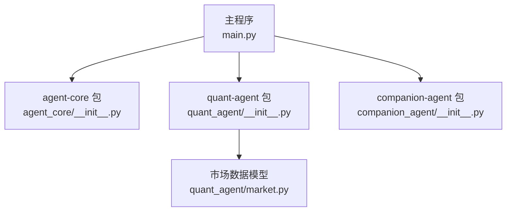
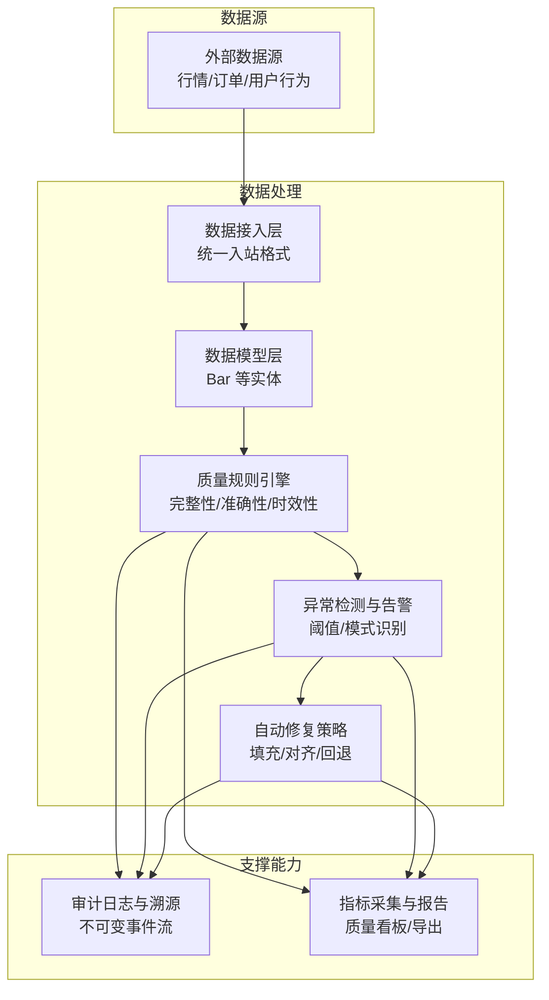
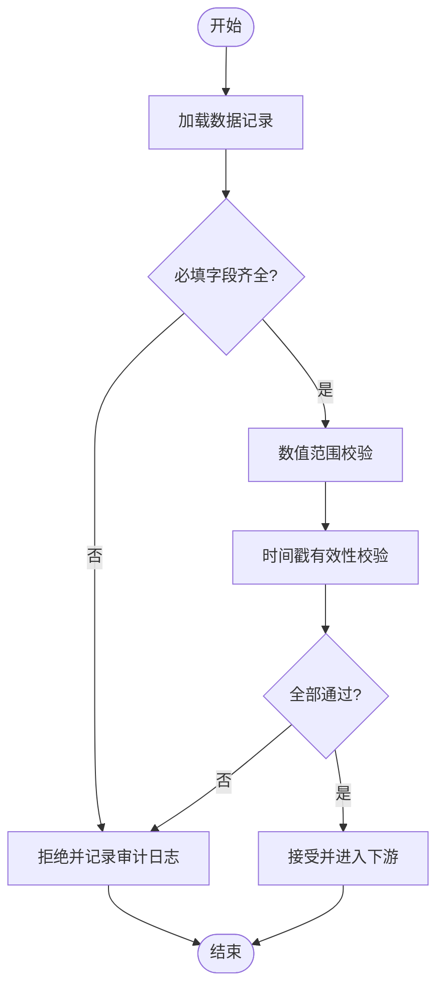
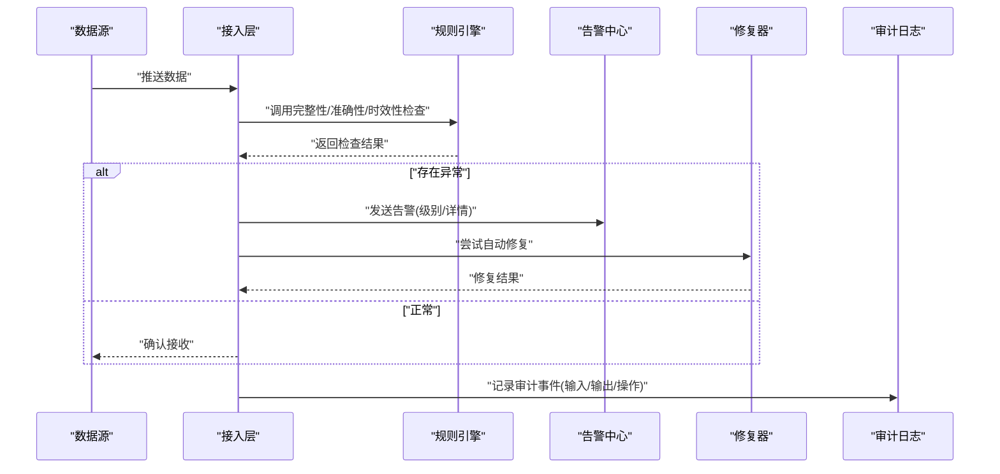
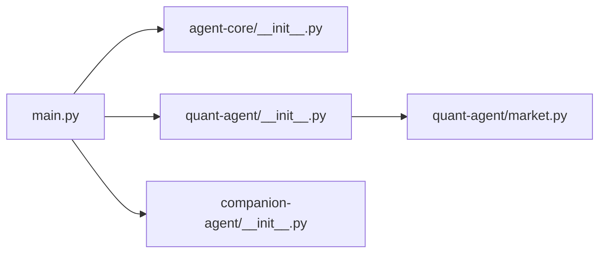

# 数据质量控制

<cite>
**本文引用的文件**
- [main.py](file://main.py)
- [pyproject.toml](file://pyproject.toml)
- [agent-core __init__.py](file://packages/agent-core/src/agent_core/__init__.py)
- [quant-agent __init__.py](file://packages/quant-agent/src/quant_agent/__init__.py)
- [companion-agent __init__.py](file://packages/companion-agent/src/companion_agent/__init__.py)
- [quant-agent market.py](file://packages/quant-agent/src/quant_agent/market.py)
</cite>

## 目录
1. [引言](#引言)
2. [项目结构](#项目结构)
3. [核心组件](#核心组件)
4. [架构总览](#架构总览)
5. [详细组件分析](#详细组件分析)
6. [依赖分析](#依赖分析)
7. [性能考虑](#性能考虑)
8. [故障排查指南](#故障排查指南)
9. [结论](#结论)
10. [附录](#附录)

## 引言
本技术文档围绕“数据质量控制机制”展开，目标是构建一套覆盖完整性、准确性与时效性的监控与评估体系，并配套异常检测与告警、自动修复策略、数据溯源与审计日志、质量指标采集与报告生成。同时提供可配置的质量规则示例与自定义验证逻辑实现方法，并对性能影响进行分析与优化建议。

本项目为多包工作区（workspace）结构，包含 agent-core、quant-agent、companion-agent 等子包。当前仓库中尚未发现专门的数据质量控制模块，因此本文在尊重现有代码结构的基础上，提出面向该仓库的可落地方案，并以量化市场数据模型作为示例载体，说明如何嵌入质量检查、告警与审计能力。

## 项目结构
仓库采用 Python workspace 组织方式，根入口 main.py 聚合多个子包的对外能力；各子包以 src/<package>/__init__.py 暴露最小可用接口；quant-agent 中包含基础数据模型 Bar（K线），适合作为数据质量校验的示例对象。

图表来源
- [main.py:1-13](file://main.py#L1-L13)
- [agent-core __init__.py:1-3](file://packages/agent-core/src/agent_core/__init__.py#L1-L3)
- [quant-agent __init__.py:1-15](file://packages/quant-agent/src/quant_agent/__init__.py#L1-L15)
- [companion-agent __init__.py:1-15](file://packages/companion-agent/src/companion_agent/__init__.py#L1-L15)
- [quant-agent market.py:1-16](file://packages/quant-agent/src/quant_agent/market.py#L1-L16)

章节来源
- [main.py:1-13](file://main.py#L1-L13)
- [pyproject.toml:1-30](file://pyproject.toml#L1-L30)

## 核心组件
本节从“数据质量控制”视角，定义需要落地的关键组件及其职责：
- 数据模型层：承载业务数据（如 Bar），用于后续完整性、准确性与时序性校验。
- 质量规则引擎：解析配置化的质量规则，执行完整性、准确性、时效性等检查。
- 异常检测与告警：基于阈值与模式识别触发告警，支持分级与路由。
- 自动修复策略：对可恢复问题执行自愈（如缺失字段填充、时间戳对齐）。
- 溯源与审计日志：记录数据来源、处理链路、变更轨迹与检查结果。
- 指标采集与报告：汇总质量指标（通过率、延迟、缺失率等），生成可视化或结构化报告。

上述组件在本仓库中尚未直接实现，但可在现有包结构中扩展。例如，将质量规则与校验逻辑置于 quant-agent 或新建 data-quality 子包；将审计日志与指标采集下沉到 agent-core 作为通用能力。

章节来源
- [quant-agent market.py:1-16](file://packages/quant-agent/src/quant_agent/market.py#L1-L16)

## 架构总览
下图展示数据质量控制的整体架构，包括数据接入、规则校验、异常告警、自动修复、审计与报告输出等环节，并与现有包结构对应。

图表来源
- [quant-agent market.py:1-16](file://packages/quant-agent/src/quant_agent/market.py#L1-L16)

## 详细组件分析

### 数据模型与完整性检查
- 目标：确保每条记录具备必要字段、类型正确且取值范围合理。
- 针对 Bar 的完整性检查要点：
  - 必填字段：symbol、timestamp、open、high、low、close、volume。
  - 数值约束：high ≥ max(open, close)，low ≤ min(open, close)，volume ≥ 0。
  - 时间约束：timestamp 非空且符合预期时区。
- 实现建议：
  - 在数据入站阶段进行 schema 校验与默认值填充。
  - 使用强类型数据结构（dataclass）减少运行时错误。
  - 将失败样本写入隔离队列，便于人工复核与回溯。

图表来源
- [quant-agent market.py:1-16](file://packages/quant-agent/src/quant_agent/market.py#L1-L16)

章节来源
- [quant-agent market.py:1-16](file://packages/quant-agent/src/quant_agent/market.py#L1-L16)

### 准确性验证
- 目标：保证数据真实可靠，避免脏数据污染下游决策。
- 典型规则：
  - 价格一致性：同一 symbol 的多条记录间，相邻时间点的 open/close 应平滑过渡，突变需标记。
  - 量价关系：极端成交量伴随价格跳变需二次确认。
  - 去重与合并：按 symbol+timestamp 去重，冲突时选择权威源。
- 实现建议：
  - 引入“可信度评分”，对不同数据源赋予权重。
  - 对可疑记录进入“待审队列”，由人工或更严格规则复核。

章节来源
- [quant-agent market.py:1-16](file://packages/quant-agent/src/quant_agent/market.py#L1-L16)

### 时效性监控
- 目标：保障数据新鲜度与处理延迟满足 SLA。
- 关键指标：
  - 端到端延迟：从数据产生到入库的时间差。
  - 处理吞吐：单位时间内成功处理的记录数。
  - 滞后窗口：当前时间与最新有效数据时间的差值。
- 实现建议：
  - 在入站与入库点埋点，计算延迟分位数（P50/P95/P99）。
  - 对超过阈值的延迟触发告警并降级处理。

章节来源
- [quant-agent market.py:1-16](file://packages/quant-agent/src/quant_agent/market.py#L1-L16)

### 异常检测与告警系统
- 目标：快速发现数据异常并通知相关责任人。
- 检测策略：
  - 阈值告警：如缺失率 > 5%、延迟 P95 > 2s。
  - 模式识别：周期性波动异常、尖峰/尖谷检测。
  - 组合规则：多条件联动（如高缺失 + 高延迟）。
- 告警分级：
  - 提示（Info）、警告（Warn）、严重（Critical）。
  - 路由策略：邮件、IM、工单系统。
- 自动修复策略：
  - 缺失字段：根据历史均值或上游默认值填充。
  - 时间错位：基于 symbol 排序后插值补齐。
  - 回退机制：切换到备用数据源或启用只读缓存。

图表来源
- [quant-agent market.py:1-16](file://packages/quant-agent/src/quant_agent/market.py#L1-L16)

章节来源
- [quant-agent market.py:1-16](file://packages/quant-agent/src/quant_agent/market.py#L1-L16)

### 数据溯源与审计日志
- 目标：全链路可追溯，满足合规与排障需求。
- 记录内容：
  - 数据来源标识、批次号、时间戳。
  - 处理步骤、规则版本、参数快照。
  - 检查结果、告警事件、修复动作。
- 存储建议：
  - 不可变事件流（append-only），便于回放与审计。
  - 分层存储：热数据短期保留，冷数据归档。

章节来源
- [quant-agent market.py:1-16](file://packages/quant-agent/src/quant_agent/market.py#L1-L16)

### 质量指标收集与报告生成
- 指标维度：
  - 完整性：缺失率、字段覆盖率。
  - 准确性：异常率、重复率、一致性得分。
  - 时效性：延迟分布、吞吐、SLA 达标率。
- 报告形式：
  - 结构化 JSON/CSV 供自动化消费。
  - 可视化看板（趋势图、热力图、排行榜）。
- 发布节奏：
  - 实时：关键指标秒级刷新。
  - 定时：日报/周报汇总与对比。

章节来源
- [quant-agent market.py:1-16](file://packages/quant-agent/src/quant_agent/market.py#L1-L16)

### 质量规则配置示例与自定义验证逻辑
- 配置化规则建议：
  - 规则 ID、名称、描述、适用数据模型。
  - 条件表达式（字段、运算符、阈值）。
  - 动作（拒绝、告警、修复、采样）。
  - 生效时段、优先级、开关。
- 自定义验证逻辑：
  - 插件式注册：按数据模型或主题注册校验函数。
  - 版本管理：规则变更需版本化，支持灰度与回滚。
  - 沙箱执行：限制资源与权限，防止恶意规则。

章节来源
- [quant-agent market.py:1-16](file://packages/quant-agent/src/quant_agent/market.py#L1-L16)

## 依赖分析
当前仓库为多包工作区，根入口 main.py 聚合子包能力；quant-agent 提供基础数据模型 Bar，可作为质量校验的载体。

图表来源
- [main.py:1-13](file://main.py#L1-L13)
- [agent-core __init__.py:1-3](file://packages/agent-core/src/agent_core/__init__.py#L1-L3)
- [quant-agent __init__.py:1-15](file://packages/quant-agent/src/quant_agent/__init__.py#L1-L15)
- [companion-agent __init__.py:1-15](file://packages/companion-agent/src/companion_agent/__init__.py#L1-L15)
- [quant-agent market.py:1-16](file://packages/quant-agent/src/quant_agent/market.py#L1-L16)

章节来源
- [main.py:1-13](file://main.py#L1-L13)
- [pyproject.toml:1-30](file://pyproject.toml#L1-L30)

## 性能考虑
- 批处理与流式结合：批量校验降低开销，流式处理保障低延迟。
- 短路策略：先做轻量检查（非空、类型），再做复杂规则（跨记录比对）。
- 并行与分区：按 symbol 或时间窗口分区并行处理，避免热点阻塞。
- 采样与近似：对大规模数据进行采样校验，必要时使用近似算法。
- 资源隔离：规则执行沙箱化，限制 CPU/内存，防止雪崩。
- 缓存与复用：中间结果缓存，减少重复计算。
- 观测与限流：埋点监控关键路径，超限时快速失败与降级。

[本节为通用指导，不直接分析具体文件]

## 故障排查指南
- 常见问题定位：
  - 缺失字段：检查入站 schema 与默认值策略。
  - 时间错乱：核对时区设置与排序键。
  - 告警风暴：收敛规则、提高阈值或增加冷却期。
  - 修复失败：查看修复器日志与回退策略是否生效。
- 排障手段：
  - 审计日志检索：按批次号、规则 ID、告警级别过滤。
  - 指标下钻：从全局指标定位到具体数据源与时间段。
  - 回放与复现：基于不可变事件流重放问题场景。

章节来源
- [quant-agent market.py:1-16](file://packages/quant-agent/src/quant_agent/market.py#L1-L16)

## 结论
本仓库已具备多包结构与基础数据模型，适合在此基础上构建完善的数据质量控制体系。建议优先落地完整性与准确性校验、审计日志与基础告警，再逐步增强时效性监控、自动修复与报告能力。通过配置化规则与插件式验证，可实现灵活扩展与持续演进。

[本节为总结性内容，不直接分析具体文件]

## 附录
- 术语表：
  - 完整性：数据是否齐全、类型是否正确。
  - 准确性：数据是否真实、一致、无矛盾。
  - 时效性：数据是否及时到达与处理。
  - 审计日志：记录数据流转与处理行为的不可变事件。
  - 自动修复：对可恢复问题的自愈策略。
- 参考实践：
  - 规则版本管理与灰度发布。
  - 告警收敛与降噪策略。
  - 指标看板设计与告警路由。

[本节为概念性内容，不直接分析具体文件]