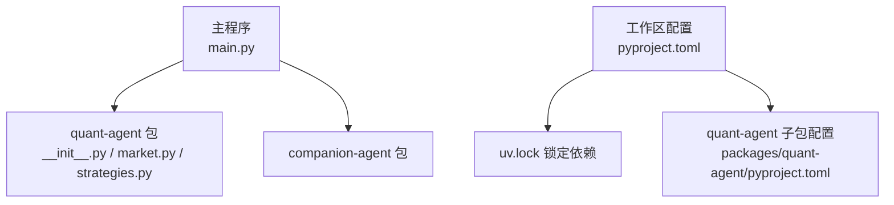
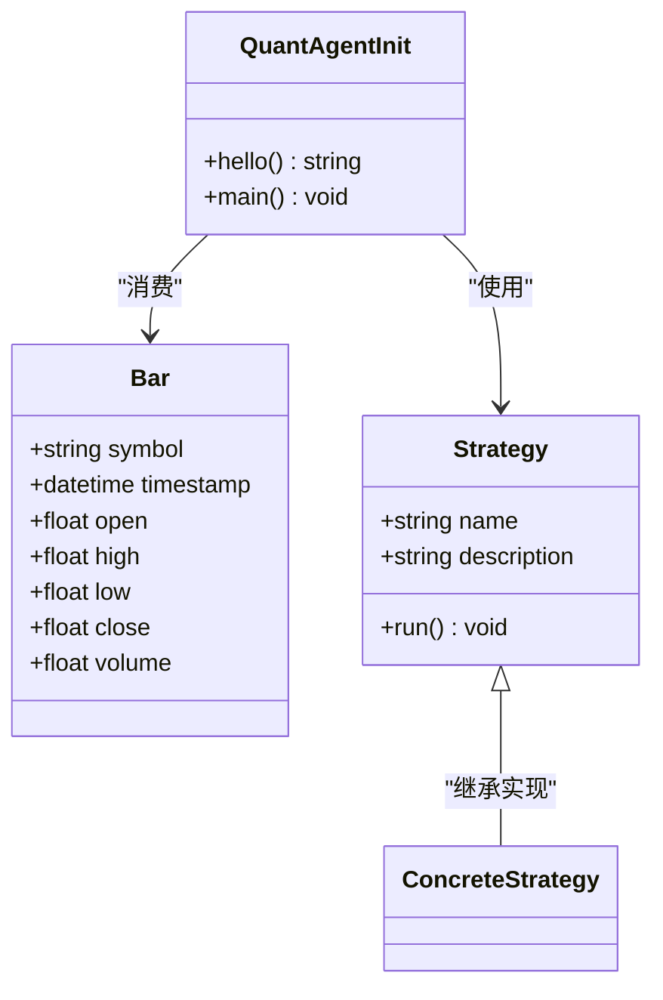
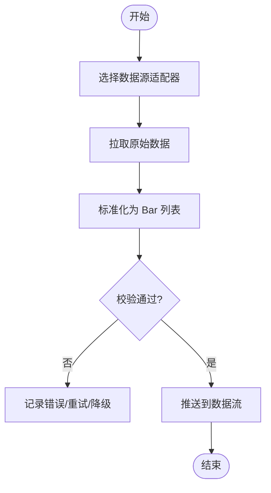
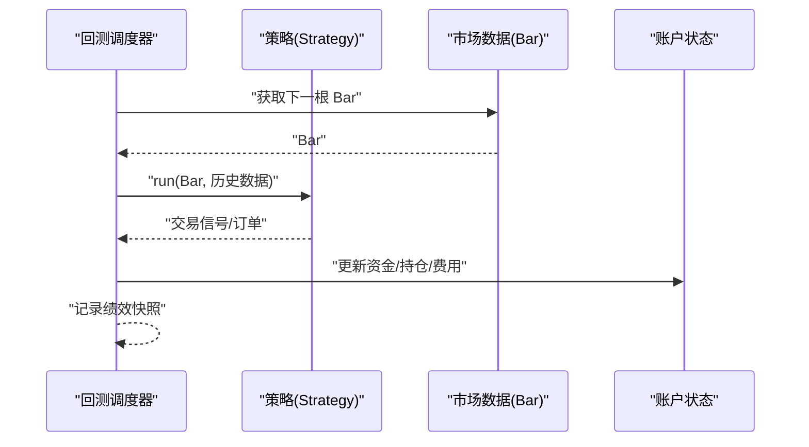
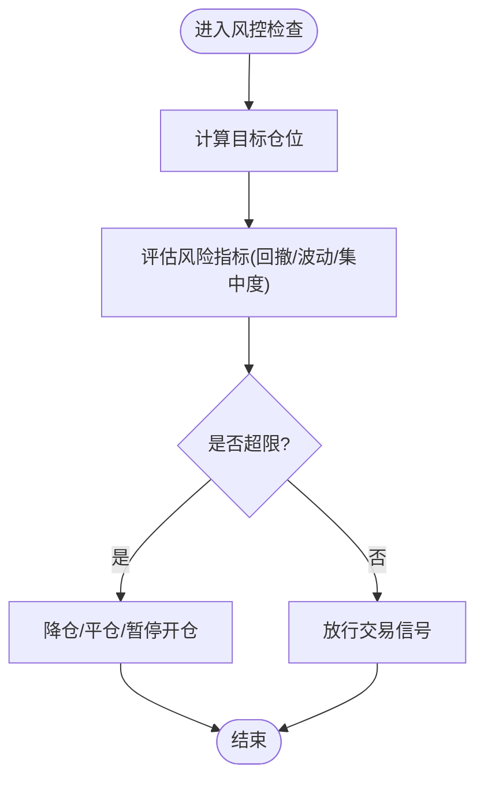
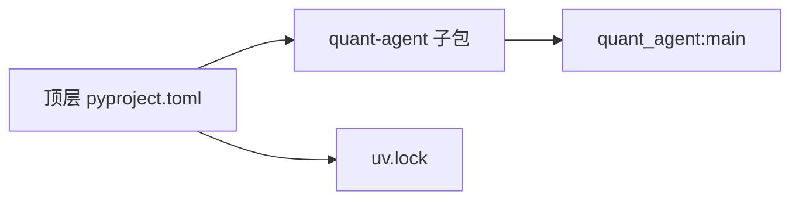

# 量化交易智能体

<cite>
**本文引用的文件**   
- [main.py](file://main.py)
- [pyproject.toml](file://pyproject.toml)
- [uv.lock](file://uv.lock)
- [packages/quant-agent/README.md](file://packages/quant-agent/README.md)
- [packages/quant-agent/pyproject.toml](file://packages/quant-agent/pyproject.toml)
- [packages/quant-agent/src/quant_agent/__init__.py](file://packages/quant-agent/src/quant_agent/__init__.py)
- [packages/quant-agent/src/quant_agent/market.py](file://packages/quant-agent/src/quant_agent/market.py)
- [packages/quant-agent/src/quant_agent/strategies.py](file://packages/quant-agent/src/quant_agent/strategies.py)
</cite>

## 目录
1. [简介](#简介)
2. [项目结构](#项目结构)
3. [核心组件](#核心组件)
4. [架构总览](#架构总览)
5. [详细组件分析](#详细组件分析)
6. [依赖关系分析](#依赖关系分析)
7. [性能考虑](#性能考虑)
8. [故障排查指南](#故障排查指南)
9. [结论](#结论)
10. [附录](#附录)

## 简介
本仓库为 JanusAgent 的“理性之面”——量化交易智能体（quant-agent）。当前版本提供：
- 市场数据基础模型（K线 Bar）
- 策略定义接口（Strategy）
- 回测与执行框架的入口与约定
- 命令行工具与包管理配置

目标是构建面向数据驱动的投资决策系统，后续将逐步完善数据接入、策略引擎、风控与绩效分析等模块。

## 项目结构
顶层 main.py 作为应用入口，聚合多个子智能体；quant-agent 作为独立工作空间成员，提供量化能力。

图表来源
- [main.py:1-12](file://main.py#L1-L12)
- [packages/quant-agent/src/quant_agent/__init__.py:1-14](file://packages/quant-agent/src/quant_agent/__init__.py#L1-L14)
- [packages/quant-agent/src/quant_agent/market.py:1-16](file://packages/quant-agent/src/quant_agent/market.py#L1-L16)
- [packages/quant-agent/src/quant_agent/strategies.py:1-13](file://packages/quant-agent/src/quant_agent/strategies.py#L1-L13)
- [pyproject.toml:1-30](file://pyproject.toml#L1-L30)
- [uv.lock:2158-2195](file://uv.lock#L2158-L2195)
- [packages/quant-agent/pyproject.toml:1-17](file://packages/quant-agent/pyproject.toml#L1-L17)

章节来源
- [main.py:1-12](file://main.py#L1-L12)
- [pyproject.toml:1-30](file://pyproject.toml#L1-L30)
- [uv.lock:2158-2195](file://uv.lock#L2158-L2195)
- [packages/quant-agent/README.md:1-16](file://packages/quant-agent/README.md#L1-L16)
- [packages/quant-agent/pyproject.toml:1-17](file://packages/quant-agent/pyproject.toml#L1-L17)

## 核心组件
- 市场数据模型：Bar 表示单根 K 线，包含标的、时间戳与 OHLCV 字段，用于统一行情数据结构。
- 策略基类：Strategy 定义策略名称、描述与运行接口 run，供具体策略实现。
- 包入口：quant_agent.__init__ 暴露 hello 与 main，便于 CLI 与外部调用。

章节来源
- [packages/quant-agent/src/quant_agent/market.py:1-16](file://packages/quant-agent/src/quant_agent/market.py#L1-L16)
- [packages/quant-agent/src/quant_agent/strategies.py:1-13](file://packages/quant-agent/src/quant_agent/strategies.py#L1-L13)
- [packages/quant-agent/src/quant_agent/__init__.py:1-14](file://packages/quant-agent/src/quant_agent/__init__.py#L1-L14)

## 架构总览
当前阶段以“数据模型 + 策略接口 + 入口”为核心骨架，后续可扩展数据源适配层、回测引擎、风控与绩效分析模块。

图表来源
- [packages/quant-agent/src/quant_agent/market.py:1-16](file://packages/quant-agent/src/quant_agent/market.py#L1-L16)
- [packages/quant-agent/src/quant_agent/strategies.py:1-13](file://packages/quant-agent/src/quant_agent/strategies.py#L1-L13)
- [packages/quant-agent/src/quant_agent/__init__.py:1-14](file://packages/quant-agent/src/quant_agent/__init__.py#L1-L14)

## 详细组件分析

### 市场数据接入层设计
- 数据源适配
  - 目标：对接多数据源（如 akshare/tushare/yfinance），统一返回 Bar 序列。
  - 建议：抽象 DataFeed 接口，实现历史与实时两种适配器；通过工厂或注册表选择具体实现。
- 数据格式标准化
  - 已定义 Bar 标准结构，确保各数据源输出一致。
  - 建议：增加校验逻辑（时间排序、缺失值处理、复权标记等）。
- 实时数据流处理
  - 建议：基于事件总线或异步队列推送新 Bar；策略订阅事件并增量更新指标。

[本节为概念性说明，未直接分析具体源码文件]

### 交易策略框架实现
- 策略定义接口
  - Strategy 提供 run 方法，子类需实现具体交易逻辑。
  - 建议：在 run 中接收 Bar 流或历史数据，输出交易信号或订单。
- 回测引擎（规划）
  - 建议：按时间步进遍历 Bar，逐条触发策略 run，维护账户状态（资金、持仓、费用、滑点）。
- 绩效分析模块（规划）
  - 建议：计算收益曲线、最大回撤、夏普比率、胜率、盈亏比等指标，并提供可视化导出。

图表来源
- [packages/quant-agent/src/quant_agent/strategies.py:1-13](file://packages/quant-agent/src/quant_agent/strategies.py#L1-L13)
- [packages/quant-agent/src/quant_agent/market.py:1-16](file://packages/quant-agent/src/quant_agent/market.py#L1-L16)

章节来源
- [packages/quant-agent/src/quant_agent/strategies.py:1-13](file://packages/quant-agent/src/quant_agent/strategies.py#L1-L13)
- [packages/quant-agent/src/quant_agent/market.py:1-16](file://packages/quant-agent/src/quant_agent/market.py#L1-L16)

### 风险管理系统（规划）
- 仓位控制
  - 建议：基于固定比例、波动率倒数或凯利公式动态调整头寸规模。
- 止损机制
  - 建议：支持固定百分比止损、追踪止损、时间止损等多模式。
- 风险控制规则
  - 建议：设置单日最大亏损、最大回撤阈值、集中度限制、流动性约束等。

[本节为概念性说明，未直接分析具体源码文件]

### 自定义策略开发示例（步骤指引）
- 步骤
  1) 新建策略类，继承 Strategy，实现 run 方法。
  2) 在 run 中读取 Bar 序列，计算技术指标，生成交易信号。
  3) 将信号传递给回测引擎或执行器进行下单。
- 参考路径
  - 策略基类定义：[packages/quant-agent/src/quant_agent/strategies.py:1-13](file://packages/quant-agent/src/quant_agent/strategies.py#L1-L13)
  - 数据模型：[packages/quant-agent/src/quant_agent/market.py:1-16](file://packages/quant-agent/src/quant_agent/market.py#L1-L16)

章节来源
- [packages/quant-agent/src/quant_agent/strategies.py:1-13](file://packages/quant-agent/src/quant_agent/strategies.py#L1-L13)
- [packages/quant-agent/src/quant_agent/market.py:1-16](file://packages/quant-agent/src/quant_agent/market.py#L1-L16)

### 回测结果分析与可视化（规划）
- 指标
  - 累计收益、年化收益、最大回撤、夏普比率、索提诺比率、Calmar 比率、胜率、盈亏比、换手率等。
- 可视化
  - 净值曲线、回撤曲线、月度收益热力图、交易分布直方图等。
- 输出
  - CSV/JSON 报告与 PNG/SVG 图表，便于归档与分享。

[本节为概念性说明，未直接分析具体源码文件]

### 与外部交易平台集成（规划）
- 集成方式
  - 抽象 Broker 接口，封装下单、撤单、查询持仓与资金、批量操作等。
  - 支持模拟盘与实盘切换，通过配置注入不同实现。
- API 规范
  - 统一请求/响应模型，幂等键、重试与退避、签名与鉴权、限频与熔断。
- 安全与合规
  - 密钥管理、最小权限原则、审计日志与异常上报。

[本节为概念性说明，未直接分析具体源码文件]

## 依赖关系分析
- 工作区成员
  - quant-agent 作为 packages 下成员被顶层 pyproject.toml 引用。
- 脚本入口
  - quant-agent 命令绑定到 quant_agent:main。
- 锁定文件
  - uv.lock 记录了可编辑工作区依赖关系。

图表来源
- [pyproject.toml:1-30](file://pyproject.toml#L1-L30)
- [packages/quant-agent/pyproject.toml:1-17](file://packages/quant-agent/pyproject.toml#L1-L17)
- [uv.lock:2158-2195](file://uv.lock#L2158-L2195)

章节来源
- [pyproject.toml:1-30](file://pyproject.toml#L1-L30)
- [packages/quant-agent/pyproject.toml:1-17](file://packages/quant-agent/pyproject.toml#L1-L17)
- [uv.lock:2158-2195](file://uv.lock#L2158-L2195)

## 性能考虑
- 数据层
  - 批量拉取与分页游标，避免全量重复下载；本地缓存与增量更新。
- 策略层
  - 向量化计算优先，减少循环开销；按需加载指标窗口。
- 回测层
  - 并行化标的扫描；惰性求值与内存池复用对象。
- I/O 与序列化
  - 使用高效序列化格式（如 Parquet/MessagePack）存储中间结果。

[本节为通用指导，未直接分析具体源码文件]

## 故障排查指南
- 常见问题
  - 命令不可用：确认 quant-agent 脚本已安装且指向 quant_agent:main。
  - 依赖冲突：使用 uv sync 同步工作区依赖，核对 uv.lock。
  - 运行时错误：检查策略实现是否覆盖 run 方法，Bar 字段是否完整。
- 定位手段
  - 打印入口信息验证包加载：[packages/quant-agent/src/quant_agent/__init__.py:9-10](file://packages/quant-agent/src/quant_agent/__init__.py#L9-L10)
  - 查看顶层入口调用链：[main.py:5-8](file://main.py#L5-L8)

章节来源
- [packages/quant-agent/src/quant_agent/__init__.py:1-14](file://packages/quant-agent/src/quant_agent/__init__.py#L1-L14)
- [main.py:1-12](file://main.py#L1-L12)
- [packages/quant-agent/pyproject.toml:12-13](file://packages/quant-agent/pyproject.toml#L12-L13)

## 结论
当前 quant-agent 提供了量化系统的核心骨架：标准化的 Bar 数据模型与 Strategy 策略接口，配合清晰的包结构与脚本入口，便于快速扩展数据接入、回测引擎、风控与绩效分析模块。下一步建议优先落地数据源适配与回测内核，再逐步完善风控与可视化。

## 附录
- 开发与环境
  - 安装与运行请参考 quant-agent 子包 README。
- 相关文档
  - 路线图与任务清单见 docs/plans 目录。

章节来源
- [packages/quant-agent/README.md:1-16](file://packages/quant-agent/README.md#L1-L16)