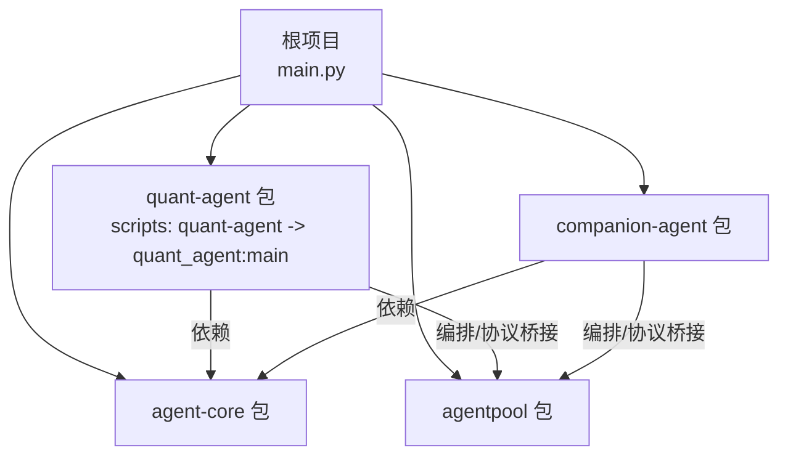
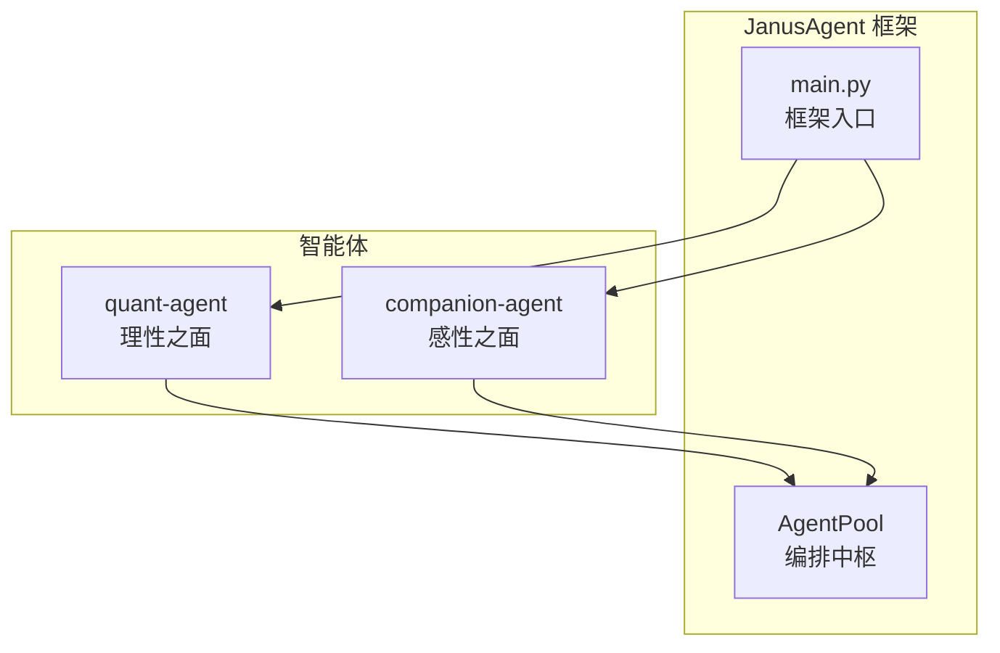
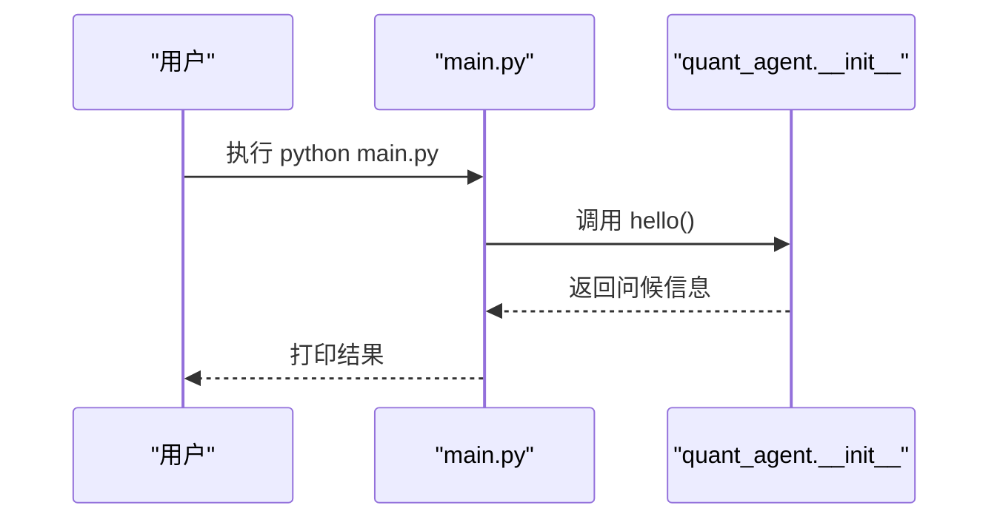
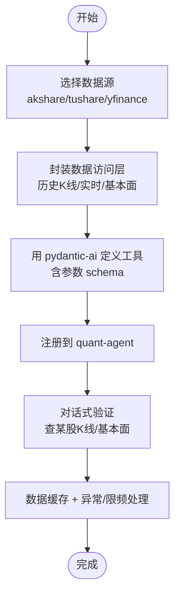
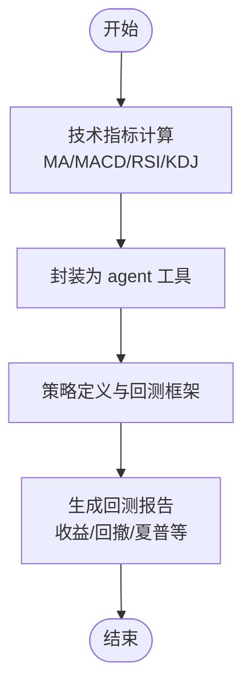
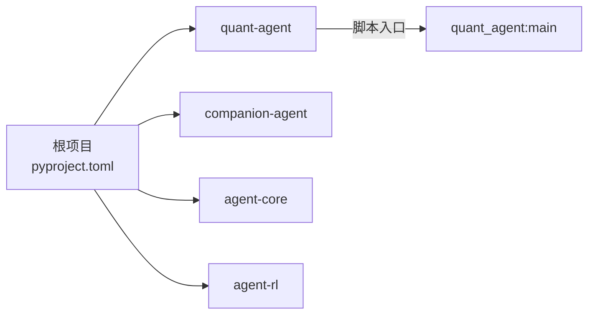

# 量化交易智能体概述

<cite>
**本文引用的文件**   
- [main.py](file://main.py)
- [README.md](file://README.md)
- [pyproject.toml](file://pyproject.toml)
- [uv.lock](file://uv.lock)
- [AGENT.md](file://.agent/AGENT.md)
- [quant-agent README.md](file://packages/quant-agent/README.md)
- [quant-agent pyproject.toml](file://packages/quant-agent/pyproject.toml)
- [quant_agent __init__.py](file://packages/quant-agent/src/quant_agent/__init__.py)
- [todolist.html](file://docs/plans/todolist.html)
</cite>

## 目录
1. [简介](#简介)
2. [项目结构](#项目结构)
3. [核心组件](#核心组件)
4. [架构总览](#架构总览)
5. [详细组件分析](#详细组件分析)
6. [依赖关系分析](#依赖关系分析)
7. [性能考量](#性能考量)
8. [故障排查指南](#故障排查指南)
9. [结论](#结论)
10. [附录：快速开始与使用示例](#附录快速开始与使用示例)

## 简介
本概述聚焦于 JanusAgent 框架中的“理性之面”——量化交易智能体（quant-agent）。该智能体定位为数据驱动的投资决策助手，提供市场数据接入、策略定义与回测框架等能力，并与“陪伴之面”（companion-agent）共享统一的编排中枢 AgentPool。通过 YAML 配置与多协议桥接（ACP、AG-UI、MCP、OpenCode），quant-agent 可在统一入口下与其他智能体协同工作，形成“专业协助 + 情感陪伴”的双面体系。

## 项目结构
仓库采用 UV 工作区组织，根项目聚合四个子包：agent-core、agentpool、quant-agent、companion-agent。quant-agent 作为业务域包，负责量化交易相关能力；其脚本入口由 pyproject 的 scripts 指向 quant_agent:main。根 main.py 作为框架入口，加载并调用各子包的 hello 方法以验证运行态。

图示来源
- [main.py:1-12](file://main.py#L1-L12)
- [pyproject.toml:1-30](file://pyproject.toml#L1-L30)
- [quant-agent pyproject.toml:12-13](file://packages/quant-agent/pyproject.toml#L12-L13)

章节来源
- [README.md:39-94](file://README.md#L39-L94)
- [pyproject.toml:1-30](file://pyproject.toml#L1-L30)
- [uv.lock:2158-2179](file://uv.lock#L2158-L2179)

## 核心组件
- 量化交易智能体（quant-agent）
  - 定位：JanusAgent 的“理性之面”，面向数据驱动的投资决策。
  - 职责边界：市场数据（K线/Bar）、策略定义与回测框架、工具化接口（如行情查询、技术指标分析等，按规划逐步落地）。
  - 与 AgentPool 协作：通过 YAML 配置挂载为可编排的智能体，暴露工具供对话式交互或自动化流程调用。
- 编排中枢（AgentPool）
  - 职责：统一的多智能体编排层，桥接 ACP、AG-UI、MCP、OpenCode 等多协议，支撑 quant-agent 与 companion-agent 的协同。
- 核心抽象（agent-core）
  - 职责：Agent 内核基类、生命周期管理、插件化接口等通用能力沉淀。
- 陪伴智能体（companion-agent）
  - 职责：对话管理、记忆存储、多轮交互，与 quant-agent 共享同一“自我”。

章节来源
- [AGENT.md:10-15](file://.agent/AGENT.md#L10-L15)
- [README.md:86-94](file://README.md#L86-L94)
- [quant-agent README.md:1-6](file://packages/quant-agent/README.md#L1-L6)

## 架构总览
JanusAgent 将“理性之面”与“感性之面”统一在同一个编排层之下，通过主入口进行初始化与启动。quant-agent 作为业务域智能体，对外暴露工具与能力，配合 AgentPool 完成协议适配与任务调度。

图示来源
- [main.py:1-12](file://main.py#L1-L12)
- [README.md:61-84](file://README.md#L61-L84)

## 详细组件分析

### 量化交易智能体（quant-agent）
- 角色与职责
  - 提供市场数据访问（K线/Bar）、策略定义与回测框架，面向数据驱动的投资决策。
  - 通过脚本入口 quant-agent 暴露命令行能力，便于集成到工作流或测试冒烟。
- 与框架的关系
  - 作为 uv 工作区成员被根项目依赖，根 main.py 在启动时调用其 hello 方法以验证可用性。
  - 未来将通过 AgentPool 与 companion-agent 协作，实现“专业协助 + 情感陪伴”的统一体验。
- 关键入口
  - 脚本入口：quant-agent → quant_agent:main
  - 模块入口：quant_agent.hello() / quant_agent.main()

图示来源
- [main.py:5-8](file://main.py#L5-L8)
- [quant_agent __init__.py:9-10](file://packages/quant-agent/src/quant_agent/__init__.py#L9-L10)

章节来源
- [quant-agent README.md:1-6](file://packages/quant-agent/README.md#L1-L6)
- [quant-agent pyproject.toml:12-13](file://packages/quant-agent/pyproject.toml#L12-L13)
- [quant_agent __init__.py:1-14](file://packages/quant-agent/src/quant_agent/__init__.py#L1-L14)
- [main.py:1-12](file://main.py#L1-L12)

### 市场数据接入（规划与演进）
- 目标
  - 接入主流行情数据源（如 akshare / tushare / yfinance），封装历史 K 线、实时行情、基本面等数据访问层，统一返回结构。
  - 基于 pydantic-ai 将“行情查询”封装为 agent 工具，挂接到 quant-agent，支持对话式验证。
- 关键要点
  - 数据缓存与异常/限频处理，确保稳定性与性能。
  - 参数 schema 明确，便于 LLM 正确调用与校验。

图示来源
- [todolist.html:190-197](file://docs/plans/todolist.html#L190-L197)

章节来源
- [todolist.html:190-197](file://docs/plans/todolist.html#L190-L197)

### 交易策略执行与回测分析（规划与演进）
- 目标
  - 提供策略定义与回测框架，使 quant-agent 能进行策略评估与优化。
  - 结合技术指标计算（MA/MACD/RSI/KDJ 等）与分析工具，提升看盘与分析能力。
- 关键要点
  - 指标库选型或自算，封装为 agent 工具。
  - 回测框架需考虑滑点、手续费、资金曲线等要素，输出可解释报告。

图示来源
- [todolist.html:200-203](file://docs/plans/todolist.html#L200-L203)

章节来源
- [todolist.html:200-203](file://docs/plans/todolist.html#L200-L203)

### 风险管理（规划与演进）
- 目标
  - 在策略与执行层面引入风控规则（仓位控制、止损止盈、最大回撤阈值等）。
  - 与回测框架联动，输出风险指标与预警。
- 关键要点
  - 风控规则可配置化，便于不同策略复用。
  - 与数据层和策略层解耦，保持模块化与可扩展性。

[本节为概念性说明，未直接分析具体源码文件]

## 依赖关系分析
- 根项目依赖 quant-agent、companion-agent、agent-core、agent-rl，并通过 uv workspace 管理。
- quant-agent 当前无运行时依赖声明，后续将根据功能扩展按需引入（如数据源 SDK、指标库等）。
- 根 main.py 在启动时调用 quant_agent.hello()，用于快速验证安装与入口可用。

图示来源
- [pyproject.toml:1-30](file://pyproject.toml#L1-L30)
- [quant-agent pyproject.toml:12-13](file://packages/quant-agent/pyproject.toml#L12-L13)
- [uv.lock:2158-2179](file://uv.lock#L2158-L2179)

章节来源
- [pyproject.toml:1-30](file://pyproject.toml#L1-L30)
- [uv.lock:2158-2179](file://uv.lock#L2158-L2179)

## 性能考量
- 数据层
  - 建议对高频行情与历史数据引入本地缓存与增量更新，降低外部 API 压力与延迟。
  - 对数据拉取增加限频与重试机制，避免触发供应商限制。
- 策略与回测
  - 向量化计算优先，减少 Python 循环开销；必要时使用 C/C++ 扩展或专用库。
  - 回测过程可并行化（多标的/多参数网格搜索），注意内存占用与 I/O 瓶颈。
- 编排与协议
  - 通过 AgentPool 统一桥接协议，避免重复适配；对长耗时任务采用异步与队列化设计。

[本节提供一般性指导，不直接分析具体源码文件]

## 故障排查指南
- 入口不可用
  - 检查 quant-agent 是否已安装且脚本入口是否正确映射至 quant_agent:main。
  - 确认根 main.py 能成功导入并调用 quant_agent.hello()。
- 依赖问题
  - 使用 uv sync 同步工作区依赖，核对 uv.lock 中 quant-agent 是否为可编辑安装。
- 数据源异常
  - 针对网络错误、限频与鉴权失败，增加日志与重试策略；必要时切换备用数据源。

章节来源
- [quant-agent pyproject.toml:12-13](file://packages/quant-agent/pyproject.toml#L12-L13)
- [main.py:1-12](file://main.py#L1-L12)
- [uv.lock:2158-2179](file://uv.lock#L2158-L2179)

## 结论
quant-agent 作为 JanusAgent 的“理性之面”，承担量化交易领域的专业职责，包括市场数据接入、策略定义与回测框架等。通过与 AgentPool 的协作以及 YAML 驱动的编排，quant-agent 可与 companion-agent 共同构成“专业协助 + 情感陪伴”的统一智能体生态。当前处于骨架阶段，后续将按计划逐步完善数据接入、分析工具与风控能力，并在 agent-core 中沉淀通用机制，最终形成可复用的领域引擎。

[本节为总结性内容，不直接分析具体源码文件]

## 附录：快速开始与使用示例
- 安装与运行
  - 在工作区根目录执行 uv sync 安装依赖。
  - 运行根入口 python main.py，验证 quant-agent 与 companion-agent 的 hello 输出。
  - 也可单独进入 quant-agent 包目录，执行 uv run quant-agent 调用其脚本入口。
- 基本使用示例
  - 通过根 main.py 启动后，观察控制台输出包含来自 quant-agent 的问候信息，表明量化智能体已成功加载。
  - 后续可通过 AgentPool 与 YAML 配置将 quant-agent 的工具（如行情查询、技术指标分析）暴露给对话或自动化流程。

章节来源
- [README.md:95-112](file://README.md#L95-L112)
- [quant-agent README.md:7-15](file://packages/quant-agent/README.md#L7-L15)
- [main.py:5-8](file://main.py#L5-L8)